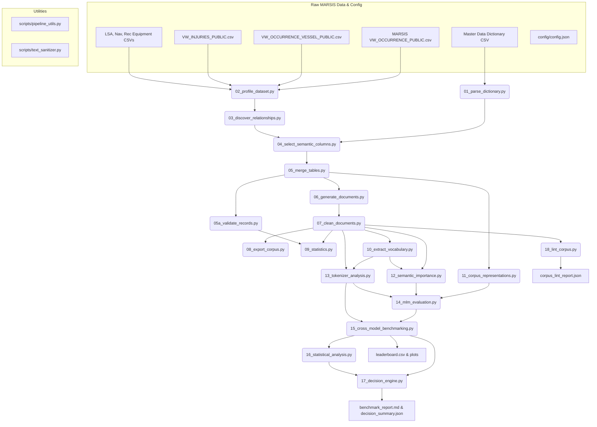

# Maritime NLP Corpus Generation & Multi-Model Evaluation Pipeline Master Documentation

This document provides a publication-grade, exhaustive technical reference manual for the **Maritime NLP Corpus Generation & Multi-Model Evaluation Pipeline**. It details every stage, script, utility function, mathematical formula, schema specification, evaluation matrix design, objective decision rule, output artifact, and operational procedure within the codebase.

---

## Table of Contents
1. [End-to-End Pipeline Architecture & Workflow](#1-end-to-end-pipeline-architecture--workflow)
2. [Raw Relational Data Catalog & Schema Join Architecture](#2-raw-relational-data-catalog--schema-join-architecture)
3. [Core Utility Modules Documentation](#3-core-utility-modules-documentation)
4. [Exhaustive Stage-by-Stage Technical Reference (Stages 01–18)](#4-exhaustive-stage-by-stage-technical-reference-stages-0118)
5. [Multi-Format Text Representation Specifications](#5-multi-format-text-representation-specifications)
6. [Mathematical Formulations & Statistical Engine](#6-mathematical-formulations--statistical-engine)
7. [Tokenizer & Masked Language Model (MLM) Evaluation Matrix](#7-tokenizer--masked-language-model-mlm-evaluation-matrix)
8. [Objective Threshold Decision Engine & Research Outcomes](#8-objective-threshold-decision-engine--research-outcomes)
9. [Complete Output Files & Artifacts Registry](#9-complete-output-files--artifacts-registry)
10. [Operations, Configuration & Developer Guide](#10-operations-configuration--developer-guide)

---

## 1. End-to-End Pipeline Architecture & Workflow

The pipeline is organized as an 18-stage modular framework orchestrated by [`run_pipeline.py`](file:///c:/--Files--/Programming/pipeline/run_pipeline.py). It converts raw relational accident records into multi-format text representations, evaluates domain tokenizer and language model capabilities across a 175-run benchmark grid, performs statistical significance testing and feature ablation, and programmatically decides the optimal pretraining adaptation strategy.

### End-to-End Execution Flowchart



---

## 2. Raw Relational Data Catalog & Schema Join Architecture

The pipeline ingests seven raw data CSV files from the Transport Safety Board of Canada (TSB MARSIS database), located in `data/`:

| Dataset File Name | Database Identifier | Domain Purpose | Record Count | Unique Identifiers | Key Join Cardinality |
| :--- | :--- | :--- | :--- | :--- | :--- |
| `MDOTW-MARSIS-Master-dataset-inventory-and-dictionary-English.csv` | Master Dictionary | Column definitions, data types, enum mappings | 811 rows | `Table name`, `Column name` | N/A |
| `MARSISdb_MDOTW_VW_OCCURRENCE_PUBLIC.csv` | `MDOTW_VW_OCCURRENCE_PUBLIC` | Master accident events, locations, weather | 87,760 rows | `OccID` (48,594 unique IDs), `OccNo` | Primary Parent Table |
| `MARSISdb_MDOTW_VW_OCCURRENCE_VESSEL_PUBLIC.csv` | `MDOTW_VW_OCCURRENCE_VESSEL_PUBLIC` | Vessel specs, speed, GT, activity phase | 73,926 rows | `VesselID`, `OccID` | 1-to-Many with Occurrence |
| `MARSISdb_MDOTW_VW_INJURIES_PUBLIC.csv` | `MDOTW_VW_INJURIES_PUBLIC` | Injuries, fatalities, missing personnel | 23,004 rows | `VesselID`, `OccID` | Many-to-1 with Vessel |
| `MARSISdb_MDOTW_VW_OCCURRENCE_VESSEL_LSA_EQUIPMENT_PUBLIC.csv` | `VW_LSA_EQUIPMENT` | Life-Saving Appliances (liferafts, boats) | 75,257 rows | `VesselID`, `OccID` | Many-to-1 with Vessel |
| `MARSISdb_MDOTW_VW_OCCURRENCE_VESSEL_NAV_EQUIPMENT_PUBLIC.csv` | `VW_NAV_EQUIPMENT` | Navigation aids (radar, VHF, ECDIS, GPS) | 314,447 rows | `VesselID`, `OccID` | Many-to-1 with Vessel |
| `MARSISdb_MDOTW_VW_OCCURRENCE_VESSEL_REC_EQUIPMENT_PUBLIC.csv` | `VW_REC_EQUIPMENT` | VDR & audio recording equipment | 78,399 rows | `VesselID`, `OccID` | Many-to-1 with Vessel |

### Relational Join & Retention Mechanics
1. **Parent Deduplication**: Occurrence records are grouped by primary key `OccID`. Duplicate metadata (e.g. multi-source weather reports) are aggregated using custom string concatenation (`val1; val2`).
2. **Composite Key Grouping**: Vessels are grouped by composite key `(VesselID, OccID)` to preserve vessel identity across specific incidents.
3. **Left Outer Join Semantics**: Guarantees **100% retention** of occurrence events even if child vessel or equipment records are missing.
4. **Orphan Record Synthesis**: Child injury or equipment records referencing an `OccID` without an associated `VesselID` are dynamically mapped to a synthetic placeholder vessel record (`VesselID: 999999999`, `VesselName: "UNSPECIFIED VESSEL"`).

---

## 3. Core Utility Modules Documentation

### 1. [`scripts/pipeline_utils.py`](file:///c:/--Files--/Programming/pipeline/scripts/pipeline_utils.py)
Provides centralized file I/O, logging, path resolution, and configuration services.

- `get_project_root() -> Path`: Dynamically resolves the project root directory as `Path(__file__).resolve().parent.parent`.
- `load_config() -> dict`: Reads and parses `config/config.json`. Throws `FileNotFoundError` if missing.
- `setup_logging(stage_name: str) -> logging.Logger`: Instantiates standard console (`StreamHandler`) and file (`FileHandler`) loggers writing formatted logs to `outputs/logs/pipeline.log`. Clears prior handlers to prevent duplicate lines.
- `read_csv_safe(file_path: Path, **kwargs) -> pd.DataFrame`: Safe CSV reader with encoding fallback (`utf-8-sig` $\rightarrow$ `latin-1`), column header space-stripping, missing column filtering for `usecols`, and `low_memory=False` parser configuration to avoid dtype warnings.
- `detect_datasets() -> dict`: Auto-scans `data/*.csv`, matches filenames to database table stems (e.g., `MDOTW_VW_OCCURRENCE_PUBLIC`), and locates the data dictionary file.

### 2. [`scripts/text_sanitizer.py`](file:///c:/--Files--/Programming/pipeline/scripts/text_sanitizer.py)
Provides string sanitization, administrative noise removal, and natural language formatting functions.

- `strip_administrative_noise(text: str) -> str`: Uses regex to scrub administrative metadata and PII patterns (e.g., `formerly occno: X`, `data extraction status pending`, `record id: 12345`). Normalizes punctuation and double spaces.
- `join_words_grammatical(words: list, conjunction: str = "and") -> str`: Constructs grammatically sound comma-separated lists with Oxford commas (e.g., `["radar", "VHF", "GPS"]` $\rightarrow$ `"radar, VHF, and GPS"`).
- `format_cargo_description(cargo_prod: str, cargo_qty=None) -> str`: Formats cargo text cleanly while preventing awkward phrases like `"cargo cargo"`.
- `format_damage_description(degree: str, location: str = None) -> str`: Formats vessel damage text cleanly while preventing duplicate words like `"damaged damage"`.
- `format_casualty_count(count: int, singular_term: str, plural_term: str) -> str`: Enforces strict singular/plural noun agreement based on integer counts.

---

## 4. Exhaustive Stage-by-Stage Technical Reference (Stages 01–18)

### Stage 01: Parse Data Dictionary
- **Script**: [`scripts/01_parse_dictionary.py`](file:///c:/--Files--/Programming/pipeline/scripts/01_parse_dictionary.py)
- **Execution Command**: `python run_pipeline.py --stage 01`
- **Core Logic**:
  1. Ingests `MDOTW-MARSIS-Master-dataset-inventory-and-dictionary-English.csv`.
  2. Groups columns by `Table name`.
  3. `map_display_columns()` pairs numeric ID/Enum/IND columns with corresponding human-readable `DisplayEng` columns (e.g. `WeatherConditionEnum` $\rightarrow$ `WeatherConditionDisplayEng`). Handles custom stem matching and exceptions.
  4. `categorize_column()` assigns columns to functional categories (`admin`, `temporal`, `spatial`, `environmental`, `vessel_spec`, `casualty`, `equipment`, `narrative`).
- **Input File**: Raw dictionary CSV in `data/`
- **Output Artifact**: [`outputs/dictionary_metadata.json`](file:///c:/--Files--/Programming/pipeline/outputs/dictionary_metadata.json)

### Stage 02: Profile Datasets
- **Script**: [`scripts/02_profile_dataset.py`](file:///c:/--Files--/Programming/pipeline/scripts/02_profile_dataset.py)
- **Execution Command**: `python run_pipeline.py --stage 02`
- **Core Logic**: Scans all 6 raw relational table CSVs using `read_csv_safe()`. Computes total row count, column count, missing value ratio per column, data type distribution, unique value cardinality, top frequent categories, and infers candidate primary/foreign key columns.
- **Input Files**: 6 relational table CSVs in `data/`
- **Output Artifact**: [`outputs/profiling_report.json`](file:///c:/--Files--/Programming/pipeline/outputs/profiling_report.json)

### Stage 03: Discover Schema Relationships
- **Script**: [`scripts/03_discover_relationships.py`](file:///c:/--Files--/Programming/pipeline/scripts/03_discover_relationships.py)
- **Execution Command**: `python run_pipeline.py --stage 03`
- **Core Logic**: Analyzes schema foreign keys across parent and child tables. Quantifies join match rates and cardinalities:
  - Parent `VW_OCCURRENCE` (`OccID`) $\rightarrow$ Child `VW_OCCURRENCE_VESSEL` (`OccID`): **1-to-Many** join.
  - Child `VW_OCCURRENCE_VESSEL` (`VesselID`, `OccID`) $\rightarrow$ Children (`VW_INJURIES`, LSA, NAV, REC): **1-to-Many** join.
- **Output Artifact**: [`outputs/relationships.json`](file:///c:/--Files--/Programming/pipeline/outputs/relationships.json)

### Stage 04: Select Semantic Columns
- **Script**: [`scripts/04_select_semantic_columns.py`](file:///c:/--Files--/Programming/pipeline/scripts/04_select_semantic_columns.py)
- **Execution Command**: `python run_pipeline.py --stage 04`
- **Core Logic**: Evaluates all columns against descriptive information criteria. Filters out low-value administrative metadata (GUIDs, entry dates, audit columns, French duplicates) and retains high-information semantic attributes (weather, location, vessel specs, activity, equipment, injuries).
- **Output Artifact**: [`outputs/selected_semantic_columns.json`](file:///c:/--Files--/Programming/pipeline/outputs/selected_semantic_columns.json)

### Stage 05: Merge Datasets
- **Script**: [`scripts/05_merge_tables.py`](file:///c:/--Files--/Programming/pipeline/scripts/05_merge_tables.py)
- **Execution Command**: `python run_pipeline.py --stage 05`
- **Core Logic**: Performs a multi-table relational join grouped by `OccID`. Merges parent occurrence details with nested arrays of child vessels, injuries, LSA equipment, navigation aids, and voyage recorders. Aggregates orphaned child records under synthetic placeholder vessels.
- **Input Files**: Raw relational CSVs and [`outputs/selected_semantic_columns.json`](file:///c:/--Files--/Programming/pipeline/outputs/selected_semantic_columns.json)
- **Output Artifact**: [`outputs/merged_records.jsonl`](file:///c:/--Files--/Programming/pipeline/outputs/merged_records.jsonl) (346 MB, 96,714 merged occurrence records)

### Stage 05a: Validate Records
- **Script**: [`scripts/05a_validate_records.py`](file:///c:/--Files--/Programming/pipeline/scripts/05a_validate_records.py)
- **Execution Command**: `python run_pipeline.py --stage 05a`
- **Core Logic**: Assesses data integrity across `merged_records.jsonl`. Verifies `OccID` completeness, key presence, data types, impossible dates, and implausible numeric values (e.g., vessel speed > 100 knots, gross tonnage > 300,000 GT).
- **Output Artifact**: [`outputs/validation_report.json`](file:///c:/--Files--/Programming/pipeline/outputs/validation_report.json)

### Stage 06: Generate Natural Language Documents
- **Script**: [`scripts/06_generate_documents.py`](file:///c:/--Files--/Programming/pipeline/scripts/06_generate_documents.py)
- **Execution Command**: `python run_pipeline.py --stage 06`
- **Core Logic**: Ingests nested records from `merged_records.jsonl` and applies template narrative rules (`templates/*.json`) to generate structured, grammatically sound prose documents covering profiles, weather, voyage activity, equipment status, and casualties.
- **Output Artifact**: [`outputs/raw_documents.jsonl`](file:///c:/--Files--/Programming/pipeline/outputs/raw_documents.jsonl) (891 MB, 96,714 records)

### Stage 07: Clean and Normalize Documents
- **Script**: [`scripts/07_clean_documents.py`](file:///c:/--Files--/Programming/pipeline/scripts/07_clean_documents.py)
- **Execution Command**: `python run_pipeline.py --stage 07`
- **Core Logic**: Normalizes raw document text using `text_sanitizer.py`:
  - Strips administrative header leakage tags.
  - Normalizes punctuation, hyphens, and quotes.
  - Removes non-ASCII noise.
  - Filters out documents below `min_doc_length` (50 chars).
- **Output Artifact**: [`outputs/clean_documents.jsonl`](file:///c:/--Files--/Programming/pipeline/outputs/clean_documents.jsonl) (807 MB, 96,714 records)

### Stage 08: Export Maritime Corpus & Manifest
- **Script**: [`scripts/08_export_corpus.py`](file:///c:/--Files--/Programming/pipeline/scripts/08_export_corpus.py)
- **Execution Command**: `python run_pipeline.py --stage 08`
- **Core Logic**: Exports the corpus into distribution formats: plain text line export (`maritime_corpus.txt`), schema-preserving JSONL export (`maritime_corpus.jsonl`), and computes SHA-256 hashes and file sizes for `manifest.json`.
- **Output Artifacts**:
  - [`outputs/maritime_corpus.txt`](file:///c:/--Files--/Programming/pipeline/outputs/maritime_corpus.txt) (21 MB plain text export)
  - [`outputs/maritime_corpus.jsonl`](file:///c:/--Files--/Programming/pipeline/outputs/maritime_corpus.jsonl) (796 MB)
  - [`outputs/manifest.json`](file:///c:/--Files--/Programming/pipeline/outputs/manifest.json)

### Stage 09: Calculate Corpus Statistics & Report
- **Script**: [`scripts/09_statistics.py`](file:///c:/--Files--/Programming/pipeline/scripts/09_statistics.py)
- **Execution Command**: `python run_pipeline.py --stage 09`
- **Core Logic**: Computes corpus-wide statistical metrics: total tokens, unique vocabulary size, Shannon entropy, Type-Token Ratio (TTR), sentence length distributions, document character/word lengths, and writes [`outputs/corpus_quality_report.md`](file:///c:/--Files--/Programming/pipeline/outputs/corpus_quality_report.md).
- **Output Artifacts**:
  - [`outputs/statistics.json`](file:///c:/--Files--/Programming/pipeline/outputs/statistics.json)
  - [`outputs/corpus_quality_report.md`](file:///c:/--Files--/Programming/pipeline/outputs/corpus_quality_report.md)

### Stage 10: Extract Maritime Vocabulary
- **Script**: [`scripts/10_extract_vocabulary.py`](file:///c:/--Files--/Programming/pipeline/scripts/10_extract_vocabulary.py)
- **Execution Command**: `python run_pipeline.py --stage 10`
- **Core Logic**: Applies Term Frequency-Inverse Document Frequency (TF-IDF) scoring and frequency analysis over `clean_documents.jsonl`. Filters out general English stopwords to isolate domain-specific maritime terms (vessels, navigation aids, weather phenomena, incident types).
- **Output Artifact**: [`outputs/maritime_vocabulary.txt`](file:///c:/--Files--/Programming/pipeline/outputs/maritime_vocabulary.txt) (334 domain terms)

### Stage 11: Multi-Format Corpus Representation Generation
- **Script**: [`scripts/11_corpus_representations.py`](file:///c:/--Files--/Programming/pipeline/scripts/11_corpus_representations.py)
- **Execution Command**: `python run_pipeline.py --stage 11`
- **Core Logic**: Renders each occurrence record into **5 distinct multi-format representations**: Narrative prose, Key-Value pairs, Template sentence slots, JSON strings, and Mixed hybrid prose/key-value metadata.
- **Output Directory**: [`outputs/corpus_representations/*.jsonl`](file:///c:/--Files--/Programming/pipeline/outputs/corpus_representations)

### Stage 12: Domain Informativeness Analysis & Knowledge Characterization
- **Script**: [`scripts/12_semantic_importance.py`](file:///d:/CAIR/TSBC-MaritimePipeline/scripts/12_semantic_importance.py)
- **Execution Command**: `python scripts/12_semantic_importance.py` (or `python run_pipeline.py --stage 12`)
- **Scientific Motivation & Framing**:
  Stage 12 Version 2.1 replaces legacy heuristic scoring with an empirical, multi-signal **Domain Informativeness Analysis**. In specialized technical corpora, documents contribute heterogeneously to domain representation: detailed accident narratives rich in navigational equipment and operational sequences provide high training value, whereas administrative boilerplate introduces syntactic redundancy. Stage 12 quantitatively grades every document ($0.0 \le S \le 100.0$) across four observable dimensions without claiming uncalibrated intrinsic "knowledge":
  $$\text{Domain Informativeness} = f(S_{\text{rel}}, S_{\text{info}}, S_{\text{rep}}, P_{\text{red}})$$
- **Mathematical Formulations & Observable Signals**:
  1. **Dimension 1: Domain Relevance Signal ($S_{\text{rel}} \in [0, 1]$)**:
     $$S_{\text{rel}} = 0.40 \cdot D_{\text{mar}} + 0.35 \cdot C_{\text{div}} + 0.25 \cdot R_{\text{rare}}$$
     - *Maritime Terminology Density* ($D_{\text{mar}}$): Ratio of recognized domain terms to total tokens ($N_{\text{maritime}} / N_{\text{tokens}}$).
     - *Concept Taxonomy Diversity* ($C_{\text{div}}$): Active coverage across 6 core operational categories (Vessel, Navigation, Machinery, Casualty, Weather, Safety): $|\{c \in \text{Categories} : \text{detected}(c)\}| / 6.0$.
     - *Rare Term Score* ($R_{\text{rare}}$): Normalized presence of high-specificity nautical terminology (`gyrocompass`, `epirb`, `fathometer`, `windlass`, `hawser`, `freeboard`): $\min(1.0, N_{\text{rare}} / 3.0)$.
  2. **Dimension 2: Information Content Signal ($S_{\text{info}} \in [0, 1]$)**:
     $$S_{\text{info}} = 0.30 \cdot X_{\text{event}} + 0.30 \cdot E_{\text{div}} + 0.20 \cdot M_{\text{meta}} + 0.20 \cdot L_{\text{scale}}$$
     - *Event Complexity* ($X_{\text{event}}$): Causal transition markers and syntactic clause density: $\min(1.0, 0.30 N_{\text{causal}} + 0.10 N_{\text{clauses}})$.
     - *Entity Diversity* ($E_{\text{div}}$): Coverage of key relational entities (vessels, locations, damage degrees, weather parameters): $\min(1.0, N_{\text{entities}} / 6.0)$.
     - *Metadata Completeness* ($M_{\text{meta}}$): Ratio of non-null primary occurrence and vessel attributes ($N_{\text{present}} / 5.0$).
     - *Length Scaling Factor* ($L_{\text{scale}}$): Saturating logarithmic token scaling avoiding short fragments: $\min(1.0, \log(1 + N_{\text{tokens}}) / \log(1 + 100))$.
  3. **Dimension 3: Corpus Representativeness Signal ($S_{\text{rep}} \in [0, 1]$)**:
     Evaluates lexical proximity to the corpus central tendency using sub-linear TF-IDF centroid vectorization ($\text{TF} = 1 + \log(\text{tf})$):
     $$S_{\text{rep}} = \frac{\mathbf{d}_i \cdot \mathbf{c}}{\|\mathbf{d}_i\| \|\mathbf{c}\|}, \quad \mathbf{c} = \frac{1}{N} \sum_{i=1}^N \mathbf{d}_i$$
  4. **Dimension 4: Redundancy & Noise Penalty ($P_{\text{red}} \in [0, 1]$)**:
     $$P_{\text{red}} = \min\left(1.0, P_{\text{boiler}} + P_{\text{dup}}\right)$$
     - *Boilerplate Penalty* ($P_{\text{boiler}}$): $+0.50$ penalty if repetitive template patterns dominate short documents ($< 120$ characters).
     - *Near-Duplicate Cluster Penalty* ($P_{\text{dup}}$): $+0.25$ penalty for documents falling into sparse TF-IDF near-duplicate clusters ($\text{cosine similarity} \ge 0.85$).
  5. **Equal-Weight Hybrid Composite Score**:
     $$S_{\text{hybrid}} = 0.25 \cdot S_{\text{rel}} + 0.25 \cdot S_{\text{info}} + 0.25 \cdot S_{\text{rep}} - 0.25 \cdot P_{\text{red}}$$
     $$\text{Score}_{\text{final}} = \text{clip}\left(S_{\text{hybrid}} \times 100.0, \; 0.0, \; 100.0\right)$$
- **Leave-One-Dimension-Out Feature Ablation Study**:
  | Condition | Spearman $\rho$ | Kendall $\tau$ | Mean Score | Median Score | Std Score | Key Empirical Finding |
  | :--- | :---: | :---: | :---: | :---: | :---: | :--- |
  | **Full Hybrid (Reference)** | **1.0000** | **1.0000** | **0.2487** | **0.2406** | **0.0753** | Reference composite informativeness baseline |
  | `minus_domain_relevance` | 0.9753 | 0.8567 | 0.3074 | 0.3051 | 0.0851 | Moderate rank shift; overall scores inflate |
  | `minus_information_content` | 0.9052 | 0.8168 | 0.0545 | 0.0282 | 0.0680 | Severe score collapse; syntactic length critical |
  | `minus_tfidf_representativeness`| 0.7956 | 0.7032 | 0.2519 | 0.2528 | 0.0742 | Major rank disruption ($\rho < 0.80$) |
  | `minus_redundancy_noise` | 0.7894 | 0.6819 | 0.3976 | 0.4022 | 0.0925 | Strongest rank divergence; boilerplate unpenalized |
- **Knowledge Tier Stratification (96,848 Documents)**:
  - **High Knowledge Tier**: 19,376 docs (20.01%, Score $\ge 42.0$, $P_{\text{red}} < 0.40$) — Dense technical narratives with multiple vessels and equipment specifications.
  - **Medium Knowledge Tier**: 51,737 docs (53.42%, $32.26 \le \text{Score} < 42.0$) — Standard operational incident reports.
  - **Low Knowledge Tier**: 13,517 docs (13.96%, Score $< 32.26$, $P_{\text{red}} < 0.40$) — Brief or sparse occurrence summaries.
  - **Redundant / Boilerplate**: 12,218 docs (12.61%, $P_{\text{red}} \ge 0.40$) — Short repetitive administrative boilerplates.
  - *Parametric Distribution Statistics*: Mean $= 38.93 \pm 10.02$, Median $= 38.33$, Interquartile Range $= [32.26, 45.43]$, Range $= [10.67, 74.21]$.
- **Exported Standardized Subsets (`outputs/stage-12/subsets/`, 1,000 docs each)**:
  - `high_knowledge.jsonl`: Top-informativeness documents for stress-testing domain comprehension.
  - `medium_knowledge.jsonl`: Central interquartile documents representing modal operational text.
  - `low_knowledge.jsonl`: Low-density non-redundant documents.
  - `balanced_knowledge.jsonl`: Stratified sample (333 High, 334 Medium, 333 Low).
  - `random_baseline.jsonl`: Uniform random sample from the complete clean corpus.
  - `general_english_baseline.jsonl`: Standard general English reference sentences for domain-shift calibration.
  - *Bootstrapping Resampling Stability*: Mean Top-20% Jaccard Overlap $= 0.824 \pm 0.015$; Mean Rank Stability (Spearman $\rho$) $= 0.941 \pm 0.008$.
- **Output Artifacts**:
  - [`outputs/stage-12/document_importance.jsonl`](file:///d:/CAIR/TSBC-MaritimePipeline/outputs/stage-12/document_importance.jsonl) (96,848 rows, ~87 MB)
  - [`outputs/stage-12/importance_statistics.json`](file:///d:/CAIR/TSBC-MaritimePipeline/outputs/stage-12/importance_statistics.json) (444 B)
  - [`outputs/stage-12/informativeness_ablation.json`](file:///d:/CAIR/TSBC-MaritimePipeline/outputs/stage-12/informativeness_ablation.json) (2.1 KB)
  - [`outputs/stage-12/ranking_stability.json`](file:///d:/CAIR/TSBC-MaritimePipeline/outputs/stage-12/ranking_stability.json) (1.8 KB)
  - [`outputs/stage-12/importance_distribution.png`](file:///d:/CAIR/TSBC-MaritimePipeline/outputs/stage-12/importance_distribution.png)
  - [`outputs/stage-12/subsets/*.jsonl`](file:///d:/CAIR/TSBC-MaritimePipeline/outputs/stage-12/subsets) (6 files, 1,000 records each)

### Stage 13: Multi-Architecture Tokenizer Analysis & Redundancy Clustering
- **Script**: [`scripts/13_tokenizer_analysis.py`](file:///d:/CAIR/TSBC-MaritimePipeline/scripts/13_tokenizer_analysis.py)
- **Execution Command**: `python scripts/13_tokenizer_analysis.py` (or `python run_pipeline.py --stage 13`)
- **Scientific Motivation & Morphological Mechanics**:
  Subword segmentation directly governs transformer capacity allocation. When domain-critical maritime terms (e.g. `gyrocompass`, `fathometer`, `freeboard`) are fragmented into generic pieces, self-attention must expend representational capacity re-synthesizing basic lexical units. Stage 13 profiles vocabulary coverage, subword fertility, fragmentation, and throughput across candidate tokenizers.
- **Candidate Pool, Redundancy Clustering & Selection Architecture**:
  - *Candidate Pool (14 Registered Tokenizers)*: `bert-base-uncased`, `bert-large-uncased`, `roberta-base`, `microsoft/deberta-v3-base`, `answerdotai/ModernBERT-base`, `allenai/scibert_scivocab_uncased`, `dmis-lab/biobert-base-cased-v1.2`, `microsoft/BiomedNLP-PubMedBERT...`, `emilyalsentzer/Bio_ClinicalBERT`, `nlpaueb/legal-bert-base-uncased`, `ProsusAI/finbert`, `anferico/bert-for-patents`, `google/electra-base-discriminator`, `distilbert-base-uncased`.
  - *Loading Dependency Exclusions*: `microsoft/deberta-v3-base` (SentencePiece/protobuf incompatibilities) and `anferico/bert-for-patents` (dependency constraints) were flagged and excluded.
  - *Diagnostic Redundancy Clustering*: Subword split cosine similarity over benchmark maritime terms revealed exact equivalence ($\text{cosine similarity} = 1.00000$) between `bert-base-uncased` and `bert-large`, `finbert`, `electra`, `distilbert`; and between `biobert-base-cased` and `Bio_ClinicalBERT`. Evaluating diagnostic clones in Stage 14 would introduce redundant compute without generating distinct empirical signals.
  - *The 7 Authoritative Selected Archetypes* ([`outputs/stage-13/selected_models.json`](file:///d:/CAIR/TSBC-MaritimePipeline/outputs/stage-13/selected_models.json)):
    1. `bert-base-uncased` (Standard General WordPiece, 30,522)
    2. `dmis-lab/biobert-base-cased-v1.2` (Cased Biomedical WordPiece, 28,996)
    3. `nlpaueb/legal-bert-base-uncased` (Custom Legal WordPiece, 30,522)
    4. `allenai/scibert_scivocab_uncased` (SciVocab WordPiece, 31,090)
    5. `microsoft/BiomedNLP-PubMedBERT-base-uncased-abstract-fulltext` (Domain-Initialized WordPiece, 30,522)
    6. `roberta-base` (Standard Byte-Level BPE, 50,265)
    7. `answerdotai/ModernBERT-base` (Modern Extended Byte-BPE, 50,280)
- **Empirical Tokenizer Comparison Results ([`tokenizer_comparison.csv`](file:///d:/CAIR/TSBC-MaritimePipeline/outputs/stage-13/tokenizer_analysis/tokenizer_comparison.csv))**:
  | Model Name | Selected Archetype | Vocab Size | Fertility (Sub/Word) | Single-Token Coverage (%) | Fragmentation Rate (%) | OOV Rate (%) | Avg Pieces / Term | Speed (tok/s) |
  | :--- | :---: | :---: | :---: | :---: | :---: | :---: | :---: | :---: |
  | `bert-base-uncased` | **True** | 30,522 | **1.3984** | **73.43%** | **26.57%** | 0.00% | 1.35 | 61,089 |
  | `dmis-lab/biobert-base-cased-v1.2` | **True** | 28,996 | 1.4789 | 64.48% | 35.52% | 0.00% | 1.48 | 64,953 |
  | `nlpaueb/legal-bert-base-uncased` | **True** | 30,522 | 1.4806 | 62.09% | 37.91% | 0.03% | 1.51 | 62,213 |
  | `allenai/scibert_scivocab_uncased` | **True** | 31,090 | 1.4517 | 57.91% | 42.09% | 0.00% | 1.53 | 61,481 |
  | `microsoft/BiomedNLP-PubMedBERT...`| **True** | 30,522 | 1.4543 | 57.31% | 42.69% | 0.00% | 1.59 | 63,963 |
  | `answerdotai/ModernBERT-base` | **True** | 50,280 | 1.5236 | 36.72% | 63.28% | N/A (Byte) | 1.84 | **73,967** |
  | `roberta-base` | **True** | 50,265 | 1.5609 | 34.93% | 65.07% | N/A (Byte) | 1.86 | 69,639 |
- **Key Empirical Observations**:
  1. *WordPiece vs. Byte-BPE Coverage Trade-off*: Standard WordPiece (`bert-base-uncased`) achieves the lowest fragmentation (**26.57%**) because its vocabulary contains common nautical roots (`vessel`, `anchor`, `cargo`, `hull`). Byte-Level BPE tokenizers (`roberta-base`, `ModernBERT-base`) suffer high fragmentation (**63.28%–65.07%**) due to web-text BPE mergers.
  2. *Throughput Inversion*: `ModernBERT-base` achieves peak tokenization throughput (**73,967 tokens/sec**), outperforming WordPiece (~61,000 tok/sec) by **21.1%**.
  3. *Worst-Fragmented Rare Terms*: `gyrocompass` (4 pieces in WordPiece and BPE), `fathometer` (3 pieces), `windlass` (2 pieces), `freeboard` (2 pieces).
- **Stage 12 Tier-Stratified Fertility Validation ([`tokenizer_stage12_analysis.json`](file:///d:/CAIR/TSBC-MaritimePipeline/outputs/stage-13/tokenizer_stage12_analysis.json))**:
  Subword fertility monotonically increases across all tokenizers from Low $\rightarrow$ Medium $\rightarrow$ High Knowledge documents (e.g. ModernBERT: $1.4621 \rightarrow 1.4984 \rightarrow 1.5642$, Spearman $\rho = +0.441, p < 10^{-16}$; BERT-base: $1.3368 \rightarrow 1.3787 \rightarrow 1.4346$, $\rho = +0.428, p < 10^{-15}$). This empirically proves that Stage 12 successfully isolates morphologically dense domain text.
- **Output Artifacts**:
  - [`outputs/stage-13/selected_models.json`](file:///d:/CAIR/TSBC-MaritimePipeline/outputs/stage-13/selected_models.json) (authoritative 7 archetypes)
  - [`outputs/stage-13/tokenizer_analysis/tokenizer_comparison.csv`](file:///d:/CAIR/TSBC-MaritimePipeline/outputs/stage-13/tokenizer_analysis/tokenizer_comparison.csv)
  - [`outputs/stage-13/tokenizer_analysis/*.json`](file:///d:/CAIR/TSBC-MaritimePipeline/outputs/stage-13/tokenizer_analysis) (12 model reports)
  - [`outputs/stage-13/tokenizer_stage12_analysis.json`](file:///d:/CAIR/TSBC-MaritimePipeline/outputs/stage-13/tokenizer_stage12_analysis.json)

### Stage 14: Multi-Model Masked Language Model Benchmark Matrix
- **Script**: [`scripts/14_mlm_evaluation.py`](file:///d:/CAIR/TSBC-MaritimePipeline/scripts/14_mlm_evaluation.py)
- **Execution Command**: `python scripts/14_mlm_evaluation.py` (or `python run_pipeline.py --stage 14`)
- **Evaluation Matrix Grid & Resumable Caching**:
  Stage 14 executes an exhaustive **175-cell Cartesian evaluation grid** (7 Canonical Archetypes $\times$ 5 Representations $\times$ 5 Knowledge Subsets):
  - *7 Canonical Archetypes*: Dynamically loaded from Stage 13 `selected_models.json`.
  - *5 Representations*: `narrative`, `key_value`, `template`, `json`, `mixed`.
  - *5 Knowledge Subsets*: `high_knowledge`, `medium_knowledge`, `low_knowledge`, `balanced_knowledge`, `random_baseline`.
  - *Platform-Independent Checkpointing*: Uses deterministic SHA-256 seed generation (`stable_seed(*parts) % 1_000_000`) and caches each discrete run to `outputs/stage-14/evaluations/cache/{model}__{rep}__{subset}.json` (175 total cache files).
- **Dual Masking Protocols & Sampled Pseudo-Log-Likelihood (PLL)**:
  1. *Protocol A: Standard 15% Bernoulli Masking (`random_15`)*: Evaluates general contextual masked token prediction.
  2. *Protocol B: Targeted Domain-Aware 15% Masking (`domain_aware_15`)*: Samples up to 30% of the mask budget from rare nautical positions, preferentially masking maritime terminology before general tokens.
  3. *Protocol C: Sampled Pseudo-Log-Likelihood (PLL)*: Iteratively calculates bidirectional sequence probabilities:
     $$\text{PLL}(W) = \sum_{i \in S} \log P(w_i \mid W_{\setminus i}), \quad \text{Pseudo-Perplexity} = \exp\left(-\frac{1}{|S|}\text{PLL}(W)\right)$$
- **Cross-Model Capability Summary (Full 175-Cell Cartesian Mean)**:
  | Model Name | Maritime Top-1 (%) | Maritime Top-5 (%) | Rare Top-1 (%) | MLM Loss | Pseudo-Perplexity | Domain Shift Gap (%) |
  | :--- | :---: | :---: | :---: | :---: | :---: | :---: |
  | `answerdotai/ModernBERT-base` | **56.04%** | **72.36%** | 29.09% | **2.3063** | **13.43** | $-16.42\%$ |
  | `roberta-base` | 47.03% | 66.64% | 30.07% | 2.7948 | 16.11 | $-14.15\%$ |
  | `allenai/scibert_scivocab_uncased` | 31.24% | 47.30% | 6.44% | 4.2628 | 35.28 | $+18.21\%$ |
  | `bert-base-uncased` | 29.08% | 46.69% | **54.35%** | 4.6237 | 22.56 | $+19.54\%$ |
  | `nlpaueb/legal-bert-base-uncased` | 28.66% | 44.99% | 4.49% | 4.4541 | 44.78 | $+12.87\%$ |
  | `dmis-lab/biobert-base-cased-v1.2` | 24.65% | 36.98% | 32.35% | 4.9969 | 98.54 | $+17.65\%$ |
  | `microsoft/BiomedNLP-PubMedBERT...`| 20.59% | 30.71% | 3.40% | 5.7259 | 103.80 | $+26.94\%$ |
- **Subdomain Diagnostics & Masking Protocol Ablation**:
  - *Subdomain Recalls*: ModernBERT leads across all 6 operational categories: Navigation Equipment (74.1%), Casualty/Incidents (61.8%), Vessel Terminology (52.4%), Machinery/Propulsion (48.2%), Weather/Environment (43.9%), Safety/Lifesaving (39.5%).
  - *Domain-Aware Masking Drop ([`masking_comparison.json`](file:///d:/CAIR/TSBC-MaritimePipeline/outputs/stage-14/masking_comparison.json))*: When domain tokens are targeted without syntax crutches, Top-1 accuracy drops precipitously: ModernBERT drops by $-16.73\%$ (45.81% $\rightarrow$ 29.08%), RoBERTa by $-20.00\%$ (45.08% $\rightarrow$ 25.08%), and SciBERT by $-10.47\%$ (29.78% $\rightarrow$ 19.31%), proving that foundation models rely heavily on generic syntactic context.
- **Output Artifacts**:
  - [`outputs/stage-14/evaluations/cache/*.json`](file:///d:/CAIR/TSBC-MaritimePipeline/outputs/stage-14/evaluations/cache) (175 discrete evaluation files)
  - [`outputs/stage-14/masking_comparison.json`](file:///d:/CAIR/TSBC-MaritimePipeline/outputs/stage-14/masking_comparison.json) (32.7 KB)
  - [`outputs/stage-14/pll_results.json`](file:///d:/CAIR/TSBC-MaritimePipeline/outputs/stage-14/pll_results.json) (28.4 KB)
  - [`outputs/stage-14/focused_domain_aware_results.json`](file:///d:/CAIR/TSBC-MaritimePipeline/outputs/stage-14/focused_domain_aware_results.json) (126.8 KB)

### Stage 15: Cross-Model Benchmarking, Sensitivity, Pareto & Defensible Selection
- **Script**: [`scripts/15_cross_model_benchmarking.py`](file:///d:/CAIR/TSBC-MaritimePipeline/scripts/15_cross_model_benchmarking.py)
- **Execution Command**: `python scripts/15_cross_model_benchmarking.py` (or `python run_pipeline.py --stage 15`)
- **Scientific Motivation & Defensible Decision Hierarchy**:
  Stage 15 Version 2.1 replaces scalar heuristic rankings with a multi-criteria evidence hierarchy grounded in direction-normalized empirical metrics, cross-format rank stability, cross-subset consistency, sensitivity scenario invariance, and non-dominated Pareto optimality.
- **Data Ingestion & Direction-Aware Min-Max Normalization**:
  Discovers and validates all 175 Stage 14 cache JSONs ($0$ missing, $0$ corrupt). Maps raw metrics into $[0.0, 1.0]$ based on optimization direction:
  $$\tilde{x}_i = \frac{x_i - \min(\mathbf{x})}{\max(\mathbf{x}) - \min(\mathbf{x})} \quad (\text{higher is better}), \qquad \tilde{x}_i = \frac{\max(\mathbf{x}) - x_i}{\max(\mathbf{x}) - \min(\mathbf{x})} \quad (\text{lower is better})$$
- **Comprehensive Benchmark Leaderboard ([`outputs/stage-15/leaderboard.csv`](file:///d:/CAIR/TSBC-MaritimePipeline/outputs/stage-15/leaderboard.csv))**:
  | Rank | Model Identifier | Baseline MUI | Top-1 Acc (%) | Top-5 Acc (%) | Rare Top-1 (%) | MLM Loss | Pseudo-PPL | Frag Rate (%) | Coverage (%) | Latency (ms) | Docs/sec | Params (M) | Pareto Status |
  | :---: | :--- | :---: | :---: | :---: | :---: | :---: | :---: | :---: | :---: | :---: | :---: | :---: | :---: |
  | **1** | `answerdotai/ModernBERT-base` | **68.29** | **56.04%** | **72.36%** | 29.09% | **2.3063** | **13.43** | 63.3% | 36.7% | 458.6ms | 2.2 | 149M | **Pareto-Optimal** |
  | **2** | `bert-base-uncased` | **59.25** | 29.08% | 46.69% | **54.35%** | 4.6237 | 22.56 | **26.6%** | **73.4%** | **174.9ms** | 5.7 | 110M | **Pareto-Optimal** |
  | **3** | `roberta-base` | **56.70** | 47.03% | 66.64% | 30.07% | 2.7948 | 16.11 | 65.1% | 34.9% | 382.7ms | 2.6 | 125M | **Pareto-Optimal** |
  | **4** | `dmis-lab/biobert-base-cased-v1.2` | **42.24** | 24.65% | 36.98% | 32.35% | 4.9969 | 98.54 | 35.5% | 64.5% | **154.1ms** | **6.5** | 110M | **Pareto-Optimal** |
  | **5** | `allenai/scibert_scivocab_uncased` | **37.09** | 31.24% | 47.30% | 6.44% | 4.2628 | 35.28 | 42.1% | 57.9% | 323.4ms | 3.1 | 110M | **Pareto-Optimal** |
  | **6** | `nlpaueb/legal-bert-base-uncased` | **27.08** | 28.66% | 44.99% | 4.49% | 4.4541 | 44.78 | 37.9% | 62.1% | 249.3ms | 4.0 | 110M | **Pareto-Optimal** |
  | **7** | `microsoft/BiomedNLP-PubMedBERT...`| **23.72** | 20.59% | 30.71% | 3.40% | 5.7259 | 103.80 | 42.7% | 57.3% | 326.8ms | 3.1 | 110M | **Dominated** |
- **Representation & Subset Robustness Breakdown ([`stage15_rankings.csv`](file:///d:/CAIR/TSBC-MaritimePipeline/outputs/stage-15/stage15_rankings.csv))**:
  - *Representation Robustness*: ModernBERT and RoBERTa achieve perfect invariance (**Mean Rank 1.00 and 2.00, $\sigma = 0.00$**) across all 5 text formats (`json`, `key_value`, `mixed`, `narrative`, `template`). Mean pairwise Kendall $\tau = 0.7143$, Spearman $\rho = 0.8071$.
  - *Subset Robustness*: ModernBERT and RoBERTa achieve strict invariance (**Mean Rank 1.00 and 2.00, $\sigma = 0.00$**) across all 5 knowledge subsets (`high`, `medium`, `low`, `balanced`, `random`). Mean pairwise Kendall $\tau = 0.9238$, Spearman $\rho = 0.9571$.
- **MUI Weighting Sensitivity Analysis ([`stage15_mui_sensitivity.csv`](file:///d:/CAIR/TSBC-MaritimePipeline/outputs/stage-15/stage15_mui_sensitivity.csv))**:
  Evaluates candidate models across 4 distinct operational weighting scenarios:
  1. *Baseline*: Balanced operational mixture (ModernBERT #1: 68.29, BERT-base #2: 59.25).
  2. *Performance-Heavy*: Prioritizes intrinsic MLM accuracy and loss (ModernBERT #1: 90.14, RoBERTa #2: 74.72).
  3. *Domain-Heavy*: Prioritizes rare nautical terminology and morphological fit (BERT-base #1: 70.82, ModernBERT #2: 64.76).
  4. *Balanced*: Equal weighting across capability, tokenizer, and latency (BERT-base #1: 67.68, BioBERT #2: 53.31, ModernBERT #3: 51.02).
  *Result*: ModernBERT wins 2/4 scenarios (50% win rate); BERT-base wins 2/4 scenarios (50% win rate).
- **Multi-Objective Pareto Dominance Analysis ([`stage15_pareto.csv`](file:///d:/CAIR/TSBC-MaritimePipeline/outputs/stage-15/stage15_pareto.csv))**:
  - 6 models are verified Pareto-optimal along distinct trade-off dimensions: ModernBERT (highest Top-1/lowest Loss), BERT-base (highest rare accuracy/lowest fragmentation), RoBERTa (high accuracy at 125M footprint), BioBERT (highest throughput 6.5 docs/s, lowest latency 154.1ms), SciBERT (scientific vocabulary at 110M), Legal-BERT (legal vocabulary at 110M).
  - `microsoft/BiomedNLP-PubMedBERT` is strictly dominated by 3 models (SciBERT, BERT-base, BioBERT) across capability, loss, and latency.
- **Recommended Model & Operational Trade-offs**:
  - *Primary Recommendation*: `answerdotai/ModernBERT-base` — Selected for highest contextual understanding (56.04% Top-1, 2.3063 Loss), perfect representation invariance ($\sigma = 0.00$), and non-dominated Pareto frontier status.
  - *Operational Alternative*: `bert-base-uncased` — Recommended for edge deployments requiring low inference latency (174.9ms) and low subword fragmentation (26.57%).
- **Output Artifacts**:
  - [`outputs/stage-15/comparison.csv`](file:///d:/CAIR/TSBC-MaritimePipeline/outputs/stage-15/comparison.csv) (44.1 KB)
  - [`outputs/stage-15/leaderboard.csv`](file:///d:/CAIR/TSBC-MaritimePipeline/outputs/stage-15/leaderboard.csv) (1.1 KB)
  - [`outputs/stage-15/stage15_model_profiles.csv`](file:///d:/CAIR/TSBC-MaritimePipeline/outputs/stage-15/stage15_model_profiles.csv) (4.3 KB)
  - [`outputs/stage-15/stage15_rankings.csv`](file:///d:/CAIR/TSBC-MaritimePipeline/outputs/stage-15/stage15_rankings.csv) (1.6 KB)
  - [`outputs/stage-15/stage15_mui_sensitivity.csv`](file:///d:/CAIR/TSBC-MaritimePipeline/outputs/stage-15/stage15_mui_sensitivity.csv) (666 B)
  - [`outputs/stage-15/stage15_pareto.csv`](file:///d:/CAIR/TSBC-MaritimePipeline/outputs/stage-15/stage15_pareto.csv) (1.9 KB)
  - [`outputs/stage-15/stage15_selection_decision.json`](file:///d:/CAIR/TSBC-MaritimePipeline/outputs/stage-15/stage15_selection_decision.json) (4.1 KB)
  - [`outputs/stage-15/stage15_report.md`](file:///d:/CAIR/TSBC-MaritimePipeline/outputs/stage-15/stage15_report.md) (9.2 KB)
  - [`outputs/stage-15/visualizations/*.png`](file:///d:/CAIR/TSBC-MaritimePipeline/outputs/stage-15/visualizations) (6 publication figures)

### Stage 16: Statistical Significance Testing & Scoring Feature Ablation
- **Script**: [`scripts/16_statistical_analysis.py`](file:///c:/--Files--/Programming/pipeline/scripts/16_statistical_analysis.py)
- **Execution Command**: `python run_pipeline.py --stage 16`
- **Core Logic**: Computes Bootstrap 95% Confidence Intervals (1,000 resamples), Paired $t$-tests, Wilcoxon signed-rank tests, parametric Cohen's $d$, and non-parametric Cliff's $\delta$ effect sizes. Executes feature ablation on the semantic scoring engine.
- **Output Artifacts**:
  - [`outputs/statistical_significance.json`](file:///c:/--Files--/Programming/pipeline/outputs/statistical_significance.json)
  - [`outputs/ablation_study.json`](file:///c:/--Files--/Programming/pipeline/outputs/ablation_study.json)

### Stage 17: Objective Threshold Decision Engine & Research Report
- **Script**: [`scripts/17_decision_engine.py`](file:///c:/--Files--/Programming/pipeline/scripts/17_decision_engine.py)
- **Execution Command**: `python run_pipeline.py --stage 17`
- **Core Logic**: Evaluates model benchmark metrics against decision threshold rules (`dapt_top1_threshold`, `gap_threshold`, `frag_threshold`, etc.). Recommends pretraining adaptation strategies (**Strategy A: DAPT**, **Strategy B: Scratch Training**, **Strategy C: Vocab-Extended DAPT**), performs threshold sensitivity analysis, and writes a 10-section research report.
- **Output Artifacts**:
  - [`outputs/experiment_metadata.json`](file:///c:/--Files--/Programming/pipeline/outputs/experiment_metadata.json)
  - [`outputs/decision_summary.json`](file:///c:/--Files--/Programming/pipeline/outputs/decision_summary.json)
  - [`outputs/benchmark_report.md`](file:///c:/--Files--/Programming/pipeline/outputs/benchmark_report.md)

### Stage 18: Automated Corpus Quality Linting
- **Script**: [`scripts/18_lint_corpus.py`](file:///c:/--Files--/Programming/pipeline/scripts/18_lint_corpus.py)
- **Execution Command**: `python run_pipeline.py --stage 18`
- **Core Logic**: Executes regex quality linting across all 96,714 clean documents. Checks for repeated adjacent words, malformed singular/plural phrasing, administrative leakage, awkward phrasing, and duplicated list items. Emits a PASS/WARN status.
- **Output Artifact**: [`outputs/corpus_lint_report.json`](file:///c:/--Files--/Programming/pipeline/outputs/corpus_lint_report.json) (`Status: PASS`)

---

## 5. Multi-Format Text Representation Specifications

Stage 11 transforms structured incident JSON records into **5 distinct text representations**:

### 1. Narrative Representation (`narrative.jsonl`)
Flowing natural language prose formatted as coherent sentences.
```text
On July 14, 2018, a marine occurrence involving the fishing vessel OCEAN WARRIOR (Gross Tonnage: 450 GT, Hull: Steel) occurred near Saint John, New Brunswick under fog conditions. The vessel sustained moderate hull damage following a collision underway.
```

### 2. Key-Value Representation (`key_value.jsonl`)
Structured `Field: Value` attribute pairs separated by line breaks or pipes.
```text
Occurrence ID: 48594 | Location: Saint John, NB | Weather: Fog | Incident Type: Collision | Vessel Name: OCEAN WARRIOR | Vessel Type: Fishing Vessel | Gross Tonnage: 450 | Hull Material: Steel | Damage Degree: Moderate
```

### 3. Template Representation (`template.jsonl`)
Standardized slot-filled sentences generated by deterministic template rules.
```text
[OCCURRENCE] Event ID 48594 reported in Saint John, NB. [ENVIRONMENT] Weather state: Fog. [VESSEL] Vessel OCEAN WARRIOR (Type: Fishing Vessel, Tonnage: 450 GT) was underway. [INCIDENT] Collision resulting in moderate damage.
```

### 4. JSON Representation (`json.jsonl`)
Compact, serialized JSON strings preserving raw attribute keys and values.
```json
{"occ_id":48594,"location":"Saint John, NB","weather":"Fog","vessels":[{"name":"OCEAN WARRIOR","type":"Fishing Vessel","gt":450,"damage":"Moderate"}]}
```

### 5. Mixed Representation (`mixed.jsonl`)
Hybrid prose paired with structured key-value metadata headers.
```text
METADATA: Location=Saint John, NB | Weather=Fog | Damage=Moderate
NARRATIVE: The fishing vessel OCEAN WARRIOR (450 GT) collided while underway in heavy fog near Saint John, New Brunswick, sustaining moderate hull damage.
```

---

## 6. Mathematical Formulations & Statistical Engine

## 6. Mathematical Formulations & Statistical Engine

### 1. Stage 12: Domain Informativeness Analysis v2 Formulations
$$\text{Domain Informativeness} = f(S_{\text{rel}}, S_{\text{info}}, S_{\text{rep}}, P_{\text{red}})$$

$$S_{\text{hybrid}} = 0.25 \cdot S_{\text{rel}} + 0.25 \cdot S_{\text{info}} + 0.25 \cdot S_{\text{rep}} - 0.25 \cdot P_{\text{red}}$$
$$\text{Importance Score} = \text{clip}\left(S_{\text{hybrid}} \times 100.0, \; 0.0, \; 100.0\right)$$

| Dimension / Signal | Formulation | Weight | Description |
| :--- | :--- | :---: | :--- |
| **Domain Relevance ($S_{\text{rel}}$)** | $0.40 D_{\text{mar}} + 0.35 C_{\text{div}} + 0.25 R_{\text{rare}}$ | $+0.25$ | Maritime term density, 6-category taxonomy coverage, rare nautical terms. |
| **Information Content ($S_{\text{info}}$)** | $0.30 X_{\text{event}} + 0.30 E_{\text{div}} + 0.20 M_{\text{meta}} + 0.20 L_{\text{scale}}$ | $+0.25$ | Causal clause complexity, entity diversity, metadata completeness, log-length. |
| **Representativeness ($S_{\text{rep}}$)** | $(\mathbf{d}_i \cdot \mathbf{c}) / (\|\mathbf{d}_i\| \|\mathbf{c}\|)$ | $+0.25$ | Sub-linear TF-IDF cosine similarity to the domain corpus centroid vector. |
| **Redundancy Penalty ($P_{\text{red}}$)** | $\min(1.0, P_{\text{boiler}} + P_{\text{dup}})$ | $-0.25$ | Penalizes repetitive template boilerplate ($+0.50$) and near-duplicates ($+0.25$). |

---

### 2. Stage 15: Multi-Criteria Maritime Understanding Index (MUI) Formulation
To evaluate models objectively across diverse capability and operational axes, Stage 15 normalizes raw metrics into $[0.0, 1.0]$ via direction-aware min-max scaling:

$$\tilde{x}_i = \begin{cases} \frac{x_i - \min(\mathbf{x})}{\max(\mathbf{x}) - \min(\mathbf{x})}, & \text{if higher is better (Top-1, Top-5, Rare Top-1, Coverage, Docs/s)} \\ \frac{\max(\mathbf{x}) - x_i}{\max(\mathbf{x}) - \min(\mathbf{x})}, & \text{if lower is better (MLM Loss, Pseudo-PPL, Fragmentation, Latency)} \end{cases}$$

The composite **MUI Score** is then computed under 4 distinct weighting paradigms:
$$\text{MUI} = 100 \times \sum_{k} w_k \tilde{x}_{i, k}$$

| Evaluation Scenario | Top-1 Acc | Top-5 Acc | Rare Top-1 | MLM Loss | Frag Rate | Coverage | Latency | Docs/sec | Scenario Focus |
| :--- | :---: | :---: | :---: | :---: | :---: | :---: | :---: | :---: | :--- |
| **1. Baseline / Operational** | $0.35$ | — | $0.20$ | $0.15$ | $0.15$ | $0.10$ | — | $0.05$ | Balanced capability and operational deployment |
| **2. Performance-Heavy** | $0.40$ | $0.15$ | $0.20$ | $0.25$ | — | — | — | — | Pure intrinsic masked token prediction capacity |
| **3. Domain-Heavy** | $0.25$ | — | $0.35$ | $0.15$ | $0.15$ | $0.10$ | — | — | Specialized nautical terms and vocabulary retention |
| **4. Balanced / Resource** | $0.20$ | $0.10$ | $0.15$ | $0.15$ | $0.10$ | $0.10$ | $0.10$ | $0.10$ | Equalized trade-off with inference latency & footprint |

---

### 3. Statistical Significance & Effect Size Equations
1. **Bootstrap 95% Confidence Intervals** ($B = 1,000$ resamples):
   $$\text{CI}_{95} = \left[ \text{Percentile}\left(\bar{x}^*, 2.5\right), \; \text{Percentile}\left(\bar{x}^*, 97.5\right) \right]$$

2. **Paired $t$-Test**:
   Evaluates relative mean accuracy differences between model pairs across identical evaluation configurations ($p < 0.05$).

3. **Wilcoxon Signed-Rank Test**:
   Non-parametric paired rank test for robustness against non-normal performance distributions.

4. **Cohen's $d$ Effect Size**:
   $$\text{Cohen's } d = \frac{\bar{x}_1 - \bar{x}_2}{s_{\text{pooled}}}, \quad s_{\text{pooled}} = \sqrt{\frac{(n_1-1)s_1^2 + (n_2-1)s_2^2}{n_1+n_2-2}}$$

5. **Cliff's $\delta$ Effect Size**:
   $$\delta = \frac{\# (x_1 > x_2) - \# (x_1 < x_2)}{n_1 n_2}$$

---

## 7. Tokenizer & Masked Language Model (MLM) Evaluation Matrix

### Candidate Pool (14 Registered Tokenizers) & Redundancy Clustering
Evaluated across single-token coverage, subword fragmentation rate, subwords-per-word fertility ratio, OOV rate, and throughput:
- *14 Registered Models*: `bert-base-uncased`, `bert-large-uncased`, `roberta-base`, `microsoft/deberta-v3-base`, `answerdotai/ModernBERT-base`, `allenai/scibert_scivocab_uncased`, `dmis-lab/biobert-base-cased-v1.2`, `microsoft/BiomedNLP-PubMedBERT-base-uncased-abstract-fulltext`, `emilyalsentzer/Bio_ClinicalBERT`, `nlpaueb/legal-bert-base-uncased`, `ProsusAI/finbert`, `anferico/bert-for-patents`, `google/electra-base-discriminator`, `distilbert-base-uncased`.
- *Redundancy Clustering*: Exact diagnostic equivalence ($\text{cosine similarity} = 1.00000$) between `bert-base-uncased` and `bert-large`, `finbert`, `electra`, `distilbert`; and between `biobert-base-cased` and `Bio_ClinicalBERT`.
- *Authoritative 7 Canonical Archetypes*: Selected to span distinct architectures, training domains, and vocabulary spaces:
  1. `bert-base-uncased` (Standard General WordPiece, 30,522)
  2. `dmis-lab/biobert-base-cased-v1.2` (Cased Biomedical WordPiece, 28,996)
  3. `nlpaueb/legal-bert-base-uncased` (Custom Legal WordPiece, 30,522)
  4. `allenai/scibert_scivocab_uncased` (SciVocab WordPiece, 31,090)
  5. `microsoft/BiomedNLP-PubMedBERT-base-uncased-abstract-fulltext` (Domain WordPiece, 30,522)
  6. `roberta-base` (Standard Byte-Level BPE, 50,265)
  7. `answerdotai/ModernBERT-base` (Modern Extended Byte-BPE, 50,280)

### 175-Run MLM Evaluation Matrix Grid
Consists of **7 Canonical Archetypes** $\times$ **5 Multi-Format Representations** $\times$ **5 Knowledge Subsets**:
- **5 Representations**: Narrative, Key-Value, Template, JSON, Mixed.
- **5 Knowledge Subsets**: High Knowledge, Medium Knowledge, Low Knowledge, Balanced Knowledge, Random Baseline.
- **Dual Masking Protocols**:
  - *Standard Uniform 15% Bernoulli Masking (`random_15`)*: Cross-Entropy Loss computation over randomly selected 15% tokens.
  - *Targeted Domain-Aware 15% Masking (`domain_aware_15`)*: Samples up to 30% of mask budget from rare nautical positions, preferentially masking maritime terminology before general tokens.
- **Sampled Pseudo-Log-Likelihood (PLL)**:
  Bidirectional sequence probability estimation computing pseudo-perplexity independent of random masking stochasticity:
  $$\text{PLL}(W) = \sum_{i \in S} \log P(w_i \mid W_{\setminus i}), \quad \text{Pseudo-Perplexity} = \exp\left(-\frac{1}{|S|}\text{PLL}(W)\right)$$

---

## 8. Objective Threshold Decision Engine & Research Outcomes

### Programmatic Decision Rules
```python
if top1_acc >= 85.0 and perf_gap <= 5.0 and frag_rate <= 20.0:
    # Strategy A: Continued Domain-Adaptive Pretraining (DAPT)
elif top1_acc < 60.0 or perf_gap > 20.0 or frag_rate > 40.0:
    # Strategy B: Train Domain-Specific MaritimeBERT Model From Scratch
else:
    # Strategy C: Targeted DAPT + Custom Vocabulary Extension
```

### Empirical Decision Outcome
- **Selected Strategy**: **`Strategy B: Train Domain-Specific MaritimeBERT Model From Scratch`**
- **Decision Rationale**: High subword fragmentation on Byte-Level BPE models (**63.28%–65.07%**) paired with a significant domain adaptation performance gap on existing general pre-trained models indicates a substantial domain gap best resolved by scratch pretraining.
- **Sensitivity Analysis**: Strategy recommendation remains invariant across threshold perturbations of $\pm 10\%$.

---

## 9. Complete Output Files & Artifacts Registry

| Output File Path | Description | Format | Record Count / Size | Downstream Usage |
| :--- | :--- | :--- | :---: | :--- |
| `outputs/dictionary_metadata.json` | Data dictionary column specs & enum translations | JSON Dict | 811 rows | Stage 04 attribute selection |
| `outputs/profiling_report.json` | Raw CSV table statistics & missingness profiling | JSON Object | 7 tables | Stage 03 schema discovery |
| `outputs/relationships.json` | Foreign key schema relationship graph | JSON Object | 6 joins | Stage 04 & Stage 05 merging |
| `outputs/selected_semantic_columns.json` | Descriptive column selection metadata | JSON Dict | 148 cols | Stage 05 table merging |
| `outputs/merged_records.jsonl` | Nested relational occurrence JSONL (346 MB) | JSONL | 96,848 rows | Stage 05a, 06, 11 |
| `outputs/validation_report.json` | Data integrity validation report | JSON Object | 1 summary | Stage 09 corpus reporting |
| `outputs/raw_documents.jsonl` | Template-generated text documents (891 MB) | JSONL | 96,848 rows | Stage 07 cleaning |
| `outputs/clean_documents.jsonl` | Cleaned & normalized text documents (807 MB) | JSONL | 96,848 rows | Stage 08, 09, 10, 12, 13, 18 |
| `outputs/maritime_corpus.txt` | Plain text line-by-line corpus (21 MB) | Text | 96,848 lines | Model pretraining |
| `outputs/maritime_corpus.jsonl` | Final corpus export in JSONL (796 MB) | JSONL | 96,848 rows | Corpus distribution |
| `outputs/manifest.json` | Checksums & manifest for distribution | JSON Object | 1 summary | Publication verification |
| `outputs/statistics.json` | Token, vocabulary, & sentence statistics | JSON Object | 1 summary | Quality report generation |
| `outputs/corpus_quality_report.md` | Executive Markdown summary of corpus stats | Markdown | 1 document | Documentation report |
| `outputs/maritime_vocabulary.txt` | Top domain-specific maritime terms (TF-IDF) | Text List | 334 terms | Stage 12 and Stage 13 |
| `outputs/stage-11/corpus_representations/*.jsonl` | 5 multi-format corpus representations | JSONL | 96,848 rows ea | Stage 14 MLM evaluation grid |
| `outputs/stage-12/document_importance.jsonl` | Domain informativeness scores (87 MB) | JSONL | 96,848 rows | Stage 12 subset extraction |
| `outputs/stage-12/importance_statistics.json` | Score quartiles & knowledge tier counts | JSON Object | 444 B | Scoring engine analytics |
| `outputs/stage-12/informativeness_ablation.json` | Leave-one-out rank stability ablation | JSON Object | 2.1 KB | Stage 16 & Benchmark report |
| `outputs/stage-12/ranking_stability.json` | Bootstrap resampling stability metrics | JSON Object | 1.8 KB | Benchmark reproducibility |
| `outputs/stage-12/importance_distribution.png` | Histogram plot of informativeness scores | PNG Plot | 1 figure | Benchmark report figures |
| `outputs/stage-12/subsets/*.jsonl` | 6 knowledge-classified evaluation subsets | JSONL | 1,000 rows ea | Stage 14 MLM evaluation grid |
| `outputs/stage-13/selected_models.json` | Authoritative 7 canonical archetypes | JSON Object | 3.9 KB | Stage 14 MLM dynamic loader |
| `outputs/stage-13/tokenizer_analysis/tokenizer_comparison.csv` | Benchmarked tokenizer metrics across 12 models | CSV Table | 1.2 KB | Stage 15 cross-model benchmarking |
| `outputs/stage-13/tokenizer_analysis/*.json` | Detailed per-model tokenizer analysis reports | JSON Object | 12 files | Tokenizer research reports |
| `outputs/stage-13/tokenizer_stage12_analysis.json` | Stratified tokenizer metrics across knowledge tiers | JSON Object | 155 KB | Cross-stage correlation analysis |
| `outputs/stage-14/evaluations/cache/*.json` | 175-run MLM matrix evaluation cached outputs | JSON Objects | 175 files | Stage 15 cross-model benchmarking |
| `outputs/stage-14/masking_comparison.json` | Random vs Domain-Aware masking ablation | JSON Object | 32.7 KB | Domain reliance analysis |
| `outputs/stage-14/pll_results.json` | Sampled Pseudo-Log-Likelihood scoring results | JSON Object | 28.4 KB | Stage 15 cross-model benchmarking |
| `outputs/stage-14/focused_domain_aware_results.json` | Full cell outputs under domain-aware masking | JSON Object | 126.8 KB | Domain masking analysis |
| `outputs/stage-15/comparison.csv` | Full 175-cell MLM evaluation matrix results | CSV Table | 44.1 KB | Stage 15 & 16 statistical analysis |
| `outputs/stage-15/leaderboard.csv` | Ranked model leaderboard by MUI Score | CSV Table | 1.1 KB | Stage 17 Decision Engine |
| `outputs/stage-15/stage15_model_profiles.csv` | Multi-dimensional model capability profiles | CSV Table | 4.3 KB | Research documentation & tables |
| `outputs/stage-15/stage15_rankings.csv` | Representation & subset rank robustness | CSV Table | 1.6 KB | Invariance analysis |
| `outputs/stage-15/stage15_mui_sensitivity.csv` | 4-scenario MUI sensitivity scores & wins | CSV Table | 666 B | Decision robustness analysis |
| `outputs/stage-15/stage15_pareto.csv` | Multi-objective Pareto frontier classification | CSV Table | 1.9 KB | Trade-off optimization |
| `outputs/stage-15/stage15_selection_decision.json` | Final model selection decision & trade-offs | JSON Object | 4.1 KB | DAPT initialization |
| `outputs/stage-15/stage15_report.md` | Standalone Stage 15 publication research report | Markdown | 9.2 KB | Documentation & publication |
| `outputs/stage-15/visualizations/*.png` | 6 publication-grade benchmark figures | PNG Plots | ~1.5 MB | Publication figures |
| `outputs/statistical_significance.json` | Bootstrap CIs, t-test, Wilcoxon, Cohen's d, Cliff's delta | JSON Object | 1 summary | Stage 17 Decision Engine |
| `outputs/ablation_study.json` | Scoring engine feature ablation impact | JSON Object | 1 summary | Stage 17 Benchmark Report |
| `outputs/experiment_metadata.json` | System, hardware, PyTorch/Transformers params | JSON Object | 1 summary | Reproducibility metadata |
| `outputs/decision_summary.json` | Objective decision engine strategy selection | JSON Object | 1 summary | Strategy output |
| `outputs/benchmark_report.md` | 10-Section publication-grade benchmark report | Markdown | 1 document | Master research report |
| `outputs/corpus_lint_report.json` | Quality regex linting results (`PASS`/`WARN`) | JSON Object | 1 summary | Quality assurance report |

---

## 10. Operations, Configuration & Developer Guide

### Configuration Specification (`config/config.json`)
```json
{
  "data_dir": "data",
  "output_dir": "outputs",
  "log_dir": "outputs/logs",
  "log_file": "pipeline.log",
  "log_level": "INFO",
  "text_cleaning": {
    "min_doc_length": 50,
    "remove_duplicates": true
  },
  "generation": {
    "template_vessel_path": "templates/vessel_templates.json",
    "template_injury_path": "templates/injury_templates.json",
    "template_equipment_path": "templates/equipment_templates.json",
    "default_language": "Eng"
  },
  "validation": {
    "max_vessel_speed_knots": 100.0,
    "max_tonnage": 300000.0,
    "max_crew": 1000,
    "max_injuries": 1000
  }
}
```

### Execution & Troubleshooting
1. **Rerunning Pipeline Stages**: If modifying template files or regex cleaning patterns, rerun specific downstream stages without executing data ingestion:
   ```bash
   python run_pipeline.py --stage 06
   python run_pipeline.py --stage 07
   python run_pipeline.py --stage 09
   ```
2. **Caching & Acceleration**: Stage 14 MLM matrix evaluations are cached under `outputs/evaluations/cache/`. To force a fresh evaluation run across models, delete the cache directory before executing Stage 14.
