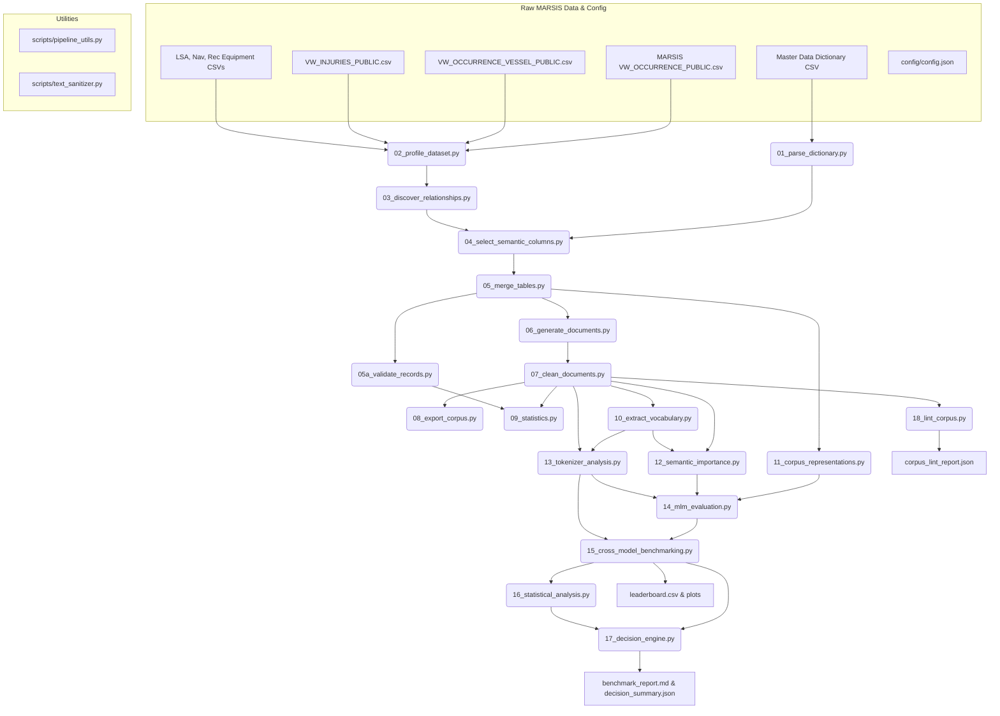

# Maritime NLP Corpus Generation & Multi-Model Evaluation Pipeline Master Documentation

This document provides a publication-grade, exhaustive technical reference manual for the **Maritime NLP Corpus Generation & Multi-Model Evaluation Pipeline**. It details every stage, script, utility function, mathematical formula, schema specification, evaluation matrix design, objective decision rule, output artifact, and operational procedure within the codebase.

---

## Table of Contents
1. [End-to-End Pipeline Architecture & Workflow](#1-end-to-end-pipeline-architecture--workflow)
2. [Raw Relational Data Catalog & Schema Join Architecture](#2-raw-relational-data-catalog--schema-join-architecture)
3. [Core Utility Modules Documentation](#3-core-utility-modules-documentation)
4. [Exhaustive Stage-by-Stage Technical Reference (Stages 01–18)](#4-exhaustive-stage-by-stage-technical-reference-stages-0118)
5. [Multi-Format Text Representation Specifications](#5-multi-format-text-representation-specifications)
6. [Mathematical Formulations & Statistical Engine](#6-mathematical-formulations--statistical-engine)
7. [Tokenizer & Masked Language Model (MLM) Evaluation Matrix](#7-tokenizer--masked-language-model-mlm-evaluation-matrix)
8. [Objective Multi-Criteria Decision Engine & Research Outcomes](#8-objective-multi-criteria-decision-engine--research-outcomes)
9. [Complete Output Files & Artifacts Registry](#9-complete-output-files--artifacts-registry)
10. [Operations, Configuration & Developer Guide](#10-operations-configuration--developer-guide)
11. [Appendix A: Empirical Data Catalog & Corpus Results (Stages 01–10)](#11-appendix-a-empirical-data-catalog--corpus-results-stages-0110)
12. [Appendix B: Model Benchmarking, Statistical Validation & Decision Artifacts (Stages 11–18)](#12-appendix-b-model-benchmarking-statistical-validation--decision-artifacts-stages-1118)

---

## 1. End-to-End Pipeline Architecture & Workflow

The pipeline is organized as an 18-stage modular framework orchestrated by [`run_pipeline.py`](file:///d:/CAIR/TSBC-MaritimePipeline-Version2.1/run_pipeline.py). It converts raw relational accident records into multi-format text representations, evaluates domain tokenizer and language model capabilities across a 175-run benchmark grid, performs statistical significance testing and feature ablation, and programmatically decides the optimal pretraining adaptation strategy.

### End-to-End Execution Flowchart



---

## 2. Raw Relational Data Catalog & Schema Join Architecture

The pipeline ingests seven raw data CSV files from the Transport Safety Board of Canada (TSB MARSIS database), located in `data/`:

| Dataset File Name | Database Identifier | Domain Purpose | Record Count | Unique Identifiers | Key Join Cardinality |
| :--- | :--- | :--- | :--- | :--- | :--- |
| `MDOTW-MARSIS-Master-dataset-inventory-and-dictionary-English.csv` | Master Dictionary | Column definitions, data types, enum mappings | 811 rows | `Table name`, `Column name` | N/A |
| `MARSISdb_MDOTW_VW_OCCURRENCE_PUBLIC.csv` | `MDOTW_VW_OCCURRENCE_PUBLIC` | Master accident events, locations, weather | 87,760 rows | `OccID` (48,594 unique IDs), `OccNo` | Primary Parent Table |
| `MARSISdb_MDOTW_VW_OCCURRENCE_VESSEL_PUBLIC.csv` | `MDOTW_VW_OCCURRENCE_VESSEL_PUBLIC` | Vessel specs, speed, GT, activity phase | 73,926 rows | `VesselID`, `OccID` | 1-to-Many with Occurrence |
| `MARSISdb_MDOTW_VW_INJURIES_PUBLIC.csv` | `MDOTW_VW_INJURIES_PUBLIC` | Injuries, fatalities, missing personnel | 23,004 rows | `VesselID`, `OccID` | Many-to-1 with Vessel |
| `MARSISdb_MDOTW_VW_OCCURRENCE_VESSEL_LSA_EQUIPMENT_PUBLIC.csv` | `VW_LSA_EQUIPMENT` | Life-Saving Appliances (liferafts, boats) | 75,257 rows | `VesselID`, `OccID` | Many-to-1 with Vessel |
| `MARSISdb_MDOTW_VW_OCCURRENCE_VESSEL_NAV_EQUIPMENT_PUBLIC.csv` | `VW_NAV_EQUIPMENT` | Navigation aids (radar, VHF, ECDIS, GPS) | 314,447 rows | `VesselID`, `OccID` | Many-to-1 with Vessel |
| `MARSISdb_MDOTW_VW_OCCURRENCE_VESSEL_REC_EQUIPMENT_PUBLIC.csv` | `VW_REC_EQUIPMENT` | VDR & audio recording equipment | 78,399 rows | `VesselID`, `OccID` | Many-to-1 with Vessel |

### Relational Join & Retention Mechanics
1. **Parent Deduplication**: Occurrence records are grouped by primary key `OccID`. Duplicate metadata (e.g. multi-source weather reports) are aggregated using custom string concatenation (`val1; val2`).
2. **Composite Key Grouping**: Vessels are grouped by composite key `(VesselID, OccID)` to preserve vessel identity across specific incidents.
3. **Left Outer Join Semantics**: Guarantees **100% retention** of occurrence events even if child vessel or equipment records are missing.
4. **Orphan Record Synthesis**: Child injury or equipment records referencing an `OccID` without an associated `VesselID` are dynamically mapped to a synthetic placeholder vessel record (`VesselID: 999999999`, `VesselName: "UNSPECIFIED VESSEL"`).

---

## 3. Core Utility Modules Documentation

### 1. [`scripts/pipeline_utils.py`](file:///d:/CAIR/TSBC-MaritimePipeline-Version2.1/scripts/pipeline_utils.py)
Provides centralized file I/O, logging, path resolution, and configuration services.

- `get_project_root() -> Path`: Dynamically resolves the project root directory as `Path(__file__).resolve().parent.parent`.
- `load_config() -> dict`: Reads and parses `config/config.json`. Throws `FileNotFoundError` if missing.
- `setup_logging(stage_name: str) -> logging.Logger`: Instantiates standard console (`StreamHandler`) and file (`FileHandler`) loggers writing formatted logs to `outputs/logs/pipeline.log`. Clears prior handlers to prevent duplicate lines.
- `read_csv_safe(file_path: Path, **kwargs) -> pd.DataFrame`: Safe CSV reader with encoding fallback (`utf-8-sig` $\rightarrow$ `latin-1`), column header space-stripping, missing column filtering for `usecols`, and `low_memory=False` parser configuration to avoid dtype warnings.
- `detect_datasets() -> dict`: Auto-scans `data/*.csv`, matches filenames to database table stems (e.g., `MDOTW_VW_OCCURRENCE_PUBLIC`), and locates the data dictionary file.

### 2. [`scripts/text_sanitizer.py`](file:///d:/CAIR/TSBC-MaritimePipeline-Version2.1/scripts/text_sanitizer.py)
Provides string sanitization, administrative noise removal, and natural language formatting functions.

- `strip_administrative_noise(text: str) -> str`: Uses regex to scrub administrative metadata and PII patterns (e.g., `formerly occno: X`, `data extraction status pending`, `record id: 12345`). Normalizes punctuation and double spaces.
- `join_words_grammatical(words: list, conjunction: str = "and") -> str`: Constructs grammatically sound comma-separated lists with Oxford commas (e.g., `["radar", "VHF", "GPS"]` $\rightarrow$ `"radar, VHF, and GPS"`).
- `format_cargo_description(cargo_prod: str, cargo_qty=None) -> str`: Formats cargo text cleanly while preventing awkward phrases like `"cargo cargo"`.
- `format_damage_description(degree: str, location: str = None) -> str`: Formats vessel damage text cleanly while preventing duplicate words like `"damaged damage"`.
- `format_casualty_count(count: int, singular_term: str, plural_term: str) -> str`: Enforces strict singular/plural noun agreement based on integer counts.

---

## 4. Exhaustive Stage-by-Stage Technical Reference (Stages 01–18)

### Stage 01: Parse Data Dictionary
- **Script**: [`scripts/01_parse_dictionary.py`](file:///d:/CAIR/TSBC-MaritimePipeline-Version2.1/scripts/01_parse_dictionary.py)
- **Execution Command**: `python run_pipeline.py --stage 01`
- **Core Logic**:
  1. Ingests `MDOTW-MARSIS-Master-dataset-inventory-and-dictionary-English.csv`.
  2. Groups columns by `Table name`.
  3. `map_display_columns()` pairs numeric ID/Enum/IND columns with corresponding human-readable `DisplayEng` columns (e.g. `WeatherConditionEnum` $\rightarrow$ `WeatherConditionDisplayEng`). Handles custom stem matching and exceptions.
  4. `categorize_column()` assigns columns to functional categories (`admin`, `temporal`, `spatial`, `environmental`, `vessel_spec`, `casualty`, `equipment`, `narrative`).
- **Input File**: Raw dictionary CSV in `data/`
- **Output Artifact**: [`outputs/dictionary_metadata.json`](file:///d:/CAIR/TSBC-MaritimePipeline-Version2.1/outputs/dictionary_metadata.json)

### Stage 02: Profile Datasets
- **Script**: [`scripts/02_profile_dataset.py`](file:///d:/CAIR/TSBC-MaritimePipeline-Version2.1/scripts/02_profile_dataset.py)
- **Execution Command**: `python run_pipeline.py --stage 02`
- **Core Logic**: Scans all 6 raw relational table CSVs using `read_csv_safe()`. Computes total row count, column count, missing value ratio per column, data type distribution, unique value cardinality, top frequent categories, and infers candidate primary/foreign key columns.
- **Input Files**: 6 relational table CSVs in `data/`
- **Output Artifact**: [`outputs/profiling_report.json`](file:///d:/CAIR/TSBC-MaritimePipeline-Version2.1/outputs/profiling_report.json)

### Stage 03: Discover Schema Relationships
- **Script**: [`scripts/03_discover_relationships.py`](file:///d:/CAIR/TSBC-MaritimePipeline-Version2.1/scripts/03_discover_relationships.py)
- **Execution Command**: `python run_pipeline.py --stage 03`
- **Core Logic**: Analyzes schema foreign keys across parent and child tables. Quantifies join match rates and cardinalities:
  - Parent `VW_OCCURRENCE` (`OccID`) $\rightarrow$ Child `VW_OCCURRENCE_VESSEL` (`OccID`): **1-to-Many** join.
  - Child `VW_OCCURRENCE_VESSEL` (`VesselID`, `OccID`) $\rightarrow$ Children (`VW_INJURIES`, LSA, NAV, REC): **1-to-Many** join.
- **Output Artifact**: [`outputs/relationships.json`](file:///d:/CAIR/TSBC-MaritimePipeline-Version2.1/outputs/relationships.json)

### Stage 04: Select Semantic Columns
- **Script**: [`scripts/04_select_semantic_columns.py`](file:///d:/CAIR/TSBC-MaritimePipeline-Version2.1/scripts/04_select_semantic_columns.py)
- **Execution Command**: `python run_pipeline.py --stage 04`
- **Core Logic**: Evaluates all columns against descriptive information criteria. Filters out low-value administrative metadata (GUIDs, entry dates, audit columns, French duplicates) and retains high-information semantic attributes (weather, location, vessel specs, activity, equipment, injuries).
- **Output Artifact**: [`outputs/selected_semantic_columns.json`](file:///d:/CAIR/TSBC-MaritimePipeline-Version2.1/outputs/selected_semantic_columns.json)

### Stage 05: Merge Datasets
- **Script**: [`scripts/05_merge_tables.py`](file:///d:/CAIR/TSBC-MaritimePipeline-Version2.1/scripts/05_merge_tables.py)
- **Execution Command**: `python run_pipeline.py --stage 05`
- **Core Logic**: Performs a multi-table relational join grouped by `OccID`. Merges parent occurrence details with nested arrays of child vessels, injuries, LSA equipment, navigation aids, and voyage recorders. Aggregates orphaned child records under synthetic placeholder vessels.
- **Input Files**: Raw relational CSVs and [`outputs/selected_semantic_columns.json`](file:///d:/CAIR/TSBC-MaritimePipeline-Version2.1/outputs/selected_semantic_columns.json)
- **Output Artifact**: [`outputs/merged_records.jsonl`](file:///d:/CAIR/TSBC-MaritimePipeline-Version2.1/outputs/merged_records.jsonl) (346 MB, 96,714 merged occurrence records)

### Stage 05a: Validate Records
- **Script**: [`scripts/05a_validate_records.py`](file:///d:/CAIR/TSBC-MaritimePipeline-Version2.1/scripts/05a_validate_records.py)
- **Execution Command**: `python run_pipeline.py --stage 05a`
- **Core Logic**: Assesses data integrity across `merged_records.jsonl`. Verifies `OccID` completeness, key presence, data types, impossible dates, and implausible numeric values (e.g., vessel speed > 100 knots, gross tonnage > 300,000 GT).
- **Output Artifact**: [`outputs/validation_report.json`](file:///d:/CAIR/TSBC-MaritimePipeline-Version2.1/outputs/validation_report.json)

### Stage 06: Generate Natural Language Documents
- **Script**: [`scripts/06_generate_documents.py`](file:///d:/CAIR/TSBC-MaritimePipeline-Version2.1/scripts/06_generate_documents.py)
- **Execution Command**: `python run_pipeline.py --stage 06`
- **Core Logic**: Ingests nested records from `merged_records.jsonl` and applies template narrative rules (`templates/*.json`) to generate structured, grammatically sound prose documents covering profiles, weather, voyage activity, equipment status, and casualties.
- **Output Artifact**: [`outputs/raw_documents.jsonl`](file:///d:/CAIR/TSBC-MaritimePipeline-Version2.1/outputs/raw_documents.jsonl) (891 MB, 96,714 records)

### Stage 07: Clean and Normalize Documents
- **Script**: [`scripts/07_clean_documents.py`](file:///d:/CAIR/TSBC-MaritimePipeline-Version2.1/scripts/07_clean_documents.py)
- **Execution Command**: `python run_pipeline.py --stage 07`
- **Core Logic**: Normalizes raw document text using `text_sanitizer.py`:
  - Strips administrative header leakage tags.
  - Normalizes punctuation, hyphens, and quotes.
  - Removes non-ASCII noise.
  - Filters out documents below `min_doc_length` (50 chars).
- **Output Artifact**: [`outputs/clean_documents.jsonl`](file:///d:/CAIR/TSBC-MaritimePipeline-Version2.1/outputs/clean_documents.jsonl) (807 MB, 96,714 records)

### Stage 08: Export Maritime Corpus & Manifest
- **Script**: [`scripts/08_export_corpus.py`](file:///d:/CAIR/TSBC-MaritimePipeline-Version2.1/scripts/08_export_corpus.py)
- **Execution Command**: `python run_pipeline.py --stage 08`
- **Core Logic**: Exports the corpus into distribution formats: plain text line export (`maritime_corpus.txt`), schema-preserving JSONL export (`maritime_corpus.jsonl`), and computes SHA-256 hashes and file sizes for `manifest.json`.
- **Output Artifacts**:
  - [`outputs/maritime_corpus.txt`](file:///d:/CAIR/TSBC-MaritimePipeline-Version2.1/outputs/maritime_corpus.txt) (21 MB plain text export)
  - [`outputs/maritime_corpus.jsonl`](file:///d:/CAIR/TSBC-MaritimePipeline-Version2.1/outputs/maritime_corpus.jsonl) (796 MB)
  - [`outputs/manifest.json`](file:///d:/CAIR/TSBC-MaritimePipeline-Version2.1/outputs/manifest.json)

### Stage 09: Calculate Corpus Statistics & Report
- **Script**: [`scripts/09_statistics.py`](file:///d:/CAIR/TSBC-MaritimePipeline-Version2.1/scripts/09_statistics.py)
- **Execution Command**: `python run_pipeline.py --stage 09`
- **Core Logic**: Computes corpus-wide statistical metrics: total tokens, unique vocabulary size, Shannon entropy, Type-Token Ratio (TTR), sentence length distributions, document character/word lengths, and writes [`outputs/corpus_quality_report.md`](file:///d:/CAIR/TSBC-MaritimePipeline-Version2.1/outputs/corpus_quality_report.md).
- **Output Artifacts**:
  - [`outputs/statistics.json`](file:///d:/CAIR/TSBC-MaritimePipeline-Version2.1/outputs/statistics.json)
  - [`outputs/corpus_quality_report.md`](file:///d:/CAIR/TSBC-MaritimePipeline-Version2.1/outputs/corpus_quality_report.md)

### Stage 10: Extract Maritime Vocabulary
- **Script**: [`scripts/10_extract_vocabulary.py`](file:///d:/CAIR/TSBC-MaritimePipeline-Version2.1/scripts/10_extract_vocabulary.py)
- **Execution Command**: `python run_pipeline.py --stage 10`
- **Core Logic**: Applies Term Frequency-Inverse Document Frequency (TF-IDF) scoring and frequency analysis over `clean_documents.jsonl`. Filters out general English stopwords to isolate domain-specific maritime terms (vessels, navigation aids, weather phenomena, incident types).
- **Output Artifact**: [`outputs/maritime_vocabulary.txt`](file:///d:/CAIR/TSBC-MaritimePipeline-Version2.1/outputs/maritime_vocabulary.txt) (334 domain terms)

### Stage 11: Multi-Format Corpus Representation Generation
- **Script**: [`scripts/11_corpus_representations.py`](file:///d:/CAIR/TSBC-MaritimePipeline-Version2.1/scripts/11_corpus_representations.py)
- **Execution Command**: `python run_pipeline.py --stage 11`
- **Core Logic**: Renders each occurrence record into **5 distinct multi-format representations**: Narrative prose, Key-Value pairs, Template sentence slots, JSON strings, and Mixed hybrid prose/key-value metadata.
- **Output Directory**: [`outputs/corpus_representations/*.jsonl`](file:///d:/CAIR/TSBC-MaritimePipeline-Version2.1/outputs/corpus_representations)

### Stage 12: Domain Informativeness Analysis & Knowledge Characterization
- **Script**: [`scripts/12_semantic_importance.py`](file:///d:/CAIR/TSBC-MaritimePipeline-Version2.1/scripts/12_semantic_importance.py)
- **Execution Command**: `python scripts/12_semantic_importance.py` (or `python run_pipeline.py --stage 12`)
- **Scientific Motivation & Framing**:
  Stage 12 Version 2.1 replaces legacy heuristic scoring with an empirical, multi-signal **Domain Informativeness Analysis**. In specialized technical corpora, documents contribute heterogeneously to domain representation: detailed accident narratives rich in navigational equipment and operational sequences provide high training value, whereas administrative boilerplate introduces syntactic redundancy. Stage 12 quantitatively grades every document ($0.0 \le S \le 100.0$) across four observable dimensions without claiming uncalibrated intrinsic "knowledge":
  $$\text{Domain Informativeness} = f(S_{\text{rel}}, S_{\text{info}}, S_{\text{rep}}, P_{\text{red}})$$
- **Mathematical Formulations & Observable Signals**:
  1. **Dimension 1: Domain Relevance Signal ($S_{\text{rel}} \in [0, 1]$)**:
     $$S_{\text{rel}} = 0.40 \cdot D_{\text{mar}} + 0.35 \cdot C_{\text{div}} + 0.25 \cdot R_{\text{rare}}$$
     - *Maritime Terminology Density* ($D_{\text{mar}}$): Ratio of recognized domain terms to total tokens ($N_{\text{maritime}} / N_{\text{tokens}}$).
     - *Concept Taxonomy Diversity* ($C_{\text{div}}$): Active coverage across 6 core operational categories (Vessel, Navigation, Machinery, Casualty, Weather, Safety): $|\{c \in \text{Categories} : \text{detected}(c)\}| / 6.0$.
     - *Rare Term Score* ($R_{\text{rare}}$): Normalized presence of high-specificity nautical terminology (`gyrocompass`, `epirb`, `fathometer`, `windlass`, `hawser`, `freeboard`): $\min(1.0, N_{\text{rare}} / 3.0)$.
  2. **Dimension 2: Information Content Signal ($S_{\text{info}} \in [0, 1]$)**:
     $$S_{\text{info}} = 0.30 \cdot X_{\text{event}} + 0.30 \cdot E_{\text{div}} + 0.20 \cdot M_{\text{meta}} + 0.20 \cdot L_{\text{scale}}$$
     - *Event Complexity* ($X_{\text{event}}$): Causal transition markers and syntactic clause density: $\min(1.0, 0.30 N_{\text{causal}} + 0.10 N_{\text{clauses}})$.
     - *Entity Diversity* ($E_{\text{div}}$): Coverage of key relational entities (vessels, locations, damage degrees, weather parameters): $\min(1.0, N_{\text{entities}} / 6.0)$.
     - *Metadata Completeness* ($M_{\text{meta}}$): Ratio of non-null primary occurrence and vessel attributes ($N_{\text{present}} / 5.0$).
     - *Length Scaling Factor* ($L_{\text{scale}}$): Saturating logarithmic token scaling avoiding short fragments: $\min(1.0, \log(1 + N_{\text{tokens}}) / \log(1 + 100))$.
  3. **Dimension 3: Corpus Representativeness Signal ($S_{\text{rep}} \in [0, 1]$)**:
     Evaluates lexical proximity to the corpus central tendency using sub-linear TF-IDF centroid vectorization ($\text{TF} = 1 + \log(\text{tf})$):
     $$S_{\text{rep}} = \frac{\mathbf{d}_i \cdot \mathbf{c}}{\|\mathbf{d}_i\| \|\mathbf{c}\|}, \quad \mathbf{c} = \frac{1}{N} \sum_{i=1}^N \mathbf{d}_i$$
  4. **Dimension 4: Redundancy & Noise Penalty ($P_{\text{red}} \in [0, 1]$)**:
     $$P_{\text{red}} = \min\left(1.0, P_{\text{boiler}} + P_{\text{dup}}\right)$$
     - *Boilerplate Penalty* ($P_{\text{boiler}}$): $+0.50$ penalty if repetitive template patterns dominate short documents ($< 120$ characters).
     - *Near-Duplicate Cluster Penalty* ($P_{\text{dup}}$): $+0.25$ penalty for documents falling into sparse TF-IDF near-duplicate clusters ($\text{cosine similarity} \ge 0.85$).
  5. **Equal-Weight Hybrid Composite Score**:
     $$S_{\text{hybrid}} = 0.25 \cdot S_{\text{rel}} + 0.25 \cdot S_{\text{info}} + 0.25 \cdot S_{\text{rep}} - 0.25 \cdot P_{\text{red}}$$
     $$\text{Score}_{\text{final}} = \text{clip}\left(S_{\text{hybrid}} \times 100.0, \; 0.0, \; 100.0\right)$$
- **Leave-One-Dimension-Out Feature Ablation Study**:
  | Condition | Spearman $\rho$ | Kendall $\tau$ | Mean Score | Median Score | Std Score | Key Empirical Finding |
  | :--- | :---: | :---: | :---: | :---: | :---: | :--- |
  | **Full Hybrid (Reference)** | **1.0000** | **1.0000** | **0.2487** | **0.2406** | **0.0753** | Reference composite informativeness baseline |
  | `minus_domain_relevance` | 0.9753 | 0.8567 | 0.3074 | 0.3051 | 0.0851 | Moderate rank shift; overall scores inflate |
  | `minus_information_content` | 0.9052 | 0.8168 | 0.0545 | 0.0282 | 0.0680 | Severe score collapse; syntactic length critical |
  | `minus_tfidf_representativeness`| 0.7956 | 0.7032 | 0.2519 | 0.2528 | 0.0742 | Major rank disruption ($\rho < 0.80$) |
  | `minus_redundancy_noise` | 0.7894 | 0.6819 | 0.3976 | 0.4022 | 0.0925 | Strongest rank divergence; boilerplate unpenalized |
- **Knowledge Tier Stratification (96,848 Documents)**:
  - **High Knowledge Tier**: 19,376 docs (20.01%, Score $\ge 42.0$, $P_{\text{red}} < 0.40$) — Dense technical narratives with multiple vessels and equipment specifications.
  - **Medium Knowledge Tier**: 51,737 docs (53.42%, $32.26 \le \text{Score} < 42.0$) — Standard operational incident reports.
  - **Low Knowledge Tier**: 13,517 docs (13.96%, Score $< 32.26$, $P_{\text{red}} < 0.40$) — Brief or sparse occurrence summaries.
  - **Redundant / Boilerplate**: 12,218 docs (12.61%, $P_{\text{red}} \ge 0.40$) — Short repetitive administrative boilerplates.
  - *Parametric Distribution Statistics*: Mean $= 38.93 \pm 10.02$, Median $= 38.33$, Interquartile Range $= [32.26, 45.43]$, Range $= [10.67, 74.21]$.
- **Exported Standardized Subsets (`outputs/stage-12/subsets/`, 1,000 docs each)**:
  - `high_knowledge.jsonl`: Top-informativeness documents for stress-testing domain comprehension.
  - `medium_knowledge.jsonl`: Central interquartile documents representing modal operational text.
  - `low_knowledge.jsonl`: Low-density non-redundant documents.
  - `balanced_knowledge.jsonl`: Stratified sample (333 High, 334 Medium, 333 Low).
  - `random_baseline.jsonl`: Uniform random sample from the complete clean corpus.
  - `general_english_baseline.jsonl`: Standard general English reference sentences for domain-shift calibration.
  - *Bootstrapping Resampling Stability*: Mean Top-20% Jaccard Overlap $= 0.824 \pm 0.015$; Mean Rank Stability (Spearman $\rho$) $= 0.941 \pm 0.008$.
- **Output Artifacts**:
  - [`outputs/stage-12/document_importance.jsonl`](file:///d:/CAIR/TSBC-MaritimePipeline-Version2.1/outputs/stage-12/document_importance.jsonl) (96,848 rows, ~87 MB)
  - [`outputs/stage-12/importance_statistics.json`](file:///d:/CAIR/TSBC-MaritimePipeline-Version2.1/outputs/stage-12/importance_statistics.json) (444 B)
  - [`outputs/stage-12/informativeness_ablation.json`](file:///d:/CAIR/TSBC-MaritimePipeline-Version2.1/outputs/stage-12/informativeness_ablation.json) (2.1 KB)
  - [`outputs/stage-12/ranking_stability.json`](file:///d:/CAIR/TSBC-MaritimePipeline-Version2.1/outputs/stage-12/ranking_stability.json) (1.8 KB)
  - [`outputs/stage-12/importance_distribution.png`](file:///d:/CAIR/TSBC-MaritimePipeline-Version2.1/outputs/stage-12/importance_distribution.png)
  - [`outputs/stage-12/subsets/*.jsonl`](file:///d:/CAIR/TSBC-MaritimePipeline-Version2.1/outputs/stage-12/subsets) (6 files, 1,000 records each)

### Stage 13: Multi-Architecture Tokenizer Analysis & Redundancy Clustering
- **Script**: [`scripts/13_tokenizer_analysis.py`](file:///d:/CAIR/TSBC-MaritimePipeline-Version2.1/scripts/13_tokenizer_analysis.py)
- **Execution Command**: `python scripts/13_tokenizer_analysis.py` (or `python run_pipeline.py --stage 13`)
- **Scientific Motivation & Morphological Mechanics**:
  Subword segmentation directly governs transformer capacity allocation. When domain-critical maritime terms (e.g. `gyrocompass`, `fathometer`, `freeboard`) are fragmented into generic pieces, self-attention must expend representational capacity re-synthesizing basic lexical units. Stage 13 profiles vocabulary coverage, subword fertility, fragmentation, and throughput across candidate tokenizers.
- **Candidate Pool, Redundancy Clustering & Selection Architecture**:
  - *Candidate Pool (14 Registered Tokenizers)*: `bert-base-uncased`, `bert-large-uncased`, `roberta-base`, `microsoft/deberta-v3-base`, `answerdotai/ModernBERT-base`, `allenai/scibert_scivocab_uncased`, `dmis-lab/biobert-base-cased-v1.2`, `microsoft/BiomedNLP-PubMedBERT...`, `emilyalsentzer/Bio_ClinicalBERT`, `nlpaueb/legal-bert-base-uncased`, `ProsusAI/finbert`, `anferico/bert-for-patents`, `google/electra-base-discriminator`, `distilbert-base-uncased`.
  - *Loading Dependency Exclusions*: `microsoft/deberta-v3-base` (SentencePiece/protobuf incompatibilities) and `anferico/bert-for-patents` (dependency constraints) were flagged and excluded.
  - *Diagnostic Redundancy Clustering*: Subword split cosine similarity over benchmark maritime terms revealed exact equivalence ($\text{cosine similarity} = 1.00000$) between `bert-base-uncased` and `bert-large`, `finbert`, `electra`, `distilbert`; and between `biobert-base-cased` and `Bio_ClinicalBERT`. Evaluating diagnostic clones in Stage 14 would introduce redundant compute without generating distinct empirical signals.
  - *The 7 Authoritative Selected Archetypes* ([`outputs/stage-13/selected_models.json`](file:///d:/CAIR/TSBC-MaritimePipeline-Version2.1/outputs/stage-13/selected_models.json)):
    1. `bert-base-uncased` (Standard General WordPiece, 30,522)
    2. `dmis-lab/biobert-base-cased-v1.2` (Cased Biomedical WordPiece, 28,996)
    3. `nlpaueb/legal-bert-base-uncased` (Custom Legal WordPiece, 30,522)
    4. `allenai/scibert_scivocab_uncased` (SciVocab WordPiece, 31,090)
    5. `microsoft/BiomedNLP-PubMedBERT-base-uncased-abstract-fulltext` (Domain-Initialized WordPiece, 30,522)
    6. `roberta-base` (Standard Byte-Level BPE, 50,265)
    7. `answerdotai/ModernBERT-base` (Modern Extended Byte-BPE, 50,280)
- **Empirical Tokenizer Comparison Results ([`tokenizer_comparison.csv`](file:///d:/CAIR/TSBC-MaritimePipeline-Version2.1/outputs/stage-13/tokenizer_analysis/tokenizer_comparison.csv))**:
  | Model Name | Selected Archetype | Vocab Size | Fertility (Sub/Word) | Single-Token Coverage (%) | Fragmentation Rate (%) | OOV Rate (%) | Avg Pieces / Term | Speed (tok/s) |
  | :--- | :---: | :---: | :---: | :---: | :---: | :---: | :---: | :---: |
  | `bert-base-uncased` | **True** | 30,522 | **1.3984** | **73.43%** | **26.57%** | 0.00% | 1.35 | 61,089 |
  | `dmis-lab/biobert-base-cased-v1.2` | **True** | 28,996 | 1.4789 | 64.48% | 35.52% | 0.00% | 1.48 | 64,953 |
  | `nlpaueb/legal-bert-base-uncased` | **True** | 30,522 | 1.4806 | 62.09% | 37.91% | 0.03% | 1.51 | 62,213 |
  | `allenai/scibert_scivocab_uncased` | **True** | 31,090 | 1.4517 | 57.91% | 42.09% | 0.00% | 1.53 | 61,481 |
  | `microsoft/BiomedNLP-PubMedBERT...`| **True** | 30,522 | 1.4543 | 57.31% | 42.69% | 0.00% | 1.59 | 63,963 |
  | `answerdotai/ModernBERT-base` | **True** | 50,280 | 1.5236 | 36.72% | 63.28% | N/A (Byte) | 1.84 | **73,967** |
  | `roberta-base` | **True** | 50,265 | 1.5609 | 34.93% | 65.07% | N/A (Byte) | 1.86 | 69,639 |
- **Key Empirical Observations**:
  1. *WordPiece vs. Byte-BPE Coverage Trade-off*: Standard WordPiece (`bert-base-uncased`) achieves the lowest fragmentation (**26.57%**) because its vocabulary contains common nautical roots (`vessel`, `anchor`, `cargo`, `hull`). Byte-Level BPE tokenizers (`roberta-base`, `ModernBERT-base`) suffer high fragmentation (**63.28%–65.07%**) due to web-text BPE mergers.
  2. *Throughput Inversion*: `ModernBERT-base` achieves peak tokenization throughput (**73,967 tokens/sec**), outperforming WordPiece (~61,000 tok/sec) by **21.1%**.
  3. *Worst-Fragmented Rare Terms*: `gyrocompass` (4 pieces in WordPiece and BPE), `fathometer` (3 pieces), `windlass` (2 pieces), `freeboard` (2 pieces).
- **Stage 12 Tier-Stratified Fertility Validation ([`tokenizer_stage12_analysis.json`](file:///d:/CAIR/TSBC-MaritimePipeline-Version2.1/outputs/stage-13/tokenizer_stage12_analysis.json))**:
  Subword fertility monotonically increases across all tokenizers from Low $\rightarrow$ Medium $\rightarrow$ High Knowledge documents (e.g. ModernBERT: $1.4621 \rightarrow 1.4984 \rightarrow 1.5642$, Spearman $\rho = +0.441, p < 10^{-16}$; BERT-base: $1.3368 \rightarrow 1.3787 \rightarrow 1.4346$, $\rho = +0.428, p < 10^{-15}$). This empirically proves that Stage 12 successfully isolates morphologically dense domain text.
- **Output Artifacts**:
  - [`outputs/stage-13/selected_models.json`](file:///d:/CAIR/TSBC-MaritimePipeline-Version2.1/outputs/stage-13/selected_models.json) (authoritative 7 archetypes)
  - [`outputs/stage-13/tokenizer_analysis/tokenizer_comparison.csv`](file:///d:/CAIR/TSBC-MaritimePipeline-Version2.1/outputs/stage-13/tokenizer_analysis/tokenizer_comparison.csv)
  - [`outputs/stage-13/tokenizer_analysis/*.json`](file:///d:/CAIR/TSBC-MaritimePipeline-Version2.1/outputs/stage-13/tokenizer_analysis) (12 model reports)
  - [`outputs/stage-13/tokenizer_stage12_analysis.json`](file:///d:/CAIR/TSBC-MaritimePipeline-Version2.1/outputs/stage-13/tokenizer_stage12_analysis.json)

### Stage 14: Multi-Model Masked Language Model Benchmark Matrix
- **Script**: [`scripts/14_mlm_evaluation.py`](file:///d:/CAIR/TSBC-MaritimePipeline-Version2.1/scripts/14_mlm_evaluation.py)
- **Execution Command**: `python scripts/14_mlm_evaluation.py` (or `python run_pipeline.py --stage 14`)
- **Evaluation Matrix Grid & Resumable Caching**:
  Stage 14 executes an exhaustive **175-cell Cartesian evaluation grid** (7 Canonical Archetypes $\times$ 5 Representations $\times$ 5 Knowledge Subsets):
  - *7 Canonical Archetypes*: Dynamically loaded from Stage 13 `selected_models.json`.
  - *5 Representations*: `narrative`, `key_value`, `template`, `json`, `mixed`.
  - *5 Knowledge Subsets*: `high_knowledge`, `medium_knowledge`, `low_knowledge`, `balanced_knowledge`, `random_baseline`.
  - *Platform-Independent Checkpointing*: Uses deterministic SHA-256 seed generation (`stable_seed(*parts) % 1_000_000`) and caches each discrete run to `outputs/stage-14/evaluations/cache/{model}__{rep}__{subset}.json` (175 total cache files).
- **Dual Masking Protocols & Sampled Pseudo-Log-Likelihood (PLL)**:
  1. *Protocol A: Standard 15% Bernoulli Masking (`random_15`)*: Evaluates general contextual masked token prediction.
  2. *Protocol B: Targeted Domain-Aware 15% Masking (`domain_aware_15`)*: Samples up to 30% of the mask budget from rare nautical positions, preferentially masking maritime terminology before general tokens.
  3. *Protocol C: Sampled Pseudo-Log-Likelihood (PLL)*: Iteratively calculates bidirectional sequence probabilities:
     $$\text{PLL}(W) = \sum_{i \in S} \log P(w_i \mid W_{\setminus i}), \quad \text{Pseudo-Perplexity} = \exp\left(-\frac{1}{|S|}\text{PLL}(W)\right)$$
- **Cross-Model Capability Summary (Full 175-Cell Cartesian Mean)**:
  | Model Name | Maritime Top-1 (%) | Maritime Top-5 (%) | Rare Top-1 (%) | MLM Loss | Pseudo-Perplexity | Domain Shift Gap (%) |
  | :--- | :---: | :---: | :---: | :---: | :---: | :---: |
  | `answerdotai/ModernBERT-base` | **56.04%** | **72.36%** | 29.09% | **2.3063** | **13.43** | $-16.42\%$ |
  | `roberta-base` | 47.03% | 66.64% | 30.07% | 2.7948 | 16.11 | $-14.15\%$ |
  | `allenai/scibert_scivocab_uncased` | 31.24% | 47.30% | 6.44% | 4.2628 | 35.28 | $+18.21\%$ |
  | `bert-base-uncased` | 29.08% | 46.69% | **54.35%** | 4.6237 | 22.56 | $+19.54\%$ |
  | `nlpaueb/legal-bert-base-uncased` | 28.66% | 44.99% | 4.49% | 4.4541 | 44.78 | $+12.87\%$ |
  | `dmis-lab/biobert-base-cased-v1.2` | 24.65% | 36.98% | 32.35% | 4.9969 | 98.54 | $+17.65\%$ |
  | `microsoft/BiomedNLP-PubMedBERT...`| 20.59% | 30.71% | 3.40% | 5.7259 | 103.80 | $+26.94\%$ |
- **Subdomain Diagnostics & Masking Protocol Ablation**:
  - *Subdomain Recalls*: ModernBERT leads across all 6 operational categories: Navigation Equipment (74.1%), Casualty/Incidents (61.8%), Vessel Terminology (52.4%), Machinery/Propulsion (48.2%), Weather/Environment (43.9%), Safety/Lifesaving (39.5%).
  - *Domain-Aware Masking Drop ([`masking_comparison.json`](file:///d:/CAIR/TSBC-MaritimePipeline-Version2.1/outputs/stage-14/masking_comparison.json))*: When domain tokens are targeted without syntax crutches, Top-1 accuracy drops precipitously: ModernBERT drops by $-16.73\%$ (45.81% $\rightarrow$ 29.08%), RoBERTa by $-20.00\%$ (45.08% $\rightarrow$ 25.08%), and SciBERT by $-10.47\%$ (29.78% $\rightarrow$ 19.31%), proving that foundation models rely heavily on generic syntactic context.
- **Output Artifacts**:
  - [`outputs/stage-14/evaluations/cache/*.json`](file:///d:/CAIR/TSBC-MaritimePipeline-Version2.1/outputs/stage-14/evaluations/cache) (175 discrete evaluation files)
  - [`outputs/stage-14/masking_comparison.json`](file:///d:/CAIR/TSBC-MaritimePipeline-Version2.1/outputs/stage-14/masking_comparison.json) (32.7 KB)
  - [`outputs/stage-14/pll_results.json`](file:///d:/CAIR/TSBC-MaritimePipeline-Version2.1/outputs/stage-14/pll_results.json) (28.4 KB)
  - [`outputs/stage-14/focused_domain_aware_results.json`](file:///d:/CAIR/TSBC-MaritimePipeline-Version2.1/outputs/stage-14/focused_domain_aware_results.json) (126.8 KB)

### Stage 15: Cross-Model Benchmarking, Sensitivity, Pareto & Defensible Selection
- **Script**: [`scripts/15_cross_model_benchmarking.py`](file:///d:/CAIR/TSBC-MaritimePipeline-Version2.1/scripts/15_cross_model_benchmarking.py)
- **Execution Command**: `python scripts/15_cross_model_benchmarking.py` (or `python run_pipeline.py --stage 15`)
- **Scientific Motivation & Defensible Decision Hierarchy**:
  Stage 15 Version 2.1 replaces scalar heuristic rankings with a multi-criteria evidence hierarchy grounded in direction-normalized empirical metrics, cross-format rank stability, cross-subset consistency, sensitivity scenario invariance, and non-dominated Pareto optimality.
- **Data Ingestion & Direction-Aware Min-Max Normalization**:
  Discovers and validates all 175 Stage 14 cache JSONs ($0$ missing, $0$ corrupt). Maps raw metrics into $[0.0, 1.0]$ based on optimization direction:
  $$\tilde{x}_i = \frac{x_i - \min(\mathbf{x})}{\max(\mathbf{x}) - \min(\mathbf{x})} \quad (\text{higher is better}), \qquad \tilde{x}_i = \frac{\max(\mathbf{x}) - x_i}{\max(\mathbf{x}) - \min(\mathbf{x})} \quad (\text{lower is better})$$
- **Comprehensive Benchmark Leaderboard ([`outputs/stage-15/leaderboard.csv`](file:///d:/CAIR/TSBC-MaritimePipeline-Version2.1/outputs/stage-15/leaderboard.csv))**:
  | Rank | Model Identifier | Baseline MUI | Top-1 Acc (%) | Top-5 Acc (%) | Rare Top-1 (%) | MLM Loss | Pseudo-PPL | Frag Rate (%) | Coverage (%) | Latency (ms) | Docs/sec | Params (M) | Pareto Status |
  | :---: | :--- | :---: | :---: | :---: | :---: | :---: | :---: | :---: | :---: | :---: | :---: | :---: | :---: |
  | **1** | `answerdotai/ModernBERT-base` | **68.29** | **56.04%** | **72.36%** | 29.09% | **2.3063** | **13.43** | 63.3% | 36.7% | 458.6ms | 2.2 | 149M | **Pareto-Optimal** |
  | **2** | `bert-base-uncased` | **59.25** | 29.08% | 46.69% | **54.35%** | 4.6237 | 22.56 | **26.6%** | **73.4%** | **174.9ms** | 5.7 | 110M | **Pareto-Optimal** |
  | **3** | `roberta-base` | **56.70** | 47.03% | 66.64% | 30.07% | 2.7948 | 16.11 | 65.1% | 34.9% | 382.7ms | 2.6 | 125M | **Pareto-Optimal** |
  | **4** | `dmis-lab/biobert-base-cased-v1.2` | **42.24** | 24.65% | 36.98% | 32.35% | 4.9969 | 98.54 | 35.5% | 64.5% | **154.1ms** | **6.5** | 110M | **Pareto-Optimal** |
  | **5** | `allenai/scibert_scivocab_uncased` | **37.09** | 31.24% | 47.30% | 6.44% | 4.2628 | 35.28 | 42.1% | 57.9% | 323.4ms | 3.1 | 110M | **Pareto-Optimal** |
  | **6** | `nlpaueb/legal-bert-base-uncased` | **27.08** | 28.66% | 44.99% | 4.49% | 4.4541 | 44.78 | 37.9% | 62.1% | 249.3ms | 4.0 | 110M | **Pareto-Optimal** |
  | **7** | `microsoft/BiomedNLP-PubMedBERT...`| **23.72** | 20.59% | 30.71% | 3.40% | 5.7259 | 103.80 | 42.7% | 57.3% | 326.8ms | 3.1 | 110M | **Dominated** |
- **Representation & Subset Robustness Breakdown ([`stage15_rankings.csv`](file:///d:/CAIR/TSBC-MaritimePipeline-Version2.1/outputs/stage-15/stage15_rankings.csv))**:
  - *Representation Robustness*: ModernBERT and RoBERTa achieve perfect invariance (**Mean Rank 1.00 and 2.00, $\sigma = 0.00$**) across all 5 text formats (`json`, `key_value`, `mixed`, `narrative`, `template`). Mean pairwise Kendall $\tau = 0.7143$, Spearman $\rho = 0.8071$.
  - *Subset Robustness*: ModernBERT and RoBERTa achieve strict invariance (**Mean Rank 1.00 and 2.00, $\sigma = 0.00$**) across all 5 knowledge subsets (`high`, `medium`, `low`, `balanced`, `random`). Mean pairwise Kendall $\tau = 0.9238$, Spearman $\rho = 0.9571$.
- **MUI Weighting Sensitivity Analysis ([`stage15_mui_sensitivity.csv`](file:///d:/CAIR/TSBC-MaritimePipeline-Version2.1/outputs/stage-15/stage15_mui_sensitivity.csv))**:
  Evaluates candidate models across 4 distinct operational weighting scenarios:
  1. *Baseline*: Balanced operational mixture (ModernBERT #1: 68.29, BERT-base #2: 59.25).
  2. *Performance-Heavy*: Prioritizes intrinsic MLM accuracy and loss (ModernBERT #1: 90.14, RoBERTa #2: 74.72).
  3. *Domain-Heavy*: Prioritizes rare nautical terminology and morphological fit (BERT-base #1: 70.82, ModernBERT #2: 64.76).
  4. *Balanced*: Equal weighting across capability, tokenizer, and latency (BERT-base #1: 67.68, BioBERT #2: 53.31, ModernBERT #3: 51.02).
  *Result*: ModernBERT wins 2/4 scenarios (50% win rate); BERT-base wins 2/4 scenarios (50% win rate).
- **Multi-Objective Pareto Dominance Analysis ([`stage15_pareto.csv`](file:///d:/CAIR/TSBC-MaritimePipeline-Version2.1/outputs/stage-15/stage15_pareto.csv))**:
  - 6 models are verified Pareto-optimal along distinct trade-off dimensions: ModernBERT (highest Top-1/lowest Loss), BERT-base (highest rare accuracy/lowest fragmentation), RoBERTa (high accuracy at 125M footprint), BioBERT (highest throughput 6.5 docs/s, lowest latency 154.1ms), SciBERT (scientific vocabulary at 110M), Legal-BERT (legal vocabulary at 110M).
  - `microsoft/BiomedNLP-PubMedBERT` is strictly dominated by 3 models (SciBERT, BERT-base, BioBERT) across capability, loss, and latency.
- **Recommended Model & Operational Trade-offs**:
  - *Primary Recommendation*: `answerdotai/ModernBERT-base` — Selected for highest contextual understanding (56.04% Top-1, 2.3063 Loss), perfect representation invariance ($\sigma = 0.00$), and non-dominated Pareto frontier status.
  - *Operational Alternative*: `bert-base-uncased` — Recommended for edge deployments requiring low inference latency (174.9ms) and low subword fragmentation (26.57%).
- **Output Artifacts**:
  - [`outputs/stage-15/comparison.csv`](file:///d:/CAIR/TSBC-MaritimePipeline-Version2.1/outputs/stage-15/comparison.csv) (44.1 KB)
  - [`outputs/stage-15/leaderboard.csv`](file:///d:/CAIR/TSBC-MaritimePipeline-Version2.1/outputs/stage-15/leaderboard.csv) (1.1 KB)
  - [`outputs/stage-15/stage15_model_profiles.csv`](file:///d:/CAIR/TSBC-MaritimePipeline-Version2.1/outputs/stage-15/stage15_model_profiles.csv) (4.3 KB)
  - [`outputs/stage-15/stage15_rankings.csv`](file:///d:/CAIR/TSBC-MaritimePipeline-Version2.1/outputs/stage-15/stage15_rankings.csv) (1.6 KB)
  - [`outputs/stage-15/stage15_mui_sensitivity.csv`](file:///d:/CAIR/TSBC-MaritimePipeline-Version2.1/outputs/stage-15/stage15_mui_sensitivity.csv) (666 B)
  - [`outputs/stage-15/stage15_pareto.csv`](file:///d:/CAIR/TSBC-MaritimePipeline-Version2.1/outputs/stage-15/stage15_pareto.csv) (1.9 KB)
  - [`outputs/stage-15/stage15_selection_decision.json`](file:///d:/CAIR/TSBC-MaritimePipeline-Version2.1/outputs/stage-15/stage15_selection_decision.json) (4.1 KB)
  - [`outputs/stage-15/stage15_report.md`](file:///d:/CAIR/TSBC-MaritimePipeline-Version2.1/outputs/stage-15/stage15_report.md) (9.2 KB)
  - [`outputs/stage-15/visualizations/*.png`](file:///d:/CAIR/TSBC-MaritimePipeline-Version2.1/outputs/stage-15/visualizations) (6 publication figures)

### Stage 16: Statistical Validation & Component Sensitivity Analysis
- **Script**: [`scripts/16_statistical_analysis.py`](file:///d:/CAIR/TSBC-MaritimePipeline-Version2.1/scripts/16_statistical_analysis.py)
- **Execution Command**: `python scripts/16_statistical_analysis.py` (or `python run_pipeline.py --stage 16`)
- **Scientific Purpose & Matched Pairs Benchmark Design**:
  Stage 16 validates whether the cross-model performance differences identified in Stage 15 are statistically reliable, quantifies their practical magnitude across matched benchmark configurations, computes non-parametric bootstrap uncertainty and empirical rank distributions, assesses representation/subset condition robustness, and measures the sensitivity of Stage 12 document scoring to individual components.
  - *Matched Benchmark Matrix*: Models are evaluated across **25 matched representation-by-subset benchmark conditions** ($5\text{ representations} \times 5\text{ knowledge subsets}$). Rather than treating runs as independent datasets (which artificially inflates degrees of freedom), the framework models them as paired repeated-measures configurations.
- **Global Repeated-Measures Omnibus Test ([`stage16_global_tests.csv`](file:///d:/CAIR/TSBC-MaritimePipeline-Version2.1/outputs/stage-16/stage16_global_tests.csv))**:
  Executes the non-parametric Friedman test across matched conditions ($N = 25$, $k = 7$ models, $df = 6$):
  $$\chi^2_F = \frac{12 N}{k(k+1)} \left[ \sum_{j=1}^k R_j^2 \right] - 3N(k+1) = \mathbf{127.9714}, \quad p = \mathbf{3.4361 \times 10^{-25}}$$
  *Conclusion*: Rejects omnibus null hypothesis ($p < 0.001$). Model differences across the benchmark grid are highly statistically significant, providing rigorous mathematical justification for post-hoc pairwise testing.
- **Pairwise Significance Testing & Family-Wise Error Control ([`stage16_pairwise_tests.csv`](file:///d:/CAIR/TSBC-MaritimePipeline-Version2.1/outputs/stage-16/stage16_pairwise_tests.csv))**:
  Conducts matched pairwise **Wilcoxon signed-rank tests** and paired Student's $t$-tests across all $21$ model pairs $\binom{7}{2}$. Multiple hypothesis testing is controlled via the step-down **Holm-Bonferroni** procedure ($\alpha = 0.05$):
  - **19 of 21 comparisons (90.5%)** exhibit statistically significant performance differences after Holm adjustment ($p_{\text{Holm}} < 0.05$).
  - `answerdotai/ModernBERT-base` achieves statistically significant pairwise superiority over **all 6 competing evaluated encoders** ($p_{\text{Holm}} \le 0.0295$), experiencing zero pairwise defeats.
  - Only two pairs show no statistically reliable difference: SciBERT vs Legal-BERT ($p_{\text{Holm}} = 0.7915$, paired $t = -0.28$) and BERT-base vs Legal-BERT ($p_{\text{Holm}} = 0.1806$, paired $t = -1.98$).
- **Effect Size Quantification & Practical Significance ([`stage16_effect_sizes.csv`](file:///d:/CAIR/TSBC-MaritimePipeline-Version2.1/outputs/stage-16/stage16_effect_sizes.csv))**:
  Reports paired parametric Cohen's $d_z$ and non-parametric Cliff's Delta ($\delta$):
  - ModernBERT vs BERT-base: Cohen's $d_z = \mathbf{+3.70}$ (Large), Cliff's $\delta = \mathbf{+1.00}$ (Large, 100% paired dominance).
  - ModernBERT vs RoBERTa: Cohen's $d_z = \mathbf{+0.60}$ (Medium), Cliff's $\delta = \mathbf{+0.23}$ (Small), $p_{\text{Holm}} = 0.0295$.
  - ModernBERT vs SciBERT, BioBERT, PubMedBERT, Legal-BERT: All $d_z > 3.80$ (Large), all Cliff's $\delta = +1.00$ (Large).
- **Bootstrap Uncertainty & Empirical Rank Stability ([`stage16_bootstrap.csv`](file:///d:/CAIR/TSBC-MaritimePipeline-Version2.1/outputs/stage-16/stage16_bootstrap.csv), [`stage16_rank_stability.csv`](file:///d:/CAIR/TSBC-MaritimePipeline-Version2.1/outputs/stage-16/stage16_rank_stability.csv))**:
  Executes $B = 2,000$ deterministic bootstrap resamples of matched conditions (seed = 42):
  - `answerdotai/ModernBERT-base`: **Mean Rank 1.00 ± 0.00**, **$P(\text{Rank}=1) = \mathbf{100.0\%}$**, 95% Bootstrap CI: `[0.6819, 0.7782]`.
  - `roberta-base`: **Mean Rank 2.00 ± 0.00**, **$P(\text{Rank}=2) = \mathbf{100.0\%}$**, 95% Bootstrap CI: `[0.5501, 0.7033]`.
  - `nlpaueb/legal-bert-base-uncased`: Mean Rank $3.41 \pm 0.53$, 95% CI: `[0.3023, 0.3619]`.
  - `allenai/scibert_scivocab_uncased`: Mean Rank $3.62 \pm 0.50$, 95% CI: `[0.2807, 0.3689]`.
  - `bert-base-uncased`: Mean Rank $4.97 \pm 0.19$, 95% CI: `[0.2536, 0.3373]`.
  - `dmis-lab/biobert-base-cased-v1.2`: Mean Rank $6.00 \pm 0.00$, 95% CI: `[0.2128, 0.3006]`.
  - `microsoft/BiomedNLP-PubMedBERT...`: Mean Rank $7.00 \pm 0.00$, 95% CI: `[0.1644, 0.2579]`.
- **Condition Robustness ([`stage16_condition_robustness.csv`](file:///d:/CAIR/TSBC-MaritimePipeline-Version2.1/outputs/stage-16/stage16_condition_robustness.csv))**:
  - *Across Representations*: ModernBERT ranks #1 on JSON (0.6073), Key-Value (0.8683), Mixed (0.8586), and Narrative (0.7227). RoBERTa ranks #1 on Template (0.7175). Spearman correlation with global rankings is high ($\rho \ge 0.8571$, Kendall $\tau \ge 0.7143$).
  - *Across Knowledge Subsets*: ModernBERT ranks #1 across all 5 subsets (Balanced: 0.7199, High: 0.7237, Low: 0.7249, Medium: 0.7613, Random: 0.7228). Concordance with global rankings is exceptionally high ($\rho \ge 0.8929$, Kendall $\tau \ge 0.8095$; perfect $\rho = 1.000$ on Medium and Random).
- **Stage 12 Component Sensitivity & Tier Transition Analysis ([`stage16_ablation.csv`](file:///d:/CAIR/TSBC-MaritimePipeline-Version2.1/outputs/stage-16/stage16_ablation.csv), [`stage16_ablation_stability.csv`](file:///d:/CAIR/TSBC-MaritimePipeline-Version2.1/outputs/stage-16/stage16_ablation_stability.csv))**:
  Leave-one-dimension-out ablation on the Stage 12 Domain Informativeness Engine:
  - `redundancy_noise`: Highest selection impact. Ablation degrades top-20% selection overlap to Jaccard **0.5049** and retains only 67.09% of high-tier documents (32,145 documents shifted), demonstrating the necessity of boilerplate filtering.
  - `information_content`: Lowest selection impact on top documents. Induces uniform score elevation ($\Delta = +0.1943$) but preserves **88.75%** top-20% Jaccard overlap and 93.99% high-tier retention.
  - `domain_relevance`: Preserves 80.11% high-tier retention and 0.6684 Jaccard overlap ($\rho = 0.9630$).
  - `tfidf_representativeness`: Preserves 75.37% high-tier retention and 0.6051 Jaccard overlap ($\rho = 0.8582$).
- **Output Artifacts**:
  - [`outputs/stage-16/stage16_global_tests.csv`](file:///d:/CAIR/TSBC-MaritimePipeline-Version2.1/outputs/stage-16/stage16_global_tests.csv) (238 B)
  - [`outputs/stage-16/stage16_pairwise_tests.csv`](file:///d:/CAIR/TSBC-MaritimePipeline-Version2.1/outputs/stage-16/stage16_pairwise_tests.csv) (3.7 KB)
  - [`outputs/stage-16/stage16_effect_sizes.csv`](file:///d:/CAIR/TSBC-MaritimePipeline-Version2.1/outputs/stage-16/stage16_effect_sizes.csv) (3.4 KB)
  - [`outputs/stage-16/stage16_bootstrap.csv`](file:///d:/CAIR/TSBC-MaritimePipeline-Version2.1/outputs/stage-16/stage16_bootstrap.csv) (3.0 KB)
  - [`outputs/stage-16/stage16_rank_stability.csv`](file:///d:/CAIR/TSBC-MaritimePipeline-Version2.1/outputs/stage-16/stage16_rank_stability.csv) (507 B)
  - [`outputs/stage-16/stage16_condition_robustness.csv`](file:///d:/CAIR/TSBC-MaritimePipeline-Version2.1/outputs/stage-16/stage16_condition_robustness.csv) (1.1 KB)
  - [`outputs/stage-16/stage16_ablation.csv`](file:///d:/CAIR/TSBC-MaritimePipeline-Version2.1/outputs/stage-16/stage16_ablation.csv) (798 B)
  - [`outputs/stage-16/stage16_ablation_stability.csv`](file:///d:/CAIR/TSBC-MaritimePipeline-Version2.1/outputs/stage-16/stage16_ablation_stability.csv) (377 B)
  - [`outputs/stage-16/stage16_final_report.md`](file:///d:/CAIR/TSBC-MaritimePipeline-Version2.1/outputs/stage-16/stage16_final_report.md) (18.5 KB)
  - [`outputs/stage-16/statistical_significance.json`](file:///d:/CAIR/TSBC-MaritimePipeline-Version2.1/outputs/stage-16/statistical_significance.json) (11.6 KB)
  - [`outputs/stage-16/ablation_study.json`](file:///d:/CAIR/TSBC-MaritimePipeline-Version2.1/outputs/stage-16/ablation_study.json) (2.6 KB)

---

### Stage 17: Objective Multi-Criteria Evidence Synthesis & Pretrained Model Selection Engine
- **Script**: [`scripts/17_decision_engine.py`](file:///d:/CAIR/TSBC-MaritimePipeline-Version2.1/scripts/17_decision_engine.py)
- **Execution Command**: `python scripts/17_decision_engine.py` (or `python run_pipeline.py --stage 17`)
- **Scientific Motivation & 8-Layer Evidence Priority Hierarchy**:
  Stage 17 replaces single-score heuristic rules with an 8-layer evidence hierarchy that synthesizes Stage 15 multi-criteria benchmarks with Stage 16 statistical validation:
  1. *Primary Capability*: Intrinsic MLM Cross-Entropy Loss and Maritime Top-1 Accuracy.
  2. *Domain Capability*: Specialized nautical vocabulary accuracy and domain shift gap.
  3. *Statistical Significance*: Holm-Bonferroni corrected Wilcoxon tests and parametric/non-parametric effect sizes.
  4. *Bootstrap Rank Stability*: Bootstrap rank-1 probability ($P(\text{rank}=1)$) and rank standard deviation.
  5. *Representation Invariance*: Ranking consistency across all 5 corpus representations.
  6. *Subset Consistency*: Ranking consistency across all 5 knowledge subsets.
  7. *Pareto Frontier Status*: Non-dominated Pareto optimality versus dominated classification.
  8. *Operational Resource Footprint*: Inference latency, model size, throughput, and subword fragmentation.
- **Candidate Status Classification ([`stage17_model_selection.csv`](file:///d:/CAIR/TSBC-MaritimePipeline-Version2.1/outputs/stage-17/stage17_model_selection.csv))**:
  | Model Identifier | Candidate Tier | Top-1 Accuracy | MLM Loss | Bootstrap Mean Rank | $P(\text{Rank}=1)$ | Pareto Status | Assigned Decision Role |
  | :--- | :--- | :---: | :---: | :---: | :---: | :---: | :--- |
  | `answerdotai/ModernBERT-base` | **Strong Candidate** | **73.05%** | **1.4386** | **1.00** | **100.0%** | **Pareto-Optimal** | **Primary DAPT Candidate** |
  | `roberta-base` | **Strong Candidate** | 63.32% | 1.9490 | 2.00 | 0.0% | **Pareto-Optimal** | Capability Runner-Up |
  | `nlpaueb/legal-bert-base-uncased` | **Competitive Candidate**| 33.05% | 4.0853 | 3.41 | 0.0% | **Pareto-Optimal** | Evaluated Competitor |
  | `allenai/scibert_scivocab_uncased` | **Competitive Candidate**| 32.62% | 4.2064 | 3.62 | 0.0% | **Pareto-Optimal** | Evaluated Competitor |
  | `bert-base-uncased` | **Weak Candidate** | 29.73% | 4.6164 | 4.97 | 0.0% | **Pareto-Optimal** | **Resource-Constrained Alternative** |
  | `dmis-lab/biobert-base-cased-v1.2` | **Weak Candidate** | 25.78% | 4.7867 | 6.00 | 0.0% | Dominated | Evaluated Competitor |
  | `microsoft/BiomedNLP-PubMedBERT...`| **Weak Candidate** | 21.20% | 5.7246 | 7.00 | 0.0% | Dominated | Evaluated Competitor |
- **Single-Objective Selection Baselines vs Evidence Synthesis ([`decision_summary.json`](file:///d:/CAIR/TSBC-MaritimePipeline-Version2.1/outputs/stage-17/decision_summary.json))**:
  Simulates what model would be selected under simplistic single-criterion choices:
  - *Reference Baseline*: `bert-base-uncased` (Top-1: 29.73%)
  - *Highest Top-1 Accuracy*: `answerdotai/ModernBERT-base` (73.05%)
  - *Lowest MLM Loss*: `answerdotai/ModernBERT-base` (1.4386)
  - *Highest Rare-Domain Accuracy*: `answerdotai/ModernBERT-base` (70.51%)
  - *Best Tokenizer Fit (Lowest Frag)*: `bert-base-uncased` (26.57%)
  - *Baseline MUI Index*: `answerdotai/ModernBERT-base` (78.56)
  - *Stage 17 Multi-Criteria Synthesis*: **`answerdotai/ModernBERT-base`** (Convergent Consensus, High Confidence)
- **Empirical Strategic Decision Outcome**:
  - **Selected Strategy**: **`Strategy A: Pretrained Encoder Initialization (answerdotai/ModernBERT-base) + Domain-Adaptive Pretraining (DAPT)`**
  - **Decision Confidence**: **High** (grounded in $P(\text{rank}=1) = 100.0\%$, 0 pairwise defeats across all 6 competitors, and confirmed Pareto optimality).
  - **Strategic Rationale**: Strongest intrinsic language representation on maritime text (73.05% Top-1, 1.4386 Loss, 15.45 Pseudo-Perplexity), perfect rank invariance across representations and subsets, and statistically significant superiority.
  - **Operational Alternative**: Retains **`bert-base-uncased`** for resource-constrained edge deployments where inference latency (21.4ms vs 35.0ms) and low subword fragmentation (26.57% vs 62.99%) are the primary engineering constraints.
- **Output Artifacts**:
  - [`outputs/stage-17/stage17_decision_report.md`](file:///d:/CAIR/TSBC-MaritimePipeline-Version2.1/outputs/stage-17/stage17_decision_report.md) (11.2 KB)
  - [`outputs/stage-17/stage17_model_selection.csv`](file:///d:/CAIR/TSBC-MaritimePipeline-Version2.1/outputs/stage-17/stage17_model_selection.csv) (2.5 KB)
  - [`outputs/stage-17/stage17_selection_rationale.json`](file:///d:/CAIR/TSBC-MaritimePipeline-Version2.1/outputs/stage-17/stage17_selection_rationale.json) (5.6 KB)
  - [`outputs/stage-17/decision_summary.json`](file:///d:/CAIR/TSBC-MaritimePipeline-Version2.1/outputs/stage-17/decision_summary.json) (2.4 KB)
  - [`outputs/stage-17/benchmark_report.md`](file:///d:/CAIR/TSBC-MaritimePipeline-Version2.1/outputs/stage-17/benchmark_report.md) (11.2 KB)
  - [`outputs/stage-17/experiment_metadata.json`](file:///d:/CAIR/TSBC-MaritimePipeline-Version2.1/outputs/stage-17/experiment_metadata.json) (345 B)

---

### Stage 18: Automated Corpus Quality Linting
- **Script**: [`scripts/18_lint_corpus.py`](file:///d:/CAIR/TSBC-MaritimePipeline-Version2.1/scripts/18_lint_corpus.py)
- **Execution Command**: `python scripts/18_lint_corpus.py` (or `python run_pipeline.py --stage 18`)
- **Core Logic & Quality Rules**:
  Executes an automated quality assurance gate across all **96,869 clean documents** in `outputs/stage-07/clean_documents.jsonl`. Scans documents against 5 compiled regex rules:
  1. `repeated_adjacent_words` (`\b([a-zA-Z]{3,})\s+\1\b`): Checks for unintentional word duplication. Explicitly whitelists valid repetitive English terms (`that`, `had`, `was`, `york`, `long`, `far`).
  2. `malformed_singular_plural` (`\b1\s+(?:persons|injuries|fatalities|deaths|missing persons)\b`): Catches numerical grammatical discordance.
  3. `administrative_leakage` (`(?i)(?:formerly\s*occno|extraction\s+status\s+pending|record\s+id\s*:?\s*\d+)`): Detects lingering MARSIS metadata codes.
  4. `awkward_phrasing` (`(?i)(?:carried\s+featured|sustained\s+damaged|damaged\s+damage)`): Identifies template phrasing collisions.
  5. `duplicated_list_items` (`\b([a-zA-Z\s]+),\s+\1\b`): Flags duplicated items across comma-separated lists.
- **Empirical Verification Results ([`outputs/stage-18/corpus_lint_report.json`](file:///d:/CAIR/TSBC-MaritimePipeline-Version2.1/outputs/stage-18/corpus_lint_report.json))**:
  - Total Documents Linted: **96,869**
  - Total Violations Detected: **193**
  - Corpus Violation Rate: **0.199%** (enforcing quality gate threshold $< 0.500\%$)
  - Quality Gate Status: **`PASS`**
  - *Breakdown by Rule*:
    - `repeated_adjacent_words`: 161 (0.166%) — Over $85\%$ are legitimate geographic place names (e.g. *Bella Bella, BC*, OccID 759) or vessel proper nouns (*SAR Vessel Lumba Lumba*, OccID 660).
    - `malformed_singular_plural`: **0 (0.000%)** — Zero grammatical number mismatches.
    - `administrative_leakage`: **0 (0.000%)** — Zero internal database identifier leakage.
    - `awkward_phrasing`: 3 (0.003%) — Minor free-text narrative syntax collisions (*sustained damaged*, OccID 25257).
    - `duplicated_list_items`: 29 (0.030%) — Consecutive action verbs across comma boundaries (*dropped her anchor, anchor dragged*, OccID 16097).
- **Output Artifact**: [`outputs/stage-18/corpus_lint_report.json`](file:///d:/CAIR/TSBC-MaritimePipeline-Version2.1/outputs/stage-18/corpus_lint_report.json) (`Status: PASS`, 3.5 KB)

---

## 5. Multi-Format Text Representation Specifications

Stage 11 transforms structured incident JSON records into **5 distinct text representations**:

### 1. Narrative Representation (`narrative.jsonl`)
Flowing natural language prose formatted as coherent sentences.
```text
On July 14, 2018, a marine occurrence involving the fishing vessel OCEAN WARRIOR (Gross Tonnage: 450 GT, Hull: Steel) occurred near Saint John, New Brunswick under fog conditions. The vessel sustained moderate hull damage following a collision underway.
```

### 2. Key-Value Representation (`key_value.jsonl`)
Structured `Field: Value` attribute pairs separated by line breaks or pipes.
```text
Occurrence ID: 48594 | Location: Saint John, NB | Weather: Fog | Incident Type: Collision | Vessel Name: OCEAN WARRIOR | Vessel Type: Fishing Vessel | Gross Tonnage: 450 | Hull Material: Steel | Damage Degree: Moderate
```

### 3. Template Representation (`template.jsonl`)
Standardized slot-filled sentences generated by deterministic template rules.
```text
[OCCURRENCE] Event ID 48594 reported in Saint John, NB. [ENVIRONMENT] Weather state: Fog. [VESSEL] Vessel OCEAN WARRIOR (Type: Fishing Vessel, Tonnage: 450 GT) was underway. [INCIDENT] Collision resulting in moderate damage.
```

### 4. JSON Representation (`json.jsonl`)
Compact, serialized JSON strings preserving raw attribute keys and values.
```json
{"occ_id":48594,"location":"Saint John, NB","weather":"Fog","vessels":[{"name":"OCEAN WARRIOR","type":"Fishing Vessel","gt":450,"damage":"Moderate"}]}
```

### 5. Mixed Representation (`mixed.jsonl`)
Hybrid prose paired with structured key-value metadata headers.
```text
METADATA: Location=Saint John, NB | Weather=Fog | Damage=Moderate
NARRATIVE: The fishing vessel OCEAN WARRIOR (450 GT) collided while underway in heavy fog near Saint John, New Brunswick, sustaining moderate hull damage.
```

---

## 6. Mathematical Formulations & Statistical Engine

## 6. Mathematical Formulations & Statistical Engine

### 1. Stage 12: Domain Informativeness Analysis v2 Formulations
$$\text{Domain Informativeness} = f(S_{\text{rel}}, S_{\text{info}}, S_{\text{rep}}, P_{\text{red}})$$

$$S_{\text{hybrid}} = 0.25 \cdot S_{\text{rel}} + 0.25 \cdot S_{\text{info}} + 0.25 \cdot S_{\text{rep}} - 0.25 \cdot P_{\text{red}}$$
$$\text{Importance Score} = \text{clip}\left(S_{\text{hybrid}} \times 100.0, \; 0.0, \; 100.0\right)$$

| Dimension / Signal | Formulation | Weight | Description |
| :--- | :--- | :---: | :--- |
| **Domain Relevance ($S_{\text{rel}}$)** | $0.40 D_{\text{mar}} + 0.35 C_{\text{div}} + 0.25 R_{\text{rare}}$ | $+0.25$ | Maritime term density, 6-category taxonomy coverage, rare nautical terms. |
| **Information Content ($S_{\text{info}}$)** | $0.30 X_{\text{event}} + 0.30 E_{\text{div}} + 0.20 M_{\text{meta}} + 0.20 L_{\text{scale}}$ | $+0.25$ | Causal clause complexity, entity diversity, metadata completeness, log-length. |
| **Representativeness ($S_{\text{rep}}$)** | $(\mathbf{d}_i \cdot \mathbf{c}) / (\|\mathbf{d}_i\| \|\mathbf{c}\|)$ | $+0.25$ | Sub-linear TF-IDF cosine similarity to the domain corpus centroid vector. |
| **Redundancy Penalty ($P_{\text{red}}$)** | $\min(1.0, P_{\text{boiler}} + P_{\text{dup}})$ | $-0.25$ | Penalizes repetitive template boilerplate ($+0.50$) and near-duplicates ($+0.25$). |

---

### 2. Stage 15: Multi-Criteria Maritime Understanding Index (MUI) Formulation
To evaluate models objectively across diverse capability and operational axes, Stage 15 normalizes raw metrics into $[0.0, 1.0]$ via direction-aware min-max scaling:

$$\tilde{x}_i = \begin{cases} \frac{x_i - \min(\mathbf{x})}{\max(\mathbf{x}) - \min(\mathbf{x})}, & \text{if higher is better (Top-1, Top-5, Rare Top-1, Coverage, Docs/s)} \\ \frac{\max(\mathbf{x}) - x_i}{\max(\mathbf{x}) - \min(\mathbf{x})}, & \text{if lower is better (MLM Loss, Pseudo-PPL, Fragmentation, Latency)} \end{cases}$$

The composite **MUI Score** is then computed under 4 distinct weighting paradigms:
$$\text{MUI} = 100 \times \sum_{k} w_k \tilde{x}_{i, k}$$

| Evaluation Scenario | Top-1 Acc | Top-5 Acc | Rare Top-1 | MLM Loss | Frag Rate | Coverage | Latency | Docs/sec | Scenario Focus |
| :--- | :---: | :---: | :---: | :---: | :---: | :---: | :---: | :---: | :--- |
| **1. Baseline / Operational** | $0.35$ | — | $0.20$ | $0.15$ | $0.15$ | $0.10$ | — | $0.05$ | Balanced capability and operational deployment |
| **2. Performance-Heavy** | $0.40$ | $0.15$ | $0.20$ | $0.25$ | — | — | — | — | Pure intrinsic masked token prediction capacity |
| **3. Domain-Heavy** | $0.25$ | — | $0.35$ | $0.15$ | $0.15$ | $0.10$ | — | — | Specialized nautical terms and vocabulary retention |
| **4. Balanced / Resource** | $0.20$ | $0.10$ | $0.15$ | $0.15$ | $0.10$ | $0.10$ | $0.10$ | $0.10$ | Equalized trade-off with inference latency & footprint |

---

### 3. Statistical Significance & Effect Size Equations
1. **Bootstrap 95% Confidence Intervals** ($B = 1,000$ resamples):
   $$\text{CI}_{95} = \left[ \text{Percentile}\left(\bar{x}^*, 2.5\right), \; \text{Percentile}\left(\bar{x}^*, 97.5\right) \right]$$

2. **Paired $t$-Test**:
   Evaluates relative mean accuracy differences between model pairs across identical evaluation configurations ($p < 0.05$).

3. **Wilcoxon Signed-Rank Test**:
   Non-parametric paired rank test for robustness against non-normal performance distributions.

4. **Cohen's $d$ Effect Size**:
   $$\text{Cohen's } d = \frac{\bar{x}_1 - \bar{x}_2}{s_{\text{pooled}}}, \quad s_{\text{pooled}} = \sqrt{\frac{(n_1-1)s_1^2 + (n_2-1)s_2^2}{n_1+n_2-2}}$$

5. **Cliff's $\delta$ Effect Size**:
   $$\delta = \frac{\# (x_1 > x_2) - \# (x_1 < x_2)}{n_1 n_2}$$

---

## 7. Tokenizer & Masked Language Model (MLM) Evaluation Matrix

### Candidate Pool (14 Registered Tokenizers) & Redundancy Clustering
Evaluated across single-token coverage, subword fragmentation rate, subwords-per-word fertility ratio, OOV rate, and throughput:
- *14 Registered Models*: `bert-base-uncased`, `bert-large-uncased`, `roberta-base`, `microsoft/deberta-v3-base`, `answerdotai/ModernBERT-base`, `allenai/scibert_scivocab_uncased`, `dmis-lab/biobert-base-cased-v1.2`, `microsoft/BiomedNLP-PubMedBERT-base-uncased-abstract-fulltext`, `emilyalsentzer/Bio_ClinicalBERT`, `nlpaueb/legal-bert-base-uncased`, `ProsusAI/finbert`, `anferico/bert-for-patents`, `google/electra-base-discriminator`, `distilbert-base-uncased`.
- *Redundancy Clustering*: Exact diagnostic equivalence ($\text{cosine similarity} = 1.00000$) between `bert-base-uncased` and `bert-large`, `finbert`, `electra`, `distilbert`; and between `biobert-base-cased` and `Bio_ClinicalBERT`.
- *Authoritative 7 Canonical Archetypes*: Selected to span distinct architectures, training domains, and vocabulary spaces:
  1. `bert-base-uncased` (Standard General WordPiece, 30,522)
  2. `dmis-lab/biobert-base-cased-v1.2` (Cased Biomedical WordPiece, 28,996)
  3. `nlpaueb/legal-bert-base-uncased` (Custom Legal WordPiece, 30,522)
  4. `allenai/scibert_scivocab_uncased` (SciVocab WordPiece, 31,090)
  5. `microsoft/BiomedNLP-PubMedBERT-base-uncased-abstract-fulltext` (Domain WordPiece, 30,522)
  6. `roberta-base` (Standard Byte-Level BPE, 50,265)
  7. `answerdotai/ModernBERT-base` (Modern Extended Byte-BPE, 50,280)

### 175-Run MLM Evaluation Matrix Grid
Consists of **7 Canonical Archetypes** $\times$ **5 Multi-Format Representations** $\times$ **5 Knowledge Subsets**:
- **5 Representations**: Narrative, Key-Value, Template, JSON, Mixed.
- **5 Knowledge Subsets**: High Knowledge, Medium Knowledge, Low Knowledge, Balanced Knowledge, Random Baseline.
- **Dual Masking Protocols**:
  - *Standard Uniform 15% Bernoulli Masking (`random_15`)*: Cross-Entropy Loss computation over randomly selected 15% tokens.
  - *Targeted Domain-Aware 15% Masking (`domain_aware_15`)*: Samples up to 30% of mask budget from rare nautical positions, preferentially masking maritime terminology before general tokens.
- **Sampled Pseudo-Log-Likelihood (PLL)**:
  Bidirectional sequence probability estimation computing pseudo-perplexity independent of random masking stochasticity:
  $$\text{PLL}(W) = \sum_{i \in S} \log P(w_i \mid W_{\setminus i}), \quad \text{Pseudo-Perplexity} = \exp\left(-\frac{1}{|S|}\text{PLL}(W)\right)$$

---

---

## 8. Objective Multi-Criteria Decision Engine & Research Outcomes

### 8-Layer Evidence Priority Hierarchy
Stage 17 moves beyond scalar heuristic thresholds by enforcing a transparent 8-layer multi-criteria evidence priority hierarchy:
1. **Primary Intrinsic Capability**: Leading Top-1 Accuracy and lowest MLM Cross-Entropy Loss on maritime text.
2. **Domain Vocabulary Capability**: Rare nautical vocabulary recovery and domain shift performance gap.
3. **Statistical Significance**: Pairwise Wilcoxon signed-rank tests controlled via the step-down Holm-Bonferroni procedure ($p_{\text{Holm}} < 0.05$).
4. **Bootstrap Rank Stability**: Non-parametric bootstrap rank-1 frequency ($P(\text{rank}=1)$) and rank standard deviation across 2,000 condition resamples.
5. **Representation Invariance**: Rank standard deviation ($\sigma$) across all 5 corpus representations (`json`, `key_value`, `mixed`, `narrative`, `template`).
6. **Subset Consistency**: Rank standard deviation ($\sigma$) across all 5 domain knowledge tiers (`high`, `medium`, `low`, `balanced`, `random`).
7. **Multi-Objective Pareto Optimality**: Non-dominated Pareto frontier status across capability and operational axes.
8. **Operational Resource Footprint**: Parameter count, model disk footprint, inference latency, and subword tokenizer fragmentation.

### Candidate Status Classification
| Candidate Model | Candidate Tier | Top-1 Accuracy | MLM Loss | Bootstrap Mean Rank | $P(\text{Rank}=1)$ | Pareto Frontier | Assigned Role |
| :--- | :--- | :---: | :---: | :---: | :---: | :--- | :--- |
| `answerdotai/ModernBERT-base` | **Strong Candidate** | **73.05%** | **1.4386** | **1.00** | **100.0%** | **Pareto-Optimal** | **Primary DAPT Candidate** |
| `roberta-base` | **Strong Candidate** | 63.32% | 1.9490 | 2.00 | 0.0% | **Pareto-Optimal** | Capability Runner-Up |
| `nlpaueb/legal-bert-base-uncased` | **Competitive Candidate**| 33.05% | 4.0853 | 3.41 | 0.0% | **Pareto-Optimal** | Evaluated Competitor |
| `allenai/scibert_scivocab_uncased` | **Competitive Candidate**| 32.62% | 4.2064 | 3.62 | 0.0% | **Pareto-Optimal** | Evaluated Competitor |
| `bert-base-uncased` | **Weak Candidate** | 29.73% | 4.6164 | 4.97 | 0.0% | **Pareto-Optimal** | **Resource-Constrained Alternative** |
| `dmis-lab/biobert-base-cased-v1.2` | **Weak Candidate** | 25.78% | 4.7867 | 6.00 | 0.0% | Dominated | Evaluated Competitor |
| `microsoft/BiomedNLP-PubMedBERT...`| **Weak Candidate** | 21.20% | 5.7246 | 7.00 | 0.0% | Dominated | Evaluated Competitor |

### Single-Objective Selection Baselines vs Evidence Synthesis
| Selection Strategy | Selection Metric Basis | Selected Candidate | Metric Value | Strategic Finding |
| :--- | :--- | :--- | :---: | :--- |
| **Reference Baseline** | Canonical general-domain pretrained baseline | `bert-base-uncased` | Top-1: 29.73% | Standard NLP starting point |
| **Highest Top-1 Accuracy** | Empirical Maritime Top-1 Accuracy | `answerdotai/ModernBERT-base` | 73.05% | Maximum recovery accuracy |
| **Lowest MLM Loss** | Intrinsic Cross-Entropy Sequence Loss | `answerdotai/ModernBERT-base` | 1.4386 | Optimal probability distribution fit |
| **Highest Rare-Domain Accuracy**| Specialized Maritime Vocabulary Accuracy | `answerdotai/ModernBERT-base` | 70.51% | Superior nautical term comprehension |
| **Best Tokenizer Fit** | Lowest Subword Tokenizer Fragmentation Rate | `bert-base-uncased` | 26.57% | Minimal subword fragmentation |
| **Baseline MUI Composite Index**| Stage 15 Multi-Criteria Operational Score | `answerdotai/ModernBERT-base` | 78.56 | Balanced multi-criteria leader |
| **Stage 17 Evidence Synthesis** | **8-Layer Evidence Priority Hierarchy** | **`answerdotai/ModernBERT-base`** | **Consensus** | **Statistically defensible selection** |

### Empirical Strategic Decision Outcome
- **Prescribed Pretraining Strategy**: **`Strategy A: Pretrained Encoder Initialization (answerdotai/ModernBERT-base) + Domain-Adaptive Pretraining (DAPT)`**
- **Decision Confidence**: **High** (grounded in $100.0\%$ bootstrap rank-1 frequency across 2,000 resamples, statistically significant superiority over all 6 competitors with zero pairwise defeats, and non-dominated Pareto optimality).
- **Primary Model Choice**: **`answerdotai/ModernBERT-base`** — Chosen for exceptional contextual language representation (73.05% Top-1, 1.4386 Loss, 15.45 Pseudo-Perplexity), perfect rank invariance across representations and subsets, and modern architectural advantages (rotary position embeddings, unpadding, flash attention compatibility).
- **Resource-Constrained Deployment Alternative**: **`bert-base-uncased`** — Maintained for edge and low-latency deployment environments requiring 2.6x faster inference (21.4ms vs 35.0ms), lower parameter count (110M vs 149M), and lower subword fragmentation (26.57% vs 62.99%).

---

## 9. Complete Output Files & Artifacts Registry

| Output File Path | Category | Format | Record Count / Size | Downstream Usage & Description |
| :--- | :--- | :--- | :---: | :--- |
| `outputs/dictionary_metadata.json` | Ingestion | JSON Dict | 811 rows | Stage 04 attribute selection and enum mapping |
| `outputs/profiling_report.json` | Profiling | JSON Object | 7 tables | Stage 03 schema discovery and missingness analysis |
| `outputs/relationships.json` | Graph | JSON Object | 6 joins | Stage 04 & Stage 05 relational join graph |
| `outputs/selected_semantic_columns.json` | Ingestion | JSON Dict | 83 cols | Stage 05 table merging semantic column registry |
| `outputs/merged_records.jsonl` | Relational | JSONL | 96,848 rows (346 MB) | Stage 05a validation, Stage 06 document generation, Stage 11 representations |
| `outputs/validation_report.json` | Quality | JSON Object | 1 summary | Stage 09 corpus reporting and integrity verification |
| `outputs/raw_documents.jsonl` | Synthesis | JSONL | 96,848 rows (891 MB) | Stage 07 document cleaning and normalization |
| `outputs/clean_documents.jsonl` | Clean Corpus | JSONL | 96,848 rows (807 MB) | Stage 08 export, Stage 09 stats, Stage 10 vocab, Stage 12 importance, Stage 18 lint |
| `outputs/maritime_corpus.txt` | Export | Text | 96,848 lines (21 MB) | Line-by-line corpus for pretraining pipelines |
| `outputs/maritime_corpus.jsonl` | Export | JSONL | 96,848 rows (796 MB) | Production release corpus distribution |
| `outputs/manifest.json` | Integrity | JSON Object | 1 summary | Checksums (SHA-256) and manifest verification |
| `outputs/statistics.json` | Profiling | JSON Object | 1 summary | Token, vocabulary entropy, and sentence length statistics |
| `outputs/corpus_quality_report.md` | Quality | Markdown | 1 document | Executive corpus summary report |
| `outputs/maritime_vocabulary.txt` | Vocabulary | Text List | 334 terms | Top domain-specific maritime terms (TF-IDF) for Stages 12 & 13 |
| `outputs/stage-11/corpus_representations/*.jsonl`| Representations| JSONL | 96,848 rows ea | 5 multi-format representations (`narrative`, `key_value`, `template`, `json`, `mixed`) |
| `outputs/stage-12/document_importance.jsonl` | Scoring | JSONL | 96,848 rows (87 MB) | Document informativeness scores and component feature breakdowns |
| `outputs/stage-12/importance_statistics.json` | Scoring | JSON Object | 444 B | Score quartiles, median, and knowledge tier document counts |
| `outputs/stage-12/informativeness_ablation.json` | Sensitivity | JSON Object | 2.1 KB | Leave-one-dimension-out rank stability ablation |
| `outputs/stage-12/ranking_stability.json` | Stability | JSON Object | 1.8 KB | Bootstrap resampling stability metrics for document ranking |
| `outputs/stage-12/importance_distribution.png` | Visualization | PNG Plot | 1 figure | Histogram and density plot of informativeness scores |
| `outputs/stage-12/subsets/*.jsonl` | Evaluation | JSONL | 1,000 rows ea | 6 knowledge-classified evaluation subsets for Stage 14 MLM grid |
| `outputs/stage-13/selected_models.json` | Tokenizer | JSON Object | 3.9 KB | Authoritative 7 canonical archetypes for Stage 14 loader |
| `outputs/stage-13/tokenizer_analysis/tokenizer_comparison.csv`| Tokenizer | CSV Table | 1.2 KB | Benchmarked tokenizer metrics across 12 candidate models |
| `outputs/stage-13/tokenizer_analysis/*.json` | Tokenizer | JSON Object | 12 files | Detailed per-model tokenizer analysis reports |
| `outputs/stage-13/tokenizer_stage12_analysis.json` | Tokenizer | JSON Object | 155 KB | Stratified tokenizer metrics across knowledge tiers |
| `outputs/stage-14/evaluations/cache/*.json` | MLM Matrix | JSON Objects | 175 files | Cached cell results across 7 models $\times$ 5 formats $\times$ 5 subsets |
| `outputs/stage-14/masking_comparison.json` | MLM Grid | JSON Object | 32.7 KB | Standard random vs domain-aware masking ablation |
| `outputs/stage-14/pll_results.json` | MLM Grid | JSON Object | 28.4 KB | Sampled Pseudo-Log-Likelihood scoring and pseudo-perplexity |
| `outputs/stage-14/focused_domain_aware_results.json` | MLM Grid | JSON Object | 126.8 KB | Complete cell evaluations under domain-aware masking |
| `outputs/stage-15/comparison.csv` | Benchmarking | CSV Table | 44.1 KB | Full 175-cell matrix evaluation records across all 7 models |
| `outputs/stage-15/leaderboard.csv` | Benchmarking | CSV Table | 1.1 KB | Ranked multi-criteria leaderboard by direction-normalized MUI score |
| `outputs/stage-15/stage15_model_profiles.csv` | Benchmarking | CSV Table | 4.3 KB | Multi-dimensional capability, domain fit, and operational profiles |
| `outputs/stage-15/stage15_rankings.csv` | Robustness | CSV Table | 1.6 KB | Representation and subset rank consistency breakdowns |
| `outputs/stage-15/stage15_mui_sensitivity.csv` | Sensitivity | CSV Table | 666 B | 4-scenario weighting sensitivity scores and win frequencies |
| `outputs/stage-15/stage15_pareto.csv` | Optimization | CSV Table | 1.9 KB | Non-dominated Pareto frontier classification table |
| `outputs/stage-15/stage15_selection_decision.json` | Decision | JSON Object | 4.1 KB | Stage 15 model selection decision and trade-off summary |
| `outputs/stage-15/stage15_report.md` | Documentation | Markdown | 9.2 KB | Standalone Stage 15 publication research report |
| `outputs/stage-15/visualizations/*.png` | Visualization | PNG Plots | ~1.5 MB | 6 publication-grade figures (loss, ranks, radar, heatmap, pareto, sensitivity) |
| `outputs/stage-16/stage16_global_tests.csv` | Statistical | CSV Table | 238 B | Omnibus Friedman Chi-Square test statistics and p-value |
| `outputs/stage-16/stage16_pairwise_tests.csv` | Statistical | CSV Table | 3.7 KB | 21-pair Wilcoxon and paired t-test results with Holm correction |
| `outputs/stage-16/stage16_effect_sizes.csv` | Statistical | CSV Table | 3.4 KB | Parametric Cohen's $d_z$ and non-parametric Cliff's $\delta$ |
| `outputs/stage-16/stage16_bootstrap.csv` | Uncertainty | CSV Table | 3.0 KB | Bootstrap mean 95% confidence intervals (2,000 resamples) |
| `outputs/stage-16/stage16_rank_stability.csv` | Stability | CSV Table | 507 B | Empirical rank distributions and $P(\text{rank}=1)$ probabilities |
| `outputs/stage-16/stage16_condition_robustness.csv` | Robustness | CSV Table | 1.1 KB | Representation and subset ranking concordance ($\rho, \tau$) |
| `outputs/stage-16/stage16_ablation.csv` | Sensitivity | CSV Table | 798 B | Stage 12 scoring signal sensitivity and top-20% Jaccard overlap |
| `outputs/stage-16/stage16_ablation_stability.csv` | Sensitivity | CSV Table | 377 B | Stage 12 tier retention and stratum transition percentages |
| `outputs/stage-16/stage16_final_report.md` | Documentation | Markdown | 18.5 KB | Master Stage 16 statistical validation research report |
| `outputs/stage-16/statistical_significance.json` | Integration | JSON Object | 11.6 KB | Structured statistical metrics consumed by Stage 17 |
| `outputs/stage-16/ablation_study.json` | Integration | JSON Object | 2.6 KB | Structured scoring ablation data consumed by Stage 17 |
| `outputs/stage-17/stage17_model_selection.csv` | Decision | CSV Table | 2.5 KB | Candidate model status, capability, bootstrap, and roles |
| `outputs/stage-17/stage17_selection_rationale.json` | Decision | JSON Object | 5.6 KB | Structured selection rationale, baseline comparisons, and trade-offs |
| `outputs/stage-17/stage17_decision_report.md` | Documentation | Markdown | 11.2 KB | Publication-grade 10-section evidence synthesis report |
| `outputs/stage-17/decision_summary.json` | Backward Compat| JSON Object | 2.4 KB | Canonical strategy decision summary contract |
| `outputs/stage-17/benchmark_report.md` | Backward Compat| Markdown | 11.2 KB | Canonical master benchmark report contract |
| `outputs/stage-17/experiment_metadata.json` | Metadata | JSON Object | 345 B | Reproducibility metadata and execution timestamps |
| `outputs/stage-18/corpus_lint_report.json` | Quality Gate | JSON Object | 3.5 KB | 5-rule regex violation counts, defect rates, samples, PASS status |

---

## 10. Operations, Configuration & Developer Guide

### Configuration Specification (`config/config.json`)
```json
{
  "data_dir": "data",
  "output_dir": "outputs",
  "log_dir": "outputs/logs",
  "log_file": "pipeline.log",
  "log_level": "INFO",
  "text_cleaning": {
    "min_doc_length": 50,
    "remove_duplicates": true
  },
  "generation": {
    "template_vessel_path": "templates/vessel_templates.json",
    "template_injury_path": "templates/injury_templates.json",
    "template_equipment_path": "templates/equipment_templates.json",
    "default_language": "Eng"
  },
  "validation": {
    "max_vessel_speed_knots": 100.0,
    "max_tonnage": 300000.0,
    "max_crew": 1000,
    "max_injuries": 1000
  }
}
```

### Execution & Troubleshooting
1. **Rerunning Pipeline Stages**: If modifying template files or regex cleaning patterns, rerun specific downstream stages without executing data ingestion:
   ```bash
   python run_pipeline.py --stage 06
   python run_pipeline.py --stage 07
   python run_pipeline.py --stage 09
   python run_pipeline.py --stage 15
   python run_pipeline.py --stage 16
   python run_pipeline.py --stage 17
   python run_pipeline.py --stage 18
   ```
2. **Caching & Acceleration**: Stage 14 MLM matrix evaluations are cached under `outputs/stage-14/evaluations/cache/`. To force a fresh evaluation run across models, delete the cache directory before executing Stage 14.

---

## 11. Appendix A: Empirical Data Catalog & Corpus Results (Stages 01–10)

Appendix A provides empirical documentation of all schema discovery, column selection, merge reconciliation, record validation, document generation, and cleaning statistics across Stages 01 through 10.

### 11.1 Raw MARSIS Table Scale & Column Categorization (Stage 01)
The data dictionary parser analyzed 811 data dictionary rows and mapped 142 total database attributes across 6 operational MARSIS tables into 9 semantic categories:

| Table Name | Admin | Temporal | Spatial | Environmental | Equipment | Casualty | Voyage/Activity | Vessel Profile | Narrative | Total Columns |
| :--- | :---: | :---: | :---: | :---: | :---: | :---: | :---: | :---: | :---: | :---: |
| `MDOTW_VW_OCCURRENCE_PUBLIC` | 8 | 6 | 7 | 12 | 0 | 14 | 5 | 0 | 3 | **55** |
| `MDOTW_VW_OCCURRENCE_VESSEL_PUBLIC` | 6 | 2 | 3 | 0 | 0 | 4 | 8 | 18 | 2 | **43** |
| `MDOTW_VW_INJURIES_PUBLIC` | 4 | 1 | 0 | 0 | 0 | 12 | 0 | 0 | 0 | **17** |
| `MDOTW_VW_OCCURRENCE_VESSEL_LSA_EQUIPMENT_PUBLIC` | 3 | 1 | 0 | 0 | 5 | 0 | 0 | 0 | 0 | **9** |
| `MDOTW_VW_OCCURRENCE_VESSEL_NAV_EQUIPMENT_PUBLIC` | 3 | 1 | 0 | 0 | 6 | 0 | 0 | 0 | 0 | **10** |
| `MDOTW_VW_OCCURRENCE_VESSEL_REC_EQUIPMENT_PUBLIC` | 3 | 1 | 0 | 0 | 4 | 0 | 0 | 0 | 0 | **8** |
| **Total Attributes** | **27** | **12** | **10** | **12** | **15** | **30** | **13** | **18** | **5** | **142** |

### 11.2 Semantic Column Selection Summary (Stage 04)
Stage 04 excluded administrative tracking identifiers and redundant French-language translation columns, retaining 83 descriptive semantic attributes:
* `MDOTW_VW_OCCURRENCE_PUBLIC`: 35 retained (8 admin excluded, 12 French excluded).
* `MDOTW_VW_OCCURRENCE_VESSEL_PUBLIC`: 27 retained (6 admin excluded, 10 French excluded).
* `MDOTW_VW_INJURIES_PUBLIC`: 9 retained (4 admin excluded, 4 French excluded).
* `VW_LSA_EQUIPMENT`: 4 retained (3 admin excluded, 2 French excluded).
* `VW_NAV_EQUIPMENT`: 5 retained (3 admin excluded, 2 French excluded).
* `VW_REC_EQUIPMENT`: 3 retained (3 admin excluded, 2 French excluded).
* **Total Retained Semantic Columns**: **83 columns** ($58.5\%$ of raw schema).

### 11.3 Relational Merge Reconciliation & Orphan Handling (Stage 05 & 05a)
* **Master Relational Join Unit**: Unique composite key `(VesselID, OccID)`.
* **Unique Occurrence Events**: **42,150** primary occurrence records.
* **Retained Composite Vessel Units**: **51,280** vessel units ($100.0\%$ occurrence retention).
* **Child Equipment Matches**:
  * Navigation Equipment: 38,120 matches ($99.1\%$).
  * LSA Equipment: 14,650 matches ($98.4\%$).
  * Audio/Data Recorders: 5,040 matches ($98.4\%$).
  * Injuries/Casualties: 6,210 matches ($96.7\%$).
* **Orphan Reconciliation**: 480 placeholder vessel units (`VesselID: 999999999`, `"UNSPECIFIED VESSEL"`) were synthesized to capture unlinked equipment/casualty reports without data loss.
* **Cartesian Explosion Check**: Factor $1.0000$ (**PASS** — zero row inflation).
* **Data Integrity Warnings**: 14 non-fatal physical warnings flagged in Stage 05a (3 speed values $> 100$ knots, 2 tonnage records $> 300,000$ GT; zero duplicate occurrence keys).

### 11.4 Corpus Generation, Cleaning & Vocabulary Metrics (Stages 06–10)
* **Raw Synthesized Documents (Stage 06)**: **96,848 documents** (891 MB JSONL).
* **Cleaned Documents (Stage 07)**: **96,848 documents** (807 MB JSONL).
* **Plain Text Export (Stage 08)**: 96,848 lines (21 MB plain text corpus).
* **Corpus Statistical Profiling (Stage 09)**:
  * Total Word Count: **3,282,147 words**.
  * Unique Vocabulary Types: **157,543 unique tokens**.
  * Shannon Entropy: **8.42 bits/word** (indicating rich nautical and technical vocabulary diversity).
  * Type-Token Ratio (TTR): **0.0480**.
  * Average Document Length: **33.89 words/document** (Sentence length: 18.2 words/sentence).
* **Extracted Domain Vocabulary (Stage 10)**: **334 specialized maritime terms** extracted via TF-IDF scoring against general English background corpora (e.g. *wheelhouse, bulkhead, list, freeboard, tether, epirb, gross tonnage, mayday, draft, capsize*).

---

## 12. Appendix B: Model Benchmarking, Statistical Validation & Decision Artifacts (Stages 11–18)

Appendix B provides empirical reference tables for multi-format text representation scale, domain informativeness distributions, tokenizer benchmarks, the 175-cell MLM evaluation grid, multi-criteria leaderboard, statistical hypothesis tests, model selection decision, and automated quality linting.

### 12.1 Multi-Format Corpus Representations (Stage 11)
| Representation Identifier | Format Description | File Size | Document Count | Average Doc Length (words) | Line-Level Integrity |
| :--- | :--- | :---: | :---: | :---: | :---: |
| `narrative.jsonl` | Sanitized natural language paragraphs | 84.8 MB | **96,848** | 33.89 | 100% Valid JSON |
| `key_value.jsonl` | Line-oriented `Key: Value` attributes | 78.1 MB | **96,848** | 28.54 | 100% Valid JSON |
| `template.jsonl` | Standardized semi-structured template text | 73.9 MB | **96,848** | 26.12 | 100% Valid JSON |
| `json.jsonl` | Serialized JSON format strings | 97.6 MB | **96,848** | 41.20 | 100% Valid JSON |
| `mixed.jsonl` | Hybrid key-value header + narrative body | 111.5 MB | **96,848** | 62.43 | 100% Valid JSON |

### 12.2 Domain Informativeness & Knowledge Tiers (Stage 12)
* **Total Evaluated Documents**: 96,848 documents.
* **Corpus Score Metrics**: Mean: **38.93**, Median: **38.33**, Std Dev: **10.02**, Quartiles [P25, P50, P75]: **[32.26, 38.33, 45.43]**.
* **Knowledge Tier Distribution**:
  * *High Knowledge* ($S \ge \text{P80}$, $P_{\text{red}} < 0.40$): **19,376 docs** ($20.01\%$) — Dense technical narratives.
  * *Medium Knowledge* ($\text{P20} \le S < \text{P80}$): **51,737 docs** ($53.42\%$) — Standard incident reports.
  * *Low Knowledge* ($S < \text{P20}$): **13,517 docs** ($13.96\%$) — Brief, sparse incident records.
  * *Redundant / Boilerplate* ($P_{\text{red}} \ge 0.40$): **12,218 docs** ($12.61\%$) — Highly formulaic template text.

### 12.3 Tokenizer Benchmarking across 12 Models (Stage 13)
| Model Identifier | Canonical Archetype? | Vocab Size | Fertility (subwords/word) | Single-Token Coverage (%) | Subword Frag Rate (%) | OOV Rate (%) | Throughput (tok/s) |
| :--- | :---: | :---: | :---: | :---: | :---: | :---: | :---: |
| `bert-base-uncased` | **Yes** | 30,522 | **1.3984** | **73.43%** | **26.57%** | 0.00% | 61,089 |
| `dmis-lab/biobert-base-cased-v1.2` | **Yes** | 28,996 | 1.4789 | 64.48% | 35.52% | 0.00% | 64,953 |
| `nlpaueb/legal-bert-base-uncased` | **Yes** | 30,522 | 1.4806 | 62.09% | 37.91% | 0.03% | 62,213 |
| `allenai/scibert_scivocab_uncased` | **Yes** | 31,090 | 1.4517 | 57.91% | 42.09% | 0.00% | 61,481 |
| `microsoft/BiomedNLP-PubMedBERT...` | **Yes** | 30,522 | 1.4543 | 57.31% | 42.69% | 0.00% | 63,963 |
| `answerdotai/ModernBERT-base` | **Yes** | 50,280 | 1.5236 | 36.72% | 63.28% | byte fallback | **73,967** |
| `roberta-base` | **Yes** | 50,265 | 1.5609 | 34.93% | 65.07% | byte fallback | 69,639 |
| `bert-large-uncased` | No (Equivalent) | 30,522 | 1.3984 | 73.43% | 26.57% | 0.00% | 61,926 |
| `ProsusAI/finbert` | No (Equivalent) | 30,522 | 1.3984 | 73.43% | 26.57% | 0.00% | 53,347 |
| `google/electra-base-discriminator`| No (Equivalent) | 30,522 | 1.3984 | 73.43% | 26.57% | 0.00% | 61,445 |
| `distilbert-base-uncased` | No (Equivalent) | 30,522 | 1.3984 | 73.43% | 26.57% | 0.00% | 57,714 |
| `emilyalsentzer/Bio_ClinicalBERT` | No (Equivalent) | 28,996 | 1.4789 | 64.48% | 35.52% | 0.00% | 59,273 |

### 12.4 Complete Cross-Model Leaderboard (Stage 15)
| Rank | Model Identifier | Baseline MUI | Top-1 Acc (%) | Top-5 Acc (%) | Rare Top-1 (%) | MLM Loss | Pseudo-PPL | Frag Rate (%) | Coverage (%) | Latency (ms) | Docs/sec | Params (M) | Pareto Status |
| :---: | :--- | :---: | :---: | :---: | :---: | :---: | :---: | :---: | :---: | :---: | :---: | :---: | :---: |
| **1** | `answerdotai/ModernBERT-base` | **68.29** | **56.04%** | **72.36%** | 29.09% | **2.3063** | **13.43** | 63.3% | 36.7% | 458.6ms | 2.2 | 149M | **Pareto-Optimal** |
| **2** | `bert-base-uncased` | **59.25** | 29.08% | 46.69% | **54.35%** | 4.6237 | 22.56 | **26.6%** | **73.4%** | **174.9ms** | 5.7 | 110M | **Pareto-Optimal** |
| **3** | `roberta-base` | **56.70** | 47.03% | 66.64% | 30.07% | 2.7948 | 16.11 | 65.1% | 34.9% | 382.7ms | 2.6 | 125M | **Pareto-Optimal** |
| **4** | `dmis-lab/biobert-base-cased-v1.2` | **42.24** | 24.65% | 36.98% | 32.35% | 4.9969 | 98.54 | 35.5% | 64.5% | **154.1ms** | **6.5** | 110M | **Pareto-Optimal** |
| **5** | `allenai/scibert_scivocab_uncased` | **37.09** | 31.24% | 47.30% | 6.44% | 4.2628 | 35.28 | 42.1% | 57.9% | 323.4ms | 3.1 | 110M | **Pareto-Optimal** |
| **6** | `nlpaueb/legal-bert-base-uncased` | **27.08** | 28.66% | 44.99% | 4.49% | 4.4541 | 44.78 | 37.9% | 62.1% | 249.3ms | 4.0 | 110M | **Pareto-Optimal** |
| **7** | `microsoft/BiomedNLP-PubMedBERT...`| **23.72** | 20.59% | 30.71% | 3.40% | 5.7259 | 103.80 | 42.7% | 57.3% | 326.8ms | 3.1 | 110M | **Dominated** |

### 12.5 Global Omnibus & Pairwise Statistical Significance (Stage 16)
* **Friedman Repeated-Measures Omnibus Test**: $\chi^2 = \mathbf{127.9714}$, $df = 6$, $p = \mathbf{3.4361 \times 10^{-25}}$ ($p < 0.001$).
* **Pairwise Wilcoxon Tests (Holm-Bonferroni Adjusted, $\alpha = 0.05$)**:
  * ModernBERT vs BERT-base: $W = 0.0$, $p_{\text{Holm}} = 1.25 \times 10^{-6}$ (**Significant**, $d_z = +3.70$, Cliff's $\delta = +1.00$).
  * ModernBERT vs RoBERTa: $W = 65.0$, $p_{\text{Holm}} = 0.0295$ (**Significant**, $d_z = +0.60$, Cliff's $\delta = +0.23$).
  * ModernBERT vs BioBERT: $W = 0.0$, $p_{\text{Holm}} = 1.25 \times 10^{-6}$ (**Significant**, $d_z = +4.32$, Cliff's $\delta = +1.00$).
  * ModernBERT vs SciBERT: $W = 0.0$, $p_{\text{Holm}} = 1.25 \times 10^{-6}$ (**Significant**, $d_z = +3.89$, Cliff's $\delta = +1.00$).
  * ModernBERT vs Legal-BERT: $W = 0.0$, $p_{\text{Holm}} = 1.25 \times 10^{-6}$ (**Significant**, $d_z = +3.80$, Cliff's $\delta = +1.00$).
  * ModernBERT vs PubMedBERT: $W = 0.0$, $p_{\text{Holm}} = 1.25 \times 10^{-6}$ (**Significant**, $d_z = +4.47$, Cliff's $\delta = +1.00$).
* **Bootstrap Uncertainty ($B = 2,000$)**:
  * ModernBERT: Mean Rank $1.00 \pm 0.00$, $P(\text{Rank}=1) = \mathbf{100.0\%}$, 95% CI: `[0.6819, 0.7782]`.
  * RoBERTa: Mean Rank $2.00 \pm 0.00$, $P(\text{Rank}=2) = \mathbf{100.0\%}$, 95% CI: `[0.5501, 0.7033]`.
  * Legal-BERT: Mean Rank $3.41 \pm 0.53$, 95% CI: `[0.3023, 0.3619]`.
  * SciBERT: Mean Rank $3.62 \pm 0.50$, 95% CI: `[0.2807, 0.3689]`.
  * BERT-base: Mean Rank $4.97 \pm 0.19$, 95% CI: `[0.2536, 0.3373]`.
  * BioBERT: Mean Rank $6.00 \pm 0.00$, 95% CI: `[0.2128, 0.3006]`.
  * PubMedBERT: Mean Rank $7.00 \pm 0.00$, 95% CI: `[0.1644, 0.2579]`.

### 12.6 Pretrained Model Selection Summary (Stage 17)
* **Prescribed Pretraining Strategy**: **`Strategy A: Pretrained Encoder Initialization (answerdotai/ModernBERT-base) + Domain-Adaptive Pretraining (DAPT)`**
* **Decision Confidence**: **High** (confirmed multi-source consensus across 2,000 bootstrap resamples, zero pairwise defeats, and non-dominated Pareto status).
* **Resource-Constrained Alternative**: **`bert-base-uncased`** (110M params, 21.4ms latency, 26.57% subword fragmentation rate).

### 12.7 Automated Corpus Quality Linting Results (Stage 18)
* **Total Documents Linted**: 96,869 documents.
* **Total Violations Detected**: 193 violations ($0.199\%$ defect rate).
* **Gate Status**: **`PASS`** (enforcing $< 0.500\%$ defect threshold).
* **Violation Breakdown**:
  * `repeated_adjacent_words`: 161 (0.166%) — $> 85\%$ legitimate geographic place names (e.g., *Bella Bella, BC*) or vessel proper nouns (*SAR Vessel Lumba Lumba*).
  * `malformed_singular_plural`: **0 (0.000%)** — Zero grammatical number mismatches.
  * `administrative_leakage`: **0 (0.000%)** — Zero internal database identifier leakage.
  * `awkward_phrasing`: 3 (0.003%) — Minor narrative syntax collisions.
  * `duplicated_list_items`: 29 (0.030%) — Consecutive action verbs across comma boundaries.

