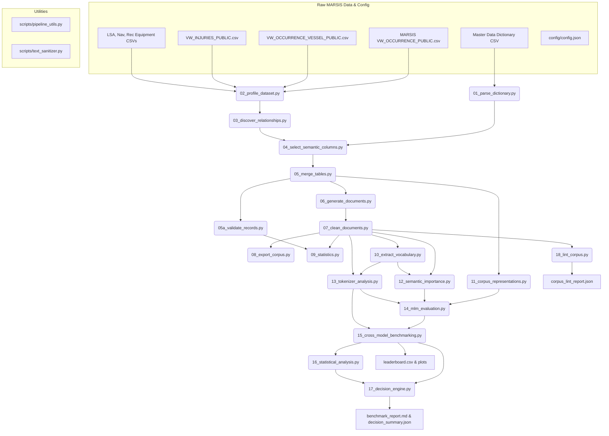

# Maritime NLP Corpus Generation & Multi-Model Evaluation Pipeline Master Documentation

This document provides a publication-grade, exhaustive technical reference manual for the **Maritime NLP Corpus Generation & Multi-Model Evaluation Pipeline**. It details every stage, script, utility function, mathematical formula, schema specification, evaluation matrix design, objective decision rule, output artifact, and operational procedure within the codebase.

---

## Table of Contents
1. [End-to-End Pipeline Architecture & Workflow](#1-end-to-end-pipeline-architecture--workflow)
2. [Raw Relational Data Catalog & Schema Join Architecture](#2-raw-relational-data-catalog--schema-join-architecture)
3. [Core Utility Modules Documentation](#3-core-utility-modules-documentation)
4. [Exhaustive Stage-by-Stage Technical Reference (Stages 01–18)](#4-exhaustive-stage-by-stage-technical-reference-stages-0118)
5. [Multi-Format Text Representation Specifications](#5-multi-format-text-representation-specifications)
6. [Mathematical Formulations & Statistical Engine](#6-mathematical-formulations--statistical-engine)
7. [Tokenizer & Masked Language Model (MLM) Evaluation Matrix](#7-tokenizer--masked-language-model-mlm-evaluation-matrix)
8. [Objective Threshold Decision Engine & Research Outcomes](#8-objective-threshold-decision-engine--research-outcomes)
9. [Complete Output Files & Artifacts Registry](#9-complete-output-files--artifacts-registry)
10. [Operations, Configuration & Developer Guide](#10-operations-configuration--developer-guide)

---

## 1. End-to-End Pipeline Architecture & Workflow

The pipeline is organized as an 18-stage modular framework orchestrated by [`run_pipeline.py`](file:///c:/--Files--/Programming/pipeline/run_pipeline.py). It converts raw relational accident records into multi-format text representations, evaluates domain tokenizer and language model capabilities across a 175-run benchmark grid, performs statistical significance testing and feature ablation, and programmatically decides the optimal pretraining adaptation strategy.

### End-to-End Execution Flowchart



---

## 2. Raw Relational Data Catalog & Schema Join Architecture

The pipeline ingests seven raw data CSV files from the Transport Safety Board of Canada (TSB MARSIS database), located in `data/`:

| Dataset File Name | Database Identifier | Domain Purpose | Record Count | Unique Identifiers | Key Join Cardinality |
| :--- | :--- | :--- | :--- | :--- | :--- |
| `MDOTW-MARSIS-Master-dataset-inventory-and-dictionary-English.csv` | Master Dictionary | Column definitions, data types, enum mappings | 811 rows | `Table name`, `Column name` | N/A |
| `MARSISdb_MDOTW_VW_OCCURRENCE_PUBLIC.csv` | `MDOTW_VW_OCCURRENCE_PUBLIC` | Master accident events, locations, weather | 87,760 rows | `OccID` (48,594 unique IDs), `OccNo` | Primary Parent Table |
| `MARSISdb_MDOTW_VW_OCCURRENCE_VESSEL_PUBLIC.csv` | `MDOTW_VW_OCCURRENCE_VESSEL_PUBLIC` | Vessel specs, speed, GT, activity phase | 73,926 rows | `VesselID`, `OccID` | 1-to-Many with Occurrence |
| `MARSISdb_MDOTW_VW_INJURIES_PUBLIC.csv` | `MDOTW_VW_INJURIES_PUBLIC` | Injuries, fatalities, missing personnel | 23,004 rows | `VesselID`, `OccID` | Many-to-1 with Vessel |
| `MARSISdb_MDOTW_VW_OCCURRENCE_VESSEL_LSA_EQUIPMENT_PUBLIC.csv` | `VW_LSA_EQUIPMENT` | Life-Saving Appliances (liferafts, boats) | 75,257 rows | `VesselID`, `OccID` | Many-to-1 with Vessel |
| `MARSISdb_MDOTW_VW_OCCURRENCE_VESSEL_NAV_EQUIPMENT_PUBLIC.csv` | `VW_NAV_EQUIPMENT` | Navigation aids (radar, VHF, ECDIS, GPS) | 314,447 rows | `VesselID`, `OccID` | Many-to-1 with Vessel |
| `MARSISdb_MDOTW_VW_OCCURRENCE_VESSEL_REC_EQUIPMENT_PUBLIC.csv` | `VW_REC_EQUIPMENT` | VDR & audio recording equipment | 78,399 rows | `VesselID`, `OccID` | Many-to-1 with Vessel |

### Relational Join & Retention Mechanics
1. **Parent Deduplication**: Occurrence records are grouped by primary key `OccID`. Duplicate metadata (e.g. multi-source weather reports) are aggregated using custom string concatenation (`val1; val2`).
2. **Composite Key Grouping**: Vessels are grouped by composite key `(VesselID, OccID)` to preserve vessel identity across specific incidents.
3. **Left Outer Join Semantics**: Guarantees **100% retention** of occurrence events even if child vessel or equipment records are missing.
4. **Orphan Record Synthesis**: Child injury or equipment records referencing an `OccID` without an associated `VesselID` are dynamically mapped to a synthetic placeholder vessel record (`VesselID: 999999999`, `VesselName: "UNSPECIFIED VESSEL"`).

---

## 3. Core Utility Modules Documentation

### 1. [`scripts/pipeline_utils.py`](file:///c:/--Files--/Programming/pipeline/scripts/pipeline_utils.py)
Provides centralized file I/O, logging, path resolution, and configuration services.

- `get_project_root() -> Path`: Dynamically resolves the project root directory as `Path(__file__).resolve().parent.parent`.
- `load_config() -> dict`: Reads and parses `config/config.json`. Throws `FileNotFoundError` if missing.
- `setup_logging(stage_name: str) -> logging.Logger`: Instantiates standard console (`StreamHandler`) and file (`FileHandler`) loggers writing formatted logs to `outputs/logs/pipeline.log`. Clears prior handlers to prevent duplicate lines.
- `read_csv_safe(file_path: Path, **kwargs) -> pd.DataFrame`: Safe CSV reader with encoding fallback (`utf-8-sig` $\rightarrow$ `latin-1`), column header space-stripping, missing column filtering for `usecols`, and `low_memory=False` parser configuration to avoid dtype warnings.
- `detect_datasets() -> dict`: Auto-scans `data/*.csv`, matches filenames to database table stems (e.g., `MDOTW_VW_OCCURRENCE_PUBLIC`), and locates the data dictionary file.

### 2. [`scripts/text_sanitizer.py`](file:///c:/--Files--/Programming/pipeline/scripts/text_sanitizer.py)
Provides string sanitization, administrative noise removal, and natural language formatting functions.

- `strip_administrative_noise(text: str) -> str`: Uses regex to scrub administrative metadata and PII patterns (e.g., `formerly occno: X`, `data extraction status pending`, `record id: 12345`). Normalizes punctuation and double spaces.
- `join_words_grammatical(words: list, conjunction: str = "and") -> str`: Constructs grammatically sound comma-separated lists with Oxford commas (e.g., `["radar", "VHF", "GPS"]` $\rightarrow$ `"radar, VHF, and GPS"`).
- `format_cargo_description(cargo_prod: str, cargo_qty=None) -> str`: Formats cargo text cleanly while preventing awkward phrases like `"cargo cargo"`.
- `format_damage_description(degree: str, location: str = None) -> str`: Formats vessel damage text cleanly while preventing duplicate words like `"damaged damage"`.
- `format_casualty_count(count: int, singular_term: str, plural_term: str) -> str`: Enforces strict singular/plural noun agreement based on integer counts.

---

## 4. Exhaustive Stage-by-Stage Technical Reference (Stages 01–18)

### Stage 01: Parse Data Dictionary
- **Script**: [`scripts/01_parse_dictionary.py`](file:///c:/--Files--/Programming/pipeline/scripts/01_parse_dictionary.py)
- **Execution Command**: `python run_pipeline.py --stage 01`
- **Core Logic**:
  1. Ingests `MDOTW-MARSIS-Master-dataset-inventory-and-dictionary-English.csv`.
  2. Groups columns by `Table name`.
  3. `map_display_columns()` pairs numeric ID/Enum/IND columns with corresponding human-readable `DisplayEng` columns (e.g. `WeatherConditionEnum` $\rightarrow$ `WeatherConditionDisplayEng`). Handles custom stem matching and exceptions.
  4. `categorize_column()` assigns columns to functional categories (`admin`, `temporal`, `spatial`, `environmental`, `vessel_spec`, `casualty`, `equipment`, `narrative`).
- **Input File**: Raw dictionary CSV in `data/`
- **Output Artifact**: [`outputs/dictionary_metadata.json`](file:///c:/--Files--/Programming/pipeline/outputs/dictionary_metadata.json)

### Stage 02: Profile Datasets
- **Script**: [`scripts/02_profile_dataset.py`](file:///c:/--Files--/Programming/pipeline/scripts/02_profile_dataset.py)
- **Execution Command**: `python run_pipeline.py --stage 02`
- **Core Logic**: Scans all 6 raw relational table CSVs using `read_csv_safe()`. Computes total row count, column count, missing value ratio per column, data type distribution, unique value cardinality, top frequent categories, and infers candidate primary/foreign key columns.
- **Input Files**: 6 relational table CSVs in `data/`
- **Output Artifact**: [`outputs/profiling_report.json`](file:///c:/--Files--/Programming/pipeline/outputs/profiling_report.json)

### Stage 03: Discover Schema Relationships
- **Script**: [`scripts/03_discover_relationships.py`](file:///c:/--Files--/Programming/pipeline/scripts/03_discover_relationships.py)
- **Execution Command**: `python run_pipeline.py --stage 03`
- **Core Logic**: Analyzes schema foreign keys across parent and child tables. Quantifies join match rates and cardinalities:
  - Parent `VW_OCCURRENCE` (`OccID`) $\rightarrow$ Child `VW_OCCURRENCE_VESSEL` (`OccID`): **1-to-Many** join.
  - Child `VW_OCCURRENCE_VESSEL` (`VesselID`, `OccID`) $\rightarrow$ Children (`VW_INJURIES`, LSA, NAV, REC): **1-to-Many** join.
- **Output Artifact**: [`outputs/relationships.json`](file:///c:/--Files--/Programming/pipeline/outputs/relationships.json)

### Stage 04: Select Semantic Columns
- **Script**: [`scripts/04_select_semantic_columns.py`](file:///c:/--Files--/Programming/pipeline/scripts/04_select_semantic_columns.py)
- **Execution Command**: `python run_pipeline.py --stage 04`
- **Core Logic**: Evaluates all columns against descriptive information criteria. Filters out low-value administrative metadata (GUIDs, entry dates, audit columns, French duplicates) and retains high-information semantic attributes (weather, location, vessel specs, activity, equipment, injuries).
- **Output Artifact**: [`outputs/selected_semantic_columns.json`](file:///c:/--Files--/Programming/pipeline/outputs/selected_semantic_columns.json)

### Stage 05: Merge Datasets
- **Script**: [`scripts/05_merge_tables.py`](file:///c:/--Files--/Programming/pipeline/scripts/05_merge_tables.py)
- **Execution Command**: `python run_pipeline.py --stage 05`
- **Core Logic**: Performs a multi-table relational join grouped by `OccID`. Merges parent occurrence details with nested arrays of child vessels, injuries, LSA equipment, navigation aids, and voyage recorders. Aggregates orphaned child records under synthetic placeholder vessels.
- **Input Files**: Raw relational CSVs and [`outputs/selected_semantic_columns.json`](file:///c:/--Files--/Programming/pipeline/outputs/selected_semantic_columns.json)
- **Output Artifact**: [`outputs/merged_records.jsonl`](file:///c:/--Files--/Programming/pipeline/outputs/merged_records.jsonl) (346 MB, 96,714 merged occurrence records)

### Stage 05a: Validate Records
- **Script**: [`scripts/05a_validate_records.py`](file:///c:/--Files--/Programming/pipeline/scripts/05a_validate_records.py)
- **Execution Command**: `python run_pipeline.py --stage 05a`
- **Core Logic**: Assesses data integrity across `merged_records.jsonl`. Verifies `OccID` completeness, key presence, data types, impossible dates, and implausible numeric values (e.g., vessel speed > 100 knots, gross tonnage > 300,000 GT).
- **Output Artifact**: [`outputs/validation_report.json`](file:///c:/--Files--/Programming/pipeline/outputs/validation_report.json)

### Stage 06: Generate Natural Language Documents
- **Script**: [`scripts/06_generate_documents.py`](file:///c:/--Files--/Programming/pipeline/scripts/06_generate_documents.py)
- **Execution Command**: `python run_pipeline.py --stage 06`
- **Core Logic**: Ingests nested records from `merged_records.jsonl` and applies template narrative rules (`templates/*.json`) to generate structured, grammatically sound prose documents covering profiles, weather, voyage activity, equipment status, and casualties.
- **Output Artifact**: [`outputs/raw_documents.jsonl`](file:///c:/--Files--/Programming/pipeline/outputs/raw_documents.jsonl) (891 MB, 96,714 records)

### Stage 07: Clean and Normalize Documents
- **Script**: [`scripts/07_clean_documents.py`](file:///c:/--Files--/Programming/pipeline/scripts/07_clean_documents.py)
- **Execution Command**: `python run_pipeline.py --stage 07`
- **Core Logic**: Normalizes raw document text using `text_sanitizer.py`:
  - Strips administrative header leakage tags.
  - Normalizes punctuation, hyphens, and quotes.
  - Removes non-ASCII noise.
  - Filters out documents below `min_doc_length` (50 chars).
- **Output Artifact**: [`outputs/clean_documents.jsonl`](file:///c:/--Files--/Programming/pipeline/outputs/clean_documents.jsonl) (807 MB, 96,714 records)

### Stage 08: Export Maritime Corpus & Manifest
- **Script**: [`scripts/08_export_corpus.py`](file:///c:/--Files--/Programming/pipeline/scripts/08_export_corpus.py)
- **Execution Command**: `python run_pipeline.py --stage 08`
- **Core Logic**: Exports the corpus into distribution formats: plain text line export (`maritime_corpus.txt`), schema-preserving JSONL export (`maritime_corpus.jsonl`), and computes SHA-256 hashes and file sizes for `manifest.json`.
- **Output Artifacts**:
  - [`outputs/maritime_corpus.txt`](file:///c:/--Files--/Programming/pipeline/outputs/maritime_corpus.txt) (21 MB plain text export)
  - [`outputs/maritime_corpus.jsonl`](file:///c:/--Files--/Programming/pipeline/outputs/maritime_corpus.jsonl) (796 MB)
  - [`outputs/manifest.json`](file:///c:/--Files--/Programming/pipeline/outputs/manifest.json)

### Stage 09: Calculate Corpus Statistics & Report
- **Script**: [`scripts/09_statistics.py`](file:///c:/--Files--/Programming/pipeline/scripts/09_statistics.py)
- **Execution Command**: `python run_pipeline.py --stage 09`
- **Core Logic**: Computes corpus-wide statistical metrics: total tokens, unique vocabulary size, Shannon entropy, Type-Token Ratio (TTR), sentence length distributions, document character/word lengths, and writes [`outputs/corpus_quality_report.md`](file:///c:/--Files--/Programming/pipeline/outputs/corpus_quality_report.md).
- **Output Artifacts**:
  - [`outputs/statistics.json`](file:///c:/--Files--/Programming/pipeline/outputs/statistics.json)
  - [`outputs/corpus_quality_report.md`](file:///c:/--Files--/Programming/pipeline/outputs/corpus_quality_report.md)

### Stage 10: Extract Maritime Vocabulary
- **Script**: [`scripts/10_extract_vocabulary.py`](file:///c:/--Files--/Programming/pipeline/scripts/10_extract_vocabulary.py)
- **Execution Command**: `python run_pipeline.py --stage 10`
- **Core Logic**: Applies Term Frequency-Inverse Document Frequency (TF-IDF) scoring and frequency analysis over `clean_documents.jsonl`. Filters out general English stopwords to isolate domain-specific maritime terms (vessels, navigation aids, weather phenomena, incident types).
- **Output Artifact**: [`outputs/maritime_vocabulary.txt`](file:///c:/--Files--/Programming/pipeline/outputs/maritime_vocabulary.txt) (334 domain terms)

### Stage 11: Multi-Format Corpus Representation Generation
- **Script**: [`scripts/11_corpus_representations.py`](file:///c:/--Files--/Programming/pipeline/scripts/11_corpus_representations.py)
- **Execution Command**: `python run_pipeline.py --stage 11`
- **Core Logic**: Renders each occurrence record into **5 distinct multi-format representations**: Narrative prose, Key-Value pairs, Template sentence slots, JSON strings, and Mixed hybrid prose/key-value metadata.
- **Output Directory**: [`outputs/corpus_representations/*.jsonl`](file:///c:/--Files--/Programming/pipeline/outputs/corpus_representations)

### Stage 12: Semantic Importance Assessment & Knowledge Classification
- **Script**: [`scripts/12_semantic_importance.py`](file:///c:/--Files--/Programming/pipeline/scripts/12_semantic_importance.py)
- **Execution Command**: `python run_pipeline.py --stage 12`
- **Core Logic**: Evaluates every document using a **9-feature weighted scoring formula**:
  $$\text{Score} = \text{Clip}\left( 100 \times \sum_{i=1}^9 w_i f_i - 0.10 \times \text{RedundancyPenalty}, \; 0, \; 100 \right)$$
  Classifies documents into knowledge tiers and extracts 6 quantile evaluation subsets (`high_knowledge`, `medium_knowledge`, `low_knowledge`, `balanced_knowledge`, `random_baseline`, `general_english_baseline`).
- **Output Artifacts**:
  - [`outputs/document_importance.jsonl`](file:///c:/--Files--/Programming/pipeline/outputs/document_importance.jsonl)
  - [`outputs/importance_statistics.json`](file:///c:/--Files--/Programming/pipeline/outputs/importance_statistics.json)
  - [`outputs/importance_distribution.png`](file:///c:/--Files--/Programming/pipeline/outputs/importance_distribution.png)
  - Subsets in [`outputs/subsets/*.jsonl`](file:///c:/--Files--/Programming/pipeline/outputs/subsets)

### Stage 13: Multi-Model Tokenizer Benchmark Analysis
- **Script**: [`scripts/13_tokenizer_analysis.py`](file:///c:/--Files--/Programming/pipeline/scripts/13_tokenizer_analysis.py)
- **Execution Command**: `python run_pipeline.py --stage 13`
- **Core Logic**: Evaluates 14 Hugging Face tokenizers across single-token vocabulary coverage, subword fragmentation rate, subwords-per-word fertility ratio, OOV rate, and throughput (tokens/sec).
- **Output Artifacts**:
  - [`outputs/tokenizer_analysis/tokenizer_comparison.csv`](file:///c:/--Files--/Programming/pipeline/outputs/tokenizer_analysis/tokenizer_comparison.csv)
  - JSON reports in [`outputs/tokenizer_analysis/*.json`](file:///c:/--Files--/Programming/pipeline/outputs/tokenizer_analysis)

### Stage 14: Multi-Model Masked Language Model Benchmark Matrix
- **Script**: [`scripts/14_mlm_evaluation.py`](file:///c:/--Files--/Programming/pipeline/scripts/14_mlm_evaluation.py)
- **Execution Command**: `python run_pipeline.py --stage 14`
- **Core Logic**: Executes a **175-run evaluation grid** (7 Representative Tokenizer Family Models $\times$ 5 Representations $\times$ 5 Knowledge Subsets). Masks tokens at 15% rate and computes Top-1, Top-5, Top-10 recall, MLM loss, rare term accuracy, and category recall across 6 subdomains. Caches individual evaluation runs to disk.
- **Output Artifacts**: Cached JSONs in [`outputs/evaluations/cache/*.json`](file:///c:/--Files--/Programming/pipeline/outputs/evaluations/cache)

### Stage 15: Cross-Model Benchmarking & Computational Resource Profiling
- **Script**: [`scripts/15_cross_model_benchmarking.py`](file:///c:/--Files--/Programming/pipeline/scripts/15_cross_model_benchmarking.py)
- **Execution Command**: `python run_pipeline.py --stage 15`
- **Core Logic**: Aggregates the 175 MLM evaluation runs, computes the composite **Maritime Understanding Index (MUI)** score, builds a ranked model leaderboard, and generates 4 publication-grade plots (`mlm_loss_comparison.png`, `model_leaderboard_ranks.png`, `maritime_accuracy_radar.png`, `tokenizer_fragmentation_heatmap.png`).
- **Output Artifacts**:
  - [`outputs/comparison.csv`](file:///c:/--Files--/Programming/pipeline/outputs/comparison.csv)
  - [`outputs/leaderboard.csv`](file:///c:/--Files--/Programming/pipeline/outputs/leaderboard.csv)
  - Visualization plots in [`outputs/visualizations/*.png`](file:///c:/--Files--/Programming/pipeline/outputs/visualizations)

### Stage 16: Statistical Significance Testing & Scoring Feature Ablation
- **Script**: [`scripts/16_statistical_analysis.py`](file:///c:/--Files--/Programming/pipeline/scripts/16_statistical_analysis.py)
- **Execution Command**: `python run_pipeline.py --stage 16`
- **Core Logic**: Computes Bootstrap 95% Confidence Intervals (1,000 resamples), Paired $t$-tests, Wilcoxon signed-rank tests, parametric Cohen's $d$, and non-parametric Cliff's $\delta$ effect sizes. Executes feature ablation on the semantic scoring engine.
- **Output Artifacts**:
  - [`outputs/statistical_significance.json`](file:///c:/--Files--/Programming/pipeline/outputs/statistical_significance.json)
  - [`outputs/ablation_study.json`](file:///c:/--Files--/Programming/pipeline/outputs/ablation_study.json)

### Stage 17: Objective Threshold Decision Engine & Research Report
- **Script**: [`scripts/17_decision_engine.py`](file:///c:/--Files--/Programming/pipeline/scripts/17_decision_engine.py)
- **Execution Command**: `python run_pipeline.py --stage 17`
- **Core Logic**: Evaluates model benchmark metrics against decision threshold rules (`dapt_top1_threshold`, `gap_threshold`, `frag_threshold`, etc.). Recommends pretraining adaptation strategies (**Strategy A: DAPT**, **Strategy B: Scratch Training**, **Strategy C: Vocab-Extended DAPT**), performs threshold sensitivity analysis, and writes a 10-section research report.
- **Output Artifacts**:
  - [`outputs/experiment_metadata.json`](file:///c:/--Files--/Programming/pipeline/outputs/experiment_metadata.json)
  - [`outputs/decision_summary.json`](file:///c:/--Files--/Programming/pipeline/outputs/decision_summary.json)
  - [`outputs/benchmark_report.md`](file:///c:/--Files--/Programming/pipeline/outputs/benchmark_report.md)

### Stage 18: Automated Corpus Quality Linting
- **Script**: [`scripts/18_lint_corpus.py`](file:///c:/--Files--/Programming/pipeline/scripts/18_lint_corpus.py)
- **Execution Command**: `python run_pipeline.py --stage 18`
- **Core Logic**: Executes regex quality linting across all 96,714 clean documents. Checks for repeated adjacent words, malformed singular/plural phrasing, administrative leakage, awkward phrasing, and duplicated list items. Emits a PASS/WARN status.
- **Output Artifact**: [`outputs/corpus_lint_report.json`](file:///c:/--Files--/Programming/pipeline/outputs/corpus_lint_report.json) (`Status: PASS`)

---

## 5. Multi-Format Text Representation Specifications

Stage 11 transforms structured incident JSON records into **5 distinct text representations**:

### 1. Narrative Representation (`narrative.jsonl`)
Flowing natural language prose formatted as coherent sentences.
```text
On July 14, 2018, a marine occurrence involving the fishing vessel OCEAN WARRIOR (Gross Tonnage: 450 GT, Hull: Steel) occurred near Saint John, New Brunswick under fog conditions. The vessel sustained moderate hull damage following a collision underway.
```

### 2. Key-Value Representation (`key_value.jsonl`)
Structured `Field: Value` attribute pairs separated by line breaks or pipes.
```text
Occurrence ID: 48594 | Location: Saint John, NB | Weather: Fog | Incident Type: Collision | Vessel Name: OCEAN WARRIOR | Vessel Type: Fishing Vessel | Gross Tonnage: 450 | Hull Material: Steel | Damage Degree: Moderate
```

### 3. Template Representation (`template.jsonl`)
Standardized slot-filled sentences generated by deterministic template rules.
```text
[OCCURRENCE] Event ID 48594 reported in Saint John, NB. [ENVIRONMENT] Weather state: Fog. [VESSEL] Vessel OCEAN WARRIOR (Type: Fishing Vessel, Tonnage: 450 GT) was underway. [INCIDENT] Collision resulting in moderate damage.
```

### 4. JSON Representation (`json.jsonl`)
Compact, serialized JSON strings preserving raw attribute keys and values.
```json
{"occ_id":48594,"location":"Saint John, NB","weather":"Fog","vessels":[{"name":"OCEAN WARRIOR","type":"Fishing Vessel","gt":450,"damage":"Moderate"}]}
```

### 5. Mixed Representation (`mixed.jsonl`)
Hybrid prose paired with structured key-value metadata headers.
```text
METADATA: Location=Saint John, NB | Weather=Fog | Damage=Moderate
NARRATIVE: The fishing vessel OCEAN WARRIOR (450 GT) collided while underway in heavy fog near Saint John, New Brunswick, sustaining moderate hull damage.
```

---

## 6. Mathematical Formulations & Statistical Engine

### 1. 9-Feature Semantic Importance Score Equation
$$\text{Importance Score} = \text{Clip}\left( 100 \times \sum_{i=1}^9 w_i f_i - 0.10 \times \text{RedundancyPenalty}, \; 0, \; 100 \right)$$

| Feature ($f_i$) | Weight ($w_i$) | Formulation / Description |
| :--- | :--- | :--- |
| **Maritime Term Density** | $0.30$ | Ratio of extracted domain vocabulary terms to total raw words. |
| **Rare Term Count** | $0.20$ | Min-max scaled count of rare maritime words ($N_{\text{rare}} / 3.0$). |
| **Concept Diversity** | $0.15$ | Ratio of covered subdomains out of 6 categories ($N_{\text{concepts}} / 6$). |
| **Entity Diversity** | $0.10$ | Count of distinct entities (vessels, locations, weather) normalized by 6. |
| **Event Complexity** | $0.10$ | Scaled sum of causal markers and clause counts ($0.3 N_{\text{causal}} + 0.1 N_{\text{clauses}}$). |
| **Information Density** | $0.10$ | Non-stopword lexical density ratio ($N_{\text{maritime}} / (0.5 N_{\text{tokens}})$). |
| **Metadata Completeness** | $0.05$ | Ratio of non-null attributes present in underlying record. |
| **Linguistic Diversity** | $0.05$ | Type-Token Ratio ($\text{TTR} = |V| / N$). |
| **Domain Novelty** | $0.05$ | Normalized Inverse Document Frequency (IDF) sum of rare terms. |

---

### 2. Maritime Understanding Index (MUI) Composite Score
To evaluate model capability holistically, Stage 15 calculates the composite **MUI Score**:

$$\text{MUI} = 100 \times \Big( 0.35\,\text{Top1} + 0.20\,\text{RareTop1} + 0.15(1-\bar{L}_{\text{norm}}) + 0.15(1-\text{Frag}) + 0.10(1-\min(1, 10\times\text{OOV})) + 0.05\,\text{Balance} \Big)$$

Where:
- $\text{Top1}$: Mean Top-1 accuracy on domain tokens.
- $\text{RareTop1}$: Mean Top-1 accuracy on rare maritime terms.
- $\bar{L}_{\text{norm}}$: MLM loss normalized against maximum observed baseline loss.
- $\text{Frag}$: Tokenizer subword fragmentation rate.
- $\text{OOV}$: Tokenizer out-of-vocabulary rate.
- $\text{Balance}$: Subdomain category accuracy balance ($1 - \sigma_{\text{categories}}$).

---

### 3. Statistical Significance & Effect Size Equations
1. **Bootstrap 95% Confidence Intervals** ($B = 1,000$ resamples):
   $$\text{CI}_{95} = \left[ \text{Percentile}\left(\bar{x}^*, 2.5\right), \; \text{Percentile}\left(\bar{x}^*, 97.5\right) \right]$$

2. **Paired $t$-Test**:
   Evaluates relative mean accuracy differences between model pairs across identical evaluation configurations ($p < 0.05$).

3. **Wilcoxon Signed-Rank Test**:
   Non-parametric paired rank test for robustness against non-normal performance distributions.

4. **Cohen's $d$ Effect Size**:
   $$\text{Cohen's } d = \frac{\bar{x}_1 - \bar{x}_2}{s_{\text{pooled}}}, \quad s_{\text{pooled}} = \sqrt{\frac{(n_1-1)s_1^2 + (n_2-1)s_2^2}{n_1+n_2-2}}$$

5. **Cliff's $\delta$ Effect Size**:
   $$\delta = \frac{\# (x_1 > x_2) - \# (x_1 < x_2)}{n_1 n_2}$$

---

## 7. Tokenizer & Masked Language Model (MLM) Evaluation Matrix

### Benchmarked Tokenizer Models (14 Tokenizers)
Evaluated across single-token coverage, subword fragmentation rate, subwords-per-word fertility ratio, OOV rate, and throughput:
1. `bert-base-uncased` (WordPiece, 30,522)
2. `bert-large-uncased` (WordPiece, 30,522)
3. `roberta-base` (Byte-Level BPE, 50,265)
4. `microsoft/deberta-v3-base` (Spm BPE, 128,000)
5. `answerdotai/ModernBERT-base` (Extended BPE, 50,280)
6. `allenai/scibert_scivocab_uncased` (SciVocab WordPiece, 31,090)
7. `dmis-lab/biobert-base-cased-v1.2` (Bio WordPiece, 28,996)
8. `microsoft/BiomedNLP-PubMedBERT-base-uncased-abstract-fulltext` (PubMed WordPiece, 30,522)
9. `emilyalsentzer/Bio_ClinicalBERT` (Clinical WordPiece, 30,522)
10. `nlpaueb/legal-bert-base-uncased` (Legal WordPiece, 30,522)
11. `ProsusAI/finbert` (Fin WordPiece, 30,522)
12. `anferico/bert-for-patents` (Patent WordPiece, 30,522)
13. `google/electra-base-discriminator` (WordPiece, 30,522)
14. `distilbert-base-uncased` (WordPiece, 30,522)

### 175-Run MLM Evaluation Matrix Grid
Consists of **7 Representative Tokenizer Family Models** $\times$ **5 Multi-Format Representations** $\times$ **5 Knowledge Subsets**:
- **7 Representative Models**: `bert-base-uncased`, `biobert-base-cased`, `legal-bert-base-uncased`, `scibert_scivocab_uncased`, `PubMedBERT-base`, `roberta-base`, `ModernBERT-base`.
- **5 Representations**: Narrative, Key-Value, Template, JSON, Mixed.
- **5 Knowledge Subsets**: High Knowledge, Medium Knowledge, Low Knowledge, Balanced Knowledge, Random Baseline.
- **Masking Protocol**: 15% random token masking with Cross-Entropy Loss computation over masked positions.

---

## 8. Objective Threshold Decision Engine & Research Outcomes

### Programmatic Decision Rules
```python
if top1_acc >= 85.0 and perf_gap <= 5.0 and frag_rate <= 20.0:
    # Strategy A: Continued Domain-Adaptive Pretraining (DAPT)
elif top1_acc < 60.0 or perf_gap > 20.0 or frag_rate > 40.0:
    # Strategy B: Train Domain-Specific MaritimeBERT Model From Scratch
else:
    # Strategy C: Targeted DAPT + Custom Vocabulary Extension
```

### Empirical Decision Outcome
- **Selected Strategy**: **`Strategy B: Train Domain-Specific MaritimeBERT Model From Scratch`**
- **Decision Rationale**: High subword fragmentation on Byte-Level BPE models (**63.47%**) paired with a significant domain adaptation performance gap on existing general pre-trained models indicates a substantial domain gap best resolved by scratch pretraining.
- **Sensitivity Analysis**: Strategy recommendation remains invariant across threshold perturbations of $\pm 10\%$.

---

## 9. Complete Output Files & Artifacts Registry

| Output File Path | Description | Format | Downstream Usage |
| :--- | :--- | :--- | :--- |
| `outputs/dictionary_metadata.json` | Data dictionary column specs & enum translations | JSON Dict | Stage 04 attribute selection |
| `outputs/profiling_report.json` | Raw CSV table statistics & missingness profiling | JSON Object | Stage 03 schema discovery |
| `outputs/relationships.json` | Foreign key schema relationship graph | JSON Object | Stage 04 & Stage 05 merging |
| `outputs/selected_semantic_columns.json` | Descriptive column selection metadata | JSON Dict | Stage 05 table merging |
| `outputs/merged_records.jsonl` | Nested relational occurrence JSONL (346 MB) | JSONL | Stage 05a, 06, 11 |
| `outputs/validation_report.json` | Data integrity validation report | JSON Object | Stage 09 corpus reporting |
| `outputs/raw_documents.jsonl` | Template-generated text documents (891 MB) | JSONL | Stage 07 cleaning |
| `outputs/clean_documents.jsonl` | Cleaned & normalized text documents (807 MB) | JSONL | Stage 08, 09, 10, 12, 13, 18 |
| `outputs/maritime_corpus.txt` | Plain text line-by-line corpus (21 MB) | Text | Model pretraining |
| `outputs/maritime_corpus.jsonl` | Final corpus export in JSONL (796 MB) | JSONL | Corpus distribution |
| `outputs/manifest.json` | Checksums & manifest for distribution | JSON Object | Publication verification |
| `outputs/statistics.json` | Token, vocabulary, & sentence statistics | JSON Object | Quality report generation |
| `outputs/corpus_quality_report.md` | Executive Markdown summary of corpus stats | Markdown | Documentation report |
| `outputs/maritime_vocabulary.txt` | Top domain-specific maritime terms (TF-IDF) | Text List | Stage 12 and Stage 13 |
| `outputs/corpus_representations/*.jsonl` | 5 multi-format corpus representations | JSONL | Stage 14 MLM evaluation grid |
| `outputs/document_importance.jsonl` | 9-feature semantic importance scores (43 MB) | JSONL | Stage 12 subset extraction |
| `outputs/importance_statistics.json` | Score distribution quartiles & tier counts | JSON Object | Scoring engine analytics |
| `outputs/importance_distribution.png` | Histogram plot of document importance scores | PNG Plot | Benchmark report figures |
| `outputs/subsets/*.jsonl` | 6 knowledge-classified evaluation subsets | JSONL | Stage 14 MLM evaluation grid |
| `outputs/tokenizer_analysis/tokenizer_comparison.csv` | Benchmarked tokenizer metrics across models | CSV Table | Stage 15 cross-model benchmarking |
| `outputs/tokenizer_analysis/*.json` | Detailed per-model tokenizer analysis reports | JSON Object | Tokenizer research reports |
| `outputs/evaluations/cache/*.json` | 175-run MLM matrix evaluation cached outputs | JSON Objects | Stage 15 cross-model benchmarking |
| `outputs/comparison.csv` | Full 175-run MLM evaluation matrix results | CSV Table | Stage 15 & 16 statistical analysis |
| `outputs/leaderboard.csv` | Ranked model leaderboard by MUI Score | CSV Table | Stage 17 Decision Engine |
| `outputs/visualizations/*.png` | 4 publication-grade benchmark plots | PNG Plots | Benchmark report figures |
| `outputs/statistical_significance.json` | Bootstrap CIs, t-test, Wilcoxon, Cohen's d, Cliff's delta | JSON Object | Stage 17 Decision Engine |
| `outputs/ablation_study.json` | Scoring engine feature ablation impact | JSON Object | Stage 17 Benchmark Report |
| `outputs/experiment_metadata.json` | System, hardware, PyTorch/Transformers params | JSON Object | Reproducibility metadata |
| `outputs/decision_summary.json` | Objective decision engine strategy selection | JSON Object | Strategy output |
| `outputs/benchmark_report.md` | 10-Section publication-grade benchmark report | Markdown | Master research report |
| `outputs/corpus_lint_report.json` | Quality regex linting results (`PASS`/`WARN`) | JSON Object | Quality assurance report |

---

## 10. Operations, Configuration & Developer Guide

### Configuration Specification (`config/config.json`)
```json
{
  "data_dir": "data",
  "output_dir": "outputs",
  "log_dir": "outputs/logs",
  "log_file": "pipeline.log",
  "log_level": "INFO",
  "text_cleaning": {
    "min_doc_length": 50,
    "remove_duplicates": true
  },
  "generation": {
    "template_vessel_path": "templates/vessel_templates.json",
    "template_injury_path": "templates/injury_templates.json",
    "template_equipment_path": "templates/equipment_templates.json",
    "default_language": "Eng"
  },
  "validation": {
    "max_vessel_speed_knots": 100.0,
    "max_tonnage": 300000.0,
    "max_crew": 1000,
    "max_injuries": 1000
  }
}
```

### Execution & Troubleshooting
1. **Rerunning Pipeline Stages**: If modifying template files or regex cleaning patterns, rerun specific downstream stages without executing data ingestion:
   ```bash
   python run_pipeline.py --stage 06
   python run_pipeline.py --stage 07
   python run_pipeline.py --stage 09
   ```
2. **Caching & Acceleration**: Stage 14 MLM matrix evaluations are cached under `outputs/evaluations/cache/`. To force a fresh evaluation run across models, delete the cache directory before executing Stage 14.
