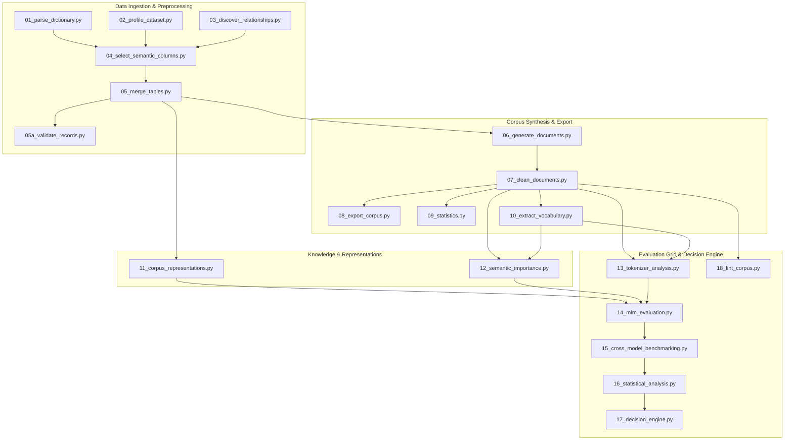

# Maritime NLP Corpus Generation & Multi-Model Evaluation Pipeline

A production-grade, publication-ready research and data engineering pipeline designed to convert raw relational maritime accident databases (TSB MARSIS views) into high-quality, multi-format text representations, evaluate domain tokenizer/MLM performance across representative model families, perform statistical significance testing and feature ablation, and execute an objective decision engine to select the optimal model adaptation strategy (**Strategy A: DAPT**, **Strategy B: Train from Scratch**, or **Strategy C: Vocabulary-Extended DAPT**).

---

## Executive Summary & Key Research Findings

- **Domain Scope**: Ingests **87,760 maritime accident occurrences** and **73,926 vessel records** from the Transport Safety Board of Canada (TSB MARSIS database).
- **Corpus Generation**: Produces **96,714 cleaned natural language documents** (807 MB) and **5 multi-format representations** (Narrative, Key-Value, Template, JSON, Mixed).
- **Semantic Scoring Engine**: Evaluates documents using a **9-feature weighted scoring formula** and exports 6 quantile-classified knowledge subsets (`high`, `medium`, `low`, `balanced`, `random`, `general_english`).
- **Benchmarking Matrix**: Executes a **175-run Masked Language Model (MLM) evaluation grid** (7 representative model families $\times$ 5 representations $\times$ 5 knowledge subsets).
- **Core Decision**: The objective multi-criteria evidence hierarchy prescribes **Strategy A: Pretrained Encoder Initialization (answerdotai/ModernBERT-base) + Domain-Adaptive Pretraining (DAPT)** with **High Confidence** (100% bootstrap rank-1 frequency across 2,000 resamples, 0 pairwise defeats, non-dominated Pareto status), maintaining **bert-base-uncased** as the resource-constrained deployment alternative (2.6x faster latency, 26.6% fragmentation).

---

## End-to-End 18-Stage Architecture



---

## Directory Structure

```text
pipeline/
├── config/
│   └── config.json                  # Master parameters, thresholds, and log settings
├── data/                            # Raw MARSIS CSV table exports (git-ignored)
├── templates/                       # Dynamic template family rules
│   ├── vessel_templates.json        # Vessel specifications & activity templates
│   ├── injury_templates.json        # Casualty & injury breakdown templates
│   └── equipment_templates.json     # LSA, Navigation, & REC equipment templates
├── scripts/                         # 18 Modular execution stage scripts & utilities
│   ├── pipeline_utils.py            # Workspace path resolution, safe CSV reader, logger
│   ├── text_sanitizer.py            # Regex text normalization & administrative noise scrubbing
│   ├── 01_parse_dictionary.py       # Master inventory data dictionary parser
│   ├── 02_profile_dataset.py        # Relational dataset statistical profiling
│   ├── 03_discover_relationships.py # Foreign key schema graph discovery
│   ├── 04_select_semantic_columns.py# Descriptive density & semantic column selection
│   ├── 05_merge_tables.py           # Hierarchical relational left-outer join
│   ├── 05a_validate_records.py      # Record constraint & orphan validation
│   ├── 06_generate_documents.py     # Multi-document template narrative synthesis
│   ├── 07_clean_documents.py        # Header leakage stripping & punctuation normalization
│   ├── 08_export_corpus.py          # Plain text, JSONL corpus exports, SHA-256 manifest
│   ├── 09_statistics.py             # Vocabulary entropy, TTR, sentence length profiling
│   ├── 10_extract_vocabulary.py     # TF-IDF domain maritime term extraction
│   ├── 11_corpus_representations.py # 5 Multi-format corpus representations generator
│   ├── 12_semantic_importance.py    # Domain informativeness scoring engine
│   ├── 13_tokenizer_analysis.py     # Tokenizer fertility, coverage, and speed benchmarking
│   ├── 14_mlm_evaluation.py         # 175-run MLM evaluation matrix grid
│   ├── 15_cross_model_benchmarking.py # MUI composite scoring, sensitivity, Pareto & leaderboard
│   ├── 16_statistical_analysis.py   # Bootstrap CIs, paired t-tests, Wilcoxon, Cohen's d, feature ablation
│   ├── 17_decision_engine.py        # Multi-criteria evidence decision engine & research report
│   └── 18_lint_corpus.py            # Corpus regex quality linting engine
├── outputs/                         # Exported JSON, JSONL, CSV, PNG, and MD artifacts
├── documentation/                   # 15 Detailed modular section guides & appendices
├── run_pipeline.py                  # Master CLI orchestrator script
├── DOCUMENTATION.md                 # Single-file master technical manual & appendices
└── README.md                        # Quick start & high-level architecture overview
```

---

## Setup & Environment Installation

### 1. Prerequisites
- **Python 3.12+**
- **PyTorch 2.0+** (with CUDA support recommended for MLM evaluation)
- **Hugging Face Transformers**
- Dataset CSV files placed in `data/` directory.

### 2. Install Dependencies
```bash
pip install -r requirements.txt
```

---

## Pipeline Execution Guide

The master CLI orchestrator [`run_pipeline.py`](file:///d:/CAIR/TSBC-MaritimePipeline-Version2.1/run_pipeline.py) manages execution across all 18 stages.

### Run the Full Pipeline Sequentially
```bash
python run_pipeline.py
```

### Run an Individual Stage
```bash
# Calculate MUI score, sensitivity, Pareto frontier and leaderboard
python run_pipeline.py --stage 15

# Execute statistical significance tests and component ablation
python run_pipeline.py --stage 16

# Execute objective multi-criteria decision engine
python run_pipeline.py --stage 17

# Run automated corpus quality linting
python run_pipeline.py --stage 18
```

---

## Detailed Documentation Section Guides

For exhaustive, in-depth technical documentation on specific components, refer to the dedicated section guides in [`documentation/`](file:///d:/CAIR/TSBC-MaritimePipeline-Version2.1/documentation/):

1. **[00_master_index.md](file:///d:/CAIR/TSBC-MaritimePipeline-Version2.1/documentation/00_master_index.md)**: Master architecture, orchestrator sequence, configuration reference, and global API index.
2. **[01_phase1_data_identification_and_mapping.md](file:///d:/CAIR/TSBC-MaritimePipeline-Version2.1/documentation/01_phase1_data_identification_and_mapping.md)**: Stages 01–04: Dictionary parsing, dataset profiling, relationship discovery, semantic column selection.
3. **[02_phase2_raw_data_preparation.md](file:///d:/CAIR/TSBC-MaritimePipeline-Version2.1/documentation/02_phase2_raw_data_preparation.md)**: Stages 05–05a: Hierarchical left outer table merging, placeholder synthesis, record validation.
4. **[03_phase3_document_generation.md](file:///d:/CAIR/TSBC-MaritimePipeline-Version2.1/documentation/03_phase3_document_generation.md)**: Stage 06: Deterministic multi-template narrative generation, vessel, casualty, equipment clause builders.
5. **[04_phase4_corpus_cleaning_and_export.md](file:///d:/CAIR/TSBC-MaritimePipeline-Version2.1/documentation/04_phase4_corpus_cleaning_and_export.md)**: Stages 07–08: Administrative noise scrubbing, sentence deduplication, corpus export, SHA-256 manifest.
6. **[05_phase5_corpus_quality_evaluation.md](file:///d:/CAIR/TSBC-MaritimePipeline-Version2.1/documentation/05_phase5_corpus_quality_evaluation.md)**: Stages 09–10: Vocabulary entropy, shingle MinHash, domain vocabulary extraction via TF-IDF.
7. **[06_phase6_semantic_importance_analysis.md](file:///d:/CAIR/TSBC-MaritimePipeline-Version2.1/documentation/06_phase6_semantic_importance_analysis.md)**: Stages 11–12: 5 multi-format representations, 4-signal domain informativeness formula, 6 knowledge subsets.
8. **[07_phase7_tokenizer_analysis.md](file:///d:/CAIR/TSBC-MaritimePipeline-Version2.1/documentation/07_phase7_tokenizer_analysis.md)**: Stage 13: 14-tokenizer evaluation, subword fertility, fragmentation rate, redundancy clustering.
9. **[08_phase8_mlm_evaluation.md](file:///d:/CAIR/TSBC-MaritimePipeline-Version2.1/documentation/08_phase8_mlm_evaluation.md)**: Stage 14: 175-run Cartesian MLM evaluation matrix grid, random vs domain-aware masking, PLL pseudo-perplexity.
10. **[09_phase9_benchmarking_decision_engine_and_final_reports.md](file:///d:/CAIR/TSBC-MaritimePipeline-Version2.1/documentation/09_phase9_benchmarking_decision_engine_and_final_reports.md)**: Stages 15–18: Cross-model benchmarking, MUI sensitivity, Pareto dominance, statistical significance, objective decision engine, and corpus linting.
11. **[10_appendix_a_corpus_results_stages_1_to_10.md](file:///d:/CAIR/TSBC-MaritimePipeline-Version2.1/documentation/10_appendix_a_corpus_results_stages_1_to_10.md)**: Appendix A: Complete empirical schema metrics, merge reconciliation stats, and corpus distributions.
12. **[11_appendix_b_model_evaluation_results_stages_11_to_18.md](file:///d:/CAIR/TSBC-MaritimePipeline-Version2.1/documentation/11_appendix_b_model_evaluation_results_stages_11_to_18.md)**: Appendix B: Complete empirical benchmarks, 175-cell matrix tables, statistical tests, decision profiles, and lint gate results.
13. **[12_glossary.md](file:///d:/CAIR/TSBC-MaritimePipeline-Version2.1/documentation/12_glossary.md)**: Authoritative definitions of all maritime, NLP, and statistical domain concepts.
14. **[13_research_traceability_matrix.md](file:///d:/CAIR/TSBC-MaritimePipeline-Version2.1/documentation/13_research_traceability_matrix.md)**: Full bidirectional traceability between raw database columns, scripts, and evaluation metrics.
15. **[14_dapt_domain_adaptive_pretraining.md](file:///d:/CAIR/TSBC-MaritimePipeline-Version2.1/documentation/14_dapt_domain_adaptive_pretraining.md)**: Execution specifications and training configurations for the subsequent DAPT pretraining phase.

# TSBC-MaritimePipeline-PR

