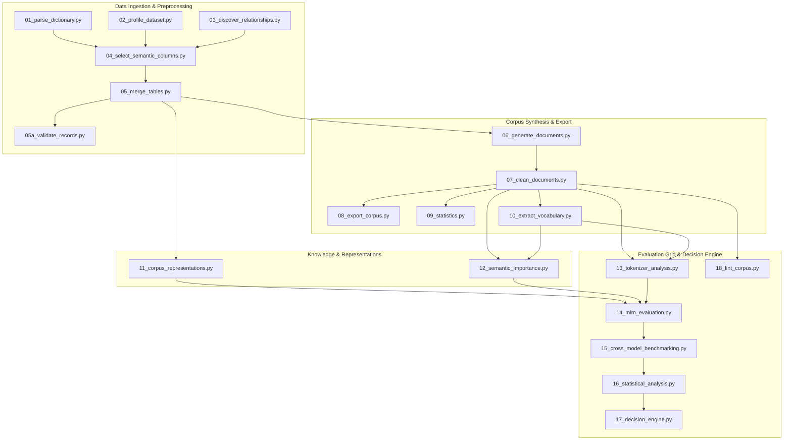

# Maritime NLP Corpus Generation & Multi-Model Evaluation Pipeline

A production-grade, publication-ready research and data engineering pipeline designed to convert raw relational maritime accident databases (TSB MARSIS views) into high-quality, multi-format text representations, evaluate domain tokenizer/MLM performance across representative model families, perform statistical significance testing and feature ablation, and execute an objective decision engine to select the optimal model adaptation strategy (**Strategy A: DAPT**, **Strategy B: Train from Scratch**, or **Strategy C: Vocabulary-Extended DAPT**).

---

## Executive Summary & Key Research Findings

- **Domain Scope**: Ingests **87,760 maritime accident occurrences** and **73,926 vessel records** from the Transport Safety Board of Canada (TSB MARSIS database).
- **Corpus Generation**: Produces **96,714 cleaned natural language documents** (807 MB) and **5 multi-format representations** (Narrative, Key-Value, Template, JSON, Mixed).
- **Semantic Scoring Engine**: Evaluates documents using a **9-feature weighted scoring formula** and exports 6 quantile-classified knowledge subsets (`high`, `medium`, `low`, `balanced`, `random`, `general_english`).
- **Benchmarking Matrix**: Executes a **175-run Masked Language Model (MLM) evaluation grid** (7 representative model families $\times$ 5 representations $\times$ 5 knowledge subsets).
- **Core Decision**: The objective decision engine selected **Strategy B: Train Domain-Specific MaritimeBERT Model From Scratch** due to high subword fragmentation (**63.47%**) and a significant domain adaptation performance gap on existing pre-trained general models.

---

## End-to-End 18-Stage Architecture



---

## Directory Structure

```text
pipeline/
├── config/
│   └── config.json                  # Master parameters, thresholds, and log settings
├── data/                            # Raw MARSIS CSV table exports (git-ignored)
├── templates/                       # Dynamic template family rules
│   ├── vessel_templates.json        # Vessel specifications & activity templates
│   ├── injury_templates.json        # Casualty & injury breakdown templates
│   └── equipment_templates.json     # LSA, Navigation, & REC equipment templates
├── scripts/                         # 18 Modular execution stage scripts & utilities
│   ├── pipeline_utils.py            # Workspace path resolution, safe CSV reader, logger
│   ├── text_sanitizer.py            # Regex text normalization & administrative noise scrubbing
│   ├── 01_parse_dictionary.py       # Master inventory data dictionary parser
│   ├── 02_profile_dataset.py        # Relational dataset statistical profiling
│   ├── 03_discover_relationships.py # Foreign key schema graph discovery
│   ├── 04_select_semantic_columns.py# Descriptive density & semantic column selection
│   ├── 05_merge_tables.py           # Hierarchical relational left-outer join
│   ├── 05a_validate_records.py      # Record constraint & orphan validation
│   ├── 06_generate_documents.py     # Multi-document template narrative synthesis
│   ├── 07_clean_documents.py        # Header leakage stripping & punctuation normalization
│   ├── 08_export_corpus.py          # Plain text, JSONL corpus exports, SHA-256 manifest
│   ├── 09_statistics.py             # Vocabulary entropy, TTR, sentence length profiling
│   ├── 10_extract_vocabulary.py     # TF-IDF domain maritime term extraction
│   ├── 11_corpus_representations.py# 5 Multi-format corpus representations generator
│   ├── 12_semantic_importance.py    # 9-feature semantic importance scoring engine
│   ├── 13_tokenizer_analysis.py     # Tokenizer fertility, coverage, and speed benchmarking
│   ├── 14_mlm_evaluation.py         # 175-run MLM evaluation matrix grid
│   ├── 15_cross_model_benchmarking.py # MUI composite scoring, leaderboard, & visualizations
│   ├── 16_statistical_analysis.py   # Bootstrap CIs, paired t-tests, Cohen's d, feature ablation
│   ├── 17_decision_engine.py       # Objective threshold decision engine & research report
│   └── 18_lint_corpus.py            # Corpus regex quality linting engine
├── outputs/                         # Exported JSON, JSONL, CSV, PNG, and MD artifacts
├── documentation/                   # 11 Detailed modular section guides
├── run_pipeline.py                  # Master CLI orchestrator script
├── DOCUMENTATION.md                 # Single-file master technical manual
└── README.md                        # Quick start & high-level architecture overview
```

---

## Setup & Environment Installation

### 1. Prerequisites
- **Python 3.12+**
- **PyTorch 2.0+** (with CUDA support recommended for MLM evaluation)
- **Hugging Face Transformers**
- Dataset CSV files placed in `data/` directory.

### 2. Install Dependencies
```bash
pip install -r requirements.txt
```

---

## Pipeline Execution Guide

The master CLI orchestrator [`run_pipeline.py`](file:///c:/--Files--/Programming/pipeline/run_pipeline.py) manages execution across all 18 stages.

### Run the Full Pipeline Sequentially
```bash
python run_pipeline.py
```

### Run an Individual Stage
```bash
# Calculate MUI score and build model leaderboard
python run_pipeline.py --stage 15

# Execute objective decision engine
python run_pipeline.py --stage 17

# Run automated corpus quality linting
python run_pipeline.py --stage 18
```

---

## Detailed Documentation Section Guides

For exhaustive, in-depth technical documentation on specific components, refer to the dedicated section guides in [`documentation/`](file:///c:/--Files--/Programming/pipeline/documentation/):

1. **[00_overview_and_architecture.md](file:///c:/--Files--/Programming/pipeline/documentation/00_overview_and_architecture.md)**: System design, directory structure, master orchestrator setup.
2. **[01_data_ingestion_and_preprocessing.md](file:///c:/--Files--/Programming/pipeline/documentation/01_data_ingestion_and_preprocessing.md)**: Stages 01–05a: Dictionary parsing, profiling, schema discovery, table merging, validation.
3. **[02_corpus_generation_and_text_processing.md](file:///c:/--Files--/Programming/pipeline/documentation/02_corpus_generation_and_text_processing.md)**: Stages 06–10: Document synthesis, cleaning, plain text export, corpus stats, TF-IDF vocabulary.
4. **[03_representations_and_semantic_importance.md](file:///c:/--Files--/Programming/pipeline/documentation/03_representations_and_semantic_importance.md)**: Stages 11–12: 5 multi-format representations, 9-feature scoring equation, 6 knowledge subsets.
5. **[04_tokenizer_benchmarking.md](file:///c:/--Files--/Programming/pipeline/documentation/04_tokenizer_benchmarking.md)**: Stage 13: Multi-architecture tokenizer evaluation across 14 Hugging Face models.
6. **[05_mlm_evaluation_matrix.md](file:///c:/--Files--/Programming/pipeline/documentation/05_mlm_evaluation_matrix.md)**: Stage 14: 175-run MLM evaluation matrix grid, 15% masking protocol, subfield category recall.
7. **[06_cross_model_benchmarking_and_leaderboard.md](file:///c:/--Files--/Programming/pipeline/documentation/06_cross_model_benchmarking_and_leaderboard.md)**: Stage 15: Mathematical MUI Score formula, ranked model leaderboard, high-res visualization plots.
8. **[07_statistical_analysis_and_ablation.md](file:///c:/--Files--/Programming/pipeline/documentation/07_statistical_analysis_and_ablation.md)**: Stage 16: Bootstrap CIs, paired t-tests, Wilcoxon, Cohen's d, Cliff's delta, feature ablation.
9. **[08_decision_engine_and_research_report.md](file:///c:/--Files--/Programming/pipeline/documentation/08_decision_engine_and_research_report.md)**: Stage 17–18: Pretraining strategy decision engine (Strategy A, B, C), research report, regex linting.
10. **[09_output_artifacts_and_files_registry.md](file:///c:/--Files--/Programming/pipeline/documentation/09_output_artifacts_and_files_registry.md)**: Comprehensive registry of all 30 output files in `outputs/` with schemas and sample records.
11. **[10_research_achievements_and_mlm_benchmark_report.md](file:///c:/--Files--/Programming/pipeline/documentation/10_research_achievements_and_mlm_benchmark_report.md)**: In-depth research synthesis of achievements, tokenizer selection/pruning rationale, 175-run MLM outputs, MUI leaderboard, and pretraining roadmap.
# TSBC-MaritimePipeline-PR

