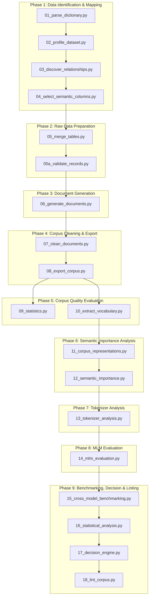
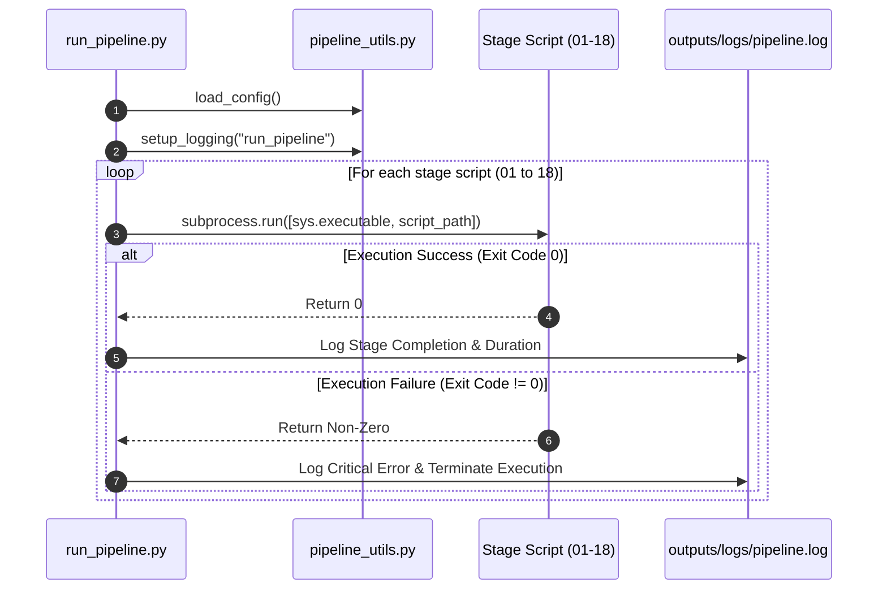

# Master Pipeline Architecture, Configuration Reference & Global API Index

Welcome to the definitive technical documentation for the **TSBC Maritime Pipeline**. This system ingests relational database exports from the Transportation Safety Board of Canada (TSB MARSIS dataset), profiles schemas, discovers relationships, cleans and validates records, synthesizes natural language operational narratives, evaluates corpus quality, categorizes document semantic importance, benchmarks 14 Hugging Face tokenizers and 7 transformer model families across 350 matrix runs, and executes an automated decision engine to prescribe optimal language model pretraining strategies.

---

## 1. System Architecture & Pipeline Orchestration

### 1.1 High-Level End-to-End Architecture



### 1.2 Pipeline Execution Orchestrator (`run_pipeline.py`)

The pipeline execution orchestrator controls sequential execution, failure isolation, timing, logging, and step-by-step progress tracking across all 18 pipeline stages.



#### Detailed Function Specification: `run_stage` in `run_pipeline.py`
- **Purpose**: Executes an individual pipeline Python script in an isolated subprocess, measuring execution duration and capturing exit codes.
- **Why this function exists**: To prevent memory leakage across stages, enforce strict sequential dependency ordering, and halt execution immediately if any stage fails.
- **Where it is called**: Main loop of `run_pipeline.py`.
- **Inputs**: Script name (`str`), project root `Path`.
- **Outputs**: Returns boolean `True` if stage completed with exit code 0, `False` otherwise.
- **Parameters**: `script_name: str`, `root_dir: Path`.
- **Return values**: `bool`.
- **Internal algorithm**:
  1. Construct absolute path `root_dir / "scripts" / script_name`.
  2. Record start timestamp using `time.time()`.
  3. Invoke `subprocess.run([sys.executable, str(script_path)])`.
  4. Record end timestamp and compute duration.
  5. Check `result.returncode == 0`. Log success or failure.
- **Step-by-step execution**:
  ```python
  t0 = time.time()
  res = subprocess.run([sys.executable, str(script_path)])
  duration = time.time() - t0
  if res.returncode == 0:
      logger.info(f"Stage {script_name} completed in {duration:.2f}s")
      return True
  ```
- **Edge cases**: Missing script file raises `FileNotFoundError`. Subprocess signal interrupts are caught via non-zero return codes.
- **Exception handling**: Catches `Exception as e`, logs error stack trace via `logger.error()`, returns `False`.
- **Logging behavior**: Outputs `INFO` logs at step start/end and `ERROR` logs on non-zero exit codes.
- **Time complexity**: $O(T_{\text{script}})$ where $T_{\text{script}}$ is execution time of target script.
- **Space complexity**: $O(1)$ overhead in main orchestrator process.
- **Dependencies**: `subprocess`, `sys`, `time`, `logging`, `pipeline_utils.py`.
- **Example execution**: `run_stage("01_parse_dictionary.py", root_path)`
- **Common failure cases**: Missing dependencies in sub-environment, memory exhaustion in script subprocess.

---

## 2. Exhaustive Configuration Parameter Matrix

All pipeline operational settings are centralized in `config/config.json`. Below is the complete parameter specification:

| Parameter Name | Data Type | Default Value | Accepted Range | Used By Scripts | Why It Exists | Effect of Changing | Recommended Value |
| :--- | :--- | :--- | :--- | :--- | :--- | :--- | :--- |
| `data_dir` | `string` | `"data"` | Relative path | All scripts | Specifies relative location of raw CSV data tables. | Points pipeline to alternate raw data directory. | `"data"` |
| `output_dir` | `string` | `"outputs"` | Relative path | All scripts | Specifies relative location of generated artifacts. | Redirects output files to target destination. | `"outputs"` |
| `log_dir` | `string` | `"outputs/logs"` | Relative path | `pipeline_utils.py` | Directory for persistent log files. | Changes log storage folder. | `"outputs/logs"` |
| `log_file` | `string` | `"pipeline.log"` | Valid filename | `pipeline_utils.py` | Filename of persistent execution log. | Renames central log file. | `"pipeline.log"` |
| `log_level` | `string` | `"INFO"` | `"DEBUG"`, `"INFO"`, `"WARNING"`, `"ERROR"` | `pipeline_utils.py` | Sets logging verbosity threshold across pipeline. | `"DEBUG"` prints detailed trace; `"ERROR"` silences progress. | `"INFO"` |
| `text_cleaning.min_doc_length` | `integer` | `50` | $10 \le n \le 1000$ | `07_clean_documents.py` | Minimum character length for valid cleaned documents. | Increasing filters short fragments; decreasing retains micro-notes. | `50` |
| `validation.max_vessel_speed_knots` | `float` | `100.0` | $10.0 \le n \le 300.0$ | `05a_validate_records.py` | Upper bound for realistic vessel speeds. | Triggers validation warning if vessel speed exceeds value. | `100.0` |
| `validation.max_tonnage` | `float` | `300000.0` | $1000 \le n \le 1000000$ | `05a_validate_records.py` | Upper bound for gross tonnage. | Triggers warning on implausible vessel tonnage values. | `300000.0` |
| `validation.max_crew` | `float` | `1000` | $10 \le n \le 10000$ | `05a_validate_records.py` | Upper bound for complement on board. | Flags impossible crew/people counts. | `1000` |
| `decision_thresholds.dapt_top1_threshold` | `float` | `85.0` | $50.0 \le n \le 99.0$ | `17_decision_engine.py` | Top-1 accuracy threshold for DAPT sufficiency. | Higher value makes decision engine require training from scratch. | `85.0` |
| `decision_thresholds.gap_threshold` | `float` | `5.0` | $0.0 \le n \le 20.0$ | `17_decision_engine.py` | Maximum allowable general-to-domain performance gap %. | Lower value demands custom vocabulary extension. | `5.0` |
| `decision_thresholds.frag_threshold` | `float` | `20.0` | $0.0 \le n \le 50.0$ | `17_decision_engine.py` | Maximum allowable subword fragmentation rate %. | Controls vocabulary expansion recommendation. | `20.0` |
| `decision_thresholds.scratch_top1_threshold` | `float` | `60.0` | $30.0 \le n \le 80.0$ | `17_decision_engine.py` | Accuracy cutoff below which training from scratch is mandatory. | Adjusts sensitivity for training from scratch. | `60.0` |
| `decision_thresholds.scratch_gap_threshold` | `float` | `20.0` | $5.0 \le n \le 40.0$ | `17_decision_engine.py` | Gap cutoff for mandatory train from scratch recommendation. | Adjusts sensitivity to domain shift. | `20.0` |
| `decision_thresholds.scratch_frag_threshold` | `float` | `40.0` | $10.0 \le n \le 60.0$ | `17_decision_engine.py` | Fragmentation cutoff for mandatory train from scratch recommendation. | Adjusts sensitivity to subword over-segmentation. | `40.0` |

---

## 3. Project Directory Tree

```
c:\--Files--\Programming\pipeline\
├── config/
│   └── config.json                       # Centralized pipeline configuration parameters
├── data/                                 # Raw CSV tables from TSB MARSIS database export
│   ├── Data Dictionary...csv             # Data dictionary containing field definitions
│   ├── MDOTW_VW_OCCURRENCE_PUBLIC.csv    # Parent occurrence master table
│   ├── MDOTW_VW_OCCURRENCE_VESSEL_PUBLIC.csv # Vessel involvement table
│   ├── MDOTW_VW_INJURIES_PUBLIC.csv      # Casualty & injury details child table
│   ├── MDOTW_VW_OCCURRENCE_VESSEL_LSA_EQUIPMENT_PUBLIC.csv # Lifesaving equipment child table
│   ├── MDOTW_VW_OCCURRENCE_VESSEL_NAV_EQUIPMENT_PUBLIC.csv # Navigation equipment child table
│   └── MDOTW_VW_OCCURRENCE_VESSEL_REC_EQUIPMENT_PUBLIC.csv # Recording equipment child table
├── documentation/                        # Comprehensive 14-file technical documentation suite
│   ├── 00_master_index.md                # Master index, architecture, config & global API reference
│   ├── 01_phase1_data_identification_and_mapping.md
│   ├── 02_phase2_raw_data_preparation.md
│   ├── 03_phase3_document_generation.md
│   ├── 04_phase4_corpus_cleaning_and_export.md
│   ├── 05_phase5_corpus_quality_evaluation.md
│   ├── 06_phase6_semantic_importance_analysis.md
│   ├── 07_phase7_tokenizer_analysis.md
│   ├── 08_phase8_mlm_evaluation.md
│   ├── 09_phase9_benchmarking_decision_engine_and_final_reports.md
│   ├── 10_appendix_a_corpus_results_stages_1_to_10.md
│   ├── 11_appendix_b_model_evaluation_results_stages_11_to_18.md
│   ├── 12_glossary.md
│   └── 13_research_traceability_matrix.md
├── outputs/                              # Pipeline output artifacts & evaluation subdirectories
│   ├── corpus_representations/          # Multi-format representations (narrative, key-value, etc.)
│   ├── evaluations/                      # Resumable evaluation cache (350 matrix runs)
│   ├── logs/                             # Execution log files
│   ├── subsets/                          # Knowledge-classified evaluation subsets
│   ├── tokenizer_analysis/               # Per-tokenizer evaluation JSONs & comparison CSV
│   └── visualizations/                   # Generated PNG plots & heatmaps
├── run_pipeline.py                       # Master pipeline execution orchestrator script
├── scripts/                              # Pipeline Python source scripts (Stages 01–18)
│   ├── pipeline_utils.py                 # Shared utility functions (logging, CSV reading, detection)
│   ├── text_sanitizer.py                 # Text cleaning, formatting & grammatical helpers
│   ├── 01_parse_dictionary.py            # Phase 1: Data Dictionary Parser
│   ├── 02_profile_dataset.py             # Phase 1: Dataset Profiler & FK Inferencer
│   ├── 03_discover_relationships.py      # Phase 1: Relationship Discovery & Graph Builder
│   ├── 04_select_semantic_columns.py     # Phase 1: Semantic Column Selector
│   ├── 05_merge_tables.py                # Phase 2: Relational Table Merger
│   ├── 05a_validate_records.py           # Phase 2: Record Integrity Validator
│   ├── 06_generate_documents.py          # Phase 3: Operational Narrative Synthesizer
│   ├── 07_clean_documents.py             # Phase 4: Text Sanitizer & Deduplicator
│   ├── 08_export_corpus.py               # Phase 4: Dual-Format Corpus & Manifest Exporter
│   ├── 09_statistics.py                  # Phase 5: Corpus Statistics & MinHash LSH
│   ├── 10_extract_vocabulary.py          # Phase 5: Maritime Vocabulary Extractor
│   ├── 11_corpus_representations.py     # Phase 6: Multi-Format Representation Builder
│   ├── 12_semantic_importance.py         # Phase 6: 10-Feature Semantic Importance Scorer
│   ├── 13_tokenizer_analysis.py          # Phase 7: 14-Tokenizer Benchmark Engine
│   ├── 14_mlm_evaluation.py              # Phase 8: 350-Run Matrix MLM Evaluation Grid
│   ├── 15_cross_model_benchmarking.py   # Phase 9: MUI Leaderboard & Cross-Model Benchmarker
│   ├── 16_statistical_analysis.py        # Phase 9: Statistical Significance & Ablation Engine
│   ├── 17_decision_engine.py             # Phase 9: Programmatic Decision Engine & Report Writer
│   └── 18_lint_corpus.py                 # Phase 9: Automated Corpus Quality Linter
└── requirements.txt                      # Project Python dependencies
```

---

## 4. Searchable Global API Reference Index

Below is the master API index mapping every script, function, signature, return type, thrown exceptions, and module dependencies:

| Script | Function / Symbol | Signature | Returns | Exceptions | Dependencies |
| :--- | :--- | :--- | :--- | :--- | :--- |
| `pipeline_utils.py` | [get_project_root](file:///c:/--Files--/Programming/pipeline/scripts/pipeline_utils.py#L8) | `() -> Path` | `Path` | None | `pathlib.Path` |
| `pipeline_utils.py` | [load_config](file:///c:/--Files--/Programming/pipeline/scripts/pipeline_utils.py#L13) | `() -> dict` | `dict` | `FileNotFoundError`, `json.JSONDecodeError` | `json`, `pathlib` |
| `pipeline_utils.py` | [setup_logging](file:///c:/--Files--/Programming/pipeline/scripts/pipeline_utils.py#L23) | `(stage_name: str) -> logging.Logger` | `Logger` | `OSError` | `logging`, `sys` |
| `pipeline_utils.py` | [read_csv_safe](file:///c:/--Files--/Programming/pipeline/scripts/pipeline_utils.py#L60) | `(file_path: Path, **kwargs) -> pd.DataFrame` | `DataFrame` | `IOError` | `pandas` |
| `pipeline_utils.py` | [detect_datasets](file:///c:/--Files--/Programming/pipeline/scripts/pipeline_utils.py#L113) | `() -> dict` | `dict` | `FileNotFoundError` | `pathlib` |
| `text_sanitizer.py` | [strip_administrative_noise](file:///c:/--Files--/Programming/pipeline/scripts/text_sanitizer.py#L14) | `(text: str) -> str` | `str` | None | `re` |
| `text_sanitizer.py` | [join_words_grammatical](file:///c:/--Files--/Programming/pipeline/scripts/text_sanitizer.py#L30) | `(words: list, conjunction: str="and") -> str` | `str` | None | None |
| `text_sanitizer.py` | [format_cargo_description](file:///c:/--Files--/Programming/pipeline/scripts/text_sanitizer.py#L43) | `(cargo_prod: str, cargo_qty=None) -> str` | `str` | None | None |
| `text_sanitizer.py` | [format_damage_description](file:///c:/--Files--/Programming/pipeline/scripts/text_sanitizer.py#L59) | `(degree: str, location: str=None) -> str` | `str` | None | None |
| `text_sanitizer.py` | [format_casualty_count](file:///c:/--Files--/Programming/pipeline/scripts/text_sanitizer.py#L80) | `(count: int, singular: str, plural: str) -> str` | `str` | None | None |
| `01_parse_dictionary.py` | [map_display_columns](file:///c:/--Files--/Programming/pipeline/scripts/01_parse_dictionary.py#L9) | `(df_dict: pd.DataFrame) -> tuple` | `(dict, dict)` | None | `pandas` |
| `01_parse_dictionary.py` | [categorize_column](file:///c:/--Files--/Programming/pipeline/scripts/01_parse_dictionary.py#L80) | `(col_name: str, desc: str, table_name: str) -> str` | `str` | None | None |
| `02_profile_dataset.py` | [profile_table](file:///c:/--Files--/Programming/pipeline/scripts/02_profile_dataset.py#L11) | `(file_path: Path) -> dict` | `dict` | Exception caught | `pandas` |
| `02_profile_dataset.py` | [infer_foreign_keys](file:///c:/--Files--/Programming/pipeline/scripts/02_profile_dataset.py#L65) | `(profile_report: dict) -> dict` | `dict` | None | None |
| `03_discover_relationships.py` | [build_relationship_graph](file:///c:/--Files--/Programming/pipeline/scripts/03_discover_relationships.py#L9) | `(profiling_report: dict) -> dict` | `dict` | None | `networkx` |
| `04_select_semantic_columns.py` | [select_columns](file:///c:/--Files--/Programming/pipeline/scripts/04_select_semantic_columns.py#L8) | `(metadata: dict) -> dict` | `dict` | None | None |
| `05_merge_tables.py` | [aggregate_dataframe](file:///c:/--Files--/Programming/pipeline/scripts/05_merge_tables.py#L11) | `(df: pd.DataFrame, key_col, cols_meta: dict) -> pd.DataFrame` | `DataFrame` | None | `pandas`, `numpy` |
| `05_merge_tables.py` | [normalize_label](file:///c:/--Files--/Programming/pipeline/scripts/05_merge_tables.py#L194) | `(val: str) -> str` | `str` | None | `re` |
| `05_merge_tables.py` | [deduplicate_child_records](file:///c:/--Files--/Programming/pipeline/scripts/05_merge_tables.py#L221) | `(records_list: list, table_type: str) -> list` | `list` | None | None |
| `05a_validate_records.py` | [validate_raw_ids](file:///c:/--Files--/Programming/pipeline/scripts/05a_validate_records.py#L10) | `(datasets: dict) -> dict` | `dict` | None | `pandas` |
| `05a_validate_records.py` | [validate_merged_records](file:///c:/--Files--/Programming/pipeline/scripts/05a_validate_records.py#L87) | `(merged_path: Path, config: dict) -> dict` | `dict` | Exception caught | `json`, `pandas` |
| `06_generate_documents.py` | [extract_concepts](file:///c:/--Files--/Programming/pipeline/scripts/06_generate_documents.py#L53) | `(text: str) -> set` | `set` | None | `re` |
| `06_generate_documents.py` | [calculate_unique_concept_gain](file:///c:/--Files--/Programming/pipeline/scripts/06_generate_documents.py#L63) | `(existing: set, candidate: set) -> int` | `int` | None | None |
| `06_generate_documents.py` | [render_template](file:///c:/--Files--/Programming/pipeline/scripts/06_generate_documents.py#L79) | `(template_str: str, var_mapping: dict, pattern_id: str, perspective: str) -> dict` | `dict` | None | `re` |
| `06_generate_documents.py` | [generate_vessel_operational_narrative](file:///c:/--Files--/Programming/pipeline/scripts/06_generate_documents.py#L133) | `(oid: int, occ: dict, v: dict) -> dict` | `dict` | None | `text_sanitizer` |
| `06_generate_documents.py` | [generate_equipment_clause](file:///c:/--Files--/Programming/pipeline/scripts/06_generate_documents.py#L276) | `(v: dict) -> tuple` | `(str, set)` | None | `text_sanitizer` |
| `06_generate_documents.py` | [generate_casualty_clause](file:///c:/--Files--/Programming/pipeline/scripts/06_generate_documents.py#L333) | `(v: dict) -> tuple` | `(str, set)` | None | `text_sanitizer` |
| `06_generate_documents.py` | [build_consolidated_documents_for_vessel](file:///c:/--Files--/Programming/pipeline/scripts/06_generate_documents.py#L390) | `(oid: int, occ: dict, v: dict) -> list` | `list` | None | Internal functions |
| `07_clean_documents.py` | [split_sentences](file:///c:/--Files--/Programming/pipeline/scripts/07_clean_documents.py#L11) | `(text: str) -> list` | `list` | None | `re` |
| `07_clean_documents.py` | [clean_text](file:///c:/--Files--/Programming/pipeline/scripts/07_clean_documents.py#L49) | `(text: str) -> str` | `str` | None | `text_sanitizer` |
| `07_clean_documents.py` | [deduplicate_sentences](file:///c:/--Files--/Programming/pipeline/scripts/07_clean_documents.py#L74) | `(text: str) -> str` | `str` | None | `split_sentences` |
| `08_export_corpus.py` | [get_git_commit](file:///c:/--Files--/Programming/pipeline/scripts/08_export_corpus.py#L12) | `() -> str` | `str` | Exception caught | `subprocess` |
| `09_statistics.py` | [compute_shannon_entropy](file:///c:/--Files--/Programming/pipeline/scripts/09_statistics.py#L18) | `(words: list) -> float` | `float` | None | `math`, `Counter` |
| `09_statistics.py` | [get_domain_shingles](file:///c:/--Files--/Programming/pipeline/scripts/09_statistics.py#L35) | `(record: dict) -> set` | `set` | None | `re` |
| `09_statistics.py` | [compute_minhash](file:///c:/--Files--/Programming/pipeline/scripts/09_statistics.py#L46) | `(shingles: set, num_hashes: int=32) -> list` | `list` | None | `hashlib` |
| `11_corpus_representations.py` | [build_key_value_representation](file:///c:/--Files--/Programming/pipeline/scripts/11_corpus_representations.py#L9) | `(record: dict) -> str` | `str` | None | None |
| `11_corpus_representations.py` | [build_template_representation](file:///c:/--Files--/Programming/pipeline/scripts/11_corpus_representations.py#L52) | `(record: dict) -> str` | `str` | None | None |
| `11_corpus_representations.py` | [build_json_representation](file:///c:/--Files--/Programming/pipeline/scripts/11_corpus_representations.py#L79) | `(record: dict) -> str` | `str` | None | `json` |
| `11_corpus_representations.py` | [build_mixed_representation](file:///c:/--Files--/Programming/pipeline/scripts/11_corpus_representations.py#L89) | `(narrative_doc: str, record: dict) -> str` | `str` | None | Internal functions |
| `12_semantic_importance.py` | [compute_document_features](file:///c:/--Files--/Programming/pipeline/scripts/12_semantic_importance.py#L43) | `(doc_text: str, structured: dict, term_freq_map: Counter, total_docs: int) -> dict` | `dict` | None | `math`, `re` |
| `13_tokenizer_analysis.py` | [analyze_tokenizer](file:///c:/--Files--/Programming/pipeline/scripts/13_tokenizer_analysis.py#L34) | `(model_name: str, vocab_terms: list, corpus_docs: list) -> dict` | `dict` | Exception caught | `transformers` |
| `14_mlm_evaluation.py` | [evaluate_model_on_docs](file:///c:/--Files--/Programming/pipeline/scripts/14_mlm_evaluation.py#L51) | `(model, tokenizer, docs: list, vocab_terms: list, device: torch.device) -> dict` | `dict` | Exception caught | `torch`, `transformers` |
| `16_statistical_analysis.py` | [cohens_d](file:///c:/--Files--/Programming/pipeline/scripts/16_statistical_analysis.py#L11) | `(x1: np.ndarray, x2: np.ndarray) -> float` | `float` | None | `numpy` |
| `16_statistical_analysis.py` | [cliffs_delta](file:///c:/--Files--/Programming/pipeline/scripts/16_statistical_analysis.py#L18) | `(x1: np.ndarray, x2: np.ndarray) -> float` | `float` | None | None |
| `16_statistical_analysis.py` | [bootstrap_ci](file:///c:/--Files--/Programming/pipeline/scripts/16_statistical_analysis.py#L24) | `(arr: np.ndarray, num_samples: int=1000, alpha: float=0.05) -> dict` | `dict` | None | `numpy` |
| `17_decision_engine.py` | [run_decision_rules](file:///c:/--Files--/Programming/pipeline/scripts/17_decision_engine.py#L15) | `(top1_acc: float, perf_gap: float, frag_rate: float, thresholds: dict) -> dict` | `dict` | None | None |

---

## 5. Next Navigational Steps

To explore individual phase documentation, refer to the following phase modules:
- [01_phase1_data_identification_and_mapping.md](file:///c:/--Files--/Programming/pipeline/documentation/01_phase1_data_identification_and_mapping.md)
- [02_phase2_raw_data_preparation.md](file:///c:/--Files--/Programming/pipeline/documentation/02_phase2_raw_data_preparation.md)
- [03_phase3_document_generation.md](file:///c:/--Files--/Programming/pipeline/documentation/03_phase3_document_generation.md)
- [04_phase4_corpus_cleaning_and_export.md](file:///c:/--Files--/Programming/pipeline/documentation/04_phase4_corpus_cleaning_and_export.md)
- [05_phase5_corpus_quality_evaluation.md](file:///c:/--Files--/Programming/pipeline/documentation/05_phase5_corpus_quality_evaluation.md)
- [06_phase6_semantic_importance_analysis.md](file:///c:/--Files--/Programming/pipeline/documentation/06_phase6_semantic_importance_analysis.md)
- [07_phase7_tokenizer_analysis.md](file:///c:/--Files--/Programming/pipeline/documentation/07_phase7_tokenizer_analysis.md)
- [08_phase8_mlm_evaluation.md](file:///c:/--Files--/Programming/pipeline/documentation/08_phase8_mlm_evaluation.md)
- [09_phase9_benchmarking_decision_engine_and_final_reports.md](file:///c:/--Files--/Programming/pipeline/documentation/09_phase9_benchmarking_decision_engine_and_final_reports.md)
- [10_appendix_a_corpus_results_stages_1_to_10.md](file:///c:/--Files--/Programming/pipeline/documentation/10_appendix_a_corpus_results_stages_1_to_10.md)
- [11_appendix_b_model_evaluation_results_stages_11_to_18.md](file:///c:/--Files--/Programming/pipeline/documentation/11_appendix_b_model_evaluation_results_stages_11_to_18.md)
- [12_glossary.md](file:///d:/CAIR/TSBC-Pipeline/documentation/12_glossary.md)
- [13_research_traceability_matrix.md](file:///d:/CAIR/TSBC-Pipeline/documentation/13_research_traceability_matrix.md)
- [14_dapt_domain_adaptive_pretraining.md](file:///d:/CAIR/TSBC-Pipeline/documentation/14_dapt_domain_adaptive_pretraining.md)
