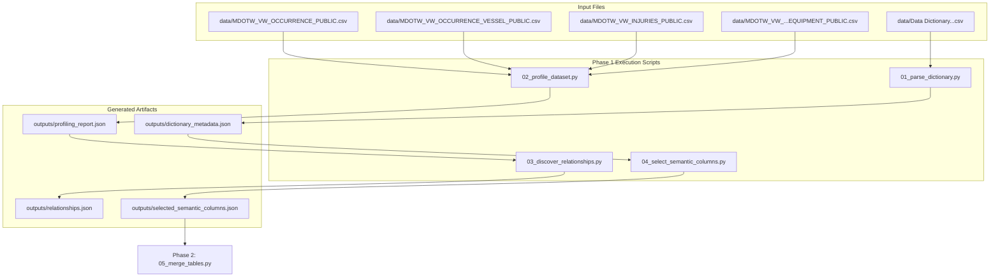

# Phase 1: Data Identification & Mapping Technical Documentation

## Executive Overview
Phase 1 establishes the foundational schema understanding, profiling metrics, primary/foreign key relationships, and semantic NLP column selections for the TSB MARSIS database export. It transitions raw, unprofiled relational CSV dumps into structured metadata registries and relationship graphs required for downstream table merging.

Scripts involved in Phase 1:
1. `scripts/pipeline_utils.py` (Foundation Utilities)
2. `scripts/01_parse_dictionary.py` (Data Dictionary Parser)
3. `scripts/02_profile_dataset.py` (Dataset Profiler & FK Inferencer)
4. `scripts/03_discover_relationships.py` (Relationship Discovery & Graph Builder)
5. `scripts/04_select_semantic_columns.py` (Semantic Column Selector)

---

## 1. Phase 1 Complete Data Flow & Pipeline Dependencies



---

## 2. Foundation Utility Module (`scripts/pipeline_utils.py`)

### 2.1 Standardized Function Documentation

#### Function 1: `get_project_root`
- **Purpose**: Returns the absolute `Path` to the root directory of the workspace.
- **Why this function exists**: Guarantees that all file paths resolve correctly regardless of which sub-folder the execution shell script was invoked from.
- **Where it is called**: Called by all 18 stage scripts and `pipeline_utils.py` functions.
- **Inputs**: File system path of `pipeline_utils.py` (`__file__`).
- **Outputs**: Absolute `pathlib.Path` instance pointing to the root workspace.
- **Parameters**: None.
- **Return values**: `Path` (e.g., `Path("c:/--Files--/Programming/pipeline")`).
- **Internal algorithm**:
  1. Retrieve `Path(__file__)`.
  2. Resolve symlinks and relative references via `.resolve()`.
  3. Access parent directory twice: `.parent.parent` (since `pipeline_utils.py` lives inside `scripts/`).
- **Step-by-step execution**:
  ```python
  return Path(__file__).resolve().parent.parent
  ```
- **Edge cases**: Handles relative execution paths and symlinked script directories without failure.
- **Exception handling**: Raises standard `RuntimeError` if path resolution fails.
- **Logging behavior**: Silent.
- **Time complexity**: $O(1)$.
- **Space complexity**: $O(1)$.
- **Dependencies**: `pathlib.Path`.
- **Example execution**: `root = get_project_root()`
- **Common failure cases**: Script relocated outside a two-level directory hierarchy.

---

#### Function 2: `load_config`
- **Purpose**: Reads configuration settings from `config/config.json`.
- **Why this function exists**: Provides a single source of truth for runtime parameters, paths, and thresholds across scripts.
- **Where it is called**: Called by `setup_logging`, `detect_datasets`, and all stage scripts.
- **Inputs**: File `config/config.json`.
- **Outputs**: Parsed configuration dictionary (`dict`).
- **Parameters**: None.
- **Return values**: `dict`.
- **Internal algorithm**:
  1. Obtain project root via `get_project_root()`.
  2. Locate `config_path = root / "config" / "config.json"`.
  3. Check `.exists()`. If missing, raise `FileNotFoundError`.
  4. Open file with `encoding="utf-8"` and return `json.load(f)`.
- **Step-by-step execution**:
  ```python
  root = get_project_root()
  config_path = root / "config" / "config.json"
  if not config_path.exists():
      raise FileNotFoundError(...)
  with open(config_path, "r", encoding="utf-8") as f:
      return json.load(f)
  ```
- **Edge cases**: Handles missing config directory or missing file gracefully by raising an explicit exception.
- **Exception handling**: Raises `FileNotFoundError` if missing; raises `json.JSONDecodeError` if invalid JSON.
- **Logging behavior**: Silent.
- **Time complexity**: $O(K)$ where $K$ is size of JSON config file.
- **Space complexity**: $O(K)$.
- **Dependencies**: `json`, `get_project_root`.
- **Example execution**: `config = load_config()`
- **Common failure cases**: Syntax errors (e.g., trailing commas) in `config.json`.

---

#### Function 3: `setup_logging`
- **Purpose**: Initializes a named logger writing to both stdout console and a persistent file handler.
- **Why this function exists**: Ensures consistent log formatting, duplicate handler prevention, and execution history capture.
- **Where it is called**: Invoked at the top of every stage script (01 through 18).
- **Inputs**: `stage_name` (`str`).
- **Outputs**: Configured `logging.Logger` instance.
- **Parameters**: `stage_name: str` (e.g., `"01_parse_dictionary"`).
- **Return values**: `logging.Logger`.
- **Internal algorithm**:
  1. Retrieve `config = load_config()`.
  2. Create log directory `root / config["log_dir"]` if it does not exist.
  3. Determine log level from `config.get("log_level", "INFO")`.
  4. Retrieve or create logger via `logging.getLogger(stage_name)`.
  5. Clear existing handlers if present (`logger.handlers.clear()`).
  6. Attach `FileHandler` pointing to `outputs/logs/pipeline.log`.
  7. Attach `StreamHandler` pointing to `sys.stdout`.
  8. Return configured logger.
- **Step-by-step execution**:
  ```python
  logger = logging.getLogger(stage_name)
  logger.setLevel(log_level)
  if logger.hasHandlers():
      logger.handlers.clear()
  formatter = logging.Formatter('[%(asctime)s] %(levelname)s [%(name)s]: %(message)s', datefmt='%Y-%m-%d %H:%M:%S')
  # Add file & console handlers...
  return logger
  ```
- **Edge cases**: Concurrent file access across fast execution loops is avoided via file appending.
- **Exception handling**: Handles permission errors if log directory is read-only.
- **Logging behavior**: Emits setup confirmation to console.
- **Time complexity**: $O(1)$.
- **Space complexity**: $O(1)$.
- **Dependencies**: `logging`, `sys`, `load_config`, `get_project_root`.
- **Example execution**: `logger = setup_logging("01_parse_dictionary")`
- **Common failure cases**: Failure to clear existing handlers leading to duplicate log messages.

---

#### Function 4: `read_csv_safe`
- **Purpose**: Reads CSV datasets safely with automatic encoding detection, string BOM stripping, case-insensitive `usecols` validation, and low-memory fallback.
- **Why this function exists**: TSB MARSIS export files mix `utf-8-sig` (with BOM) and `latin-1` encodings, and column names vary in casing or trailing spaces.
- **Where it is called**: Called by all scripts reading raw CSV tables.
- **Inputs**: CSV file `Path`, optional keyword arguments (e.g., `usecols`).
- **Outputs**: Cleaned `pandas.DataFrame`.
- **Parameters**: `file_path: Path`, `**kwargs`.
- **Return values**: `pd.DataFrame`.
- **Internal algorithm**:
  1. Inspect CSV header with `nrows=0` using `utf-8-sig`. If failed, fallback to `latin-1`.
  2. Strip whitespace from header column names.
  3. If `usecols` parameter is provided, validate case-sensitive and case-insensitive matches against header columns.
  4. If no `usecols` match, issue warning log and remove `usecols` argument.
  5. Read full DataFrame with `low_memory=False` to prevent dtype inference warning bugs.
  6. Strip whitespace from all returned DataFrame column names.
- **Step-by-step execution**:
  ```python
  encoding = 'utf-8-sig'
  try:
      header_df = pd.read_csv(file_path, encoding=encoding, nrows=0)
      actual_cols = [c.strip() for c in header_df.columns]
  except Exception:
      encoding = 'latin-1'
      header_df = pd.read_csv(file_path, encoding=encoding, nrows=0)
      actual_cols = [c.strip() for c in header_df.columns]
  # Validate usecols and execute full read...
  ```
- **Edge cases**: Malformed UTF-8 characters are handled via automatic fallback to `latin-1`. Missing columns in `usecols` are filtered without crashing.
- **Exception handling**: Raises `IOError` if file cannot be parsed with either `utf-8-sig` or `latin-1`.
- **Logging behavior**: Issues warning logs if requested `usecols` are missing in the target CSV.
- **Time complexity**: $O(N \cdot M)$ where $N$ is row count and $M$ is column count.
- **Space complexity**: $O(N \cdot M)$.
- **Dependencies**: `pandas`, `logging`.
- **Example execution**: `df = read_csv_safe(file_path, usecols=["OccID", "OccNo"])`
- **Common failure cases**: Attempting to read locked binary files.

---

#### Function 5: `detect_datasets`
- **Purpose**: Auto-detects CSV datasets in `data/` and maps file paths to standard table name stems.
- **Why this function exists**: TSB export filenames often contain date stamps or modified prefixes (e.g., `2024_MDOTW_VW_OCCURRENCE_PUBLIC.csv`). Heuristic detection abstracts actual file paths away from pipeline scripts.
- **Where it is called**: Invoked by Stage 01, 02, 05, and 05a scripts.
- **Inputs**: Data directory contents (`data/*.csv`).
- **Outputs**: Dictionary mapping standard table stems to file paths, plus `dictionary` key.
- **Parameters**: None.
- **Return values**: `dict` containing `"datasets"` mapping and `"dictionary"` file path.
- **Internal algorithm**:
  1. Retrieve CSV files list via `data_dir.glob("*.csv")`.
  2. Search for dictionary file (filename containing `"dictionary"` or `"inventory"`).
  3. Match files against canonical stems:
     - `MDOTW_VW_OCCURRENCE_VESSEL_PUBLIC`
     - `MDOTW_VW_OCCURRENCE_PUBLIC`
     - `MDOTW_VW_OCCURRENCE_VESSEL_REC_EQUIPMENT_PUBLIC`
     - `MDOTW_VW_INJURIES_PUBLIC`
     - `MDOTW_VW_OCCURRENCE_VESSEL_LSA_EQUIPMENT_PUBLIC`
     - `MDOTW_VW_OCCURRENCE_VESSEL_NAV_EQUIPMENT_PUBLIC`
  4. Apply fallback heuristic matching (`"nav"` $\rightarrow$ Nav Equipment, `"injur"` $\rightarrow$ Injuries, etc.).
  5. Return dictionary payload.
- **Step-by-step execution**:
  ```python
  for f in csv_files:
      if "dictionary" in f.name.lower():
          dictionary_file = f
          continue
      for stem in dictionary_stems:
          if stem.lower() in f.name.lower():
              mapping[stem] = f
              break
  ```
- **Edge cases**: Unrecognized filenames fall back to keyword heuristic matching.
- **Exception handling**: Raises `FileNotFoundError` if data directory does not exist.
- **Logging behavior**: Silent.
- **Time complexity**: $O(K \cdot S)$ where $K$ is CSV count and $S$ is stem count.
- **Space complexity**: $O(K)$.
- **Dependencies**: `load_config`, `get_project_root`, `pathlib.Path`.
- **Example execution**: `detected = detect_datasets()`
- **Common failure cases**: Data directory empty or missing.

---

### 2.2 Deep-Dive Code Block Explanations & Design Rationales

#### Code Block 1: CSV Encoding Fallback in `read_csv_safe`
```python
# Lines 66-76 in scripts/pipeline_utils.py
encoding = 'utf-8-sig'
try:
    header_df = pd.read_csv(file_path, encoding=encoding, nrows=0)
    actual_cols = [c.strip() for c in header_df.columns]
except Exception:
    encoding = 'latin-1'
    try:
        header_df = pd.read_csv(file_path, encoding=encoding, nrows=0)
        actual_cols = [c.strip() for c in header_df.columns]
    except Exception as e:
        raise IOError(f"Could not read headers of CSV file {file_path}: {e}")
```
- **Why is this block needed?**: Relational database exports from TSB mix modern UTF-8 files containing Byte Order Marks (`\xef\xbb\xbf`) with legacy single-byte `latin-1` (ISO-8859-1) French character encodings. Standard `pd.read_csv` fails with `UnicodeDecodeError` when encountering byte sequences like `\xe9` (`é`).
- **Why try `nrows=0` first?**: Reading only 0 rows inspects the header byte structure instantaneously ($O(1)$ time) without loading megabytes of data into memory just to validate encoding.
- **Counterfactual impact**: Removing this block causes catastrophic pipeline termination on legacy TSB CSV exports.

---

## 3. Data Dictionary Parsing (`scripts/01_parse_dictionary.py`)

### 3.1 Standardized Function Documentation

#### Function 1: `map_display_columns`
- **Purpose**: Pairs raw numeric ID, Enum, Code, and Indicator columns with their human-readable `DisplayEng` translated text counterparts.
- **Why this function exists**: In TSB database schema, categorical attributes are stored as numeric IDs (e.g., `AccIncTypeID = 14`), while the corresponding text appears in `AccIncTypeDisplayEng = "Collision"`. To generate natural language operational narratives, the pipeline must automatically pair ID columns with their English text display columns.
- **Where it is called**: Main function of `01_parse_dictionary.py`.
- **Inputs**: Data dictionary DataFrame (`df_dict`).
- **Outputs**: Tuple of two dictionaries: `(id_to_display, display_to_id)`.
- **Parameters**: `df_dict: pd.DataFrame`.
- **Return values**: `tuple[dict, dict]`.
- **Internal algorithm**:
  1. Group dictionary entries by `"Table name"`.
  2. Identify all columns ending in `"DisplayEng"` or `"Display"`.
  3. Derive the base stem name (e.g., `AccIncTypeDisplayEng` $\rightarrow$ stem `AccIncType`).
  4. Generate candidate ID names: `stem`, `stem + "id"`, `stem + "enum"`, `stem + "ind"`, `stem + "code"`.
  5. Apply abbreviation replacements (`occ` $\leftrightarrow$ `occurrence`, `quant` $\leftrightarrow$ `quantity`).
  6. Check candidate matches against actual table column names (case-insensitive).
  7. Handle custom exceptions (e.g., `LatEnum_Bearing_DisplayEng` $\rightarrow$ `latinum`).
  8. Store bidirectional mapping.
- **Step-by-step execution**:
  ```python
  for table_name, group in df_dict.groupby("Table name"):
      cols = group["Column name"].unique().tolist()
      for col in cols:
          if col.endswith("DisplayEng"):
              stem = col[:-10].rstrip("_")
              candidates = [stem.lower(), (stem + "id").lower(), (stem + "enum").lower()]
              # Match candidates against actual table columns...
  ```
- **Edge cases**: Columns ending in `Display` without `Eng` use a 7-character suffix strip length instead of 10.
- **Exception handling**: Unmapped display columns trigger a warning log but execution continues.
- **Logging behavior**: Debug logs for successful mappings; warnings for unmapped display columns.
- **Time complexity**: $O(T \cdot C \cdot K)$ where $T$ is table count, $C$ is column count, $K$ is candidate count.
- **Space complexity**: $O(C)$.
- **Dependencies**: `pandas`, `logging`.
- **Example execution**: `id_map, display_map = map_display_columns(df_dict)`
- **Common failure cases**: Missing `"Table name"` column in dictionary CSV.

---

#### Function 2: `categorize_column`
- **Purpose**: Classifies a database column into a semantic NLP domain category or marks it as administrative metadata.
- **Why this function exists**: To automate selection of high-value narrative attributes and exclude system metadata (e.g., GUIDs, timestamps, user audit logs).
- **Where it is called**: Main loop of `01_parse_dictionary.py`.
- **Inputs**: Column name (`str`), English description (`str`), Table name (`str`).
- **Outputs**: Category label string (`"admin"`, `"temporal"`, `"spatial"`, `"environmental"`, `"equipment"`, `"casualty"`, `"voyage_activity"`, `"vessel_profile"`, `"narrative"`, or `"other"`).
- **Parameters**: `col_name: str`, `desc: str`, `table_name: str`.
- **Return values**: `str`.
- **Internal algorithm**:
  1. Convert column name and description to lowercase.
  2. Check for administrative keywords (`guid`, `xrf`, `audit`, `modified`, `entrydate`). If matched, return `"admin"`.
  3. Check temporal keywords (`date`, `time`, `year`). Exclude audit dates. Return `"temporal"`.
  4. Check spatial keywords (`latitude`, `longitude`, `port`, `region`, `destination`). Return `"spatial"`.
  5. Check environmental keywords (`weather`, `wind`, `sea`, `visib`, `ice`, `swell`). Return `"environmental"`.
  6. Check equipment keywords (`equipment`, `nav`, `lsa`, `radar`, `compass`). Return `"equipment"`.
  7. Check casualty keywords (`injuries`, `death`, `fatality`, `casualty`, `pollution`). Return `"casualty"`.
  8. Check voyage/activity keywords (`phase`, `activity`, `voyage`, `cargo`, `towing`). Return `"voyage_activity"`.
  9. Check vessel profile keywords (`vesseltype`, `tonnage`, `hull`, `propulsion`, `builder`, `officialno`, `length`). Return `"vessel_profile"`.
  10. Check narrative keywords (`summary`, `narrative`, `comment`, `description`). Return `"narrative"`.
  11. Return `"other"` as fallback.
- **Step-by-step execution**: Sequential pattern matching against predefined domain keyword lists.
- **Edge cases**: Ensures `entrydate` and `modifieddate` are classified as `"admin"` rather than `"temporal"`.
- **Exception handling**: None required.
- **Logging behavior**: Silent.
- **Time complexity**: $O(W)$ where $W$ is keyword list count.
- **Space complexity**: $O(1)$.
- **Dependencies**: None.
- **Example execution**: `cat = categorize_column("WindSpeed_Knots", "Wind speed in knots", "MDOTW_VW_OCCURRENCE_PUBLIC")`
- **Common failure cases**: None.

---

### 3.2 Output Schema Specification: `outputs/dictionary_metadata.json`

- **Created By**: `scripts/01_parse_dictionary.py`
- **Consumed By**: `scripts/04_select_semantic_columns.py`, `scripts/10_extract_vocabulary.py`
- **Purpose**: Stores centralized field definitions, categories, boolean flags, and bidirectional ID-to-Display column mappings for all tables.
- **Storage Location**: `outputs/dictionary_metadata.json`
- **Format**: JSON UTF-8

#### JSON Schema
```json
{
  "registry": {
    "TABLE_NAME": {
      "COLUMN_NAME": {
        "full_name": "string",
        "description": "string",
        "data_type": "string",
        "category": "string",
        "is_boolean": "boolean",
        "id_to_display_map": "string | null",
        "display_to_id_map": "string | null"
      }
    }
  },
  "id_to_display": {
    "TABLE_NAME": {
      "RAW_ID_COL": "DISPLAY_ENG_COL"
    }
  },
  "display_to_id": {
    "TABLE_NAME": {
      "DISPLAY_ENG_COL": "RAW_ID_COL"
    }
  }
}
```

#### Example Payload Snippet
```json
{
  "registry": {
    "MDOTW_VW_OCCURRENCE_PUBLIC": {
      "AccIncTypeID": {
        "full_name": "Accident / Incident Type ID",
        "description": "Unique identifier for accident type",
        "data_type": "INTEGER",
        "category": "casualty",
        "is_boolean": false,
        "id_to_display_map": "AccIncTypeDisplayEng",
        "display_to_id_map": null
      },
      "AccIncTypeDisplayEng": {
        "full_name": "Accident / Incident Type Description",
        "description": "English description of accident type",
        "data_type": "VARCHAR",
        "category": "casualty",
        "is_boolean": false,
        "id_to_display_map": null,
        "display_to_id_map": "AccIncTypeID"
      }
    }
  }
}
```

---

## 4. Dataset Profiling & Foreign Key Inference (`scripts/02_profile_dataset.py`)

### 4.1 Standardized Function Documentation

#### Function 1: `profile_table`
- **Purpose**: Analyzes a single CSV table, computing row counts, null counts, unique value counts, cardinality ratios, data types, and primary key candidates.
- **Why this function exists**: To discover data completeness, identify unique table keys, and detect missing values without manual inspection.
- **Where it is called**: Main loop of `02_profile_dataset.py`.
- **Inputs**: CSV `file_path` (`Path`).
- **Outputs**: Table profile dictionary (`dict`).
- **Parameters**: `file_path: Path`.
- **Return values**: `dict`.
- **Internal algorithm**:
  1. Load CSV using `read_csv_safe`.
  2. Compute row count `num_rows = len(df)`.
  3. Iterate over columns, computing `null_count`, `nunique`, `cardinality_ratio = nunique / num_rows`.
  4. Invariant check for Primary Key (PK) candidate: `null_count == 0` and `nunique == num_rows`.
  5. Fallback PK heuristic: If no exact PK match, check for `null_count == 0` and `cardinality_ratio > 0.95`.
  6. Return comprehensive profile payload.
- **Step-by-step execution**:
  ```python
  df = read_csv_safe(file_path)
  num_rows = len(df)
  for col in df.columns:
      null_count = int(df[col].isnull().sum())
      nunique = int(df[col].nunique())
      if null_count == 0 and nunique == num_rows and num_rows > 0:
          possible_pks.append(col)
  ```
- **Edge cases**: Empty CSV files return 0 cardinality ratios safely without division by zero errors.
- **Exception handling**: Catches CSV read errors, logs error, returns empty dictionary `{}`.
- **Logging behavior**: Logs progress for each table.
- **Time complexity**: $O(N \cdot M)$ where $N$ is rows and $M$ is columns.
- **Space complexity**: $O(N \cdot M)$.
- **Dependencies**: `pandas`, `read_csv_safe`.
- **Example execution**: `profile = profile_table(Path("data/MDOTW_VW_OCCURRENCE_PUBLIC.csv"))`
- **Common failure cases**: Memory allocation failure on multi-gigabyte tables.

---

#### Function 2: `infer_foreign_keys`
- **Purpose**: Infers parent-child Foreign Key (FK) relationships across profiled tables based on key overlap and uniqueness metrics.
- **Why this function exists**: Raw TSB database exports lack explicit DDL foreign key constraints in CSV format.
- **Where it is called**: Main function of `02_profile_dataset.py`.
- **Inputs**: Profile report dictionary (`dict`).
- **Outputs**: Inferred foreign key mapping dictionary (`dict`).
- **Parameters**: `profile_report: dict`.
- **Return values**: `dict`.
- **Internal algorithm**:
  1. Iterate over all table pairs $(T_1, T_2)$.
  2. Extract primary keys of $T_2$.
  3. For each column $C_1$ in $T_1$, check if name matches a primary key in $T_2$.
  4. If matched and $C_1$ is not a primary key in $T_1$, register FK candidate ($T_1.C_1 \rightarrow T_2.PK_2$).
  5. Secondary check: If column contains `"id"`, `"no"`, or `"key"` and exists in $T_2$ with high cardinality ratio ($> 0.8$), register FK candidate.
  6. Return candidate relationships.
- **Step-by-step execution**:
  ```python
  for t1 in table_names:
      for col1, metrics1 in profile_report[t1]["columns"].items():
          for t2, pk2 in pks_other:
              if col1.lower() == pk2.lower() and col1 not in profile_report[t1]["possible_pks"]:
                  inferred_fks[t1].append({"column": col1, "referenced_table": t2, "referenced_column": pk2})
  ```
- **Edge cases**: Self-referencing foreign keys are skipped (`t1 == t2`).
- **Exception handling**: None required.
- **Logging behavior**: Logs number of FK candidates found per table.
- **Time complexity**: $O(T^2 \cdot C)$ where $T$ is table count and $C$ is column count.
- **Space complexity**: $O(F)$ where $F$ is inferred FK count.
- **Dependencies**: None.
- **Example execution**: `fks = infer_foreign_keys(report)`
- **Common failure cases**: Misleading column names containing `"id"` that represent attributes rather than keys.

---

### 4.2 Output Schema Specification: `outputs/profiling_report.json`

- **Created By**: `scripts/02_profile_dataset.py`
- **Consumed By**: `scripts/03_discover_relationships.py`
- **Purpose**: Stores statistical data profiling metrics, primary key candidates, and inferred foreign keys for all tables.
- **Storage Location**: `outputs/profiling_report.json`
- **Format**: JSON UTF-8

#### JSON Schema
```json
{
  "TABLE_NAME": {
    "file_name": "string",
    "row_count": "integer",
    "col_count": "integer",
    "columns": {
      "COLUMN_NAME": {
        "null_count": "integer",
        "nunique": "integer",
        "cardinality_ratio": "float",
        "data_type": "string"
      }
    },
    "possible_pks": ["string"],
    "inferred_fks": [
      {
        "column": "string",
        "referenced_table": "string",
        "referenced_column": "string",
        "reason": "string"
      }
    ]
  }
}
```

---

## 5. Relationship Discovery & Graph Construction (`scripts/03_discover_relationships.py`)

### 5.1 Standardized Function Documentation

#### Function 1: `build_relationship_graph`
- **Purpose**: Constructs a directed relational graph using NetworkX, identifying parent-child primary join keys based on unique value counts.
- **Why this function exists**: To establish the canonical join direction (Parent $\rightarrow$ Child) for multi-table aggregation, preventing multiplicative Cartesian joins.
- **Where it is called**: Main function of `03_discover_relationships.py`.
- **Inputs**: Profiling report dictionary (`profiling_report`).
- **Outputs**: Serialized relationship graph dictionary (`dict`).
- **Parameters**: `profiling_report: dict`.
- **Return values**: `dict`.
- **Internal algorithm**:
  1. Identify all key candidate columns (containing `ID`, `No`, `Key`) across tables, excluding non-key flags like `noLSE`.
  2. Find shared keys present in multiple tables.
  3. Determine the **Parent Table** for each key: the table containing the maximum `nunique` value for that key.
  4. Instantiate NetworkX directed graph `G = nx.DiGraph()`.
  5. Add tables as nodes with `row_count` attributes.
  6. Add directed edges from Parent Table to Child Tables (`G.add_edge(parent, child, key=key, type="one_to_many")`).
  7. Export graph data structure.
- **Step-by-step execution**:
  ```python
  G = nx.DiGraph()
  for t in table_names:
      G.add_node(t, row_count=profiling_report[t]["row_count"])
  for key, info in key_parents.items():
      parent = info["parent_table"]
      for child in info["child_tables"]:
          G.add_edge(parent, child, key=key, type="one_to_many")
  ```
- **Edge cases**: Attribute flags containing `"no"` (e.g., `noLSE`, `dontknow`) are filtered out explicitly.
- **Exception handling**: None required.
- **Logging behavior**: Logs identifier columns per table, parent table inferences, and directed edge creations.
- **Time complexity**: $O(T \cdot C + E)$ where $E$ is edge count.
- **Space complexity**: $O(V + E)$ where $V$ is node count and $E$ is edge count.
- **Dependencies**: `networkx`, `logging`.
- **Example execution**: `graph_data = build_relationship_graph(profiling_report)`
- **Common failure cases**: Circular key dependencies between tables.

---

### 5.2 Deep-Dive Code Block Explanations & Design Rationales

#### Code Block 1: Parent Selection via Maximum `nunique`
```python
# Lines 48-58 in scripts/03_discover_relationships.py
parent_table = None
max_unique = -1

for t in tables_with_key:
    nunique = profiling_report[t]["columns"][key]["nunique"]
    if nunique > max_unique:
        max_unique = nunique
        parent_table = t

key_parents[key] = {
    "parent_table": parent_table,
    "child_tables": [t for t in tables_with_key if t != parent_table],
    "nunique": max_unique
}
```
- **Why is this logic needed?**: In a 1-to-many relationship, the parent entity table holds the primary definition of the entity and has the highest count of distinct primary key values ($N_{\text{parent}}$). Child tables reference the key multiple times across events, resulting in lower or equal unique key counts ($N_{\text{child}} \le N_{\text{parent}}$). Selecting the table with max `nunique` guarantees correct directional joins.
- **Design alternative considered**: Inferring parentage purely from table names. Rejected because export naming conventions are inconsistent.
- **Counterfactual impact**: Inverting parent-child orientation would cause child records to drop parent metadata during left joins.

---

### 5.3 Output Schema Specification: `outputs/relationships.json`

- **Created By**: `scripts/03_discover_relationships.py`
- **Consumed By**: Data pipeline documentation and validation checks.
- **Purpose**: Defines table hierarchy, join keys, and directed graph structure for database merging.
- **Storage Location**: `outputs/relationships.json`
- **Format**: JSON UTF-8

#### JSON Schema
```json
{
  "nodes": [
    {
      "id": "string",
      "row_count": "integer"
    }
  ],
  "edges": [
    {
      "source": "string",
      "target": "string",
      "key": "string",
      "type": "string"
    }
  ],
  "relationships": [
    {
      "parent_table": "string",
      "child_table": "string",
      "join_key": "string",
      "relationship_type": "string"
    }
  ],
  "key_parents": {
    "KEY_NAME": {
      "parent_table": "string",
      "child_tables": ["string"],
      "nunique": "integer"
    }
  }
}
```

---

## 6. Semantic Column Selection (`scripts/04_select_semantic_columns.py`)

### 6.1 Standardized Function Documentation

#### Function 1: `select_columns`
- **Purpose**: Filters out administrative metadata and French translation columns, retaining only semantic NLP attributes, join keys, numeric metrics, boolean indicators, and display columns.
- **Why this function exists**: Retaining administrative noise (e.g., audit timestamps, system GUIDs, French text columns) degrades language model pretraining quality and wastes token context.
- **Where it is called**: Main function of `04_select_semantic_columns.py`.
- **Inputs**: Metadata dictionary (`metadata` from Stage 01).
- **Outputs**: Dictionary of selected semantic columns organized by table and semantic category.
- **Parameters**: `metadata: dict`.
- **Return values**: `dict`.
- **Internal algorithm**:
  1. Define core join keys that must always be retained (`occid`, `occno`, `vesselid`, `parentvesselid`).
  2. For each table, iterate over column registry entries.
  3. Skip column if category is `"admin"`.
  4. Skip column if name ends with `"displayfre"` or `"fre"`.
  5. If column is an ID column that has a corresponding `DisplayEng` partner (`id_to_display_map` is not null), skip the raw ID column (because `DisplayEng` text will be read instead).
  6. Categorize remaining columns into: `join_keys`, `display_cols`, `numeric_attrs`, `boolean_attrs`, `narrative_cols`, or `other_semantic`.
  7. Return selected columns structure.
- **Step-by-step execution**:
  ```python
  for table_name, cols in registry.items():
      for col_name, col_meta in cols.items():
          if col_lower in core_keys:
              table_selected["join_keys"].append(col_name)
              continue
          if col_lower.endswith("displayfre") or category == "admin":
              continue
          if col_meta.get("id_to_display_map"):
              continue  # Skip ID, keep DisplayEng
          # Append to category list...
  ```
- **Edge cases**: Ensures spatial numeric coordinates (`latitude`, `longitude`) are excluded from numeric NLP attributes to prevent numerical noise in pretraining.
- **Exception handling**: None required.
- **Logging behavior**: Logs count of selected columns vs total columns for each table.
- **Time complexity**: $O(T \cdot C)$ where $T$ is table count and $C$ is column count.
- **Space complexity**: $O(C_{\text{selected}})$.
- **Dependencies**: `logging`.
- **Example execution**: `selected_cols = select_columns(metadata)`
- **Common failure cases**: Core join key missing from `core_keys` set.

---

### 6.2 Output Schema Specification: `outputs/selected_semantic_columns.json`

- **Created By**: `scripts/04_select_semantic_columns.py`
- **Consumed By**: `scripts/05_merge_tables.py`
- **Purpose**: Specifies exact column subsets to read from raw CSV files during table merging.
- **Storage Location**: `outputs/selected_semantic_columns.json`
- **Format**: JSON UTF-8

#### JSON Schema
```json
{
  "TABLE_NAME": {
    "join_keys": ["string"],
    "display_cols": ["string"],
    "numeric_attrs": ["string"],
    "boolean_attrs": ["string"],
    "narrative_cols": ["string"],
    "other_semantic": ["string"]
  }
}
```

---

## 7. Future Extension Points (Phase 1)

1. **What can be extended?**:
   - Custom column category rules in `01_parse_dictionary.py` can be extended with additional domain terms (e.g., cargo classification, engine type categories).
   - FK inference heuristics in `02_profile_dataset.py` can incorporate composite key overlap ratio checks.

2. **Current Assumptions**:
   - Assumes raw CSV data directory contains standard TSB MARSIS table exports.
   - Assumes English display columns end in `DisplayEng` or `Display`.

3. **Safe-to-Modify Functions**:
   - `categorize_column` in `01_parse_dictionary.py` (adding new keyword categories).
   - `select_columns` in `04_select_semantic_columns.py` (adjusting retained column categories).

4. **Tightly Coupled Functions**:
   - `detect_datasets` in `pipeline_utils.py` is tightly coupled with hardcoded database table stems.
   - `map_display_columns` in `01_parse_dictionary.py` relies on `DisplayEng` naming conventions.

5. **Recommended Extension Strategy**:
   - When adding new raw data tables, update `dictionary_stems` list in `pipeline_utils.py` and rerun Phase 1 to automatically rebuild metadata registries and relationship graphs.
