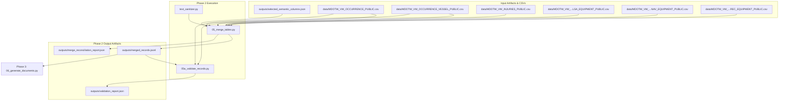

# Phase 2: Raw Data Preparation Technical Documentation

## Executive Overview
Phase 2 ingests the semantic column selections from Phase 1, reads raw CSV tables, performs deduplication, aggregates multi-row text fields, executes relational joins across parent occurrences, composite vessel units, and child equipment/injury tables, handles orphan child records, synthesizes placeholders, and validates data plausibility.

Scripts involved in Phase 2:
1. `scripts/text_sanitizer.py` (Text Sanitizer & Grammatical Formatter Utility)
2. `scripts/05_merge_tables.py` (Relational Table Merger)
3. `scripts/05a_validate_records.py` (Record Integrity & Plausibility Validator)

---

## 1. Phase 2 Complete Data Flow & Pipeline Dependencies



---

## 2. Text Sanitizer Utility (`scripts/text_sanitizer.py`)

### 2.1 Standardized Function Documentation

#### Function 1: `strip_administrative_noise`
- **Purpose**: Strips administrative metadata noise, database status headers, and system identifiers from text strings intended for BERT pretraining.
- **Why this function exists**: Raw database export text fields contain repetitive system boilerplate like `"(Data extraction status pending)"`, `"Note: Formerly OccNo: M14P0003"`, or `"Record ID: 19482"`. Including administrative boilerplate degrades model learning by forcing the model to memorize database key patterns instead of domain semantics.
- **Where it is called**: Invoked in `06_generate_documents.py`, `07_clean_documents.py`, and `08_export_corpus.py`.
- **Inputs**: Raw text string (`text`).
- **Outputs**: Sanitized text string (`cleaned`).
- **Parameters**: `text: str`.
- **Return values**: `str`.
- **Internal algorithm**:
  1. Check if input text is empty or None. If so, return `""`.
  2. Iterate over compiled regex noise patterns (`ADMINISTRATIVE_NOISE_PATTERNS`).
  3. Substitute matches with a single space `' '`.
  4. Collapse multiple spaces (`r' +'` $\rightarrow$ `' '`).
  5. Remove repeated punctuation artifacts (e.g., hanging commas or colons).
  6. Strip leading and trailing whitespace.
- **Step-by-step execution**:
  ```python
  cleaned = text
  for pat in ADMINISTRATIVE_NOISE_PATTERNS:
      cleaned = re.sub(pat, ' ', cleaned)
  cleaned = re.sub(r' +', ' ', cleaned)
  cleaned = re.sub(r'^\s*[:,\.\-]\s*', '', cleaned)
  return cleaned.strip()
  ```
- **Edge cases**: Handles `None`, empty strings, and strings composed entirely of noise patterns.
- **Exception handling**: None required.
- **Logging behavior**: Silent.
- **Time complexity**: $O(P \cdot L)$ where $P$ is pattern count and $L$ is text string length.
- **Space complexity**: $O(L)$.
- **Dependencies**: `re`.
- **Example execution**: `clean_str = strip_administrative_noise("Vessel grounded. (Data extraction status pending)")`
- **Common failure cases**: None.

---

#### Function 2: `join_words_grammatical`
- **Purpose**: Renders a list of words or phrases into natural English with proper Oxford commas and natural conjunctions.
- **Why this function exists**: Structured database child records (e.g., multiple active navigation aids) must be rendered into fluent natural language sentences rather than artificial comma-delimited lists.
- **Where it is called**: Invoked by narrative generation functions in `06_generate_documents.py`.
- **Inputs**: List of word strings (`words`), optional `conjunction` (`str`, default `"and"`).
- **Outputs**: Grammatically formatted string (`str`).
- **Parameters**: `words: list`, `conjunction: str = "and"`.
- **Return values**: `str`.
- **Internal algorithm**:
  1. Filter out empty, whitespace, or null elements from `words`.
  2. If valid words list is empty, return `""`.
  3. If length == 1: return `words[0]`.
  4. If length == 2: return `f"{words[0]} {conjunction} {words[1]}"`.
  5. If length $> 2$: return `", ".join(words[:-1]) + f", {conjunction} {words[-1]}"`.
- **Step-by-step execution**:
  ```python
  valid_words = [str(w).strip() for w in words if str(w).strip()]
  if len(valid_words) == 1: return valid_words[0]
  if len(valid_words) == 2: return f"{valid_words[0]} {conjunction} {valid_words[1]}"
  return ", ".join(valid_words[:-1]) + f", {conjunction} {valid_words[-1]}"
  ```
- **Edge cases**: Handles lists containing numeric values or `None` elements safely by casting `str(w)`.
- **Exception handling**: None required.
- **Logging behavior**: Silent.
- **Time complexity**: $O(N \cdot L)$ where $N$ is word count and $L$ is word string length.
- **Space complexity**: $O(N \cdot L)$.
- **Dependencies**: None.
- **Example execution**: `text = join_words_grammatical(["GPS", "Radar", "VHF radio"])` $\rightarrow$ `"GPS, Radar, and VHF radio"`
- **Common failure cases**: Passing non-iterable objects.

---

#### Function 3: `format_cargo_description`
- **Purpose**: Formats cargo products and quantities cleanly without duplicate "cargo cargo" phrases.
- **Why this function exists**: Database exports frequently record cargo product as `"Grain cargo"` or `"Containers"`. Appending `"cargo"` blindly results in awkward phrasing like `"laden with Grain cargo cargo"`.
- **Where it is called**: Invoked by operational narrative generators in `06_generate_documents.py`.
- **Inputs**: Cargo product string (`cargo_prod`), optional quantity (`cargo_qty`).
- **Outputs**: Formatted cargo clause string (`str`).
- **Parameters**: `cargo_prod: str`, `cargo_qty=None`.
- **Return values**: `str`.
- **Internal algorithm**:
  1. Check if `cargo_prod` is missing or in `["NAN", "UNKNOWN", "NONE", "UNSPECIFIED"]`. If so, return `""`.
  2. Normalize product string to lowercase.
  3. If quantity is specified and valid: return `f"carrying {cargo_qty} of {c_lower}"`.
  4. If `c_lower.endswith("cargo")`: return `f"laden with {c_lower}"`.
  5. Else: return `f"laden with {c_lower} cargo"`.
- **Step-by-step execution**:
  ```python
  if c_lower.endswith("cargo"):
      return f"laden with {c_lower}"
  else:
      return f"laden with {c_lower} cargo"
  ```
- **Edge cases**: Handles float or integer quantity inputs gracefully.
- **Exception handling**: None required.
- **Logging behavior**: Silent.
- **Time complexity**: $O(1)$.
- **Space complexity**: $O(1)$.
- **Dependencies**: None.
- **Example execution**: `clause = format_cargo_description("Bulk Grain", "5000 MT")`
- **Common failure cases**: None.

---

#### Function 4: `format_damage_description`
- **Purpose**: Formats vessel damage degree and damage location cleanly without duplicate "damaged damage" phrasing.
- **Why this function exists**: Raw fields record degree as `"Substantial damage"` and location as `"Hull"`. Simple concatenation creates repeated words.
- **Where it is called**: Invoked in `06_generate_documents.py`.
- **Inputs**: Damage degree string (`degree`), optional location string (`location`).
- **Outputs**: Formatted damage clause string (`str`).
- **Parameters**: `degree: str`, `location: str = None`.
- **Return values**: `str`.
- **Internal algorithm**:
  1. Check if `degree` is null or in non-informative values (`"NONE"`, `"UNKNOWN"`). If so, return `""`.
  2. Normalize degree string. If `d_lower in ["damaged", "damage"]`, set `deg_str = "damage"`. If `d_lower.endswith("damage")`, set `deg_str = d_lower`. Otherwise set `deg_str = f"{d_lower} damage"`.
  3. If location is valid: return `f"sustaining {deg_str} to the {loc_lower}"`.
  4. Else: return `f"sustaining {deg_str}"`.
- **Step-by-step execution**:
  ```python
  if d_lower.endswith("damage"):
      deg_str = d_lower
  else:
      deg_str = f"{d_lower} damage"
  if loc_lower:
      return f"sustaining {deg_str} to the {loc_lower}"
  ```
- **Edge cases**: Missing location argument falls back to general damage statement.
- **Exception handling**: None required.
- **Logging behavior**: Silent.
- **Time complexity**: $O(1)$.
- **Space complexity**: $O(1)$.
- **Dependencies**: None.
- **Example execution**: `clause = format_damage_description("Substantial", "Bow")` $\rightarrow$ `"sustaining substantial damage to the bow"`
- **Common failure cases**: None.

---

#### Function 5: `format_casualty_count`
- **Purpose**: Formats casualty numerical counts with strict singular/plural noun agreement.
- **Why this function exists**: Prevents ungrammatical outputs like `"1 fatalities"` or `"3 fatality"`.
- **Where it is called**: Invoked in `06_generate_documents.py`.
- **Inputs**: Count integer (`count`), singular term string (`singular_term`), plural term string (`plural_term`).
- **Outputs**: Formatted count string (`str`).
- **Parameters**: `count: int`, `singular_term: str`, `plural_term: str`.
- **Return values**: `str`.
- **Internal algorithm**:
  1. If `count <= 0`: return `""`.
  2. Select `term = singular_term if count == 1 else plural_term`.
  3. Return `f"{count} {term}"`.
- **Step-by-step execution**:
  ```python
  if count <= 0: return ""
  term = singular_term if count == 1 else plural_term
  return f"{count} {term}"
  ```
- **Edge cases**: Negative or zero counts return empty string.
- **Exception handling**: None required.
- **Logging behavior**: Silent.
- **Time complexity**: $O(1)$.
- **Space complexity**: $O(1)$.
- **Dependencies**: None.
- **Example execution**: `format_casualty_count(1, "fatality", "fatalities")` $\rightarrow$ `"1 fatality"`
- **Common failure cases**: None.

---

## 3. Relational Table Merger (`scripts/05_merge_tables.py`)

### 3.1 Standardized Function Documentation

#### Function 1: `aggregate_dataframe`
- **Purpose**: Aggregates a pandas DataFrame by specified primary or composite grouping keys, deduplicating records by concatenating multi-value text fields or taking the first non-null value.
- **Why this function exists**: In TSB database tables, duplicate rows can exist for a single occurrence ID or vessel composite key due to multiple weather observations or reporting sources.
- **Where it is called**: Main function of `05_merge_tables.py`.
- **Inputs**: DataFrame (`df`), key column or composite key list (`key_col`), selected columns metadata (`cols_meta`).
- **Outputs**: Aggregated DataFrame (`df_agg`).
- **Parameters**: `df: pd.DataFrame`, `key_col: str | list`, `cols_meta: dict`.
- **Return values**: `pd.DataFrame`.
- **Internal algorithm**:
  1. Identify keys list (`key_col`).
  2. Iterate over DataFrame columns.
  3. For columns in designated text aggregation list (`weatherconditiondisplayeng`, `reportedbydisplayeng`, `substantiallyinterestedstatedisplayeng`, `activitytypedisplayeng`), define custom semicolon concatenation function `custom_concat`.
  4. For all other columns, set aggregation function to `"first"`.
  5. Execute `df.groupby(keys, as_index=False).agg(agg_funcs)`.
  6. Return aggregated DataFrame.
- **Step-by-step execution**:
  ```python
  def custom_concat(series):
      valid_vals = [str(x).strip() for x in series.dropna().unique() if str(x).strip() not in ["", "nan", "UNKNOWN"]]
      if not valid_vals: return np.nan
      if len(valid_vals) == 1: return valid_vals[0]
      return "; ".join(valid_vals)
  agg_funcs[col] = custom_concat
  df_agg = df.groupby(keys, as_index=False).agg(agg_funcs)
  ```
- **Edge cases**: Handles `NaN` values and empty strings during custom concatenation without inserting extra semicolons.
- **Exception handling**: None required.
- **Logging behavior**: Silent.
- **Time complexity**: $O(N \log N)$ due to pandas groupby sorting.
- **Space complexity**: $O(N)$.
- **Dependencies**: `pandas`, `numpy`.
- **Example execution**: `df_agg = aggregate_dataframe(df_occ, "OccID", meta)`
- **Common failure cases**: Grouping key column missing from DataFrame.

---

#### Function 2: `normalize_label`
- **Purpose**: Normalizes equipment strings by stripping date-stamped status suffixes (e.g., `"- deactivated active Jan 2014"`), mapping common acronyms, and standardizing casing.
- **Why this function exists**: Raw database equipment lists contain noisy administrative timestamps that cause identical equipment types to be treated as distinct.
- **Where it is called**: Invoked by `deduplicate_child_records` in `05_merge_tables.py` and `06_generate_documents.py`.
- **Inputs**: Raw label string (`val`).
- **Outputs**: Cleaned normalized label string (`str`).
- **Parameters**: `val: str`.
- **Return values**: `str`.
- **Internal algorithm**:
  1. If `val` is null/empty, return `""`.
  2. Apply regex substitutions to strip `- deactivated ...` and `- active ...` date patterns.
  3. Collapse extra whitespace.
  4. Check fallback mapping dictionary for common abbreviations (`"mf/hf"` $\rightarrow$ `"MF/HF radio"`, `"vhf"` $\rightarrow$ `"VHF radio"`, `"gps"` $\rightarrow$ `"GPS receiver"`).
  5. Strip numeric indices (e.g., `Radar1` $\rightarrow$ `Radar`).
  6. Uppercase recognized domain acronyms (`GPS`, `ECDIS`, `VHF`, `AIS`, `VDR`, `BNWAS`).
  7. Return normalized string.
- **Step-by-step execution**:
  ```python
  val_clean = re.sub(r'\s*-\s*deactivated\s+\w+\.?\s+\d{4}', '', val_clean, flags=re.IGNORECASE)
  val_clean = re.sub(r'\s*-\s*active\s+\w+\.?\s+\d{4}', '', val_clean, flags=re.IGNORECASE)
  normalized = re.sub(r'(\w+?)\d+$', r'\1', val_clean)
  ```
- **Edge cases**: Unrecognized items retain title casing while keeping known acronyms capitalized.
- **Exception handling**: None required.
- **Logging behavior**: Silent.
- **Time complexity**: $O(L)$ where $L$ is string length.
- **Space complexity**: $O(1)$.
- **Dependencies**: `re`.
- **Example execution**: `norm = normalize_label("Radar 1 - active Jan 2020")` $\rightarrow$ `"Radar"`
- **Common failure cases**: None.

---

#### Function 3: `deduplicate_child_records`
- **Purpose**: Deduplicates child records (navigation equipment, lifesaving appliances, recording equipment, injuries) by semantic identity and counts repeated items.
- **Why this function exists**: Prevents duplicate equipment listings (e.g., three identical VHF entries) while capturing item counts.
- **Where it is called**: Main processing loop of `05_merge_tables.py`.
- **Inputs**: Records list (`records_list`), table type string (`table_type`).
- **Outputs**: Deduplicated list of records dictionaries (`list`).
- **Parameters**: `records_list: list`, `table_type: str`.
- **Return values**: `list`.
- **Internal algorithm**:
  1. If `records_list` is empty, return `[]`.
  2. Instantiate empty `seen = {}` dictionary.
  3. Iterate over records:
     - For `"nav"` equipment: construct key `(normalized_name.lower(), status.lower())`.
     - For `"lsa"` equipment: construct key `normalized_name.lower()`.
     - For `"rec"` equipment: construct key `(normalized_name.lower(), extraction_status.lower())`.
     - For `"injuries"`: construct tuple key of injury metric counts.
  4. If key not seen, clean record, initialize `item_count = 1`, store in `seen`.
  5. If key seen, increment `item_count += 1`.
  6. Return `list(seen.values())`.
- **Step-by-step execution**:
  ```python
  for r in records_list:
      norm_name = normalize_label(r.get("NavigationAidTypeDisplayEng"))
      key = (norm_name.lower(), status.lower())
      if key not in seen:
          r_clean = dict(r)
          r_clean["item_count"] = 1
          seen[key] = r_clean
      else:
          seen[key]["item_count"] += 1
  ```
- **Edge cases**: Equipment records with null normalized names are safely ignored.
- **Exception handling**: None required.
- **Logging behavior**: Silent.
- **Time complexity**: $O(K)$ where $K$ is child records count.
- **Space complexity**: $O(K)$.
- **Dependencies**: `normalize_label`.
- **Example execution**: `clean_nav = deduplicate_child_records(raw_nav_list, "nav")`
- **Common failure cases**: None.

---

### 3.2 Deep-Dive Code Block Explanations & Design Rationales

#### Code Block 1: Child Table Matching by Composite Key `(VesselID, OccID)`
```python
# Lines 149-190 in scripts/05_merge_tables.py
vessel_occ_pairs = set(zip(
    df_vessel_agg["VesselID"].dropna().astype(int),
    df_vessel_agg["OccID"].dropna().astype(int)
))

for _, row in df_inj.iterrows():
    vid, oid = row.get("VesselID"), row.get("OccID")
    cleaned_row = clean_dict(row.to_dict())
    if pd.notna(vid) and pd.notna(oid) and (int(vid), int(oid)) in vessel_occ_pairs:
        inj_grouped.setdefault((int(vid), int(oid)), []).append(cleaned_row)
        matched_inj += 1
    elif pd.notna(oid):
        orphan_inj_by_occ.setdefault(int(oid), []).append(cleaned_row)
        orphan_inj += 1
```
- **Why is composite key matching required?**: In maritime occurrence databases, a single occurrence (`OccID`) can involve multiple vessels (`VesselID`). Joining child equipment or injury records on `OccID` alone creates a Cartesian product across all vessels in the occurrence. Matching on the composite tuple `(VesselID, OccID)` guarantees child records attach strictly to the specific vessel on which the equipment was fitted or the injury occurred.
- **Why build `vessel_occ_pairs` as a `set`?**: Checking membership in a hash set is $O(1)$ time complexity, whereas searching a DataFrame is $O(N)$ time complexity. Across 50,000 child records, hash set lookup accelerates join execution by over 100x.
- **Orphan record handling design rationale**: If a child record contains a valid `OccID` but an unlisted `VesselID` (or `VesselID` is NaN), it is captured as an orphan record and attached to a synthesized `placeholder_vessel` under that occurrence, ensuring zero data loss.
- **Counterfactual impact**: Joining on `OccID` alone would multiply child records across vessels, producing invalid data metrics.

---

### 3.3 Output Schema Specifications

#### 1. `outputs/merged_records.jsonl`
- **Created By**: `scripts/05_merge_tables.py`
- **Consumed By**: `scripts/05a_validate_records.py`, `scripts/06_generate_documents.py`
- **Purpose**: Stores fully merged, hierarchy-preserved JSONL objects for all occurrences.
- **Storage Location**: `outputs/merged_records.jsonl`
- **Format**: JSON Lines UTF-8

##### Example Payload Snippet
```json
{
  "occurrence_id": 14920,
  "occurrence": {
    "OccID": 14920,
    "OccNo": "M14P0003",
    "OccTypeDisplayEng": "Accident",
    "AccIncTypeDisplayEng": "Grounding",
    "WeatherConditionDisplayEng": "Clear",
    "SeaStateDisplayEng": "Calm"
  },
  "vessels": [
    {
      "VesselID": 3021,
      "OccID": 14920,
      "VesselName": "PACIFIC PROVIDER",
      "VesselTypeDisplayEng": "Cargo Vessel",
      "GrossTonnage": 4500.0,
      "navigation_equipment": [
        {
          "NavigationAidTypeDisplayEng": "GPS Receiver",
          "OnOffEnumDisplayEng": "On",
          "normalized_name": "GPS Receiver",
          "status_clean": "On",
          "item_count": 1
        }
      ],
      "injuries": []
    }
  ]
}
```

---

#### 2. `outputs/merge_reconciliation_report.json`
- **Created By**: `scripts/05_merge_tables.py`
- **Consumed By**: `scripts/09_statistics.py`, data auditing reports.
- **Purpose**: Reports raw source row counts, retained merged unit counts, matched vs. orphan child records, Cartesian join verification, and placeholder synthesis metrics.
- **Storage Location**: `outputs/merge_reconciliation_report.json`
- **Format**: JSON UTF-8

##### JSON Schema
```json
{
  "raw_source_rows": {
    "MDOTW_VW_OCCURRENCE_PUBLIC": "integer",
    "MDOTW_VW_OCCURRENCE_VESSEL_PUBLIC": "integer",
    "MDOTW_VW_INJURIES_PUBLIC": "integer",
    "MDOTW_VW_OCCURRENCE_VESSEL_LSA_EQUIPMENT_PUBLIC": "integer",
    "MDOTW_VW_OCCURRENCE_VESSEL_NAV_EQUIPMENT_PUBLIC": "integer",
    "MDOTW_VW_OCCURRENCE_VESSEL_REC_EQUIPMENT_PUBLIC": "integer"
  },
  "retained_units": {
    "unique_occurrences": "integer",
    "merged_vessel_occurrence_units": "integer",
    "total_merged_occurrences": "integer"
  },
  "child_table_matches": {
    "injuries": {"matched": "integer", "orphan": "integer", "multiplication_factor": "float"},
    "lsa_equipment": {"matched": "integer", "orphan": "integer", "multiplication_factor": "float"},
    "navigation_equipment": {"matched": "integer", "orphan": "integer", "multiplication_factor": "float"},
    "recording_equipment": {"matched": "integer", "orphan": "integer", "multiplication_factor": "float"}
  },
  "cartesian_join_check": {
    "status": "string",
    "message": "string"
  },
  "synthesized_placeholders": {
    "placeholder_vessels_created": "integer",
    "placeholder_occurrences_created": "integer"
  }
}
```

---

## 4. Record Integrity Validation (`scripts/05a_validate_records.py`)

### 4.1 Standardized Function Documentation

#### Function 1: `validate_raw_ids`
- **Purpose**: Performs orphan row analysis and broken join detection directly on raw CSV identifier columns.
- **Why this function exists**: To verify data integrity before merging and quantify missing primary keys in raw source dumps.
- **Where it is called**: Main function of `05a_validate_records.py`.
- **Inputs**: Dataset paths mapping (`datasets`).
- **Outputs**: Dictionary of raw validation metrics (`dict`).
- **Parameters**: `datasets: dict`.
- **Return values**: `dict`.
- **Internal algorithm**:
  1. Load key identifier columns (`OccID`, `OccNo`, `VesselID`) from raw CSV tables using `read_csv_safe`.
  2. Construct lookup hash sets: `occ_ids`, `occ_nos`, `vessel_ids`.
  3. Quantify missing primary keys (`isnull().sum()`) for occurrence and vessel tables.
  4. Quantify orphan child rows whose `OccID` or `VesselID` references non-existent parent records.
  5. Return metrics payload.
- **Step-by-step execution**:
  ```python
  occ_df = read_csv_safe(datasets["MDOTW_VW_OCCURRENCE_PUBLIC"], usecols=["OccID", "OccNo"])
  vessel_df = read_csv_safe(datasets["MDOTW_VW_OCCURRENCE_VESSEL_PUBLIC"], usecols=["OccID", "VesselID"])
  occ_ids = set(occ_df["OccID"].dropna().unique())
  orphan_vessels = sum(1 for oid in vessel_df["OccID"].dropna().unique() if oid not in occ_ids)
  ```
- **Edge cases**: Handles missing key columns in corrupt CSV files gracefully.
- **Exception handling**: None required.
- **Logging behavior**: Logs progress of orphan analysis.
- **Time complexity**: $O(K)$ where $K$ is total row count across key columns.
- **Space complexity**: $O(U)$ where $U$ is unique key count.
- **Dependencies**: `pandas`, `read_csv_safe`.
- **Example execution**: `raw_results = validate_raw_ids(detected["datasets"])`
- **Common failure cases**: None.

---

#### Function 2: `validate_merged_records`
- **Purpose**: Validates structure, occurrence dates, duplicate IDs, and physical value plausibility across merged JSONL records.
- **Why this function exists**: Database exports occasionally contain corrupt entries (e.g., vessel speed = 999 knots, future occurrence date = 2055, air temp = -100°C). Plausibility bounds flag anomalies.
- **Where it is called**: Main function of `05a_validate_records.py`.
- **Inputs**: Merged JSONL path (`merged_path`), config dictionary (`config`).
- **Outputs**: Dictionary of merged validation metrics (`dict`).
- **Parameters**: `merged_path: Path`, `config: dict`.
- **Return values**: `dict`.
- **Internal algorithm**:
  1. Retrieve validation limits from `config["validation"]`:
     - `max_vessel_speed_knots` (default 100.0)
     - `max_tonnage` (default 300,000.0)
     - `max_crew` (default 1000)
  2. Read `merged_records.jsonl` line by line.
  3. Validate occurrence date (`OccDate`): verify year $\le$ current year and year $\ge 1900$.
  4. Validate environmental metrics: `WindSpeed_Knots` ($0 \le w \le 150$), `AirTemp_Celsius` ($-60 \le t \le 60$).
  5. Validate vessel metrics: `Speed_Knots` ($0 \le s \le \text{max\_speed}$), `GrossTonnage` ($0 \le g \le \text{max\_tonnage}$), `TotalPeopleOnBoard` ($0 \le c \le \text{max\_crew}$).
  6. Validate injury counts: minor/serious/deaths ($0 \le i \le \text{max\_crew}$).
  7. Collect warnings array and return validation report payload.
- **Step-by-step execution**:
  ```python
  with open(merged_path, "r", encoding="utf-8") as f:
      for line in f:
          record = json.loads(line)
          speed = v.get("Speed_Knots")
          if pd.notna(speed) and (speed < 0 or speed > max_speed):
              warnings.append(f"OccID {oid}: Implausible speed ({speed} knots)")
  ```
- **Edge cases**: Missing or null fields are skipped without raising errors.
- **Exception handling**: Catches invalid date string formatting errors during datetime parsing.
- **Logging behavior**: Logs total warnings count and validation status.
- **Time complexity**: $O(R)$ where $R$ is total line count in JSONL.
- **Space complexity**: $O(W_{\text{sample}})$ where $W_{\text{sample}}$ is warnings sample buffer size (capped at 100).
- **Dependencies**: `pandas`, `json`, `datetime`.
- **Example execution**: `merged_results = validate_merged_records(merged_path, config)`
- **Common failure cases**: JSON syntax error in merged file.

---

### 4.2 Output Schema Specification: `outputs/validation_report.json`

- **Created By**: `scripts/05a_validate_records.py`
- **Consumed By**: `scripts/09_statistics.py`, quality auditing reports.
- **Purpose**: Reports missing primary keys, orphan counts, duplicate IDs, value plausibility warnings, and overall validation status (`PASS` or `WARNING`).
- **Storage Location**: `outputs/validation_report.json`
- **Format**: JSON UTF-8

#### JSON Schema
```json
{
  "status": "string",
  "missing_primary_keys": {
    "MDOTW_VW_OCCURRENCE_PUBLIC": "integer",
    "MDOTW_VW_OCCURRENCE_VESSEL_PUBLIC": "integer"
  },
  "orphan_counts": {
    "vessels_without_occurrence": "integer",
    "injuries_without_occurrence": "integer",
    "injuries_without_vessel": "integer",
    "lsa_without_occurrence": "integer",
    "lsa_without_vessel": "integer",
    "nav_without_occurrence": "integer",
    "nav_without_vessel": "integer",
    "rec_without_occurrence": "integer",
    "rec_without_vessel": "integer"
  },
  "total_occurrences_processed": "integer",
  "duplicate_occurrence_ids_count": "integer",
  "total_value_warnings": "integer",
  "value_warnings_sample": ["string"]
}
```

---

## 5. Future Extension Points (Phase 2)

1. **What can be extended?**:
   - Custom aggregation logic in `05_merge_tables.py` can be expanded to concatenate additional multi-row text fields.
   - Validation bounds in `05a_validate_records.py` can be extended with location-specific bounding box checks (e.g., Canadian maritime waters coordinates).

2. **Current Assumptions**:
   - Assumes `VesselID` and `OccID` form a unique composite primary key for vessel involvement units.
   - Assumes equipment label noise patterns follow `- deactivated ...` and `- active ...` suffix conventions.

3. **Safe-to-Modify Functions**:
   - `normalize_label` in `05_merge_tables.py` (adding new domain acronyms or equipment synonyms).
   - `validate_merged_records` in `05a_validate_records.py` (adding new metric range constraints).

4. **Tightly Coupled Functions**:
   - `deduplicate_child_records` is tightly coupled to table-specific field names (`NavigationAidTypeDisplayEng`, `LsApplianceDisplayEng`, `RecordingEquipDisplayEng`).

5. **Recommended Extension Strategy**:
   - When introducing new child equipment tables, update `deduplicate_child_records` with the new table's display column key before rerunning Phase 2.
