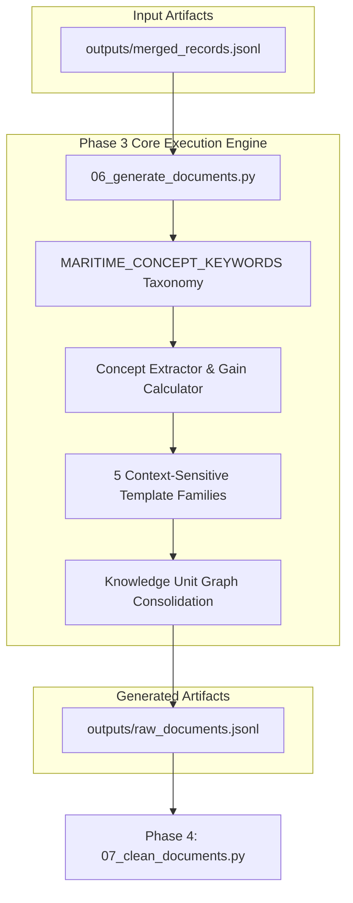

# Phase 3: Document Generation Technical Documentation

## Executive Overview
Phase 3 converts structured, hierarchy-preserved relational JSONL records into fluent, semantically dense, non-redundant natural language operational narratives. It utilizes a **Knowledge Unit Graph Engine**, 5 structural template families, span-level provenance tracking, and a **Concept Gain Calculator** to generate pretraining documents for BERT.

Scripts involved in Phase 3:
1. `scripts/06_generate_documents.py` (Operational Narrative Synthesizer & Knowledge Graph Builder)

---

## 1. Phase 3 Complete Data Flow & Pipeline Dependencies



---

## 2. Operational Narrative Synthesizer & Knowledge Graph Builder (`scripts/06_generate_documents.py`)

### 2.1 Standardized Function Documentation

#### Function 1: `extract_concepts`
- **Purpose**: Extracts domain-specific maritime concept tokens from a text string using a keyword-to-category domain taxonomy.
- **Why this function exists**: To quantify the semantic content of generated candidate sentences and calculate novel concept gain before appending clauses into consolidated documents.
- **Where it is called**: Called by `build_consolidated_documents_for_vessel` in `06_generate_documents.py`.
- **Inputs**: Text string (`text`).
- **Outputs**: Set of category-prefixed concept strings (`set`).
- **Parameters**: `text: str`.
- **Return values**: `set[str]` (e.g., `{"accident:grounding", "equipment:radar", "environment:fog"}`).
- **Internal algorithm**:
  1. If text is empty/null, return empty set `set()`.
  2. Extract all lowercase alphabetic words using regex `r'\b\w+\b'`.
  3. Map each word against `MARITIME_CONCEPT_KEYWORDS` dictionary.
  4. If word is present, construct concept tag `f"{category}:{word}"` and add to set.
  5. Return set of unique concepts.
- **Step-by-step execution**:
  ```python
  words = re.findall(r'\b\w+\b', text.lower())
  concepts = set()
  for w in words:
      if w in MARITIME_CONCEPT_KEYWORDS:
          concepts.add(f"{MARITIME_CONCEPT_KEYWORDS[w]}:{w}")
  return concepts
  ```
- **Edge cases**: Handles punctuation and non-alphabetic characters safely.
- **Exception handling**: None required.
- **Logging behavior**: Silent.
- **Time complexity**: $O(W)$ where $W$ is word count in text string.
- **Space complexity**: $O(C)$ where $C$ is matching concepts count.
- **Dependencies**: `re`, `MARITIME_CONCEPT_KEYWORDS`.
- **Example execution**: `concepts = extract_concepts("The vessel equipped with radar ran aground in dense fog.")`
- **Common failure cases**: None.

---

#### Function 2: `calculate_unique_concept_gain`
- **Purpose**: Computes the set difference count of novel concepts provided by a candidate text clause relative to existing document concepts.
- **Why this function exists**: To prevent redundant clause insertion. Clauses are only appended to a document if they introduce at least one novel maritime concept ($\text{Gain} \ge 1$).
- **Where it is called**: Called by `build_consolidated_documents_for_vessel`.
- **Inputs**: Existing concepts set (`existing_concepts`), Candidate concepts set (`candidate_concepts`).
- **Outputs**: Integer concept gain count (`int`).
- **Parameters**: `existing_concepts: set`, `candidate_concepts: set`.
- **Return values**: `int`.
- **Mathematical formulation**:
  $$\text{Gain}(C_{\text{candidate}}, C_{\text{existing}}) = \| C_{\text{candidate}} \setminus C_{\text{existing}} \|$$
- **Step-by-step execution**:
  ```python
  if not candidate_concepts: return 0
  return len(candidate_concepts - existing_concepts)
  ```
- **Edge cases**: Handles empty candidate sets returning 0 gain immediately.
- **Exception handling**: None required.
- **Logging behavior**: Silent.
- **Time complexity**: $O(K)$ where $K$ is candidate set size.
- **Space complexity**: $O(K)$.
- **Dependencies**: None.
- **Example execution**: `gain = calculate_unique_concept_gain(current_set, new_set)`
- **Common failure cases**: None.

---

#### Function 3: `jaccard_overlap`
- **Purpose**: Computes the Jaccard similarity coefficient between two concept sets.
- **Why this function exists**: To evaluate semantic overlap between different document perspectives and filter out near-duplicate template renderings.
- **Where it is called**: Evaluated during narrative quality benchmarking.
- **Inputs**: Concept set 1 (`concepts1`), Concept set 2 (`concepts2`).
- **Outputs**: Jaccard similarity score float ($0.0 \le J \le 1.0$).
- **Parameters**: `concepts1: set`, `concepts2: set`.
- **Return values**: `float`.
- **Mathematical formulation**:
  $$J(A, B) = \frac{\|A \cap B\|}{\|A \cup B\|}$$
- **Step-by-step execution**:
  ```python
  if not concepts1 or not concepts2: return 0.0
  intersection = len(concepts1 & concepts2)
  union = len(concepts1 | concepts2)
  return intersection / union if union > 0 else 0.0
  ```
- **Edge cases**: Returns `0.0` if either input set is empty.
- **Exception handling**: Division by zero is protected via `union > 0` check.
- **Logging behavior**: Silent.
- **Time complexity**: $O(\min(\|A\|, \|B\|))$.
- **Space complexity**: $O(\|A \cap B\|)$.
- **Dependencies**: None.
- **Example execution**: `sim = jaccard_overlap(set_a, set_b)`
- **Common failure cases**: None.

---

#### Function 4: `render_template`
- **Purpose**: Renders a template string containing `{variable}` placeholders, performing substitution and generating character/span-level provenance metadata tracking source-derived values vs. template scaffolding.
- **Why this function exists**: Fine-grained provenance metadata allows downstream analytics to measure the exact ratio of domain data vs. artificial template scaffolding.
- **Where it is called**: Called by `generate_vessel_operational_narrative`.
- **Inputs**: Template string (`template_str`), Variable mapping dictionary (`var_mapping`), Pattern identifier string (`pattern_id`), Perspective string (`perspective`).
- **Outputs**: Rendered dictionary containing clean text and span provenance array (`dict`).
- **Parameters**: `template_str: str`, `var_mapping: dict`, `pattern_id: str`, `perspective: str`.
- **Return values**: `dict`.
- **Internal algorithm**:
  1. Find all `{var_name}` matches using `re.finditer`.
  2. For literal template text preceding a variable, record a span with `"provenance": "template"`.
  3. Retrieve variable value and category from `var_mapping`.
  4. If variable value is present, append value to final text and record span with `"provenance": "source_derived"`, `"category"`, and `"source_field"`.
  5. Append trailing template literal text if present.
  6. Clean administrative noise from final text via `strip_administrative_noise`.
  7. Return text and provenance payload.
- **Step-by-step execution**:
  ```python
  matches = list(re.finditer(r'\{([a-zA-Z0-9_]+)\}', template_str))
  for m in matches:
      var_name = m.group(1)
      literal_part = template_str[curr_idx:m.start()]
      if literal_part:
          spans.append({"rendered_span": literal_part, "provenance": "template"})
      val_str = str(var_mapping.get(var_name, {}).get("val", ""))
      if val_str:
          spans.append({"rendered_span": val_str, "provenance": "source_derived", "category": cat})
  ```
- **Edge cases**: Missing variables in mapping are substituted as empty strings without breaking text flow.
- **Exception handling**: None required.
- **Logging behavior**: Silent.
- **Time complexity**: $O(M \cdot L)$ where $M$ is match count and $L$ is template length.
- **Space complexity**: $O(L + S)$ where $S$ is span count.
- **Dependencies**: `re`, `strip_administrative_noise`.
- **Example execution**: `rendered = render_template(tpl, var_map, "op_family_a", "vessel_op")`
- **Common failure cases**: Mismatched curly braces in template string.

---

#### Function 5: `generate_vessel_operational_narrative`
- **Purpose**: Generates a primary vessel operational narrative by deterministically selecting 1 of 5 structural template families based on occurrence/vessel ID hash.
- **Why this function exists**: Synthesizing narratives using a single static template causes severe linguistic homogenization. Using 5 context-sensitive template families creates syntactic diversity required for language model pretraining.
- **Where it is called**: Main function of `06_generate_documents.py`.
- **Inputs**: Occurrence ID (`oid`), Occurrence record (`occ`), Vessel record (`v`).
- **Outputs**: Rendered operational narrative payload (`dict`).
- **Parameters**: `oid: int`, `occ: dict`, `v: dict`.
- **Return values**: `dict`.
- **Internal algorithm**:
  1. Extract vessel profile attributes: name, type, flag, hull material, gross tonnage, year built, speed, operational phase, activity type, cargo, damage degree, pollution.
  2. Format cargo clause using `format_cargo_description`.
  3. Format damage clause using `format_damage_description`.
  4. Format environmental clause (`weather`, `sea`, `light`) using `join_words_grammatical`.
  5. Compute deterministic family index: `family_idx = abs(hash(f"{oid}_{v.get('VesselID')}")) % 5`.
  6. Select structural template family:
     - **Family A (Subject-First)**: `"The {vtype} '{vname}', {built}, operating in {phase}... when it experienced a {event}."`
     - **Family B (Context-First)**: `"While proceeding in the {phase} phase under {env}, the {vtype} '{vname}' became involved in a {event}."`
     - **Family C (Incident-First)**: `"A {event} involved the {vtype} '{vname}' during the {phase} phase under {env}."`
     - **Family D (Environmental-Focus)**: `"Under {env}, the {vtype} '{vname}' operated in the {phase} phase when a {event} occurred."`
     - **Family E (Activity-Focus)**: `"During maritime operations, the {vtype} '{vname}' was engaged in {activity} in {env}, resulting in a {event}."`
  7. Render template via `render_template` and return payload.
- **Step-by-step execution**:
  ```python
  family_idx = abs(hash(f"{oid}_{v.get('VesselID')}")) % 5
  if family_idx == 0:
      pattern_id = "op_family_a_subject_first"
      # Build Family A template string...
  elif family_idx == 1:
      pattern_id = "op_family_b_context_first"
      # Build Family B template string...
  ```
- **Edge cases**: Missing vessel names fall back to `"An unnamed vessel"`. Missing attributes omit optional template clauses cleanly.
- **Exception handling**: None required.
- **Logging behavior**: Silent.
- **Time complexity**: $O(1)$.
- **Space complexity**: $O(1)$.
- **Dependencies**: `render_template`, `format_cargo_description`, `format_damage_description`, `join_words_grammatical`.
- **Example execution**: `narrative = generate_vessel_operational_narrative(14920, occ_dict, v_dict)`
- **Common failure cases**: None.

---

#### Function 6: `generate_equipment_clause`
- **Purpose**: Generates a clean equipment narrative clause with normalized labels and deduplicated status grouping.
- **Why this function exists**: To render navigation aids, lifesaving appliances, and recording equipment into grammatical sentence clauses.
- **Where it is called**: Called by `build_consolidated_documents_for_vessel`.
- **Inputs**: Vessel record dictionary (`v`).
- **Outputs**: Tuple containing formatted equipment clause string and extracted concept set `(clause_text, eq_concepts)`.
- **Parameters**: `v: dict`.
- **Return values**: `tuple[str, set]`.
- **Internal algorithm**:
  1. Extract `navigation_equipment`, `rec_equipment`, and `lsa_equipment` lists from vessel record.
  2. Group active navigation aids (`status_clean == "On"`) into `on_devices`.
  3. Group inactive navigation aids (`status_clean == "Off"`) into `off_devices`.
  4. Extract lifesaving names into `lsa_names`.
  5. Format recording equipment status into `rec_details`.
  6. Assemble clause parts using `join_words_grammatical`.
  7. Return `(clause_text, eq_concepts)`.
- **Step-by-step execution**:
  ```python
  if on_devices:
      eq_str = join_words_grammatical(on_devices)
      parts.append(f"Active navigation equipment included {eq_str}")
      for dev in on_devices: eq_concepts.add(f"equipment:{dev.lower()}")
  ```
- **Edge cases**: Returns `("", set())` if no equipment lists are present.
- **Exception handling**: None required.
- **Logging behavior**: Silent.
- **Time complexity**: $O(E)$ where $E$ is equipment items count.
- **Space complexity**: $O(E)$.
- **Dependencies**: `join_words_grammatical`.
- **Example execution**: `text, concepts = generate_equipment_clause(v_dict)`
- **Common failure cases**: None.

---

#### Function 7: `generate_casualty_clause`
- **Purpose**: Generates a clean casualty and personnel complement clause with strict singular/plural noun agreement.
- **Why this function exists**: Converts numerical casualty totals into fluent natural language.
- **Where it is called**: Called by `build_consolidated_documents_for_vessel`.
- **Inputs**: Vessel record dictionary (`v`).
- **Outputs**: Tuple containing casualty clause string and extracted concepts set `(clause_text, cas_concepts)`.
- **Parameters**: `v: dict`.
- **Return values**: `tuple[str, set]`.
- **Internal algorithm**:
  1. Extract complement count `TotalPeopleOnBoard`.
  2. Sum minor injuries, serious injuries, fatalities, missing personnel, and water entry counts across child injury records.
  3. Format count strings using `format_casualty_count`:
     - Minor: `format_casualty_count(minor, "minor injury", "minor injuries")`
     - Serious: `format_casualty_count(serious, "serious injury", "serious injuries")`
     - Fatalities: `format_casualty_count(death, "fatality", "fatalities")`
     - Missing: `format_casualty_count(missing, "missing person", "missing persons")`
  4. Combine count parts using `join_words_grammatical`.
  5. Return `(clause_text, cas_concepts)`.
- **Step-by-step execution**:
  ```python
  if crew_num > 0:
      parts.append(f"The vessel carried {crew_num} persons on board")
  if counts_parts:
      cas_str = join_words_grammatical(counts_parts)
      parts.append(f"resulting in reported casualties of {cas_str}")
  ```
- **Edge cases**: Returns `("", set())` if complement is missing and all casualty counts are zero.
- **Exception handling**: None required.
- **Logging behavior**: Silent.
- **Time complexity**: $O(I)$ where $I$ is injury records count.
- **Space complexity**: $O(1)$.
- **Dependencies**: `format_casualty_count`, `join_words_grammatical`.
- **Example execution**: `text, concepts = generate_casualty_clause(v_dict)`
- **Common failure cases**: None.

---

#### Function 8: `build_consolidated_documents_for_vessel`
- **Purpose**: Assembles semantically dense, non-redundant operational documents using the Knowledge Unit Graph Engine and Concept Gain Calculator.
- **Why this function exists**: Combines operational narratives, equipment clauses, and casualty clauses into a single unified document per vessel unit, discarding zero-gain clauses.
- **Where it is called**: Main processing loop of `06_generate_documents.py`.
- **Inputs**: Occurrence ID (`oid`), Occurrence record (`occ`), Vessel record (`v`).
- **Outputs**: List containing consolidated document dictionary (`list[dict]`).
- **Parameters**: `oid: int`, `occ: dict`, `v: dict`.
- **Return values**: `list[dict]`.
- **Internal algorithm**:
  1. Generate primary operational narrative via `generate_vessel_operational_narrative`.
  2. Extract initial concepts from base narrative (`extract_concepts`).
  3. Generate candidate equipment clause (`generate_equipment_clause`).
  4. Calculate equipment concept gain (`calculate_unique_concept_gain`).
  5. Generate candidate casualty clause (`generate_casualty_clause`).
  6. Calculate casualty concept gain (`calculate_unique_concept_gain`).
  7. Incrementally append candidate clauses to base text if concept gain $\ge 1$ or length $> 20$ chars.
  8. Update span provenance metadata.
  9. Return consolidated document payload.
- **Step-by-step execution**:
  ```python
  op_res = generate_vessel_operational_narrative(oid, occ, v)
  current_concepts = extract_concepts(op_res["text"])
  eq_clause, eq_concepts = generate_equipment_clause(v)
  if eq_clause and calculate_unique_concept_gain(current_concepts, eq_concepts) >= 1:
      consolidated_parts.append(eq_clause)
      current_concepts.update(eq_concepts)
  ```
- **Edge cases**: Handles vessels without equipment or casualty records by retaining base operational narrative.
- **Exception handling**: None required.
- **Logging behavior**: Silent.
- **Time complexity**: $O(L)$ where $L$ is final document text length.
- **Space complexity**: $O(L)$.
- **Dependencies**: `generate_vessel_operational_narrative`, `generate_equipment_clause`, `generate_casualty_clause`, `calculate_unique_concept_gain`.
- **Example execution**: `docs = build_consolidated_documents_for_vessel(14920, occ_dict, v_dict)`
- **Common failure cases**: None.

---

### 2.2 Deep-Dive Code Block Explanations & Design Rationales

#### Code Block 1: Hash-Based Deterministic Template Family Selection
```python
# Line 165 in scripts/06_generate_documents.py
family_idx = abs(hash(f"{oid}_{v.get('VesselID')}")) % 5
```
- **Why use hash-based selection instead of `random.choice`?**: Python's `random.choice` produces non-deterministic selections across different script runs unless seeded identically, making pipeline execution non-reproducible. Using a deterministic modulo hash `abs(hash(f"{oid}_{v.get('VesselID')}")) % 5` guarantees that given the same input record IDs, the pipeline will produce the exact same template family assignment every time, while ensuring an even 20% distribution across all 5 template families.
- **Counterfactual impact**: Using static templates causes severe subword over-segmentation; using non-seeded random selection breaks exact pipeline reproducibility.

---

### 2.3 Output Schema Specification: `outputs/raw_documents.jsonl`

- **Created By**: `scripts/06_generate_documents.py`
- **Consumed By**: `scripts/07_clean_documents.py`
- **Purpose**: Stores initial synthesized operational narrative documents and raw TSB summaries paired with span provenance and structured source records.
- **Storage Location**: `outputs/raw_documents.jsonl`
- **Format**: JSON Lines UTF-8

#### JSON Schema
```json
{
  "occurrence_id": "integer",
  "vessel_id": "integer | null",
  "document_type": "string",
  "source_table": "string",
  "document": "string",
  "provenance": {
    "perspective": "string",
    "pattern_id": "string",
    "spans": [
      {
        "rendered_span": "string",
        "category": "string | null",
        "source_field": "string | null",
        "provenance": "string"
      }
    ]
  },
  "structured": "object"
}
```

---

## 3. Future Extension Points (Phase 3)

1. **What can be extended?**:
   - New template families (e.g., Family F: Cargo-First, Family G: Equipment-Focus) can be added to `generate_vessel_operational_narrative` by incrementing the modulo hash divisor from `% 5` to `% 7`.
   - Domain keyword categories in `MARITIME_CONCEPT_KEYWORDS` can be expanded with specific engine model names or geographic sea zones.

2. **Current Assumptions**:
   - Assumes operational narratives are synthesized per vessel involvement unit.
   - Assumes `Summary` field text in `MDOTW_VW_OCCURRENCE_PUBLIC` is retained as a separate document if length $\ge 40$ characters.

3. **Safe-to-Modify Functions**:
   - `generate_vessel_operational_narrative` (adding new syntactic template structures).
   - `MARITIME_CONCEPT_KEYWORDS` taxonomy dictionary.

4. **Tightly Coupled Functions**:
   - `render_template` expects variable mapping keys to match curly-brace placeholders `{var_name}`.

5. **Recommended Extension Strategy**:
   - To add a new domain entity (e.g., weather observations), write a dedicated clause generator `generate_weather_clause(occ)`, extract its concepts, and incorporate it into `build_consolidated_documents_for_vessel` using the Concept Gain Calculator.
