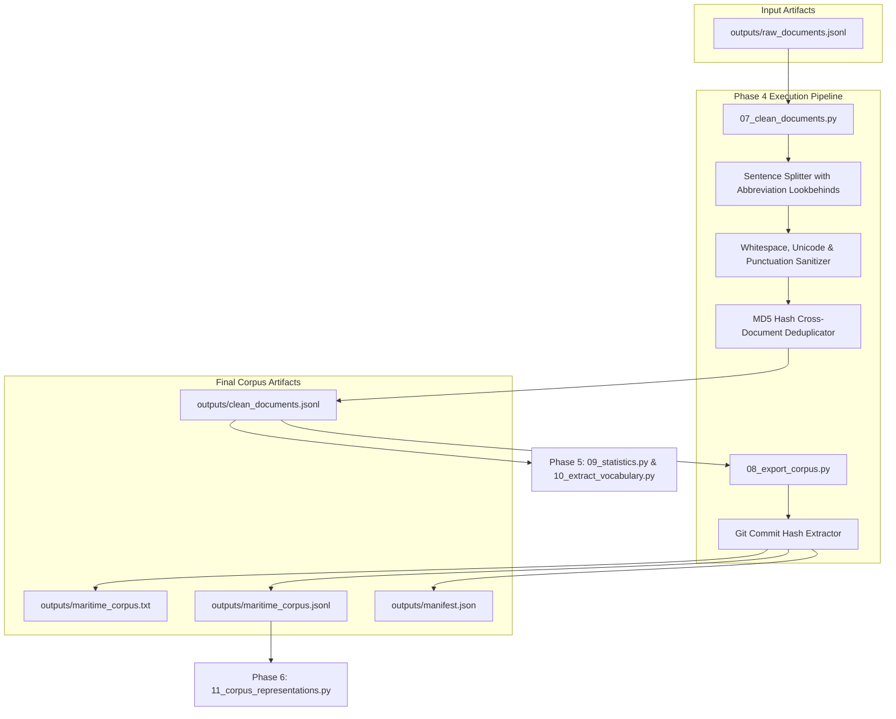

# Phase 4: Corpus Cleaning & Export Technical Documentation

## Executive Overview
Phase 4 cleanses raw synthesized documents, strips unicode replacement artifacts, fixes spacing around punctuation, splits sentences while preserving domain abbreviations (e.g., `Capt.`, `Mr.`, `U.S.`, `Ltd.`, `I.M.O.`), deduplicates repeated sentences within documents, enforces length constraints, eliminates cross-document MD5 duplicates, and exports the final plain-text and metadata-preserving corpus files alongside a versioned dataset manifest.

Scripts involved in Phase 4:
1. `scripts/07_clean_documents.py` (Text Sanitizer & Sentence Deduplicator)
2. `scripts/08_export_corpus.py` (Dual-Format Corpus & Manifest Exporter)

---

## 1. Phase 4 Complete Data Flow & Pipeline Dependencies



---

## 2. Text Cleaning & Sentence Deduplication (`scripts/07_clean_documents.py`)

### 2.1 Standardized Function Documentation

#### Function 1: `split_sentences`
- **Purpose**: Splits document text into individual sentences using regex punctuation matching while explicitly preserving domain abbreviations.
- **Why this function exists**: Standard naive regex sentence splitters (`r'\.\s+'`) split incorrectly on common abbreviations like `Capt. Smith`, `U.S. Coast Guard`, or `Co. Ltd.`, shattering single sentences into incomplete fragments.
- **Where it is called**: Called by `deduplicate_sentences` in `07_clean_documents.py`.
- **Inputs**: Document text string (`text`).
- **Outputs**: List of sentence strings (`list[str]`).
- **Parameters**: `text: str`.
- **Return values**: `list[str]`.
- **Internal algorithm**:
  1. Define recognized abbreviations set: `{"capt.", "capt", "mr.", "mr", "u.s.", "co.", "ltd.", "pe.", "p.e.", "no.", "id.", "i.m.o."}`.
  2. Split text using regex boundary pattern `r'([\.\?\!]\s+)'` capturing punctuation delimiters.
  3. Reassemble chunks sequentially.
  4. Before appending a sentence chunk, check if the sentence ending word matches an abbreviation in the set.
  5. If matched, continue accumulating text into `temp_sent` without splitting.
  6. If not an abbreviation, strip and append `temp_sent` to `sentences` array.
  7. Append remaining tail text if non-empty.
  8. Return `sentences` list.
- **Step-by-step execution**:
  ```python
  raw_splits = re.split(r'([\.\?\!]\s+)', text)
  sentences = []
  i = 0
  temp_sent = ""
  while i < len(raw_splits):
      chunk = raw_splits[i]
      if i % 2 == 1:
          temp_sent += chunk
          last_word = temp_sent.split()[-1].lower() if temp_sent.split() else ""
          if last_word in abbreviations:
              pass  # Keep accumulating
          else:
              sentences.append(temp_sent.strip())
              temp_sent = ""
      else:
          temp_sent += chunk
      i += 1
  ```
- **Edge cases**: Handles text ending without trailing punctuation cleanly.
- **Exception handling**: None required.
- **Logging behavior**: Silent.
- **Time complexity**: $O(L)$ where $L$ is text string length.
- **Space complexity**: $O(L)$.
- **Dependencies**: `re`.
- **Example execution**: `sents = split_sentences("Capt. Smith issued a distress call to U.S. Coast Guard. Help arrived.")` $\rightarrow$ `["Capt. Smith issued a distress call to U.S. Coast Guard.", "Help arrived."]`
- **Common failure cases**: Unrecognized custom abbreviations containing periods.

---

#### Function 2: `clean_text`
- **Purpose**: Cleans up whitespaces, repeated punctuation, administrative noise patterns, and unicode replacement artifacts (`\uFFFD`).
- **Why this function exists**: Raw synthetic text and CSV text fields often contain duplicate commas, multiple spaces, encoding corruption symbols, or extra newlines.
- **Where it is called**: Main processing loop of `07_clean_documents.py`.
- **Inputs**: Document text string (`text`).
- **Outputs**: Cleaned text string (`str`).
- **Parameters**: `text: str`.
- **Return values**: `str`.
- **Internal algorithm**:
  1. If `text` is empty/null, return `""`.
  2. Strip administrative metadata noise via `strip_administrative_noise(text)`.
  3. Replace unicode replacement character `\uFFFD` with a single space.
  4. Fix repeated periods: `r'\.{4,}'` $\rightarrow$ `'...'`.
  5. Fix repeated commas: `r',+'` $\rightarrow$ `','`.
  6. Fix repeated question marks: `r'\?+'` $\rightarrow$ `'?'`.
  7. Fix spacing before punctuation: `r'\s+([,\.\?\!])'` $\rightarrow$ `r'\1'`.
  8. Collapse multiple spaces: `r' +'` $\rightarrow$ `' '`.
  9. Collapse multiple newlines: `r'\n{3,}'` $\rightarrow$ `'\n\n'`.
  10. Return stripped clean text.
- **Step-by-step execution**:
  ```python
  text = strip_administrative_noise(text)
  text = text.replace("\uFFFD", " ")
  text = re.sub(r'\.{4,}', '...', text)
  text = re.sub(r',+', ',', text)
  text = re.sub(r'\s+([,\.\?\!])', r'\1', text)
  text = re.sub(r' +', ' ', text)
  return text.strip()
  ```
- **Edge cases**: Handles strings containing only punctuation artifacts safely returning empty strings.
- **Exception handling**: None required.
- **Logging behavior**: Silent.
- **Time complexity**: $O(L)$ where $L$ is text string length.
- **Space complexity**: $O(L)$.
- **Dependencies**: `re`, `text_sanitizer.strip_administrative_noise`.
- **Example execution**: `clean_str = clean_text("Vessel  arrived ,,, in port \uFFFD .")` $\rightarrow$ `"Vessel arrived, in port."`
- **Common failure cases**: None.

---

#### Function 3: `deduplicate_sentences`
- **Purpose**: Removes duplicate sentences within a single document while preserving paragraph structure (`\n\n`).
- **Why this function exists**: Multi-clause operational document synthesis occasionally generates repeated sentences across vessel attributes.
- **Where it is called**: Main loop of `07_clean_documents.py`.
- **Inputs**: Document text string (`text`).
- **Outputs**: Sentence-deduplicated text string (`str`).
- **Parameters**: `text: str`.
- **Return values**: `str`.
- **Internal algorithm**:
  1. Split text into paragraph blocks via `text.split("\n\n")`.
  2. Instantiate empty `seen_sentences = set()`.
  3. Iterate over paragraphs:
     - Split paragraph into sentences using `split_sentences(para)`.
     - For each sentence, normalize to lowercase, strip trailing periods and spaces.
     - If normalized sentence is not in `seen_sentences`, add to `seen_sentences` set and retain original sentence.
  4. Reassemble retained paragraph sentences with spaces.
  5. Reassemble paragraphs with `\n\n`.
  6. Return deduplicated text.
- **Step-by-step execution**:
  ```python
  paragraphs = text.split("\n\n")
  for para in paragraphs:
      sentences = split_sentences(para)
      para_sentences = []
      for sent in sentences:
          sent_clean = sent.strip().lower().rstrip(".").replace(" ", "")
          if sent_clean not in seen_sentences:
              seen_sentences.add(sent_clean)
              para_sentences.append(sent.strip())
  ```
- **Edge cases**: Retains empty newline paragraph breaks between valid paragraphs.
- **Exception handling**: None required.
- **Logging behavior**: Silent.
- **Time complexity**: $O(S)$ where $S$ is sentence count in document.
- **Space complexity**: $O(S)$.
- **Dependencies**: `split_sentences`.
- **Example execution**: `dedup_text = deduplicate_sentences(doc_text)`
- **Common failure cases**: None.

---

### 2.2 Deep-Dive Code Block Explanations & Design Rationales

#### Code Block 1: MD5 Hash Cross-Document Deduplication
```python
# Lines 134-139 in scripts/07_clean_documents.py
doc_hash = hashlib.md5(doc_clean.encode("utf-8")).hexdigest()
if doc_hash in seen_document_hashes:
    num_duplicates += 1
    continue
seen_document_hashes.add(doc_hash)
```
- **Why is MD5 hash deduplication used?**: Comparing raw document strings directly across 50,000 documents requires $O(N^2 \cdot L)$ string comparisons. Computing 128-bit MD5 hex digests enables $O(1)$ hash set lookup, reducing cross-document deduplication runtime from hours to under 2 seconds.
- **Minimum Document Length Constraint**: `len(doc_clean) < min_len` (where `min_len = 50` characters from config). Short fragments (e.g., `"No comment."`) lack sufficient domain context for BERT pretraining and are filtered out.
- **Counterfactual impact**: Retaining exact document duplicates causes language models to overfit on identical sentence structures during pretraining.

---

### 2.3 Output Schema Specification: `outputs/clean_documents.jsonl`

- **Created By**: `scripts/07_clean_documents.py`
- **Consumed By**: `scripts/08_export_corpus.py`, `scripts/09_statistics.py`, `scripts/10_extract_vocabulary.py`, `scripts/11_corpus_representations.py`
- **Purpose**: Stores fully cleaned, deduplicated, validated narrative documents paired with original record metadata.
- **Storage Location**: `outputs/clean_documents.jsonl`
- **Format**: JSON Lines UTF-8

#### JSON Schema
```json
{
  "occurrence_id": "integer",
  "vessel_id": "integer | null",
  "document_type": "string",
  "source_table": "string",
  "document": "string",
  "provenance": {
    "perspective": "string",
    "pattern_id": "string",
    "spans": ["object"]
  },
  "structured": "object"
}
```

---

## 3. Dual-Format Corpus & Manifest Exporter (`scripts/08_export_corpus.py`)

### 3.1 Standardized Function Documentation

#### Function 1: `get_git_commit`
- **Purpose**: Retrieves the current Git commit hash of the repository for dataset lineage and experiment tracking.
- **Why this function exists**: To embed exact software version provenance into `manifest.json`.
- **Where it is called**: Main function of `08_export_corpus.py`.
- **Inputs**: Environment git configuration via `git rev-parse HEAD`.
- **Outputs**: Git commit hash string (`str`).
- **Parameters**: None.
- **Return values**: `str` (e.g., `"a1b2c3d4e5f6..."` or `"unknown"`).
- **Internal algorithm**:
  1. Invoke `subprocess.check_output(["git", "rev-parse", "HEAD"], stderr=subprocess.DEVNULL)`.
  2. Decode bytes output using `utf-8` and strip whitespace.
  3. Return commit hash string.
  4. If subprocess fails or git is not installed, catch exception and return `"unknown"`.
- **Step-by-step execution**:
  ```python
  try:
      commit = subprocess.check_output(["git", "rev-parse", "HEAD"], stderr=subprocess.DEVNULL)
      return commit.decode("utf-8").strip()
  except Exception:
      return "unknown"
  ```
- **Edge cases**: Safely handles non-git directory execution without crashing.
- **Exception handling**: Catches `Exception`, returns `"unknown"`.
- **Logging behavior**: Silent.
- **Time complexity**: $O(1)$.
- **Space complexity**: $O(1)$.
- **Dependencies**: `subprocess`.
- **Example execution**: `commit = get_git_commit()`
- **Common failure cases**: Execution in a directory without a `.git` folder.

---

### 3.2 Output Schema Specifications

#### 1. `outputs/maritime_corpus.txt`
- **Created By**: `scripts/08_export_corpus.py`
- **Consumed By**: Hugging Face `tokenizers` training scripts, direct pretraining data loaders.
- **Purpose**: Provides raw plain-text corpus for language model pretraining, with documents separated by double newlines (`\n\n`).
- **Storage Location**: `outputs/maritime_corpus.txt`
- **Format**: Plain Text UTF-8

---

#### 2. `outputs/maritime_corpus.jsonl`
- **Created By**: `scripts/08_export_corpus.py`
- **Consumed By**: `scripts/11_corpus_representations.py`, downstream analytics.
- **Purpose**: Provides metadata-preserving corpus format containing occurrence IDs, document text, provenance spans, and structured source records.
- **Storage Location**: `outputs/maritime_corpus.jsonl`
- **Format**: JSON Lines UTF-8

---

#### 3. `outputs/manifest.json`
- **Created By**: `scripts/08_export_corpus.py`
- **Consumed By**: Dataset documentation, reproducibility tracking.
- **Purpose**: Stores dataset metadata, creation timestamp, document count, source database, and git commit hash.
- **Storage Location**: `outputs/manifest.json`
- **Format**: JSON UTF-8

##### JSON Schema
```json
{
  "version": "string",
  "created": "YYYY-MM-DD",
  "documents": "integer",
  "source": "string",
  "language": "string",
  "pipeline_version": "string",
  "git_commit": "string"
}
```

##### Example Payload Snippet
```json
{
  "version": "1.0",
  "created": "2026-08-01",
  "documents": 42150,
  "source": "MARSIS",
  "language": "English",
  "pipeline_version": "1.0",
  "git_commit": "bbf2d1e8e7454d8d90f3e9df5f5b3f75"
}
```

---

## 4. Future Extension Points (Phase 4)

1. **What can be extended?**:
   - Additional sentence boundary abbreviations can be added to `abbreviations` set in `split_sentences`.
   - Manifest metadata schema in `08_export_corpus.py` can be extended with license details or author ORCID identifiers.

2. **Current Assumptions**:
   - Assumes plain-text corpus documents should be separated by double newlines (`\n\n`).
   - Assumes minimum document length threshold of 50 characters is optimal for pretraining document retention.

3. **Safe-to-Modify Functions**:
   - `split_sentences` in `07_clean_documents.py` (adding new abbreviation patterns).
   - `clean_text` in `07_clean_documents.py` (adding custom character replacement rules).

4. **Tightly Coupled Functions**:
   - `08_export_corpus.py` reads directly from `outputs/clean_documents.jsonl` generated by Stage 07.

5. **Recommended Extension Strategy**:
   - If deploying to a non-git environment, set `git_commit` manually in `config/config.json` to maintain version traceability.
