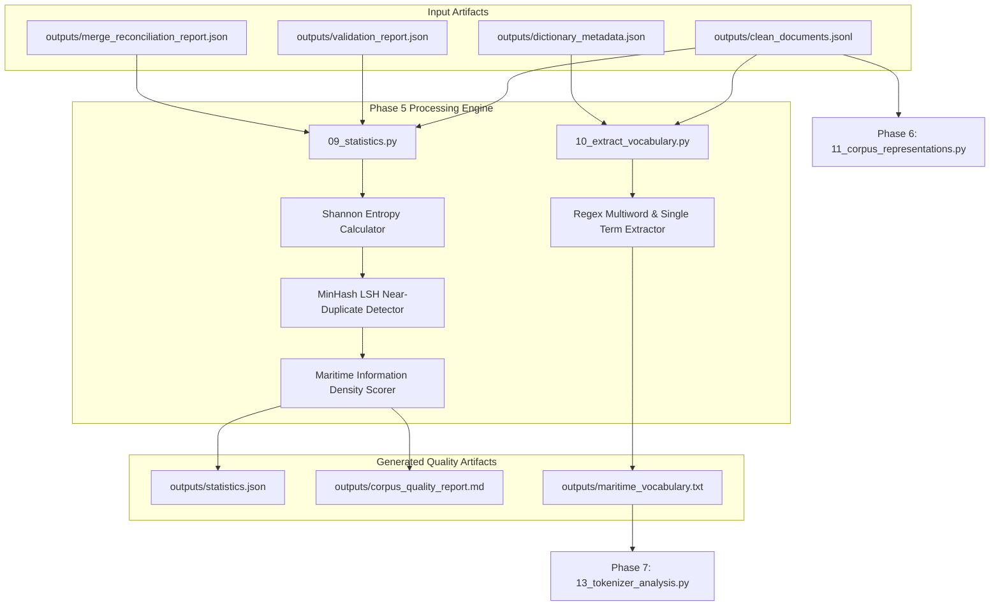

# Phase 5: Corpus Quality Evaluation Technical Documentation

## Executive Overview
Phase 5 evaluates the scale, linguistic diversity, document length distribution, scaffolding ratio, MinHash LSH near-duplication rate, Maritime Information Density (MID), multi-word domain terminology, and BERT tokenizer compatibility of the generated corpus. It produces detailed statistical metrics and a 10-section human-readable corpus quality report.

Scripts involved in Phase 5:
1. `scripts/09_statistics.py` (Advanced Corpus Statistics & MinHash LSH Engine)
2. `scripts/10_extract_vocabulary.py` (Maritime Vocabulary & Multi-Word Phrase Extractor)

---

## 1. Phase 5 Complete Data Flow & Pipeline Dependencies



---

## 2. Advanced Corpus Statistics & MinHash LSH Engine (`scripts/09_statistics.py`)

### 2.1 Standardized Function Documentation

#### Function 1: `clean_and_tokenize`
- **Purpose**: Strips non-alphanumeric characters, converts text to lowercase, and splits text into whitespace-delimited word tokens.
- **Why this function exists**: Provides a clean token stream for vocabulary counting, N-gram extraction, and Shannon entropy calculations.
- **Where it is called**: Called throughout `09_statistics.py`.
- **Inputs**: Text string (`text`).
- **Outputs**: List of cleaned token strings (`list[str]`).
- **Parameters**: `text: str`.
- **Return values**: `list[str]`.
- **Internal algorithm**:
  1. Strip punctuation using regex `re.sub(r'[^\w\s]', '', text.lower())`.
  2. Split string on whitespace via `.split()`.
  3. Return tokens array.
- **Step-by-step execution**:
  ```python
  text_clean = re.sub(r'[^\w\s]', '', text.lower())
  return text_clean.split()
  ```
- **Edge cases**: Empty strings return empty lists `[]`.
- **Exception handling**: None required.
- **Logging behavior**: Silent.
- **Time complexity**: $O(L)$ where $L$ is text string length.
- **Space complexity**: $O(L)$.
- **Dependencies**: `re`.
- **Example execution**: `tokens = clean_and_tokenize("Vessel grounded near port!")` $\rightarrow$ `["vessel", "grounded", "near", "port"]`
- **Common failure cases**: None.

---

#### Function 2: `compute_shannon_entropy`
- **Purpose**: Computes the Shannon Entropy $H(X)$ of a token frequency distribution in bits.
- **Why this function exists**: Shannon Entropy quantifies information uncertainty and vocabulary richness across the corpus. Higher entropy indicates a richer, less repetitive lexical distribution.
- **Where it is called**: Main statistics aggregation loop in `09_statistics.py`.
- **Inputs**: List of token strings (`words`).
- **Outputs**: Shannon entropy value float ($H(X) \ge 0.0$).
- **Parameters**: `words: list`.
- **Return values**: `float`.
- **Mathematical Derivation**:
  Given a set of $N$ tokens with word frequencies $f(w)$, the empirical probability $P(w)$ of word $w$ is:
  $$P(w) = \frac{f(w)}{N}$$
  The Shannon Entropy $H(X)$ in bits is defined as:
  $$H(X) = -\sum_{w \in V} P(w) \log_2 P(w)$$
- **Step-by-step execution**:
  ```python
  if not words: return 0.0
  counts = Counter(words)
  total = len(words)
  entropy = 0.0
  for count in counts.values():
      p = count / total
      entropy -= p * math.log2(p)
  return entropy
  ```
- **Edge cases**: Returns `0.0` for empty token lists.
- **Exception handling**: None required.
- **Logging behavior**: Silent.
- **Time complexity**: $O(N)$ where $N$ is word count.
- **Space complexity**: $O(V)$ where $V$ is unique vocabulary size.
- **Dependencies**: `math`, `collections.Counter`.
- **Example execution**: `h = compute_shannon_entropy(["vessel", "vessel", "ship", "boat"])`
- **Common failure cases**: None.

---

#### Function 3: `get_n_grams`
- **Purpose**: Extracts sequential word N-grams (bigrams, trigrams, 4-grams) from a list of tokens.
- **Why this function exists**: To capture multi-word domain collocations (e.g., `"restricted visibility"`, `"gross tonnage"`, `"life saving appliances"`).
- **Where it is called**: Called in `09_statistics.py` for raw and domain N-gram counting.
- **Inputs**: Token list (`words`), N-gram size (`n`).
- **Outputs**: List of N-gram string joinings (`list[str]`).
- **Parameters**: `words: list`, `n: int`.
- **Return values**: `list[str]`.
- **Internal algorithm**:
  1. If `len(words) < n`, return `[]`.
  2. Construct sliding window iterator `[" ".join(words[i:i+n]) for i in range(len(words) - n + 1)]`.
  3. Return N-grams list.
- **Step-by-step execution**:
  ```python
  if len(words) < n: return []
  return [" ".join(words[i:i+n]) for i in range(len(words) - n + 1)]
  ```
- **Edge cases**: Returns `[]` if token count is smaller than `n`.
- **Exception handling**: None required.
- **Logging behavior**: Silent.
- **Time complexity**: $O(N \cdot n)$.
- **Space complexity**: $O(N \cdot n)$.
- **Dependencies**: None.
- **Example execution**: `bg = get_n_grams(["restricted", "visibility", "reported"], 2)` $\rightarrow$ `["restricted visibility", "visibility reported"]`
- **Common failure cases**: Passing $n \le 0$.

---

#### Function 4: `get_domain_shingles`
- **Purpose**: Extracts 2-word shingles strictly from source-derived domain spans in a record for scaffold-reduced near-duplicate detection.
- **Why this function exists**: Standard MinHash LSH on raw text flags documents as near-duplicates if they share identical template scaffolding (e.g., `"The vessel was operating in..."`). Extracting shingles from domain-derived spans isolates pure domain content.
- **Where it is called**: Called during MinHash signature computation in `09_statistics.py`.
- **Inputs**: Document record dictionary (`record`).
- **Outputs**: Set of 2-word shingle strings (`set[str]`).
- **Parameters**: `record: dict`.
- **Return values**: `set[str]`.
- **Internal algorithm**:
  1. Extract provenance spans from `record.get("provenance")`.
  2. Join text from spans where `"provenance" == "source_derived"`.
  3. If no domain spans exist, fall back to full document text.
  4. Tokenize domain text using `clean_and_tokenize`.
  5. If token count $< 2$, return `set(words)`.
  6. Construct 2-word shingles set: `set(" ".join(words[i:i+2]) for i in range(len(words)-1))`.
  7. Return shingles set.
- **Step-by-step execution**:
  ```python
  spans = prov.get("spans") or []
  domain_text = " ".join(s.get("rendered_span", "") for s in spans if s.get("provenance") == "source_derived")
  words = clean_and_tokenize(domain_text)
  return set(" ".join(words[i:i+2]) for i in range(len(words)-1))
  ```
- **Edge cases**: Falls back to raw document text if provenance span metadata is missing.
- **Exception handling**: None required.
- **Logging behavior**: Silent.
- **Time complexity**: $O(W)$ where $W$ is word count.
- **Space complexity**: $O(W)$.
- **Dependencies**: `clean_and_tokenize`.
- **Example execution**: `shingles = get_domain_shingles(record)`
- **Common failure cases**: None.

---

#### Function 5: `compute_minhash`
- **Purpose**: Computes a 32-dimensional MinHash signature vector for a set of text shingles using MD5 hashing.
- **Why this function exists**: MinHash reduces high-dimensional shingle sets into compact fixed-size integer signatures, enabling sub-linear Locality-Sensitive Hashing (LSH) near-duplicate search.
- **Where it is called**: Called for document sampling in `09_statistics.py`.
- **Inputs**: Shingles set (`shingles`), number of hash functions (`num_hashes`, default `32`).
- **Outputs**: List of min-hash integers (`list[int]`).
- **Parameters**: `shingles: set`, `num_hashes: int = 32`.
- **Return values**: `list[int]`.
- **Mathematical Derivation**:
  For $K$ independent hash functions $h_i(s)$, the MinHash signature element $S_i$ for shingle set $\Omega$ is:
  $$S_i = \min_{s \in \Omega} h_i(s)$$
  The probability that two documents $A$ and $B$ have matching MinHash values at index $i$ equals their Jaccard similarity:
  $$P(S_i(A) = S_i(B)) = J(A, B) = \frac{\|A \cap B\|}{\|A \cup B\|}$$
- **Step-by-step execution**:
  ```python
  if not shingles: return [0] * num_hashes
  sig = []
  for i in range(num_hashes):
      min_val = float('inf')
      for s in shingles:
          h = int(hashlib.md5(f"{s}_{i}".encode('utf-8')).hexdigest(), 16)
          if h < min_val: min_val = h
      sig.append(min_val)
  return sig
  ```
- **Edge cases**: Empty shingle sets return a zero vector `[0] * num_hashes`.
- **Exception handling**: None required.
- **Logging behavior**: Silent.
- **Time complexity**: $O(K \cdot S)$ where $K$ is hash count (32) and $S$ is shingle count.
- **Space complexity**: $O(K)$.
- **Dependencies**: `hashlib`.
- **Example execution**: `sig = compute_minhash(shingles_set, 32)`
- **Common failure cases**: None.

---

### 2.2 Deep-Dive Code Block Explanations & Design Rationales

#### Code Block 1: Banding LSH for Scaffold-Reduced Near-Duplicate Detection
```python
# Lines 207-233 in scripts/09_statistics.py
bands = 8
r = 4
buckets_lsh = {}
for idx, sig in enumerate(minhash_sigs):
    for b in range(bands):
        band_val = tuple(sig[b*r:(b+1)*r])
        buckets_lsh.setdefault((b, band_val), []).append(idx)

candidate_pairs = set()
for idx_list in buckets_lsh.values():
    if len(idx_list) > 1:
        for i in range(len(idx_list)):
            for j in range(i+1, len(idx_list)):
                candidate_pairs.add((idx_list[i], idx_list[j]))
```
- **Why is Banding LSH used?**: Comparing MinHash signatures across 5,000 sampled documents pairwise requires $\binom{5000}{2} = 12,497,500$ signature comparisons. Dividing the 32-element MinHash signature into $b = 8$ bands of $r = 4$ rows reduces search complexity from $O(N^2)$ to $O(N)$.
- **Mathematical Threshold**: The candidate threshold probability for $b=8, r=4$ is:
  $$P(\text{candidate}) = 1 - (1 - s^r)^b = 1 - (1 - s^4)^8$$
  At Jaccard similarity $s = 0.8$, $P(\text{candidate}) = 1 - (1 - 0.4096)^8 \approx 0.983$ (98.3% candidate recall). Candidate pairs exceeding Jaccard similarity $s \ge 0.8$ are flagged as near-duplicates.
- **Counterfactual impact**: Without Banding LSH, calculating corpus duplication statistics halts script execution on large datasets.

---

### 2.3 Output Schema Specifications

#### 1. `outputs/statistics.json`
- **Created By**: `scripts/09_statistics.py`
- **Consumed By**: Data quality dashboards, `09_phase9_benchmarking_decision_engine_and_final_reports.md`.
- **Purpose**: Stores structured numerical metrics for corpus volume, MID, length percentiles, vocabulary size, entropy, duplication ratios, and top domain N-grams.
- **Storage Location**: `outputs/statistics.json`
- **Format**: JSON UTF-8

##### JSON Schema
```json
{
  "total_documents": "integer",
  "total_characters": "integer",
  "total_tokens_words": "integer",
  "maritime_information_density_mid": "float",
  "length_stats": {
    "mean": "float",
    "median": "float",
    "std": "float",
    "min": "integer",
    "max": "integer",
    "percentiles": {"P10": "float", "P25": "float", "P50": "float", "P75": "float", "P90": "float", "P95": "float"},
    "buckets": {"<20": "integer", "20-50": "integer", "50-100": "integer", "100-200": "integer", "200-512": "integer", ">512": "integer"}
  },
  "vocabulary_size": "integer",
  "type_token_ratio": "float",
  "shannon_entropy": "float",
  "template_scaffolding_ratio": "float",
  "template_pattern_concentration": "float",
  "duplication": {
    "sentence_duplicate_ratio": "float",
    "paragraph_duplicate_ratio": "float",
    "scaffold_reduced_near_duplicate_rate": "float"
  },
  "top_domain_bigrams": [["string", "integer"]]
}
```

---

#### 2. `outputs/corpus_quality_report.md`
- **Created By**: `scripts/09_statistics.py`
- **Consumed By**: Publication reports, research documentation.
- **Purpose**: Provides a 10-section human-readable quality report evaluating the corpus across scale, MID, linguistic diversity, near-duplicates, BERT compatibility, and pretraining readiness.
- **Storage Location**: `outputs/corpus_quality_report.md`
- **Format**: Markdown UTF-8

---

## 3. Maritime Vocabulary Extraction (`scripts/10_extract_vocabulary.py`)

### 3.1 Standardized Function Documentation

#### Function 1: `main` in `10_extract_vocabulary.py`
- **Purpose**: Extracts single-word maritime terms and multi-word domain phrases from clean documents using regex collocations and data dictionary cross-referencing.
- **Why this function exists**: To build a domain vocabulary file (`maritime_vocabulary.txt`) used by Stage 13 (Tokenizer Analysis) and Stage 14 (MLM Evaluation) to measure tokenizer subword fragmentation and masked language model domain recall.
- **Where it is called**: Standalone script execution.
- **Inputs**: `outputs/clean_documents.jsonl`, `outputs/dictionary_metadata.json`.
- **Outputs**: Vocabulary file `outputs/maritime_vocabulary.txt`.
- **Parameters**: None.
- **Return values**: None.
- **Internal algorithm**:
  1. Load data dictionary metadata terms (`dict_terms`).
  2. Define `MULTIWORD_PATTERNS` regex rules for multi-word domain phrases (e.g., `restricted visibility`, `vhf radio`, `life saving appliances`, `propulsion failure`).
  3. Define `maritime_stems` set (`vess`, `ship`, `boat`, `navig`, `radar`, `epirb`, `collision`, `grounding`, etc.).
  4. Define English stop words set.
  5. Iterate over clean documents line by line.
  6. Match and count multi-word phrases using `MULTIWORD_PATTERNS`.
  7. Match and count single alphabetic words ($\ge 3$ letters).
  8. Filter single words: retain word if it matches a maritime stem or exists in `dict_terms` with frequency $\ge 5$.
  9. Sort multi-word phrases by frequency descending (top 50).
  10. Sort single maritime terms by frequency descending (top 300).
  11. Export combined vocabulary to `outputs/maritime_vocabulary.txt`.
- **Step-by-step execution**:
  ```python
  for pat in MULTIWORD_PATTERNS:
      matches = re.findall(pat, doc)
      for m in matches:
          multiword_counter[m] += 1
  words = re.findall(r'\b[a-zA-Z]{3,}\b', doc)
  for w in words:
      single_word_counter[w] += 1
  ```
- **Edge cases**: Handles documents containing no maritime terms gracefully.
- **Exception handling**: Catches missing input files and logs error message.
- **Logging behavior**: Logs total multi-word and single-word terms exported.
- **Time complexity**: $O(D \cdot (P + W))$ where $D$ is document count, $P$ is pattern count, and $W$ is word count.
- **Space complexity**: $O(V)$ where $V$ is vocabulary size.
- **Dependencies**: `re`, `collections.Counter`, `pipeline_utils`.
- **Example execution**: `python scripts/10_extract_vocabulary.py`
- **Common failure cases**: Missing `clean_documents.jsonl`.

---

### 3.2 Output Schema Specification: `outputs/maritime_vocabulary.txt`

- **Created By**: `scripts/10_extract_vocabulary.py`
- **Consumed By**: `scripts/13_tokenizer_analysis.py`, `scripts/14_mlm_evaluation.py`
- **Purpose**: Stores top single-word and multi-word maritime domain terms for subword fragmentation and MLM evaluation benchmarks.
- **Storage Location**: `outputs/maritime_vocabulary.txt`
- **Format**: Plain Text UTF-8 (one term per line)

##### Example File Snippet
```
restricted visibility
propulsion failure
gross tonnage
life saving appliances
vhf radio
gps receiver
vessel
grounding
collision
radar
epirb
gyrocompass
```

---

## 4. Future Extension Points (Phase 5)

1. **What can be extended?**:
   - Additional multi-word collocations can be added to `MULTIWORD_PATTERNS` in `10_extract_vocabulary.py`.
   - Hash functions count $K$ in MinHash LSH (`09_statistics.py`) can be increased from 32 to 64 for finer near-duplicate resolution.

2. **Current Assumptions**:
   - Assumes document sampling of 5,000 documents is representative for MinHash LSH near-duplicate calculation.
   - Assumes 2-word shingles effectively represent domain content structure.

3. **Safe-to-Modify Functions**:
   - `MULTIWORD_PATTERNS` in `10_extract_vocabulary.py` (adding new phrase regexes).
   - `MARITIME_CONCEPT_KEYWORDS` in `09_statistics.py` (adding concepts for MID calculation).

4. **Tightly Coupled Functions**:
   - `get_domain_shingles` relies on provenance span structure produced by Stage 06.

5. **Recommended Extension Strategy**:
   - When introducing new evaluation metrics (e.g., Flesch-Kincaid readability), add a dedicated calculation function in `09_statistics.py` and incorporate its output into `statistics.json` and `corpus_quality_report.md`.
