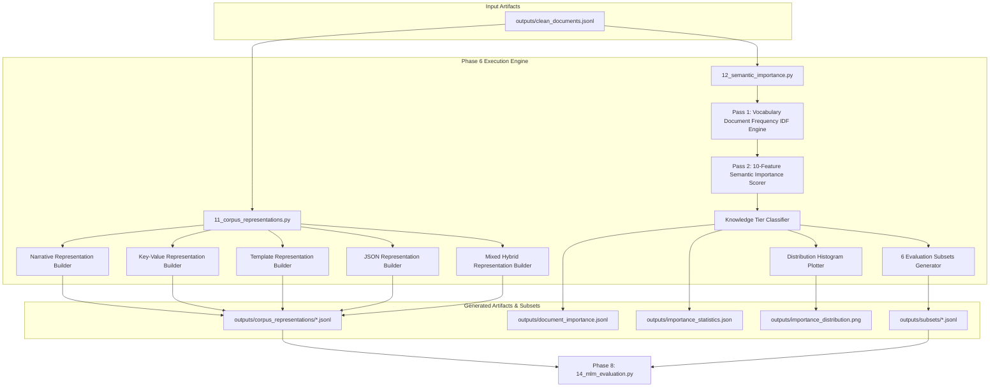

# Phase 6: Semantic Importance Analysis Technical Documentation

## Executive Overview
Phase 6 converts the clean corpus into 5 distinct multi-format textual representations and executes a 10-feature scoring engine to grade every document's semantic importance ($0.0 \le S \le 100.0$). Based on importance scores and redundancy penalties, documents are classified into Knowledge Tiers (High, Medium, Low, Redundant, Noisy) and compiled into 6 standardized evaluation subsets.

Scripts involved in Phase 6:
1. `scripts/11_corpus_representations.py` (Multi-Format Corpus Representation Builder)
2. `scripts/12_semantic_importance.py` (10-Feature Semantic Importance Scorer & Subset Generator)

---

## 1. Phase 6 Complete Data Flow & Pipeline Dependencies



---

## 2. Multi-Format Representation Builder (`scripts/11_corpus_representations.py`)

### 2.1 Standardized Function Documentation

#### Function 1: `build_key_value_representation`
- **Purpose**: Converts structured occurrence and vessel records into a clean `Key: Value` line-oriented text format.
- **Why this function exists**: Evaluates how pretrained language models handle highly structured key-value database representations vs. natural language narratives.
- **Where it is called**: Main loop of `11_corpus_representations.py`.
- **Inputs**: Document record dictionary (`record`).
- **Outputs**: Key-value formatted text string (`str`).
- **Parameters**: `record: dict`.
- **Return values**: `str`.
- **Internal algorithm**:
  1. Extract `occurrence` and `vessels` dictionaries from `record["structured"]`.
  2. Format occurrence fields: `Occurrence ID`, `Occurrence Type`, `Incident Type`, `Location`, `Weather`, `Sea State`, `Casualties`.
  3. For each vessel, format vessel attributes: `Vessel`, `Type`, `Flag`, `Tonnage`, `Hull`, `Phase`.
  4. Deduplicate and join navigation equipment names (`Navigation Equipment: ...`).
  5. Deduplicate and join lifesaving equipment names (`LSA Equipment: ...`).
  6. Append summary text if present (`Summary: ...`).
  7. Join lines with newline delimiter `" \n "`.
- **Step-by-step execution**:
  ```python
  parts = []
  if occ.get("OccID"): parts.append(f"Occurrence ID: {occ.get('OccID')}")
  if occ.get("AccIncTypeDisplayEng"): parts.append(f"Incident Type: {occ.get('AccIncTypeDisplayEng')}")
  for v in vessels:
      v_parts = []
      if v.get("VesselName"): v_parts.append(f"Vessel: {v.get('VesselName')}")
      # Format equipment...
      parts.append(" | ".join(v_parts))
  return " \n ".join(parts)
  ```
- **Edge cases**: Missing or null fields are omitted cleanly without generating empty `Key: None` pairs.
- **Exception handling**: None required.
- **Logging behavior**: Silent.
- **Time complexity**: $O(V + E)$ where $V$ is vessel count and $E$ is equipment count.
- **Space complexity**: $O(L)$ where $L$ is text string length.
- **Dependencies**: None.
- **Example execution**: `kv_str = build_key_value_representation(record)`
- **Common failure cases**: Missing `"structured"` key in record.

---

#### Function 2: `build_template_representation`
- **Purpose**: Converts structured record into a semi-structured standardized template text string.
- **Why this function exists**: Evaluates model performance on standard fixed-structure template sentences without advanced syntactic variations.
- **Where it is called**: Main loop of `11_corpus_representations.py`.
- **Inputs**: Document record dictionary (`record`).
- **Outputs**: Template formatted text string (`str`).
- **Parameters**: `record: dict`.
- **Return values**: `str`.
- **Internal algorithm**:
  1. Extract occurrence and vessel attributes, supplying clean default values (`"marine event"`, `"Canadian waters"`, `"unspecified weather"`).
  2. Format vessel description strings: `"the {v_type} '{v_name}' (registered in {v_flag}, displacement {v_gt})"`.
  3. Join vessel descriptions with `" and "`.
  4. Construct template sentence: `"A maritime {occ_type} involving {inc_type} occurred near {loc} under {weather} conditions involving {v_str}."`
  5. Append summary text if present.
  6. Return template string.
- **Step-by-step execution**:
  ```python
  v_descriptions = []
  for v in vessels:
      v_descriptions.append(f"the {v_type} '{v_name}' (registered in {v_flag}, displacement {v_gt})")
  template_doc = f"A maritime {occ_type.lower()} involving {inc_type.lower()} occurred near {loc} under {weather.lower()} conditions involving {v_str}."
  ```
- **Edge cases**: Handles vessels with unknown names or flags by substituting fallback defaults.
- **Exception handling**: None required.
- **Logging behavior**: Silent.
- **Time complexity**: $O(V)$ where $V$ is vessel count.
- **Space complexity**: $O(L)$.
- **Dependencies**: None.
- **Example execution**: `tpl_str = build_template_representation(record)`
- **Common failure cases**: None.

---

#### Function 3: `build_json_representation`
- **Purpose**: Serializes structured occurrence and vessel records directly into a compact JSON format string.
- **Why this function exists**: Evaluates how language models interpret raw structured JSON text containing syntax keywords (`"occurrence_id"`, `"vessels"`, braces, brackets) vs. natural narratives.
- **Where it is called**: Main loop of `11_corpus_representations.py`.
- **Inputs**: Document record dictionary (`record`).
- **Outputs**: Compact JSON string (`str`).
- **Parameters**: `record: dict`.
- **Return values**: `str`.
- **Internal algorithm**:
  1. Construct metadata dictionary containing `occurrence_id`, `occurrence`, and `vessels`.
  2. Execute `json.dumps(clean_meta, ensure_ascii=False)`.
  3. Return serialized JSON string.
- **Step-by-step execution**:
  ```python
  clean_meta = {
      "occurrence_id": record.get("occurrence_id"),
      "occurrence": structured.get("occurrence"),
      "vessels": structured.get("vessels")
  }
  return json.dumps(clean_meta, ensure_ascii=False)
  ```
- **Edge cases**: Preserves non-ASCII characters without escaping via `ensure_ascii=False`.
- **Exception handling**: None required.
- **Logging behavior**: Silent.
- **Time complexity**: $O(K)$ where $K$ is record JSON size.
- **Space complexity**: $O(K)$.
- **Dependencies**: `json`.
- **Example execution**: `json_str = build_json_representation(record)`
- **Common failure cases**: Non-serializable data types in record dictionary.

---

#### Function 4: `build_mixed_representation`
- **Purpose**: Combines a Key-Value metadata header block with the natural operational narrative body text.
- **Why this function exists**: Hybrid representations mimic real-world technical reports where structured metadata headers precede descriptive narrative paragraphs.
- **Where it is called**: Main loop of `11_corpus_representations.py`.
- **Inputs**: Narrative document text (`narrative_doc`), Document record dictionary (`record`).
- **Outputs**: Mixed representation text string (`str`).
- **Parameters**: `narrative_doc: str`, `record: dict`.
- **Return values**: `str`.
- **Internal algorithm**:
  1. Build key-value header via `build_key_value_representation(record)`.
  2. Assemble header and narrative body using section tags:
     `"[METADATA]\n{kv_header}\n[NARRATIVE]\n{narrative_doc}"`
  3. Return combined string.
- **Step-by-step execution**:
  ```python
  kv_header = build_key_value_representation(record)
  return f"[METADATA]\n{kv_header}\n[NARRATIVE]\n{narrative_doc}"
  ```
- **Edge cases**: Handles empty narrative bodies gracefully.
- **Exception handling**: None required.
- **Logging behavior**: Silent.
- **Time complexity**: $O(L)$ where $L$ is combined text length.
- **Space complexity**: $O(L)$.
- **Dependencies**: `build_key_value_representation`.
- **Example execution**: `mixed_str = build_mixed_representation(narrative_str, record)`
- **Common failure cases**: None.

---

### 2.2 Output Representation Artifacts: `outputs/corpus_representations/`

- **Created By**: `scripts/11_corpus_representations.py`
- **Consumed By**: `scripts/14_mlm_evaluation.py`
- **Purpose**: Stores 5 distinct multi-format JSONL files used to evaluate language model representation robustness in Stage 14.
- **Storage Location**: `outputs/corpus_representations/`
- **Files Generated**:
  1. `narrative.jsonl` (Sanitized natural language paragraphs)
  2. `key_value.jsonl` (Line-oriented key-value attributes)
  3. `template.jsonl` (Standardized semi-structured template sentences)
  4. `json.jsonl` (Serialized JSON format strings)
  5. `mixed.jsonl` (Hybrid key-value header + narrative body)

---

## 3. 10-Feature Semantic Importance Scorer (`scripts/12_semantic_importance.py`)

### 3.1 Standardized Function Documentation

#### Function 1: `compute_document_features`
- **Purpose**: Evaluates 10 quantitative semantic and domain quality features for a document.
- **Why this function exists**: To objectively measure document information density, domain complexity, metadata completeness, and boilerplate redundancy.
- **Where it is called**: Main scoring loop in `12_semantic_importance.py`.
- **Inputs**: Document text (`doc_text`), Structured record (`structured`), Vocabulary document frequency map (`term_freq_map`), Total document count (`total_docs`).
- **Outputs**: Dictionary of 10 computed feature scores (`dict`).
- **Parameters**: `doc_text: str`, `structured: dict`, `term_freq_map: Counter`, `total_docs: int`.
- **Return values**: `dict`.
- **Internal Algorithm & Mathematical Formulas**:
  1. Tokenize document text into alphabetic words ($\ge 3$ letters). If 0 tokens, return zero feature dictionary.
  2. **Maritime Terminology Density** ($D_{\text{maritime}}$): Ratio of domain tokens matching `CATEGORIES` stems to total tokens:
     $$D_{\text{maritime}} = \frac{N_{\text{maritime}}}{N_{\text{total}}}$$
  3. **Rare Maritime Vocabulary Score** ($R_{\text{rare}}$): Scaled count of rare maritime terms (`RARE_MARITIME_TERMS`):
     $$R_{\text{rare}} = \min\left(1.0, \frac{\text{Count}(\text{Rare Terms})}{3.0}\right)$$
  4. **Concept Diversity** ($C_{\text{div}}$): Proportion of active domain categories (out of 6 categories):
     $$C_{\text{div}} = \frac{\| \text{Active Categories} \|}{6.0}$$
  5. **Entity Diversity** ($E_{\text{div}}$): Proportion of unique named entities (locations, vessel names, types, hull materials):
     $$E_{\text{div}} = \min\left(1.0, \frac{\| \text{Distinct Entities} \|}{6.0}\right)$$
  6. **Event Complexity** ($X_{\text{event}}$): Weighted combination of causal markers and clause counts:
     $$X_{\text{event}} = \min\left(1.0, 0.3 \cdot N_{\text{causal}} + 0.1 \cdot N_{\text{clauses}}\right)$$
  7. **Information Density** ($I_{\text{info}}$): Maritime density scaled against a 50% threshold:
     $$I_{\text{info}} = \min\left(1.0, \frac{D_{\text{maritime}}}{0.5}\right)$$
  8. **Redundancy Penalty** ($P_{\text{red}}$): Penalty flag ($0.5$) if document matches short boilerplate template patterns ($< 120$ chars).
  9. **Metadata Completeness** ($M_{\text{meta}}$): Ratio of present key metadata fields (location, weather, incident type, vessel name, tonnage):
     $$M_{\text{meta}} = \frac{N_{\text{present\_fields}}}{5.0}$$
  10. **Linguistic Diversity (TTR)** ($L_{\text{div}}$): Type-Token Ratio:
      $$L_{\text{div}} = \frac{\| V_{\text{doc}} \|}{N_{\text{total}}}$$
  11. **Domain Novelty** ($N_{\text{nov}}$): Sum of Inverse Document Frequencies (IDF) for rare terms:
      $$\text{IDF}(t) = \log\left(\frac{N_{\text{docs}} + 1}{\text{DF}(t) + 1}\right), \quad N_{\text{nov}} = \min\left(1.0, \frac{\sum_{t \in \text{Rare}} \text{IDF}(t)}{10.0}\right)$$
- **Step-by-step execution**:
  ```python
  tokens = re.findall(r'\b[a-zA-Z]{3,}\b', doc_text.lower())
  # Compute 10 feature values...
  return {
      "maritime_density": maritime_density, "rare_term_count": rare_count, "rare_score": rare_score,
      "concept_diversity": concept_diversity, "entity_diversity": entity_diversity,
      "event_complexity": event_complexity, "information_density": info_density,
      "redundancy_penalty": redundancy_penalty, "metadata_completeness": meta_completeness,
      "linguistic_diversity": ttr, "domain_novelty": domain_novelty, "concepts": list(detected_concepts)
  }
  ```
- **Edge cases**: Zero token documents return 0.0 for all features safely.
- **Exception handling**: None required.
- **Logging behavior**: Silent.
- **Time complexity**: $O(W \cdot C)$ where $W$ is word count and $C$ is category stem count.
- **Space complexity**: $O(W)$.
- **Dependencies**: `re`, `math`, `CATEGORIES`, `RARE_MARITIME_TERMS`.
- **Example execution**: `feats = compute_document_features(doc_text, structured, term_freq, 42150)`
- **Common failure cases**: None.

---

### 3.2 Composite Importance Formula & Knowledge Tier Classification

The composite **Semantic Importance Score** $S \in [0.0, 100.0]$ is calculated as a weighted linear combination clipped to the range $[0.0, 100.0]$:

$$\text{RawScore} = \left( 0.30 \cdot D_{\text{maritime}} + 0.20 \cdot R_{\text{rare}} + 0.15 \cdot C_{\text{div}} + 0.10 \cdot E_{\text{div}} + 0.10 \cdot X_{\text{event}} + 0.10 \cdot I_{\text{info}} + 0.05 \cdot M_{\text{meta}} + 0.05 \cdot L_{\text{div}} + 0.05 \cdot N_{\text{nov}} - 0.10 \cdot P_{\text{red}} \right)$$

$$S = \text{Clip}(\text{RawScore} \times 100.0, 0.0, 100.0)$$

#### Knowledge Tier Decision Logic:
- If $P_{\text{red}} \ge 0.4$: **Redundant**
- Else if $S \ge 42.0$: **High Knowledge**
- Else if $S \ge 35.0$: **Medium Knowledge**
- Else if $S \ge 20.0$: **Low Knowledge**
- Else: **Noisy / Boilerplate**

---

### 3.3 Output Schema Specifications

#### 1. `outputs/document_importance.jsonl`
- **Created By**: `scripts/12_semantic_importance.py`
- **Consumed By**: Subset generation, research quality auditing.
- **Purpose**: Stores per-document importance scores, knowledge tiers, density metrics, and extracted concepts.
- **Storage Location**: `outputs/document_importance.jsonl`
- **Format**: JSON Lines UTF-8

##### Example Payload Snippet
```json
{
  "occurrence_id": 14920,
  "importance_score": 54.82,
  "knowledge_tier": "High Knowledge",
  "maritime_density": 0.3125,
  "rare_term_count": 2,
  "concept_diversity": 0.6667,
  "concepts": ["casualty", "equipment", "vessel_type", "environment"],
  "document": "The cargo vessel 'PACIFIC PROVIDER' was operating in..."
}
```

---

#### 2. Evaluation Subsets Directory: `outputs/subsets/`
- **Created By**: `scripts/12_semantic_importance.py`
- **Consumed By**: `scripts/14_mlm_evaluation.py`
- **Purpose**: Provides 6 standardized 1,000-document evaluation subsets representing different knowledge tiers and baselines:
  1. `high_knowledge.jsonl` (Top quantile importance scores)
  2. `medium_knowledge.jsonl` (Median quantile importance scores)
  3. `low_knowledge.jsonl` (Lower non-boilerplate quantile scores)
  4. `balanced_knowledge.jsonl` (Equal 1/3 blend of High, Medium, Low)
  5. `random_baseline.jsonl` (Random uniform document sample)
  6. `general_english_baseline.jsonl` (10 non-maritime general English reference sentences)

---

## 4. Future Extension Points (Phase 6)

1. **What can be extended?**:
   - Feature weights in `12_semantic_importance.py` can be tuned via grid search or expert feedback.
   - Additional representation formats (e.g., Markdown table format) can be added to `11_corpus_representations.py`.

2. **Current Assumptions**:
   - Assumes 6 core domain categories represent the primary spectrum of maritime concepts.
   - Assumes evaluation subsets of 1,000 documents provide statistically sufficient sample size for MLM benchmarking.

3. **Safe-to-Modify Functions**:
   - `build_key_value_representation` in `11_corpus_representations.py` (adding new field headers).
   - `compute_document_features` in `12_semantic_importance.py` (adding new semantic feature metrics).

4. **Tightly Coupled Functions**:
   - `12_semantic_importance.py` expects document objects containing `"document"` and `"structured"` fields.

5. **Recommended Extension Strategy**:
   - When adding a new feature metric, update `compute_document_features`, add a corresponding weight in `raw_score` linear combination, and update `ablation_study.json` in Stage 16.
