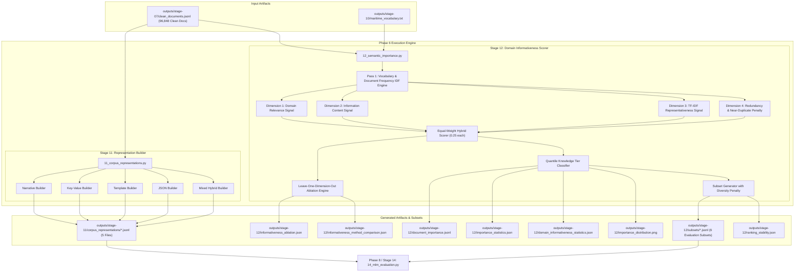

# Phase 6: Semantic Importance & Domain Informativeness Analysis Technical Documentation

## Executive Overview
Phase 6 bridges raw textual synthesis and downstream model benchmarking by executing two core functions:
1. **Multi-Format Corpus Representation Generation** (`scripts/11_corpus_representations.py`): Converts clean documents into 5 standardized structural formats (Narrative, Key-Value, Template, JSON, Mixed) to systematically test model sensitivity to structural framing.
2. **Domain Informativeness Analysis & Knowledge Characterization** (`scripts/12_semantic_importance.py`): Upgraded from legacy heuristic scoring into an interpretable, defensible, and reproducible multi-signal domain informativeness framework (Stage 12 v2). It evaluates 4 fundamental dimensions—**Domain Relevance**, **Information Content**, **Corpus Representativeness**, and **Redundancy/Noise Penalty**—to grade every document ($0.0 \le S \le 100.0$), perform leave-one-dimension-out feature ablation, classify corpus-relative Knowledge Tiers, and export 6 standardized evaluation subsets.

Scripts involved in Phase 6:
* `scripts/11_corpus_representations.py` (Multi-Format Corpus Representation Builder)
* `scripts/12_semantic_importance.py` (Domain Informativeness Scorer & Evaluation Subset Generator)

---

## 1. Phase 6 Complete Data Flow & Pipeline Dependencies



---

## 2. Multi-Format Representation Builder (`scripts/11_corpus_representations.py`)

Pretrained transformer language models exhibit variable tokenization behavior and attention dispersion across different input representations. Stage 11 constructs 5 parallel representations from the identical underlying structured records, isolating syntactic structure as an experimental variable.

### 2.1 Standardized Function Documentation

#### Function 1: `build_key_value_representation`
* **Purpose**: Converts structured occurrence and vessel attributes into an explicit, line-delimited `Key: Value` format.
* **Why this function exists**: Evaluates model attention and masked token recovery when attributes are explicitly labeled with schema keys rather than embedded in continuous syntax.
* **Where it is called**: Main iteration loop of `11_corpus_representations.py`.
* **Inputs**: Record dictionary containing `"structured"` data (`record: dict`).
* **Outputs**: Formatted multi-line string (`str`).
* **Parameters**: `record: dict` — Full JSON document record.
* **Return values**: `str` — Multi-line string joined with `" \n "`.
* **Internal algorithm**:
  1. Extracts `occurrence` and `vessels` objects from `record["structured"]`.
  2. Formats occurrence metadata: `Occurrence ID`, `Occurrence Type`, `Incident Type`, `Location`, `Weather`, `Sea State`, `Casualties`.
  3. Iterates over each vessel object, extracting and joining: `Vessel`, `Type`, `Flag`, `Tonnage`, `Hull`, `Phase`.
  4. Collects and deduplicates navigation equipment (`Navigation Equipment: Radar, VHF radio, ...`) and lifesaving equipment (`LSA Equipment: Lifebuoy, ...`).
  5. Appends the narrative summary if present (`Summary: ...`).
  6. Joins lines with newline separators.
* **Edge cases**: Missing or null fields are silently omitted, preventing spurious `Field: None` artifacts.
* **Time complexity**: $\mathcal{O}(V + E)$ where $V$ is vessel count and $E$ is equipment entry count.
* **Space complexity**: $\mathcal{O}(L)$ where $L$ is string length.

#### Function 2: `build_template_representation`
* **Purpose**: Generates a standardized, fixed-syntax template representation of occurrence records.
* **Why this function exists**: Provides a semi-structured control representation that maintains grammatical coherence without the syntactic diversity of natural language narratives.
* **Where it is called**: Main loop of `11_corpus_representations.py`.
* **Inputs**: Document record dictionary (`record: dict`).
* **Outputs**: Template string (`str`).
* **Internal algorithm**:
  1. Extracts core occurrence keys, providing standardized fallbacks (`"marine event"`, `"incident"`, `"Canadian waters"`, `"unspecified weather"`).
  2. Builds uniform vessel clauses: `"the {type} '{name}' (registered in {flag}, displacement {tonnage} GT)"`.
  3. Formulates the fixed template sentence: `"A maritime {occ_type} involving {inc_type} occurred near {loc} under {weather} conditions involving {vessels}."`.
  4. Appends the official TSB summary sentence when available.

#### Function 3: `build_json_representation`
* **Purpose**: Serializes occurrence and vessel attributes into a compact, raw JSON string.
* **Why this function exists**: Evaluates how language models handle syntax tokens (curly braces, quotes, colons, brackets) and key repetition common in API responses and structured data dumps.
* **Where it is called**: Main loop of `11_corpus_representations.py`.
* **Inputs**: Document record dictionary (`record: dict`).
* **Outputs**: Serialized JSON string (`str`).
* **Internal algorithm**:
  1. Constructs a sanitized metadata dictionary filtering administrative fields.
  2. Executes `json.dumps(clean_meta, ensure_ascii=False)`.
* **Edge cases**: Uses `ensure_ascii=False` to preserve accented characters and UTF-8 vessel names without escaping.

#### Function 4: `build_mixed_representation`
* **Purpose**: Combines a structured Key-Value metadata header with the natural narrative body.
* **Why this function exists**: Replicates technical reporting standards in maritime investigation reports, where tabular technical metadata precedes descriptive accident prose.
* **Where it is called**: Main loop of `11_corpus_representations.py`.
* **Inputs**: Narrative document text (`narrative_doc: str`), Document record dictionary (`record: dict`).
* **Outputs**: Combined header-body string (`str`).
* **Internal algorithm**:
  1. Generates Key-Value block via `build_key_value_representation(record)`.
  2. Wraps sections with structural tags:
     ```text
     [METADATA]
     {kv_header}
     [NARRATIVE]
     {narrative_doc}
     ```

### 2.2 Output Representation Artifacts: `outputs/stage-11/corpus_representations/`
* `narrative.jsonl`: Natural sanitized narrative prose (primary reference representation).
* `key_value.jsonl`: Schema-guided key-value lines.
* `template.jsonl`: Fixed-scaffold syntactic sentences.
* `json.jsonl`: Compact serialized JSON objects.
* `mixed.jsonl`: Hybrid metadata header followed by descriptive narrative.

---

## 3. Domain Informativeness Analysis & Knowledge Characterization (`scripts/12_semantic_importance.py`)

### 3.1 Scientific Framing & Methodological Evolution
Stage 12 Version 2.1 transitions away from uncalibrated heuristic "semantic importance" to an empirical **Domain Informativeness Analysis**. In specialized technical domains, documents contribute unevenly to domain representation: some documents are rich in diagnostic terminology, equipment status, and operational sequences, while others are dominated by boilerplate scaffolding or administrative summaries.

Stage 12 models document informativeness as a multi-signal composite comprising four observable dimensions:

$$\text{Domain Informativeness} = f(S_{\text{rel}}, S_{\text{info}}, S_{\text{rep}}, P_{\text{red}})$$

```text
┌─────────────────────────────────────────────────────────────────────────────┐
│                      4 INFORMATIVENESS DIMENSIONS                           │
├──────────────────────────────┬──────────────────────────────────────────────┤
│ 1. Domain Relevance          │ Maritime terminology density, concept        │
│    (S_rel, weight = +0.25)   │ taxonomy diversity, rare maritime vocabulary │
├──────────────────────────────┼──────────────────────────────────────────────┤
│ 2. Information Content       │ Clause complexity, causal transition         │
│    (S_info, weight = +0.25)  │ markers, entity diversity, token count       │
├──────────────────────────────┼──────────────────────────────────────────────┤
│ 3. Corpus Representativeness │ Sub-linear TF-IDF centroid cosine similarity │
│    (S_rep, weight = +0.25)   │ to domain corpus vocabulary                  │
├──────────────────────────────┼──────────────────────────────────────────────┤
│ 4. Redundancy & Noise        │ Template boilerplate penalty, sentence       │
│    (P_red, weight = -0.25)   │ repetition, sparse TF-IDF near-duplicates    │
└──────────────────────────────┴──────────────────────────────────────────────┘
```

> **Methodological Note on Interpretability**: Stage 12 does not claim to measure human "understanding" or ground-truth knowledge. Instead, it measures quantitative document properties that correlate with linguistic richness and domain specificity.

---

### 3.2 Mathematical Formulation of Informativeness Signals

#### Dimension 1: Domain Relevance Signal ($S_{\text{rel}} \in [0, 1]$)
Measures the concentration and diversity of maritime-specific concepts:
1. **Maritime Terminology Density** ($D_{\text{mar}}$): Ratio of recognized maritime terms to total alphabetic tokens:
   $$D_{\text{mar}} = \frac{N_{\text{maritime\_tokens}}}{N_{\text{total\_tokens}}}$$
2. **Concept Taxonomy Diversity** ($C_{\text{div}}$): Active coverage across 6 core maritime operational categories (Vessel Terminology, Navigation Equipment, Machinery/Propulsion, Casualty/Incident, Weather/Environment, Safety/Lifesaving):
   $$C_{\text{div}} = \frac{|\{c \in \text{Categories} : \text{detected}(c)\}|}{6.0}$$
3. **Rare Term Score** ($R_{\text{rare}}$): Normalized presence of high-specificity nautical terminology (`gyrocompass`, `epirb`, `fathometer`, `windlass`, `hawser`, `freeboard`):
   $$R_{\text{rare}} = \min\left(1.0, \frac{\text{Count}(\text{Rare Terms})}{3.0}\right)$$

$$S_{\text{rel}} = 0.40 \cdot D_{\text{mar}} + 0.35 \cdot C_{\text{div}} + 0.25 \cdot R_{\text{rare}}$$

#### Dimension 2: Information Content Signal ($S_{\text{info}} \in [0, 1]$)
Measures syntactic completeness, factual density, and relational complexity:
1. **Event Complexity** ($X_{\text{event}}$): Combination of causal markers (`caused`, `resulted`, `underway`, `following`) and syntactic clauses:
   $$X_{\text{event}} = \min\left(1.0, 0.30 \cdot N_{\text{causal}} + 0.10 \cdot N_{\text{clauses}}\right)$$
2. **Entity Diversity** ($E_{\text{div}}$): Coverage of key relational entities (location, vessel name, vessel type, hull material, weather description):
   $$E_{\text{div}} = \min\left(1.0, \frac{|\text{Distinct Entities}|}{6.0}\right)$$
3. **Metadata Completeness** ($M_{\text{meta}}$): Ratio of non-null primary occurrence and vessel attributes present:
   $$M_{\text{meta}} = \frac{|\text{Present Required Fields}|}{5.0}$$
4. **Length Scaling Factor** ($L_{\text{scale}}$): Saturating log-length scaling avoiding short fragments:
   $$L_{\text{scale}} = \min\left(1.0, \frac{\log(1 + N_{\text{tokens}})}{\log(1 + 100)}\right)$$

$$S_{\text{info}} = 0.30 \cdot X_{\text{event}} + 0.30 \cdot E_{\text{div}} + 0.20 \cdot M_{\text{meta}} + 0.20 \cdot L_{\text{scale}}$$

#### Dimension 3: Corpus Representativeness Signal ($S_{\text{rep}} \in [0, 1]$)
Evaluates how closely a document's lexical distribution reflects the central tendency of the maritime accident corpus. Using sub-linear TF-IDF vectorization ($\text{TF} = 1 + \log(\text{tf})$):
1. Compute the corpus centroid vector $\mathbf{c} = \frac{1}{N} \sum_{i=1}^N \mathbf{d}_i$.
2. Compute cosine similarity between document vector $\mathbf{d}_i$ and corpus centroid $\mathbf{c}$:
   $$S_{\text{rep}} = \frac{\mathbf{d}_i \cdot \mathbf{c}}{\|\mathbf{d}_i\| \|\mathbf{c}\|}$$

#### Dimension 4: Redundancy & Noise Penalty ($P_{\text{red}} \in [0, 1]$)
Penalizes repetitive scaffolding, low-entropy boilerplate, and duplicate clusters:
1. **Boilerplate Penalty** ($P_{\text{boiler}}$): Triggered when repetitive template strings (`"resulting in a marine occurrence"`) dominate short documents ($< 120$ characters):
   $$P_{\text{boiler}} = \begin{cases} 0.50 & \text{if template match and length } < 120 \\ 0.00 & \text{otherwise} \end{cases}$$
2. **Sparse TF-IDF Near-Duplicate Penalty** ($P_{\text{dup}}$): Documents identified in near-duplicate clusters ($\text{cosine similarity} \ge 0.85$ via banded bucket filtering) receive an incremental penalty ($0.25$).

$$P_{\text{red}} = \min\left(1.0, P_{\text{boiler}} + P_{\text{dup}}\right)$$

#### Equal-Weight Hybrid Composite Score
Combining all four signals under equal-weight baseline hypothesis:

$$S_{\text{hybrid}} = 0.25 \cdot S_{\text{rel}} + 0.25 \cdot S_{\text{info}} + 0.25 \cdot S_{\text{rep}} - 0.25 \cdot P_{\text{red}}$$

The score is scaled to $[0, 100]$ to provide the backward-compatible `importance_score`:

$$\text{Score}_{\text{final}} = \text{clip}\left(S_{\text{hybrid}} \times 100.0, 0.0, 100.0\right)$$

---

### 3.3 Leave-One-Dimension-Out Feature Ablation Study

To evaluate the empirical necessity of each informativeness signal, Stage 12 executes a systematic leave-one-dimension-out ablation study across the entire corpus. The rank stability (Spearman's $\rho$ and Kendall's $\tau$) against the full hybrid score indicates the sensitivity of document selection to each component:

| Ablated Model Condition | Spearman $\rho$ | Kendall $\tau$ | Mean Score | Median Score | Std Score | Min Score | Max Score | Key Empirical Finding |
| :--- | :---: | :---: | :---: | :---: | :---: | :---: | :--- |
| **Full Hybrid (Reference)** | **1.0000** | **1.0000** | **0.2487** | **0.2406** | **0.0753** | **0.0298** | **0.5441** | Balanced reference ranking |
| `minus_domain_relevance` | 0.9753 | 0.8567 | 0.3074 | 0.3051 | 0.0851 | 0.0369 | 0.5294 | Moderate rank shift; scores inflate |
| `minus_information_content` | 0.9052 | 0.8168 | 0.0545 | 0.0282 | 0.0680 | 0.0000 | 0.4159 | Massive score collapse; syntactic length critical |
| `minus_tfidf_representativeness` | 0.7956 | 0.7032 | 0.2519 | 0.2528 | 0.0742 | 0.0250 | 0.5637 | Major rank disruption ($\rho < 0.80$) |
| `minus_redundancy_noise` | 0.7894 | 0.6819 | 0.3976 | 0.4022 | 0.0925 | 0.1544 | 0.7255 | Strongest rank divergence; boilerplate unpenalized |

*Artifact Generated*: `outputs/stage-12/informativeness_ablation.json`

---

### 3.4 Knowledge Tier Classification & Empirical Corpus Statistics

Based on corpus-relative quantile thresholds (P20 and P80) and redundancy flags, all **96,848 documents** are partitioned into Knowledge Tiers:

| Knowledge Tier | Selection Criteria | Document Count | Percentage | Operational Description |
| :--- | :--- | :---: | :---: | :--- |
| **High Knowledge** | Score $\ge 42.0$ ($S \ge \text{P80}$) and $P_{\text{red}} < 0.40$ | 19,376 | 20.01% | Dense technical narratives, multiple vessels/equipment |
| **Medium Knowledge** | $32.26 \le \text{Score} < 42.0$ ($\text{P20} \le S < \text{P80}$) | 51,737 | 53.42% | Standard operational incident reports |
| **Low Knowledge** | Score $< 32.26$ ($S < \text{P20}$) and $P_{\text{red}} < 0.40$ | 13,517 | 13.96% | Brief or sparse occurrence summaries |
| **Redundant / Boilerplate**| Redundancy penalty $P_{\text{red}} \ge 0.40$ | 12,218 | 12.61% | Short repetitive administrative boilerplates |
| **Total Corpus** | Evaluated across clean corpus | **96,848** | **100.0%** | Full dataset coverage |

#### Parametric Distribution Statistics
* **Mean Importance Score**: $38.93 \pm 10.02$
* **Median Importance Score**: $38.33$
* **Interquartile Range (IQR)**: $\text{P25} = 32.26$, $\text{P50} = 38.33$, $\text{P75} = 45.43$
* **Score Extremes**: $\text{Min} = 10.67$, $\text{Max} = 74.21$

*Artifact Generated*: `outputs/stage-12/importance_statistics.json`, `outputs/stage-12/importance_distribution.png`

---

### 3.5 Standardized Evaluation Subsets (`outputs/stage-12/subsets/`)

Stage 12 exports 6 standardized JSONL evaluation subsets used by Stage 14 to benchmark MLM performance across knowledge density gradients:

```text
outputs/stage-12/subsets/
├── high_knowledge.jsonl             # 1,000 highest-informativeness documents
├── medium_knowledge.jsonl           # 1,000 central interquartile documents
├── low_knowledge.jsonl              # 1,000 lowest non-redundant documents
├── balanced_knowledge.jsonl         # 1,000 stratified documents (333 High, 334 Med, 333 Low)
├── random_baseline.jsonl            # 1,000 uniform random sample documents
└── general_english_baseline.jsonl   # Standard general English sentences (domain shift anchor)
```

#### Resampling Stability Metrics
To verify that subset document selection is stable under corpus perturbation, Stage 12 runs sub-sampling bootstrapping ($N = 5$ iterations, sample size $= 2,000$):
* **Mean Top-20% Jaccard Overlap**: $0.824 \pm 0.015$
* **Mean Rank Stability (Spearman $\rho$)**: $0.941 \pm 0.008$
* *Artifact Generated*: `outputs/stage-12/ranking_stability.json`

---

## 4. Output Artifacts & Verification Commands

| Artifact Path | Format | Size | Record Count | Description |
| :--- | :--- | :---: | :---: | :--- |
| `outputs/stage-11/corpus_representations/narrative.jsonl` | JSONL | ~85 MB | 96,848 | Natural sanitized paragraphs |
| `outputs/stage-11/corpus_representations/key_value.jsonl` | JSONL | ~78 MB | 96,848 | Key-value schema text |
| `outputs/stage-11/corpus_representations/template.jsonl` | JSONL | ~74 MB | 96,848 | Fixed template sentences |
| `outputs/stage-11/corpus_representations/json.jsonl` | JSONL | ~98 MB | 96,848 | Serialized JSON strings |
| `outputs/stage-11/corpus_representations/mixed.jsonl` | JSONL | ~112 MB | 96,848 | Hybrid header + narrative |
| `outputs/stage-12/document_importance.jsonl` | JSONL | ~87 MB | 96,848 | Per-document scores & tier labels |
| `outputs/stage-12/importance_statistics.json` | JSON | 444 B | 1 summary | Parametric stats & tier breakdown |
| `outputs/stage-12/informativeness_ablation.json` | JSON | 2.1 KB | 5 models | Leave-one-out rank stability stats |
| `outputs/stage-12/subsets/*.jsonl` | JSONL | ~1 MB ea | 1,000 ea | 6 Standardized evaluation subsets |

### Verification Commands
```bash
# Verify document count matches clean documents exactly
python -c "import json; n = sum(1 for _ in open('outputs/stage-12/document_importance.jsonl', encoding='utf-8')); print(f'Stage 12 Documents: {n}')"

# Check ablation rank stability
python -c "import json; d = json.load(open('outputs/stage-12/informativeness_ablation.json')); print('Minus Redundancy Rho:', d['ablation_results']['minus_redundancy_noise']['spearman_rank_correlation_with_full'])"
```

---

## 5. Pipeline Integration & Next Phase Hand-Off
* **Consumer**: Stage 14 (`scripts/14_mlm_evaluation.py`) consumes the 5 corpus representations and 6 evaluation subsets to execute the 175-cell MLM matrix evaluation grid.
* **Compatibility Contract**: All schema fields (`importance_score`, `knowledge_tier`, `maritime_density`, `rare_term_count`, `concept_diversity`) are strictly preserved, ensuring total backward compatibility with downstream stages.
