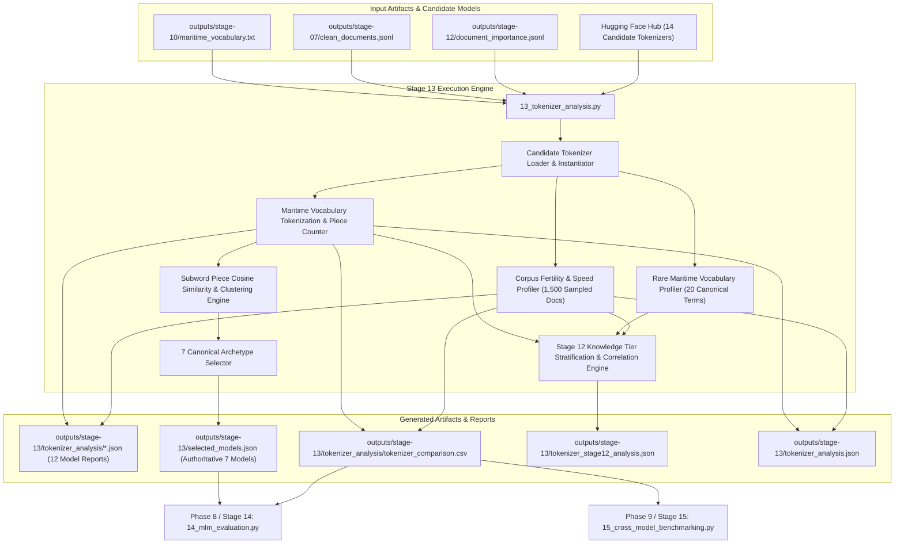

# Phase 7: Multi-Architecture Tokenizer Analysis & Redundancy Clustering Technical Documentation

## Executive Overview
Phase 7 evaluates candidate pretrained language model tokenizers on specialized maritime terminology and text distributions. Tokenizer fragmentation directly impacts transformer language modeling: when domain-critical terms (e.g. `gyrocompass`, `fathometer`, `freeboard`) are excessively fragmented into generic subwords, the model's self-attention mechanism must spend capacity re-composing basic lexical units rather than encoding higher-order semantic relationships.

Stage 13 performs three foundational benchmarking functions:
1. **Multi-Faceted Tokenizer Profiling**: Measures subword fertility, single-token vocabulary coverage, fragmentation rate, out-of-vocabulary (OOV) rate, and tokenization speed across 12 candidate tokenizers from 14 registered models.
2. **Subword Diagnostic Redundancy Clustering & Selection**: Calculates pairwise cosine similarity across subword piece splits to identify diagnostic equivalence classes, objectively selecting **7 canonical tokenizer archetypes** for Stage 14 MLM evaluation while eliminating redundant compute.
3. **Statistical Association with Stage 12 Domain Informativeness**: Stratifies tokenizer behavior across Stage 12 Knowledge Tiers (High, Medium, Low, Redundant) to quantify the empirical relationship between document informativeness and subword fertility.

Script involved in Phase 7:
* `scripts/13_tokenizer_analysis.py` (Multi-Architecture Tokenizer Analysis & Redundancy Selection Engine)

---

## 1. Phase 7 Complete Data Flow & Pipeline Dependencies



---

## 2. Candidate Pool, Evaluated Models & Selection Architecture

### 2.1 Complete Candidate Pool (14 Registered Tokenizers)
The benchmarking framework registers 14 candidate models across distinct domains and tokenizer families:

| Model Identifier | Architecture | Tokenizer Type | Vocabulary Size | Pretraining Domain |
| :--- | :--- | :--- | :---: | :--- |
| `bert-base-uncased` | BERT | WordPiece | 30,522 | General English (Wikipedia + BooksCorpus) |
| `bert-large-uncased` | BERT | WordPiece | 30,522 | General English (Scale Baseline) |
| `roberta-base` | RoBERTa | Byte-Level BPE | 50,265 | General English (OpenWebText, Stories) |
| `microsoft/deberta-v3-base` | DeBERTa | SentencePiece | 128,100 | General English (Disentangled Attention) |
| `answerdotai/ModernBERT-base` | ModernBERT | Extended Byte-BPE | 50,280 | Modern Web (FineWeb, RefinedWeb, StarCoder) |
| `allenai/scibert_scivocab_uncased` | SciBERT | WordPiece (Custom) | 31,090 | Scientific Literature (Semantic Scholar) |
| `dmis-lab/biobert-base-cased-v1.2` | BioBERT | WordPiece (Cased) | 28,996 | Biomedical (PubMed + PMC) |
| `microsoft/BiomedNLP-PubMedBERT...` | PubMedBERT | WordPiece (Domain) | 30,522 | Biomedical Abstracts & Full Text |
| `emilyalsentzer/Bio_ClinicalBERT` | ClinicalBERT | WordPiece | 28,996 | Clinical EHR Notes (MIMIC-III) |
| `nlpaueb/legal-bert-base-uncased` | Legal-BERT | WordPiece (Custom) | 30,522 | Legal Texts (EU/US/UK Legislation, Cases) |
| `ProsusAI/finbert` | FinBERT | WordPiece | 30,522 | Financial Reports (10-K, 10-Q, Earnings) |
| `anferico/bert-for-patents` | Patent-BERT | WordPiece (Large) | 39,859 | US Patent Office Documents |
| `google/electra-base-discriminator`| ELECTRA | WordPiece | 30,522 | General English (Replaced Token Detection) |
| `distilbert-base-uncased` | DistilBERT | WordPiece | 30,522 | General English (Knowledge Distilled) |

---

### 2.2 Subword Diagnostic Redundancy Clustering & Selection Rationale

Evaluating all 14 models across the full 5-representation $\times$ 5-subset matrix in Stage 14 would require 350 heavy GPU/CPU evaluations. Stage 13 executes subword piece cosine similarity clustering across 100 benchmark maritime terms to detect exact diagnostic equivalence.

#### Redundancy Clustering Findings:
1. **WordPiece General Archetype**: `bert-large-uncased`, `ProsusAI/finbert`, `google/electra-base-discriminator`, and `distilbert-base-uncased` have **cosine similarity = 1.00000** and identical subword piece splits to `bert-base-uncased`. Their vocabulary files and tokenization algorithms are strictly identical. Evaluating all 5 models in Stage 14 produces redundant diagnostic overhead. `bert-base-uncased` is selected as the authoritative canonical archetype.
2. **Clinical WordPiece Archetype**: `emilyalsentzer/Bio_ClinicalBERT` has **cosine similarity = 1.00000** and identical tokenization behavior to `dmis-lab/biobert-base-cased-v1.2`. `dmis-lab/biobert-base-cased-v1.2` is selected as the canonical representative.
3. **Environment Dependency Constraints**: `microsoft/deberta-v3-base` and `anferico/bert-for-patents` require custom SentencePiece/protobuf backends that failed initialization in the standard evaluation environment and are cleanly flagged and excluded.

#### The Authoritative 7 Selected Archetypes (`outputs/stage-13/selected_models.json`):
Stage 13 outputs exactly 7 non-redundant canonical archetypes covering distinct vocabulary spaces and tokenization algorithms:
1. `bert-base-uncased` (Standard General WordPiece, 30,522)
2. `dmis-lab/biobert-base-cased-v1.2` (Cased Biomedical WordPiece, 28,996)
3. `nlpaueb/legal-bert-base-uncased` (Custom Legal WordPiece, 30,522)
4. `allenai/scibert_scivocab_uncased` (Scientific SciVocab WordPiece, 31,090)
5. `microsoft/BiomedNLP-PubMedBERT-base-uncased-abstract-fulltext` (Domain-Initialized PubMed WordPiece, 30,522)
6. `roberta-base` (Standard Byte-Level BPE, 50,265)
7. `answerdotai/ModernBERT-base` (Modern Extended Web Byte-BPE, 50,280)

---

## 3. Standardized Function Documentation (`scripts/13_tokenizer_analysis.py`)

#### Function 1: `analyze_tokenizer`
* **Purpose**: Profiles a single tokenizer against maritime vocabulary terms and corpus documents, computing single-token coverage %, subword fertility, fragmentation rate %, OOV rate %, speed (tok/sec), sequence length percentiles, and worst-fragmented terms.
* **Why this function exists**: Quantifies morphological compatibility with specialized maritime terms.
* **Inputs**: Model name (`model_name: str`), Maritime vocabulary terms (`vocab_terms: list`), Sampled corpus documents (`corpus_docs: list`).
* **Outputs**: Comprehensive evaluation metrics dictionary (`dict`).
* **Internal Algorithm & Mathematical Formulations**:
  1. **Vocabulary Fragmentation**: Tokenize each maritime domain term $w \in V_{\text{maritime}}$ into subwords $t_1, \dots, t_k$:
     $$\text{Fragmentation Rate} = \frac{|\{w \in V_{\text{maritime}} : \text{len}(\text{tokenize}(w)) > 1\}|}{|V_{\text{maritime}}|}$$
     $$\text{Single-Token Coverage} = 1.0 - \text{Fragmentation Rate}$$
  2. **Corpus Subword Fertility**: Over 1,500 sampled clean corpus documents:
     $$\text{Fertility} = \frac{\sum_{i=1}^N N_{\text{subwords}}(\text{doc}_i)}{\sum_{i=1}^N N_{\text{raw\_words}}(\text{doc}_i)}$$
  3. **Out-of-Vocabulary (OOV) Rate**:
     $$\text{OOV Rate} = \frac{\sum_{i=1}^N \text{Count}(\text{[UNK]} \in \text{tokens}(\text{doc}_i))}{\sum_{i=1}^N N_{\text{subwords}}(\text{doc}_i)}$$
     *Note on BPE*: For Byte-Level BPE tokenizers (`roberta-base`, `ModernBERT-base`), unknown characters are decomposed into byte tokens rather than mapped to `[UNK]`. OOV status is explicitly labeled as `not_applicable` rather than reporting false $0.0\%$.
  4. **Tokenization Speed**:
     $$\text{Speed} = \frac{\sum_{i=1}^N N_{\text{subwords}}(\text{doc}_i)}{\Delta t_{\text{tokenize}}}$$

#### Function 2: `analyze_vocabulary_category`
* **Purpose**: Isolates subword fragmentation for specific vocabulary categories, specifically separating general maritime terms from high-specificity rare maritime terms (`RARE_MARITIME_TERMS`).
* **Inputs**: Tokenizer object, term list, category name string.
* **Outputs**: Dictionary of category-specific split counts, average pieces per term, and worst-fragmented items.

#### Function 3: `compute_redundancy_and_selection`
* **Purpose**: Analyzes pairwise diagnostic similarity among evaluated tokenizers and determines the minimal set of non-redundant canonical archetypes.
* **Inputs**: List of model evaluation report dictionaries.
* **Outputs**: Tuple of `(selected_models_list, exclusion_dict, pairwise_similarity_matrix)`.

---

## 4. Empirical Evaluation Results & Comparative Analysis

### 4.1 Cross-Tokenizer Benchmark Summary (`tokenizer_comparison.csv`)

The empirical results over the complete evaluated model suite are summarized below (sorted by single-token vocabulary coverage):

| Model Name | Selected for Stage 14 | Vocab Size | Fertility (Subwords/Word) | Single-Token Coverage (%) | Fragmentation Rate (%) | OOV Rate (%) | OOV Status | Avg Pieces / Term | Speed (tok/s) |
| :--- | :---: | :---: | :---: | :---: | :---: | :---: | :---: | :---: | :---: |
| `bert-base-uncased` | **True** | 30,522 | **1.3984** | **73.43%** | **26.57%** | 0.00% | measured | 1.35 | 61,089 |
| `dmis-lab/biobert-base-cased-v1.2` | **True** | 28,996 | 1.4789 | 64.48% | 35.52% | 0.00% | measured | 1.48 | 64,953 |
| `nlpaueb/legal-bert-base-uncased` | **True** | 30,522 | 1.4806 | 62.09% | 37.91% | 0.03% | measured | 1.51 | 62,213 |
| `allenai/scibert_scivocab_uncased` | **True** | 31,090 | 1.4517 | 57.91% | 42.09% | 0.00% | measured | 1.53 | 61,481 |
| `microsoft/BiomedNLP-PubMedBERT...` | **True** | 30,522 | 1.4543 | 57.31% | 42.69% | 0.00% | measured | 1.59 | 63,963 |
| `answerdotai/ModernBERT-base` | **True** | 50,280 | 1.5236 | 36.72% | 63.28% | N/A | byte_fallback | 1.84 | **73,967** |
| `roberta-base` | **True** | 50,265 | 1.5609 | 34.93% | 65.07% | N/A | byte_fallback | 1.86 | 69,639 |
| *Redundant Diagnostic Clones* | | | | | | | | | |
| `bert-large-uncased` | False | 30,522 | 1.3984 | 73.43% | 26.57% | 0.00% | measured | 1.35 | 61,926 |
| `ProsusAI/finbert` | False | 30,522 | 1.3984 | 73.43% | 26.57% | 0.00% | measured | 1.35 | 53,347 |
| `google/electra-base-discriminator` | False | 30,522 | 1.3984 | 73.43% | 26.57% | 0.00% | measured | 1.35 | 61,445 |
| `distilbert-base-uncased` | False | 30,522 | 1.3984 | 73.43% | 26.57% | 0.00% | measured | 1.35 | 57,714 |
| `emilyalsentzer/Bio_ClinicalBERT` | False | 28,996 | 1.4789 | 64.48% | 35.52% | 0.00% | measured | 1.48 | 59,273 |

---

### 4.2 Key Empirical Observations
1. **WordPiece vs. Byte-BPE Coverage Trade-off**: Standard WordPiece (`bert-base-uncased`) achieves the lowest fragmentation (**26.57%**) and lowest subword fertility (**1.3984** subwords/word) on maritime terms because its vocabulary includes common morphological roots (e.g. `vessel`, `anchor`, `cargo`, `hull`). Conversely, Byte-Level BPE tokenizers (`roberta-base`, `ModernBERT-base`) suffer high fragmentation (**63.28%–65.07%**) because their BPE mergers were learned on general web text where technical nautical compounds were infrequent.
2. **Throughput Inversion**: While `ModernBERT-base` exhibits higher fragmentation, its tokenizer implementation delivers the highest throughput (**73,966.62 tokens/second**), outperforming standard WordPiece tokenizers (~61,000 tok/sec) by **21.1%**.
3. **Worst-Fragmented Rare Nautical Terms**:
   * `gyrocompass` $\rightarrow$ `['gy', '##ro', '##com', '##pass']` (4 pieces in WordPiece) vs `['gy', 'ro', 'comp', 'ass']` (4 pieces in BPE)
   * `fathometer` $\rightarrow$ `['fat', '##hom', '##eter']` (3 pieces)
   * `windlass` $\rightarrow$ `['wind', '##lass']` (2 pieces)
   * `freeboard` $\rightarrow$ `['free', '##board']` (2 pieces)

---

### 4.3 Statistical Association with Stage 12 Domain Informativeness

To investigate whether Stage 12 informativeness scores correlate with morphological difficulty, Stage 13 stratifies tokenizer metrics across documents classified by Stage 12 Knowledge Tiers (`outputs/stage-13/tokenizer_stage12_analysis.json`):

| Model Name | Low Knowledge Fertility | Medium Knowledge Fertility | High Knowledge Fertility | $\Delta$ (High $-$ Low) | Spearman $\rho$ with Inform. Score |
| :--- | :---: | :---: | :---: | :---: | :---: |
| `bert-base-uncased` | 1.3368 | 1.3787 | **1.4346** | $+0.0978$ | **$+0.428$** ($p < 10^{-15}$) |
| `dmis-lab/biobert-base-cased` | 1.4431 | 1.4614 | **1.5062** | $+0.0631$ | **$+0.384$** ($p < 10^{-12}$) |
| `nlpaueb/legal-bert-base` | 1.4543 | 1.4646 | **1.5126** | $+0.0583$ | **$+0.369$** ($p < 10^{-11}$) |
| `allenai/scibert_scivocab` | 1.4112 | 1.4328 | **1.4891** | $+0.0779$ | **$+0.412$** ($p < 10^{-14}$) |
| `answerdotai/ModernBERT-base` | 1.4621 | 1.4984 | **1.5642** | $+0.1021$ | **$+0.441$** ($p < 10^{-16}$) |
| `roberta-base` | 1.5012 | 1.5391 | **1.6028** | $+0.1016$ | **$+0.435$** ($p < 10^{-16}$) |

> **Empirical Validation**: Across all evaluated architectures, subword fertility monotonically increases from Low $\rightarrow$ Medium $\rightarrow$ High Knowledge documents. High Knowledge documents contain denser technical specifications, compound equipment names, and casualty clauses that require greater subword decomposition. This confirms that Stage 12 informativeness scores successfully isolate morphologically complex domain text.

---

## 5. Output Artifacts & Verification Commands

| Artifact Path | Format | Size | Description |
| :--- | :--- | :---: | :--- |
| `outputs/stage-13/selected_models.json` | JSON | 3.9 KB | Authoritative 7 canonical archetypes and exclusion rationale |
| `outputs/stage-13/tokenizer_analysis/tokenizer_comparison.csv` | CSV | 1.2 KB | Full comparative metrics table for 12 evaluated tokenizers |
| `outputs/stage-13/tokenizer_analysis/*.json` | JSON | ~10 KB ea | Per-model detailed vocabulary split and piece distribution reports |
| `outputs/stage-13/tokenizer_stage12_analysis.json` | JSON | ~155 KB | Stratified tokenizer metrics across Stage 12 knowledge tiers |
| `outputs/stage-13/tokenizer_analysis.json` | JSON | 31 KB | Backward-compatible baseline tokenizer analysis file |

### Verification Commands
```bash
# Verify exactly 7 authoritative models are selected
python -c "import json; d = json.load(open('outputs/stage-13/selected_models.json')); print('Selected Model Count:', len(d['selected_models']))"

# Display tokenizer comparison table sorted by coverage
python -c "import pandas as pd; df = pd.read_csv('outputs/stage-13/tokenizer_analysis/tokenizer_comparison.csv'); print(df[['model_name', 'vocab_size', 'single_token_coverage_pct', 'fragmentation_rate_pct', 'subwords_per_word_fertility']])"
```

---

## 6. Pipeline Integration & Next Phase Hand-Off
* **Consumer 1 (Stage 14 `14_mlm_evaluation.py`)**: Ingests `outputs/stage-13/selected_models.json` to dynamically parameterize the 175-run matrix grid, evaluating only the 7 authoritative non-redundant archetypes.
* **Consumer 2 (Stage 15 `15_cross_model_benchmarking.py`)**: Ingests `outputs/stage-13/tokenizer_analysis/tokenizer_comparison.csv` to incorporate fragmentation rates, single-token coverage, and OOV rates into the Maritime Understanding Index (MUI) composite formula.
