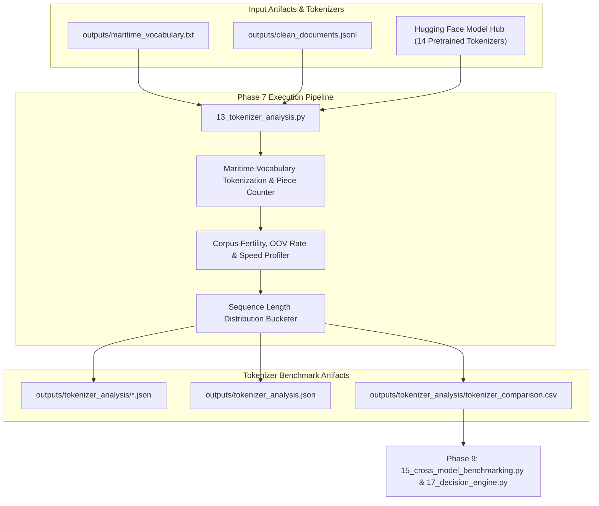

# Phase 7: Tokenizer Analysis Technical Documentation

## Executive Overview
Phase 7 profiles and benchmarks 14 pretrained Hugging Face tokenizers across single-token vocabulary coverage, subword fertility (subwords/word), maritime subword fragmentation rate %, out-of-vocabulary (OOV/[UNK]) rate %, tokenization throughput speed (tokens/sec), sequence length distributions, and worst-fragmented domain terms.

Script involved in Phase 7:
1. `scripts/13_tokenizer_analysis.py` (14-Tokenizer Benchmark Engine)

---

## 1. Phase 7 Complete Data Flow & Pipeline Dependencies



---

## 2. 14 Pretrained Tokenizer Evaluation Registry

The pipeline evaluates 14 distinct pretrained Hugging Face tokenizers representing general, domain-specific, science, legal, financial, medical, and extended BPE architectures:

| Model Identifier | Tokenizer Type | Vocabulary Size | Target Domain / Architecture |
| :--- | :--- | :--- | :--- |
| `bert-base-uncased` | WordPiece | 30,522 | General English (Baseline) |
| `bert-large-uncased` | WordPiece | 30,522 | General English (Large Encoder) |
| `roberta-base` | Byte-Level BPE | 50,265 | General English (Byte-BPE) |
| `microsoft/deberta-v3-base` | DeBERTa WordPiece | 128,100 | Disentangled Attention |
| `answerdotai/ModernBERT-base` | Modern Extended BPE | 50,280 | Modern Architecture |
| `allenai/scibert_scivocab_uncased` | SciVocab WordPiece | 31,090 | Scientific Literature |
| `dmis-lab/biobert-base-cased-v1.2` | Bio WordPiece | 28,996 | Biomedical |
| `microsoft/BiomedNLP-PubMedBERT-base-uncased-abstract-fulltext` | PubMed WordPiece | 30,522 | Biomedical Abstracts & Text |
| `emilyalsentzer/Bio_ClinicalBERT` | Clinical WordPiece | 28,996 | Clinical EHR Notes |
| `nlpaueb/legal-bert-base-uncased` | Legal WordPiece | 30,522 | Legal Contracts & Legislation |
| `ProsusAI/finbert` | Financial WordPiece | 30,522 | Financial Reports |
| `anferico/bert-for-patents` | Patent WordPiece | 39,859 | Technical Patent Documents |
| `google/electra-base-discriminator` | Electra WordPiece | 30,522 | Discriminative Pretraining |
| `distilbert-base-uncased` | Distil WordPiece | 30,522 | Light Compressed Encoder |

---

## 3. 14-Tokenizer Benchmark Engine (`scripts/13_tokenizer_analysis.py`)

### 3.1 Standardized Function Documentation

#### Function 1: `clean_model_filename`
- **Purpose**: Replaces forward slashes `/` and hyphens `-` in Hugging Face model identifiers with underscores `_` to generate valid filesystem filenames.
- **Why this function exists**: Hugging Face model names like `"microsoft/deberta-v3-base"` contain illegal filename characters on Windows and Linux systems.
- **Where it is called**: Main loop of `13_tokenizer_analysis.py`.
- **Inputs**: Model identifier string (`model_name`).
- **Outputs**: Sanitized filename string (`str`).
- **Parameters**: `model_name: str`.
- **Return values**: `str` (e.g., `"microsoft_deberta_v3_base"`).
- **Step-by-step execution**:
  ```python
  return model_name.replace("/", "_").replace("-", "_")
  ```
- **Edge cases**: None.
- **Exception handling**: None required.
- **Logging behavior**: Silent.
- **Time complexity**: $O(L)$ where $L$ is model name length.
- **Space complexity**: $O(L)$.
- **Dependencies**: None.
- **Example execution**: `fn = clean_model_filename("allenai/scibert_scivocab_uncased")`
- **Common failure cases**: None.

---

#### Function 2: `analyze_tokenizer`
- **Purpose**: Profiles a single Hugging Face tokenizer against maritime vocabulary terms and corpus documents, computing fertility, fragmentation, OOV rate, speed, and length distribution.
- **Why this function exists**: Subword over-segmentation (high fragmentation) corrupts domain semantic representations in transformer models. Profiling quantifies subword quality.
- **Where it is called**: Main loop of `13_tokenizer_analysis.py`.
- **Inputs**: Model name (`model_name`), Maritime vocabulary terms (`vocab_terms`), Sampled corpus documents (`corpus_docs`).
- **Outputs**: Comprehensive evaluation metrics dictionary (`dict`).
- **Parameters**: `model_name: str`, `vocab_terms: list`, `corpus_docs: list`.
- **Return values**: `dict`.
- **Internal Algorithm & Mathematical Formulations**:
  1. Load tokenizer via `AutoTokenizer.from_pretrained(model_name)`.
  2. **Maritime Vocabulary Analysis**: Tokenize each vocabulary term into subword pieces.
     - Record piece counts array $P = [p_1, p_2, \dots, p_T]$.
     - Count single-token terms ($p_i = 1$).
     - **Single-Token Coverage** ($C_{\text{single}}$):
       $$C_{\text{single}} = \frac{N_{\text{single}}}{T}$$
     - **Maritime Fragmentation Rate** ($F_{\text{frag}}$):
       $$F_{\text{frag}} = \frac{T - N_{\text{single}}}{T} = 1.0 - C_{\text{single}}$$
     - Compute mean, median, P95, and max pieces per term.
     - Sort worst fragmented terms ($p_i$ descending).
  3. **Corpus Subword Fertility & OOV Rate**:
     - Tokenize sampled corpus documents (1,500 documents).
     - Compute total raw words $W_{\text{raw}}$ and total subword tokens $W_{\text{subword}}$.
     - **Subword Fertility** ($\Phi$):
       $$\Phi = \frac{W_{\text{subword}}}{W_{\text{raw}}}$$
     - Count `[UNK]` tokens ($W_{\text{unk}}$).
     - **OOV Rate** ($\eta_{\text{oov}}$):
       $$\eta_{\text{oov}} = \frac{W_{\text{unk}}}{W_{\text{subword}}}$$
  4. **Tokenizer Speed Profiling**:
     - Measure total tokenization time $t_{\text{elapsed}}$ using `time.time()`.
     - **Tokenizer Throughput** ($V_{\text{tok}}$):
       $$V_{\text{tok}} = \frac{W_{\text{subword}}}{t_{\text{elapsed}}} \quad (\text{tokens/sec})$$
  5. **Sequence Length Distribution**:
     - Bucket document token lengths: `under_128`, `under_256`, `under_512`, `over_512`.
  6. Return benchmark report dictionary.
- **Step-by-step execution**:
  ```python
  tokenizer = AutoTokenizer.from_pretrained(model_name)
  for term in vocab_terms:
      tokens = tokenizer.tokenize(term)
      num_pieces = len(tokens)
      if num_pieces == 1: single_token_count += 1
  # Profile corpus docs for fertility & speed...
  ```
- **Edge cases**: Handles tokenizers without explicit `unk_token` attribute safely.
- **Exception handling**: Catches tokenizer load errors, logs warning, returns `None`.
- **Logging behavior**: Logs progress for each tokenizer model.
- **Time complexity**: $O(T \cdot P_{\text{avg}} + D \cdot L)$ where $T$ is terms count, $D$ is document count, and $L$ is doc length.
- **Space complexity**: $O(W_{\text{subword}})$.
- **Dependencies**: `transformers.AutoTokenizer`, `numpy`, `time`.
- **Example execution**: `report = analyze_tokenizer("bert-base-uncased", vocab_terms, corpus_docs)`
- **Common failure cases**: Network failure when fetching un-cached tokenizer configs from Hugging Face Hub.

---

### 3.2 Deep-Dive Code Block Explanations & Design Rationales

#### Code Block 1: Sequence Length Distribution Bucketing
```python
# Lines 89-92 in scripts/13_tokenizer_analysis.py
if num_tokens <= 128: seq_length_dist["under_128"] += 1
elif num_tokens <= 256: seq_length_dist["under_256"] += 1
elif num_tokens <= 512: seq_length_dist["under_512"] += 1
else: seq_length_dist["over_512"] += 1
```
- **Why is sequence length distribution bucketing required?**: Standard BERT models have a maximum position embedding limit of 512 tokens ($L_{\text{max}} = 512$). Documents exceeding 512 tokens require truncation or sliding-window chunking. Quantifying the proportion of documents exceeding 128, 256, and 512 tokens informs memory and sequence truncation settings during pretraining.
- **Counterfactual impact**: Failing to profile sequence lengths leads to unmonitored truncation of critical document text during MLM training.

---

### 3.3 Output Schema Specifications

#### 1. Per-Tokenizer JSON Reports: `outputs/tokenizer_analysis/<clean_model_name>.json`
- **Created By**: `scripts/13_tokenizer_analysis.py`
- **Consumed By**: `scripts/15_cross_model_benchmarking.py`
- **Purpose**: Stores detailed tokenization statistics, piece distributions, worst fragmented terms, and speed for a specific tokenizer.
- **Storage Location**: `outputs/tokenizer_analysis/`
- **Format**: JSON UTF-8

##### JSON Schema
```json
{
  "model_name": "string",
  "clean_model_name": "string",
  "vocab_size": "integer",
  "sampled_documents": "integer",
  "total_raw_words_analyzed": "integer",
  "total_subword_tokens_analyzed": "integer",
  "average_subwords_per_word": "float",
  "maritime_fragmentation_rate": "float",
  "single_token_vocabulary_coverage": "float",
  "single_token_count": "integer",
  "total_maritime_terms": "integer",
  "avg_pieces_per_term": "float",
  "median_pieces_per_term": "float",
  "p95_pieces_per_term": "float",
  "max_pieces_per_term": "integer",
  "oov_rate": "float",
  "tokenizer_speed_tokens_per_sec": "float",
  "sequence_length_distribution": {
    "under_128": "integer",
    "under_256": "integer",
    "under_512": "integer",
    "over_512": "integer"
  },
  "worst_fragmented_terms": [
    {
      "term": "string",
      "tokens": ["string"],
      "num_pieces": "integer"
    }
  ]
}
```

---

#### 2. Comparative Tokenizer CSV: `outputs/tokenizer_analysis/tokenizer_comparison.csv`
- **Created By**: `scripts/13_tokenizer_analysis.py`
- **Consumed By**: `scripts/15_cross_model_benchmarking.py`, leaderboard generation.
- **Purpose**: Compares all 14 tokenizers in a unified CSV table sorted by single-token vocabulary coverage percentage descending.
- **Storage Location**: `outputs/tokenizer_analysis/tokenizer_comparison.csv`
- **Format**: CSV UTF-8

##### Schema Columns
`model_name`, `vocab_size`, `subwords_per_word_fertility`, `single_token_coverage_pct`, `fragmentation_rate_pct`, `oov_rate_pct`, `avg_pieces_per_term`, `median_pieces`, `p95_pieces`, `max_pieces`, `tokenizer_speed_tok_sec`

---

## 4. Future Extension Points (Phase 7)

1. **What can be extended?**:
   - New Hugging Face tokenizers (e.g., `LlamaTokenizer`, `MistralTokenizer`) can be added to `TARGET_MODELS` list in `13_tokenizer_analysis.py`.
   - Custom BPE or WordPiece tokenizer training on `maritime_corpus.txt` can be benchmarked against pretrained models.

2. **Current Assumptions**:
   - Assumes sampling 1,500 documents provides accurate fertility and speed metrics.
   - Assumes single-token coverage against top 350 maritime terms accurately reflects domain vocabulary coverage.

3. **Safe-to-Modify Functions**:
   - `TARGET_MODELS` registry array in `13_tokenizer_analysis.py`.
   - `analyze_tokenizer` (adding new tokenizer evaluation metrics).

4. **Tightly Coupled Functions**:
   - `13_tokenizer_analysis.py` expects `outputs/maritime_vocabulary.txt` generated by Stage 10.

5. **Recommended Extension Strategy**:
   - When training a custom MaritimeBERT tokenizer, add its local directory path to `TARGET_MODELS` and rerun Stage 13 to compare its fragmentation rate directly against baseline BERT.
