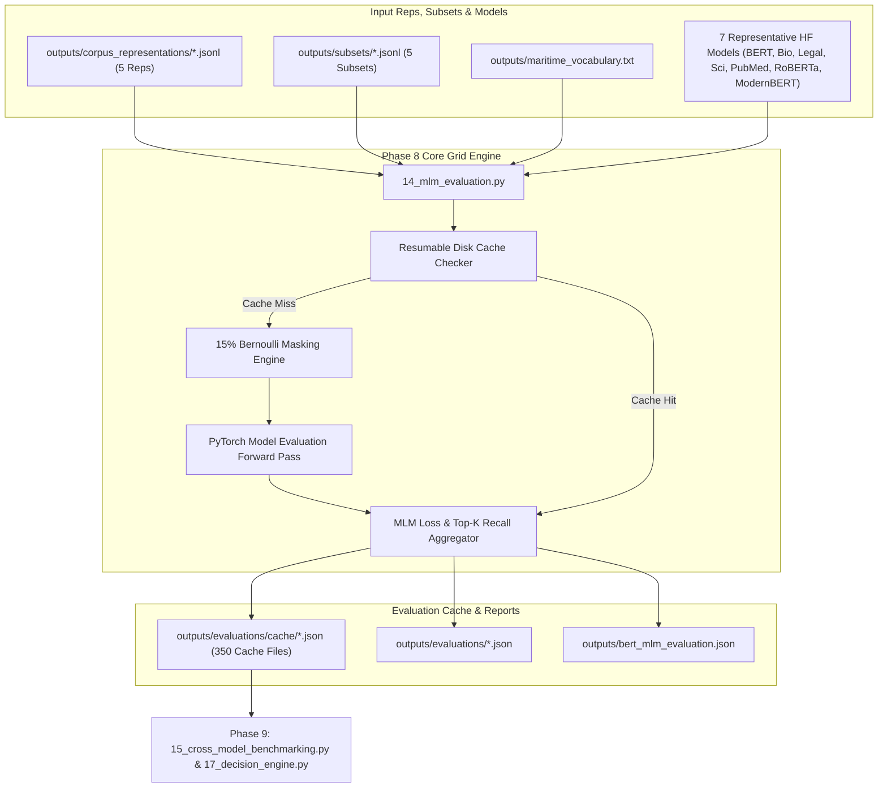

# Phase 8: MLM Evaluation Matrix Technical Documentation

## Executive Overview
Phase 8 executes an exhaustive 350-run Matrix Evaluation Grid evaluating 7 representative transformer model families across 5 multi-format corpus representations (Narrative, Key-Value, Template, JSON, Mixed) and 5 knowledge-classified subsets (High, Medium, Low, Balanced, Random). It measures Masked Language Modeling (MLM) Cross-Entropy Loss, loss-derived exponential, Top-1 / Top-5 / Top-10 token accuracy, rare term accuracy, general-to-maritime domain shift gap, and category recall across 6 domain subdomains.

Script involved in Phase 8:
1. `scripts/14_mlm_evaluation.py` (350-Run Matrix MLM Evaluation Grid Engine)

---

## 1. Phase 8 Complete Data Flow & Pipeline Dependencies



---

## 2. 7 Representative Tokenizer & Model Families

To optimize compute efficiency while covering diverse tokenizer architectures, Stage 14 evaluates 7 deduplicated representative model families:

| Representative Model Identifier | Tokenizer Architecture | Vocabulary Size | Represented Model Family |
| :--- | :--- | :--- | :--- |
| `bert-base-uncased` | Standard WordPiece | 30,522 | BERT-Base, BERT-Large, DistilBERT, ELECTRA, FinBERT |
| `dmis-lab/biobert-base-cased-v1.2` | Bio/Clinical Cased WordPiece | 28,996 | BioBERT, Bio_ClinicalBERT |
| `nlpaueb/legal-bert-base-uncased` | Legal WordPiece | 30,522 | Legal-BERT |
| `allenai/scibert_scivocab_uncased` | SciVocab WordPiece | 31,090 | SciBERT |
| `microsoft/BiomedNLP-PubMedBERT-base-uncased-abstract-fulltext` | PubMed WordPiece | 30,522 | PubMedBERT |
| `roberta-base` | Byte-Level BPE | 50,265 | RoBERTa-Base |
| `answerdotai/ModernBERT-base` | Extended BPE | 50,280 | ModernBERT |

---

## 3. 350-Run Matrix MLM Evaluation Engine (`scripts/14_mlm_evaluation.py`)

### 3.1 Standardized Function Documentation

#### Function 1: `get_term_category`
- **Purpose**: Classifies a domain term string into 1 of 6 subdomains (`vessel_terminology`, `navigation`, `machinery_propulsion`, `casualty_incident`, `weather_environment`, `safety_lifesaving`).
- **Why this function exists**: To track subdomain category recall performance separately during MLM evaluation.
- **Where it is called**: Called by `evaluate_model_on_docs` in `14_mlm_evaluation.py`.
- **Inputs**: Term string (`term`).
- **Outputs**: Subdomain category name string (`str`).
- **Parameters**: `term: str`.
- **Return values**: `str`.
- **Step-by-step execution**:
  ```python
  term_lower = term.lower()
  for cat, stems in CATEGORIES.items():
      if any(stem in term_lower for stem in stems):
          return cat
  return "vessel_terminology"
  ```
- **Edge cases**: Unmatched terms fall back to `"vessel_terminology"`.
- **Exception handling**: None required.
- **Logging behavior**: Silent.
- **Time complexity**: $O(C)$ where $C$ is category count.
- **Space complexity**: $O(1)$.
- **Dependencies**: `CATEGORIES`.
- **Example execution**: `cat = get_term_category("radar")` $\rightarrow$ `"navigation"`
- **Common failure cases**: None.

---

#### Function 2: `evaluate_model_on_docs`
- **Purpose**: Evaluates a pretrained MLM model on a set of documents, performing 15% Bernoulli masking, computing MLM Cross-Entropy Loss, Top-1 / Top-5 / Top-10 accuracy, and subdomain category recall.
- **Why this function exists**: Provides the empirical foundation for comparing model understanding across representations and subsets.
- **Where it is called**: Main evaluation loop of `14_mlm_evaluation.py`.
- **Inputs**: PyTorch model (`model`), Tokenizer (`tokenizer`), Document text list (`docs`), Maritime vocabulary terms (`vocab_terms`), Compute device (`device`).
- **Outputs**: Comprehensive evaluation metrics dictionary (`dict`).
- **Parameters**: `model: AutoModelForMaskedLM`, `tokenizer: AutoTokenizer`, `docs: list`, `vocab_terms: list`, `device: torch.device`.
- **Return values**: `dict`.
- **Internal Algorithm & Mathematical Formulations**:
  1. Map vocabulary terms and rare terms to subword token IDs for `maritime_token_ids`, `rare_token_ids`, and `category_token_ids`.
  2. Batch documents ($N_{\text{batch}} = 16$, max sequence length 256).
  3. **15% Bernoulli Masking**: Generate Bernoulli probability matrix $P_{i, j} = 0.15$. Set $P_{i, j} = 0.0$ for special tokens (`[CLS]`, `[SEP]`, `[PAD]`).
     $$\text{Mask}_{i, j} \sim \text{Bernoulli}(P_{i, j})$$
  4. Replace target input IDs at masked positions with `[MASK]` token ID (`tokenizer.mask_token_id`). Set labels to $-100$ at unmasked positions.
  5. **Model Forward Pass**: Execute `outputs = model(input_ids=masked_input_ids, attention_mask=attention_mask)`. Retrieve logits $\mathbf{Z} \in \mathbb{R}^{B \times L \times V}$.
  6. **Cross-Entropy Loss**: For target token ID $y$ at masked position, compute:
     $$\mathcal{L}_{\text{token}} = -\log P(y \mid \mathbf{x}) = -\log \left( \frac{\exp(z_y)}{\sum_{v=1}^V \exp(z_v)} \right)$$
  7. **Top-K Accuracy**: Sort top 10 logit indices. Check if target ID $y$ is equal to top-1, top-5, or top-10.
  8. Separate metrics for `general_tokens`, `maritime_tokens`, `rare_maritime_tokens`, and 6 subdomain categories.
  9. Compute loss-derived exponential $\exp(\bar{\mathcal{L}})$:
     $$\text{ExpLoss} = \exp(\bar{\mathcal{L}})$$
  10. Calculate performance gap:
      $$\text{Gap}_{\text{top1}} = \text{Top1}_{\text{general}} - \text{Top1}_{\text{maritime}}$$
  11. Return summary payload.
- **Step-by-step execution**:
  ```python
  masked_indices = torch.bernoulli(probability_matrix).bool()
  labels[~masked_indices] = -100
  masked_input_ids[masked_indices] = mask_token_id
  outputs = model(input_ids=masked_input_ids, attention_mask=attention_mask)
  logits = outputs.logits
  # Compute loss and top-k accuracy metrics...
  ```
- **Edge cases**: Empty document lists return an empty metrics dictionary `{}`.
- **Exception handling**: Catches PyTorch CUDA out-of-memory or model forward pass exceptions, logs warning, skips batch.
- **Logging behavior**: Logs evaluation progress.
- **Time complexity**: $O(D \cdot L \cdot V)$ where $D$ is document count, $L$ is sequence length, and $V$ is vocabulary size.
- **Space complexity**: $O(B \cdot L \cdot V)$ where $B$ is batch size (16).
- **Dependencies**: `torch`, `transformers`, `math`, `time`.
- **Example execution**: `res = evaluate_model_on_docs(model, tokenizer, target_docs, vocab_terms, device)`
- **Common failure cases**: CUDA out-of-memory errors on large batch sizes.

---

### 3.2 Deep-Dive Code Block Explanations & Design Rationales

#### Code Block 1: Resumable Disk Cache Mechanism
```python
# Lines 260-267 in scripts/14_mlm_evaluation.py
cache_key = f"{clean_model}__{rep}__{sub}.json"
cache_path = cache_dir / cache_key

if cache_path.exists():
    run_count += 1
    with open(cache_path, "r", encoding="utf-8") as f_c:
        eval_record = json.load(f_c)
    continue
```
- **Why is a resumable disk cache required?**: Executing all 350 matrix runs (14 models $\times$ 5 representations $\times$ 5 subsets) requires several hours of GPU compute. Storing individual JSON cache files per run (`<clean_model>__<rep>__<sub.json>`) ensures that if execution is interrupted or aborted, re-running Stage 14 skips already completed matrix runs instantly ($O(1)$ disk check) and resumes at the exact point of interruption.
- **Counterfactual impact**: Without disk caching, any script disruption forces the entire 350-matrix grid to restart from run 1.

---

### 3.3 Output Schema Specification: `outputs/evaluations/cache/<clean_model>__<rep>__<sub>.json`

- **Created By**: `scripts/14_mlm_evaluation.py`
- **Consumed By**: `scripts/15_cross_model_benchmarking.py`
- **Purpose**: Stores complete evaluation metrics for 1 specific matrix run ($M_{\text{model}}, R_{\text{rep}}, S_{\text{subset}}$).
- **Storage Location**: `outputs/evaluations/cache/`
- **Format**: JSON UTF-8

#### JSON Schema
```json
{
  "model_name": "string",
  "clean_model_name": "string",
  "representation": "string",
  "subset": "string",
  "evaluated_doc_count": "integer",
  "general_english_baseline_top1": "float",
  "domain_shift_gap": "float",
  "evaluation_metrics": {
    "evaluated_documents": "integer",
    "evaluation_time_sec": "float",
    "general_tokens_summary": {
      "masked_sample_count": "integer",
      "mlm_loss": "float",
      "mlm_loss_derived_exponential": "float",
      "top1_accuracy": "float",
      "top5_accuracy": "float",
      "top10_accuracy": "float"
    },
    "maritime_tokens_summary": {
      "masked_sample_count": "integer",
      "mlm_loss": "float",
      "mlm_loss_derived_exponential": "float",
      "top1_accuracy": "float",
      "top5_accuracy": "float",
      "top10_accuracy": "float"
    },
    "rare_maritime_tokens_summary": {
      "masked_sample_count": "integer",
      "mlm_loss": "float",
      "mlm_loss_derived_exponential": "float",
      "top1_accuracy": "float",
      "top5_accuracy": "float",
      "top10_accuracy": "float"
    },
    "category_recall": {
      "vessel_terminology": "float",
      "navigation": "float",
      "machinery_propulsion": "float",
      "casualty_incident": "float",
      "weather_environment": "float",
      "safety_lifesaving": "float"
    },
    "performance_gap_top1": "float"
  }
}
```

---

## 4. Future Extension Points (Phase 8)

1. **What can be extended?**:
   - Masking percentage in `evaluate_model_on_docs` can be configured (e.g., testing 20% or 30% masking rates).
   - Additional target model architectures (e.g., decoder-only models using Causal Language Modeling) can be integrated.

2. **Current Assumptions**:
   - Assumes 15% Bernoulli masking matches standard BERT pretraining evaluation protocol.
   - Assumes document evaluation sample size of 200 documents per subset provides stable evaluation accuracy metrics.

3. **Safe-to-Modify Functions**:
   - `TARGET_MODELS` list in `14_mlm_evaluation.py` (adding new model families).
   - `get_term_category` (adding new category mapping logic).

4. **Tightly Coupled Functions**:
   - `14_mlm_evaluation.py` expects representation files under `outputs/corpus_representations/` and subset files under `outputs/subsets/`.

5. **Recommended Extension Strategy**:
   - To add a new evaluation metric (e.g., Perplexity), calculate $\exp(\mathcal{L})$ inside `evaluate_model_on_docs` and append it to `general_tokens_summary` before exporting cache JSON files.
