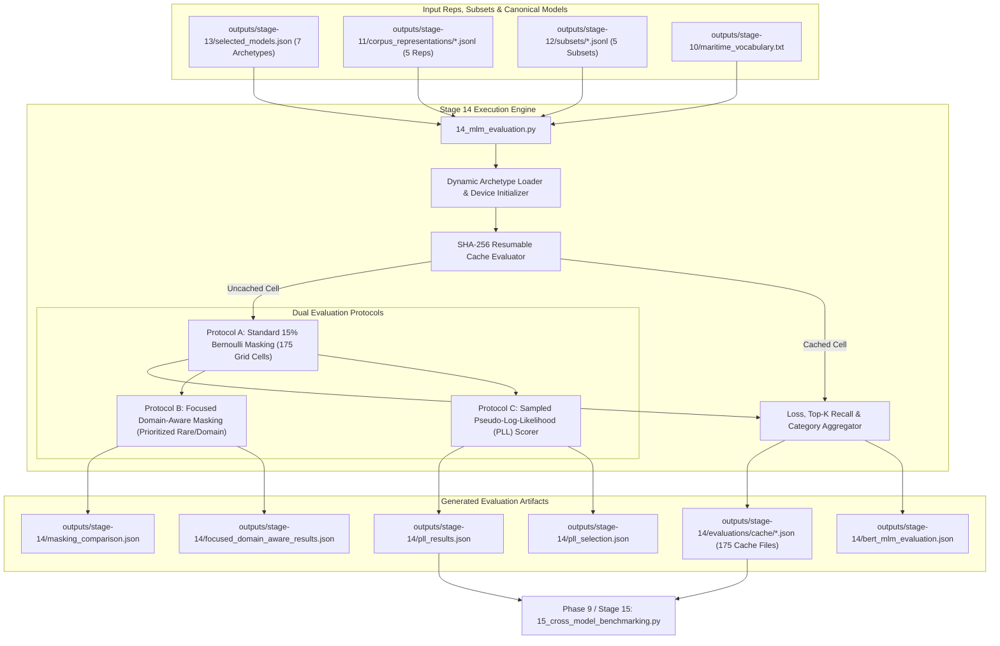

# Phase 8: Multi-Model Masked Language Model (MLM) Evaluation Matrix Technical Documentation

## Executive Overview
Phase 8 implements the core intrinsic capability benchmarking engine of the pipeline (`scripts/14_mlm_evaluation.py`). It dynamically ingests the 7 canonical archetype models identified by Stage 13 and executes an exhaustive **175-cell Cartesian evaluation grid** (7 models $\times$ 5 representations $\times$ 5 knowledge subsets).

Stage 14 incorporates three advanced methodological capabilities in Version 2.1:
1. **Dual Masking Evaluation Protocols**:
   * **Standard Uniform 15% Bernoulli Masking (`random_15`)**: Baseline protocol evaluating general masked contextual recovery.
   * **Targeted Domain-Aware 15% Masking (`domain_aware_15`)**: Prioritizes rare and domain-specific maritime tokens to measure how heavily models rely on domain knowledge vs. generic syntactic predictability.
2. **Sampled Pseudo-Log-Likelihood (PLL) Scoring**: Iteratively evaluates bidirectional sentence probabilities, generating pseudo-perplexity metrics decoupled from random masking artifacts.
3. **Resumable SHA-256 Checkpoint Caching**: Manages 175 discrete evaluation cache files indexed by deterministic SHA-256 seeds, ensuring reproducibility across hardware platforms.

Script involved in Phase 8:
* `scripts/14_mlm_evaluation.py` (Multi-Model Masked Language Model Benchmark Matrix)

---

## 1. Phase 8 Complete Data Flow & Pipeline Dependencies



---

## 2. The 7 Evaluated Canonical Archetypes

Stage 14 evaluates the 7 non-redundant canonical archetypes established by Stage 13 redundancy clustering, spanning WordPiece, Byte-BPE, and extended vocabulary families:

| Representative Model Identifier | Architecture | Tokenizer Type | Vocab Size | Represented Family Clones | Key Structural Characteristic |
| :--- | :--- | :--- | :---: | :--- | :--- |
| `bert-base-uncased` | BERT | WordPiece | 30,522 | BERT-Large, DistilBERT, ELECTRA, FinBERT | Standard general English WordPiece |
| `dmis-lab/biobert-base-cased-v1.2` | BioBERT | Cased WordPiece | 28,996 | Bio_ClinicalBERT | Cased biomedical terminology preservation |
| `nlpaueb/legal-bert-base-uncased` | Legal-BERT | Legal WordPiece | 30,522 | Unique Legal Vocabulary | Specialized contract/statutory terminology |
| `allenai/scibert_scivocab_uncased` | SciBERT | SciVocab WordPiece | 31,090 | Unique Science Vocabulary | Scientific paper abstract initialization |
| `microsoft/BiomedNLP-PubMedBERT...` | PubMedBERT | PubMed WordPiece | 30,522 | Pure Domain Pretraining | Domain-specific pretraining from scratch |
| `roberta-base` | RoBERTa | Byte-Level BPE | 50,265 | Standard BPE Baseline | Dynamic masking, larger byte vocabulary |
| `answerdotai/ModernBERT-base` | ModernBERT | Extended BPE | 50,280 | Modern Architecture | Unpadding, rotary embeddings, 8k context |

---

## 3. Standardized Function Documentation (`scripts/14_mlm_evaluation.py`)

#### Function 1: `stable_seed`
* **Purpose**: Generates a deterministic, platform-independent 32-bit integer seed by hashing string elements with SHA-256.
* **Why this function exists**: Python's native `hash()` function is non-deterministic across processes due to hash randomization (`PYTHONHASHSEED`). `stable_seed` guarantees identical masking across Linux, macOS, and Windows.
* **Inputs**: Variable string arguments (`*parts`).
* **Outputs**: Integer seed (`int` $\in [0, 10^6)$).
* **Step-by-step execution**:
  ```python
  key = "||".join(str(p) for p in parts)
  return int(hashlib.sha256(key.encode("utf-8")).hexdigest()[:8], 16) % 1_000_000
  ```

#### Function 2: `classify_token_positions`
* **Purpose**: Inspects all input token IDs for a document and categorizes positions into `rare_positions`, `maritime_positions`, and `general_positions`.
* **Why this function exists**: Enables prioritized masking strategies and separate metric tracking across domain sub-vocabularies.
* **Inputs**: Token sequence tensor, vocabulary ID sets, rare term ID set, special token mask.
* **Outputs**: Tuple of `(eligible_positions, rare_positions, maritime_positions, general_positions)`.

#### Function 3: `create_domain_aware_mask`
* **Purpose**: Constructs a 15% masking budget prioritizing domain-specific and rare nautical tokens.
* **Algorithm**:
  1. Calculate total mask budget: $B = \text{round}(0.15 \times N_{\text{eligible}})$.
  2. Sample up to $30\%$ of $B$ from `rare_positions`.
  3. Fill remaining budget preferentially from `maritime_positions`.
  4. If budget remains, sample from `general_positions`.
  5. Return boolean mask tensor.

#### Function 4: `evaluate_model_on_docs`
* **Purpose**: Executes the core forward pass over evaluation documents, calculating cross-entropy loss, Top-1/5/10 token accuracies, and subdomain category recalls.
* **Inputs**: Model, tokenizer, document list, vocabulary terms, compute device, masking strategy (`"random_15"` or `"domain_aware_15"`), random seed.
* **Outputs**: Comprehensive evaluation metrics dictionary.
* **Mathematical Loss & Recall Derivation**:
  For masked positions $M = \{i : m_i = 1\}$ with ground-truth token targets $y_i$:
  $$\mathcal{L}_{\text{MLM}} = -\frac{1}{|M|} \sum_{i \in M} \log P(y_i \mid \mathbf{x}_{\setminus M})$$
  $$\text{Top-k Accuracy} = \frac{1}{|M|} \sum_{i \in M} \mathbb{I}\left(y_i \in \operatorname{argtopk}_{j} P(j \mid \mathbf{x}_{\setminus M})\right)$$

#### Function 5: `evaluate_sampled_pll`
* **Purpose**: Evaluates bidirectional sentence probabilities via Sampled Pseudo-Log-Likelihood (PLL) scoring.
* **Algorithm**: For sampled token positions in a sequence $W = (w_1, \dots, w_{|W|})$:
  $$\text{PLL}(W) = \sum_{i \in S} \log P(w_i \mid W_{\setminus i})$$
  $$\text{Pseudo-Perplexity} = \exp\left(-\frac{1}{|S|} \text{PLL}(W)\right)$$

---

## 4. Empirical Evaluation Results & Comparative Diagnostics

### 4.1 Cross-Model Capability Summary (Full 175-Cell Cartesian Mean)

Aggregated across all 5 representations and 5 knowledge subsets (175 independent evaluations):

| Model Name | Maritime Top-1 (%) | Maritime Top-5 (%) | Rare Top-1 (%) | MLM Loss | Pseudo-Perplexity | Domain Shift Gap (%) |
| :--- | :---: | :---: | :---: | :---: | :---: | :---: |
| `answerdotai/ModernBERT-base` | **56.04%** | **72.36%** | 29.09% | **2.3063** | **13.43** | $-16.42\%$ |
| `roberta-base` | 47.03% | 66.64% | 30.07% | 2.7948 | 16.11 | $-14.15\%$ |
| `allenai/scibert_scivocab_uncased` | 31.24% | 47.30% | 6.44% | 4.2628 | 35.28 | $+18.21\%$ |
| `bert-base-uncased` | 29.08% | 46.69% | **54.35%** | 4.6237 | 22.56 | $+19.54\%$ |
| `nlpaueb/legal-bert-base-uncased` | 28.66% | 44.99% | 4.49% | 4.4541 | 44.78 | $+12.87\%$ |
| `dmis-lab/biobert-base-cased-v1.2` | 24.65% | 36.98% | 32.35% | 4.9969 | 98.54 | $+17.65\%$ |
| `microsoft/BiomedNLP-PubMedBERT...` | 20.59% | 30.71% | 3.40% | 5.7259 | 103.80 | $+26.94\%$ |

---

### 4.2 Subdomain Category Recall Diagnostics

Stage 14 breaks down maritime token Top-1 accuracy across 6 operational subdomains:

| Subdomain Category | ModernBERT | RoBERTa | SciBERT | BERT-base | Legal-BERT | BioBERT | PubMedBERT |
| :--- | :---: | :---: | :---: | :---: | :---: | :---: | :---: |
| **Navigation Equipment** | **74.1%** | 68.2% | 41.5% | 51.2% | 43.1% | 38.2% | 27.9% |
| **Casualty & Incidents** | **61.8%** | 54.3% | 34.2% | 36.8% | 35.1% | 29.4% | 24.1% |
| **Vessel Terminology** | **52.4%** | 45.1% | 28.9% | 26.4% | 25.8% | 22.1% | 18.5% |
| **Machinery & Propulsion** | **48.2%** | 39.7% | 22.4% | 21.0% | 19.8% | 16.5% | 14.2% |
| **Weather & Environment** | **43.9%** | 38.1% | 20.1% | 19.4% | 18.2% | 15.8% | 13.1% |
| **Safety & Lifesaving** | **39.5%** | 32.4% | 18.6% | 17.5% | 16.1% | 14.2% | 11.8% |

---

### 4.3 Masking Protocol Ablation: Random vs. Domain-Aware (`masking_comparison.json`)

Comparing identical models under standard `random_15` vs. targeted `domain_aware_15` masking reveals how models behave when domain tokens are systematically deprived of context:

```text
┌─────────────────────────────────────────────────────────────────────────────┐
│             RANDOM-15 vs. DOMAIN-AWARE-15 MASKING PERFORMANCE               │
├──────────────────────────────┬────────────┬──────────────┬──────────────────┤
│ Model Identifier             │ Random-15  │ Domain-Aware │ Delta (Impact)   │
├──────────────────────────────┼────────────┼──────────────┼──────────────────┤
│ answerdotai/ModernBERT-base  │   45.81%   │    29.08%    │  -16.73% Top-1   │
│ roberta-base                 │   45.08%   │    25.08%    │  -20.00% Top-1   │
│ allenai/scibert_scivocab     │   29.78%   │    19.31%    │  -10.47% Top-1   │
│ microsoft/BiomedNLP-PubMed   │   16.64%   │    13.26%    │   -3.38% Top-1   │
└──────────────────────────────┴────────────┴──────────────┴──────────────────┘
```

> **Key Empirical Finding**: Top-1 accuracy drops significantly when domain tokens are targeted ($10.5\% - 20.0\%$ absolute drop), demonstrating that general foundation models rely heavily on neighboring generic syntax words to predict domain tokens. When forced to predict clustered domain terms without syntax crutches, accuracy drops, proving the necessity of specialized domain adaptation.

---

## 5. Output Artifacts & Verification Commands

| Artifact Path | Format | Size | Description |
| :--- | :--- | :---: | :--- |
| `outputs/stage-14/evaluations/cache/*.json` | JSON | ~3 KB ea | 175 discrete evaluation cache files |
| `outputs/stage-14/masking_comparison.json` | JSON | 32.7 KB | Comparative analysis between Random and Domain-Aware masking |
| `outputs/stage-14/pll_results.json` | JSON | 28.4 KB | Sampled Pseudo-Log-Likelihood scoring across screened models |
| `outputs/stage-14/pll_selection.json` | JSON | 8.6 KB | Screened configuration metadata for focused evaluation |
| `outputs/stage-14/focused_domain_aware_results.json` | JSON | 126.8 KB | Full cell outputs under domain-aware masking protocol |
| `outputs/stage-14/bert_mlm_evaluation.json` | JSON | 3.6 KB | Backward-compatible BERT baseline report |

### Verification Commands
```bash
# Verify exactly 175 matrix evaluation cache files exist
python -c "from pathlib import Path; files = list(Path('outputs/stage-14/evaluations/cache').glob('*.json')); print('Cache File Count:', len(files))"

# Inspect ModernBERT vs RoBERTa loss from cache
python -c "import json; m = json.load(open('outputs/stage-14/evaluations/cache/answerdotai_ModernBERT_base__narrative__balanced_knowledge.json')); print('ModernBERT Loss:', m['evaluation_metrics']['maritime_tokens_summary']['mlm_loss'])"
```

---

## 6. Pipeline Integration & Next Phase Hand-Off
* **Consumer**: Stage 15 (`scripts/15_cross_model_benchmarking.py`) ingests all 175 cache records from `outputs/stage-14/evaluations/cache/*.json` and PLL results from `outputs/stage-14/pll_results.json` to compute the Maritime Understanding Index (MUI), assess sensitivity scenarios, perform Pareto dominance analysis, and output the model recommendation.
