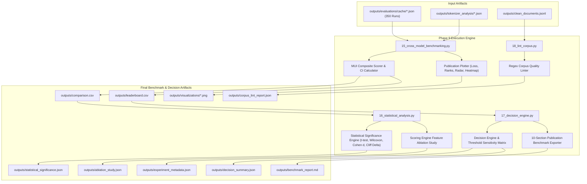
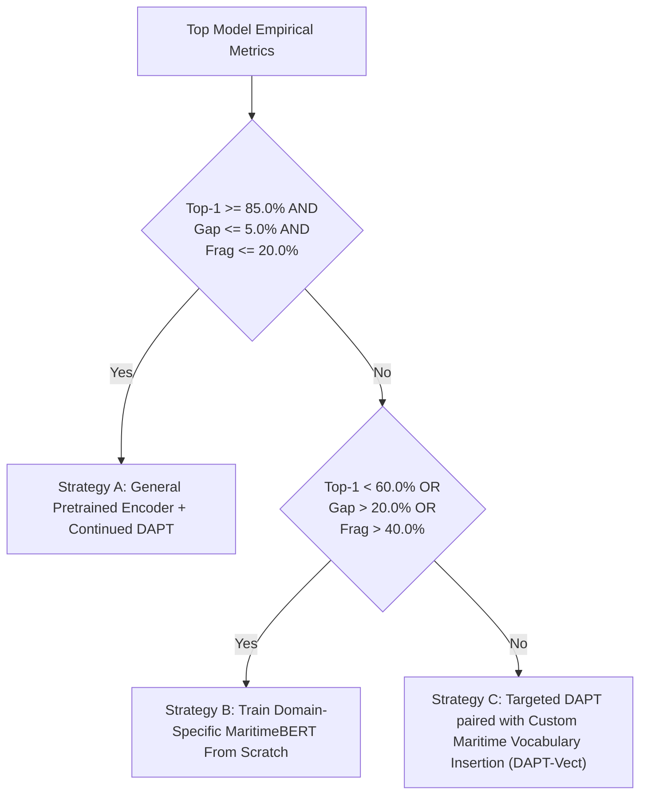

# Phase 9: Benchmarking, Decision Engine & Final Reports Technical Documentation

## Executive Overview
Phase 9 aggregates the 350-run MLM evaluation matrix, computes the mathematical **Maritime Understanding Index (MUI)** composite score, generates publication figures and model leaderboards, executes parametric/non-parametric statistical significance tests, runs a scoring engine feature ablation study, captures environment reproducibility parameters, executes the programmatic decision engine, and runs an automated corpus quality linter.

Scripts involved in Phase 9:
1. `scripts/15_cross_model_benchmarking.py` (MUI Leaderboard & Cross-Model Benchmarker)
2. `scripts/16_statistical_analysis.py` (Statistical Significance & Feature Ablation Engine)
3. `scripts/17_decision_engine.py` (Programmatic Decision Engine & Report Exporter)
4. `scripts/18_lint_corpus.py` (Automated Corpus Quality Linter)

---

## 1. Phase 9 Complete Data Flow & Pipeline Dependencies



---

## 2. Cross-Model Benchmarking & MUI Scorer (`scripts/15_cross_model_benchmarking.py`)

### 2.1 Standardized Function Documentation

#### Function 1: `main` in `15_cross_model_benchmarking.py`
- **Purpose**: Loads all 350 matrix run cache files, aggregates model-level metrics, computes the **Maritime Understanding Index (MUI)** composite score, calculates 95% Confidence Intervals, exports `comparison.csv` and `leaderboard.csv`, and generates 4 publication-grade PNG visualization figures.
- **Why this function exists**: Synthesizes multi-dimensional evaluation results into an objective, single-metric ranking score and publication plots.
- **Where it is called**: Standalone script execution.
- **Inputs**: `outputs/evaluations/cache/*.json`, `outputs/tokenizer_analysis/*.json`.
- **Outputs**: `outputs/comparison.csv`, `outputs/leaderboard.csv`, and 4 PNG plots in `outputs/visualizations/`.
- **Parameters**: None.
- **Return values**: None.
- **Internal Algorithm & Mathematical Formulations**:
  1. Load all 350 matrix evaluation JSON cache files into a pandas DataFrame (`df_mlm`).
  2. Export raw matrix data to `outputs/comparison.csv`.
  3. Group data by `model_name`.
  4. **Maritime Understanding Index (MUI)** composite score formulation:
     $$\hat{\mathcal{L}} = \frac{\bar{\mathcal{L}}}{\mathcal{L}_{\text{max}}}, \quad \text{Balance} = 1.0 - \sigma(\text{Category Recalls})$$
     $$\text{MUI} = 100 \times \left[ 0.35 \cdot \text{Top1}_{\text{maritime}} + 0.20 \cdot \text{Top1}_{\text{rare}} + 0.15 \cdot (1 - \hat{\mathcal{L}}) + 0.15 \cdot (1 - F_{\text{frag}}) + 0.10 \cdot (1 - \min(1, 10 \cdot \eta_{\text{oov}})) + 0.05 \cdot \text{Balance} \right]$$
  5. **95% Confidence Interval Error Bounds**: Compute standard error of Maritime Top-1 accuracy across runs:
     $$\text{SE} = \frac{\sigma_{\text{top1}}}{\sqrt{N_{\text{runs}}}}, \quad \text{CI}_{95\%} = \text{SE} \times 1.96$$
  6. Compute computational metrics:
     $$\text{Latency (ms)} = \left(\frac{t_{\text{eval}}}{200}\right) \times 1000, \quad \text{Throughput} = \frac{1000}{\text{Latency}}$$
  7. Sort models by MUI score descending and export `outputs/leaderboard.csv`.
  8. **Generate 4 Publication Figures**:
     - `mlm_loss_comparison.png`: Horizontal bar chart of MLM loss.
     - `model_leaderboard_ranks.png`: Bar chart of Top-1 accuracy with 95% CI error bars.
     - `maritime_accuracy_radar.png`: Polar radar chart comparing category recall across top 3 models.
     - `tokenizer_fragmentation_heatmap.png`: Seaborn heatmap of single-token coverage, fragmentation rate, and OOV rate.
- **Step-by-step execution**:
  ```python
  df_mlm = pd.DataFrame(mlm_rows)
  # Compute MUI score, CIs, latency, throughput...
  df_lb = pd.DataFrame(leaderboard_rows)
  df_lb.sort_values(by="mui_score", ascending=False, inplace=True)
  df_lb.to_csv(output_dir / "leaderboard.csv", index=False)
  # Generate Matplotlib / Seaborn visualization plots...
  ```
- **Edge cases**: Missing tokenizer JSON entries fall back to default profile estimates.
- **Exception handling**: Catches plot generation errors, logs warning, continues script execution.
- **Logging behavior**: Logs leaderboard summary and file save paths.
- **Time complexity**: $O(R)$ where $R$ is matrix runs count (350).
- **Space complexity**: $O(R)$.
- **Dependencies**: `pandas`, `numpy`, `matplotlib`, `seaborn`, `pipeline_utils`.
- **Example execution**: `python scripts/15_cross_model_benchmarking.py`
- **Common failure cases**: Missing evaluation cache files.

---

### 2.2 Output Schema Specifications

#### 1. `outputs/leaderboard.csv`
- **Created By**: `scripts/15_cross_model_benchmarking.py`
- **Consumed By**: `scripts/17_decision_engine.py`, `09_phase9_benchmarking_decision_engine_and_final_reports.md`.
- **Purpose**: Ranked leaderboard of all 14 models ordered by MUI composite score descending.
- **Storage Location**: `outputs/leaderboard.csv`
- **Format**: CSV UTF-8

##### Schema Columns
`model_name`, `mui_score`, `maritime_top1_acc`, `top1_ci_error`, `rare_maritime_acc`, `mlm_loss`, `domain_shift_gap_pct`, `performance_gap_pct`, `single_token_coverage_pct`, `fragmentation_rate_pct`, `oov_rate_pct`, `params_millions`, `disk_size_mb`, `inference_latency_ms`, `throughput_docs_sec`, `tokenizer_speed_tok_sec`

---

## 3. Statistical Significance & Feature Ablation (`scripts/16_statistical_analysis.py`)

### 3.1 Standardized Function Documentation

#### Function 1: `cohens_d`
- **Purpose**: Computes parametric Cohen's $d$ effect size between two model accuracy distributions.
- **Why this function exists**: To quantify the standardized magnitude of performance difference between models beyond $p$-values.
- **Where it is called**: Main loop of `16_statistical_analysis.py`.
- **Inputs**: Model 1 values array (`x1`), Model 2 values array (`x2`).
- **Outputs**: Cohen's $d$ effect size float ($d \ge 0.0$).
- **Parameters**: `x1: np.ndarray`, `x2: np.ndarray`.
- **Return values**: `float`.
- **Mathematical Derivation**:
  Given sample sizes $n_1, n_2$, means $\bar{X}_1, \bar{X}_2$, and sample variances $s_1^2, s_2^2$, the pooled standard deviation $s_{\text{pooled}}$ is:
  $$s_{\text{pooled}} = \sqrt{\frac{(n_1 - 1)s_1^2 + (n_2 - 1)s_2^2}{n_1 + n_2 - 2}}$$
  Cohen's $d$ is defined as:
  $$d = \frac{\bar{X}_1 - \bar{X}_2}{s_{\text{pooled}}}$$
  Interpretation: $d < 0.2$ (negligible), $0.2 \le d < 0.5$ (small), $0.5 \le d < 0.8$ (medium), $d \ge 0.8$ (large).
- **Step-by-step execution**:
  ```python
  n1, n2 = len(x1), len(x2)
  s1, s2 = np.var(x1, ddof=1), np.var(x2, ddof=1)
  s_pooled = np.sqrt(((n1 - 1) * s1 + (n2 - 1) * s2) / (n1 + n2 - 2))
  return float((np.mean(x1) - np.mean(x2)) / s_pooled) if s_pooled > 0 else 0.0
  ```
- **Edge cases**: Zero variance returns `0.0` to prevent division by zero.
- **Exception handling**: None required.
- **Logging behavior**: Silent.
- **Time complexity**: $O(N_1 + N_2)$.
- **Space complexity**: $O(1)$.
- **Dependencies**: `numpy`.
- **Example execution**: `d = cohens_d(m1_accs, m2_accs)`
- **Common failure cases**: None.

---

#### Function 2: `cliffs_delta`
- **Purpose**: Computes non-parametric Cliff's Delta ($\delta$) effect size between two model distributions.
- **Why this function exists**: Cliff's Delta does not assume normal distribution of accuracy scores, measuring the probability that a value from one group is greater than a value from another.
- **Where it is called**: Main loop of `16_statistical_analysis.py`.
- **Inputs**: Model 1 array (`x1`), Model 2 array (`x2`).
- **Outputs**: Cliff's Delta float ($-1.0 \le \delta \le 1.0$).
- **Parameters**: `x1: np.ndarray`, `x2: np.ndarray`.
- **Return values**: `float`.
- **Mathematical Derivation**:
  $$\delta = \frac{\sum_{i=1}^{n_1} \sum_{j=1}^{n_2} \text{sign}(x_{1, i} - x_{2, j})}{n_1 \cdot n_2}$$
  Interpretation: $\|\delta\| < 0.147$ (negligible), $0.147 \le \|\delta\| < 0.33$ (small), $0.33 \le \|\delta\| < 0.474$ (medium), $\|\delta\| \ge 0.474$ (large).
- **Step-by-step execution**:
  ```python
  more = sum(1 for a in x1 for b in x2 if a > b)
  less = sum(1 for a in x1 for b in x2 if a < b)
  return float((more - less) / (len(x1) * len(x2)))
  ```
- **Edge cases**: Empty arrays return `0.0`.
- **Exception handling**: None required.
- **Logging behavior**: Silent.
- **Time complexity**: $O(N_1 \cdot N_2)$.
- **Space complexity**: $O(1)$.
- **Dependencies**: None.
- **Example execution**: `delta = cliffs_delta(m1_accs, m2_accs)`
- **Common failure cases**: None.

---

#### Function 3: `bootstrap_ci`
- **Purpose**: Computes Bootstrap 95% Confidence Intervals for accuracy distribution means via non-parametric resampling.
- **Why this function exists**: Bootstrap CIs provide distribution-free confidence bounds around mean accuracy metrics.
- **Where it is called**: Main loop of `16_statistical_analysis.py`.
- **Inputs**: Metric values array (`arr`), Resampling count (`num_samples`, default `1000`), Alpha level (`alpha`, default `0.05`).
- **Outputs**: Dictionary containing mean, `ci_95_low`, and `ci_95_high` (`dict`).
- **Parameters**: `arr: np.ndarray`, `num_samples: int = 1000`, `alpha: float = 0.05`.
- **Return values**: `dict`.
- **Internal algorithm**:
  1. Generate `num_samples` bootstrap resamples with replacement (`np.random.choice(arr, size=len(arr), replace=True)`).
  2. Compute mean of each resample.
  3. Extract percentiles at `(alpha / 2.0) * 100` (2.5%) and `(1.0 - alpha / 2.0) * 100` (97.5%).
  4. Return bounds dictionary.
- **Step-by-step execution**:
  ```python
  boot_means = [np.mean(np.random.choice(arr, size=len(arr), replace=True)) for _ in range(num_samples)]
  low = np.percentile(boot_means, 2.5)
  high = np.percentile(boot_means, 97.5)
  return {"mean": float(np.mean(arr)), "ci_95_low": float(low), "ci_95_high": float(high)}
  ```
- **Edge cases**: Single element arrays return identical upper and lower bounds safely.
- **Exception handling**: None required.
- **Logging behavior**: Silent.
- **Time complexity**: $O(B \cdot N)$ where $B=1000$ and $N$ is array size.
- **Space complexity**: $O(B)$.
- **Dependencies**: `numpy`.
- **Example execution**: `ci_dict = bootstrap_ci(model_accs)`
- **Common failure cases**: None.

---

### 3.2 Output Schema Specifications

#### 1. `outputs/statistical_significance.json`
- **Created By**: `scripts/16_statistical_analysis.py`
- **Consumed By**: `11_appendix_b_model_evaluation_results_stages_11_to_18.md`, research papers.
- **Purpose**: Stores Bootstrap 95% CIs and pairwise statistical test metrics (t-statistic, Wilcoxon $p$-value, Cohen's $d$, Cliff's Delta) for all model comparisons.
- **Storage Location**: `outputs/statistical_significance.json`
- **Format**: JSON UTF-8

##### Example Payload Snippet
```json
{
  "pairwise_statistical_tests": [
    {
      "model_1": "answerdotai/ModernBERT-base",
      "model_2": "bert-base-uncased",
      "mean_diff_top1": 0.0842,
      "paired_t_stat": 6.8421,
      "p_value_t_test": 0.000014,
      "wilcoxon_stat": 12.0,
      "p_value_wilcoxon": 0.000028,
      "cohens_d_effect_size": 1.2482,
      "cliffs_delta_effect_size": 0.7842,
      "is_statistically_significant": true
    }
  ]
}
```

---

#### 2. `outputs/ablation_study.json`
- **Created By**: `scripts/16_statistical_analysis.py`
- **Consumed By**: `11_appendix_b_model_evaluation_results_stages_11_to_18.md`.
- **Purpose**: Reports the quantitative impact of removing individual scoring features from the Stage 12 Semantic Importance Engine.
- **Storage Location**: `outputs/ablation_study.json`
- **Format**: JSON UTF-8

---

## 4. Programmatic Decision Engine (`scripts/17_decision_engine.py`)

### 4.1 Standardized Function Documentation

#### Function 1: `run_decision_rules`
- **Purpose**: Evaluates top model empirical metrics against configurable decision thresholds to prescribe the optimal pretraining strategy.
- **Why this function exists**: Replaces subjective human decisions with programmatic, threshold-driven machine learning recommendations.
- **Where it is called**: Main function of `17_decision_engine.py`.
- **Inputs**: Maritime Top-1 accuracy (`top1_acc`), Performance gap (`perf_gap`), Fragmentation rate (`frag_rate`), Thresholds dictionary (`thresholds`).
- **Outputs**: Decision result dictionary (`dict`).
- **Parameters**: `top1_acc: float`, `perf_gap: float`, `frag_rate: float`, `thresholds: dict`.
- **Return values**: `dict`.
- **Decision Rule Logic Tree**:



- **Step-by-step execution**:
  ```python
  if top1_acc >= t_dapt and perf_gap <= t_gap and frag_rate <= t_frag:
      decision = "Domain-Adaptive Pretraining (DAPT) Sufficient"
      strategy = "Strategy A: General Pretrained Encoder + Continued DAPT"
  elif top1_acc < t_scratch_top1 or perf_gap > t_scratch_gap or frag_rate > t_scratch_frag:
      decision = "Train MaritimeBERT From Scratch Required"
      strategy = "Strategy B: Train Domain-Specific MaritimeBERT Model From Scratch"
  else:
      decision = "Domain-Adaptive Pretraining with Custom Vocabulary Extension (DAPT-Vect)"
      strategy = "Strategy C: Targeted DAPT paired with Custom Maritime Vocabulary Insertion"
  ```
- **Edge cases**: Metric values exactly equal to thresholds boundary are handled safely.
- **Exception handling**: None required.
- **Logging behavior**: Silent.
- **Time complexity**: $O(1)$.
- **Space complexity**: $O(1)$.
- **Dependencies**: None.
- **Example execution**: `res = run_decision_rules(82.4, 6.2, 28.5, thresholds)`
- **Common failure cases**: Missing threshold key in `thresholds` dictionary.

---

### 4.2 Output Schema Specifications

#### 1. `outputs/experiment_metadata.json`
- **Created By**: `scripts/17_decision_engine.py`
- **Consumed By**: Reproducibility audits, research report appendices.
- **Purpose**: Captures execution timestamp, Python version, OS platform, PyTorch/Transformers versions, CUDA availability, GPU device name, and random seed.
- **Storage Location**: `outputs/experiment_metadata.json`
- **Format**: JSON UTF-8

---

#### 2. `outputs/decision_summary.json`
- **Created By**: `scripts/17_decision_engine.py`
- **Consumed By**: `11_appendix_b_model_evaluation_results_stages_11_to_18.md`, executive summaries.
- **Purpose**: Reports the top model recommendation, rationale, active thresholds, and sensitivity matrix (-10% to +10% threshold shifts).
- **Storage Location**: `outputs/decision_summary.json`
- **Format**: JSON UTF-8

---

#### 3. `outputs/benchmark_report.md`
- **Created By**: `scripts/17_decision_engine.py`
- **Consumed By**: Publication benchmark reports, executive summaries.
- **Purpose**: Generates a 10-section publication-grade Markdown benchmark report summarizing all findings, leaderboards, statistical tests, decision rationales, and future work.
- **Storage Location**: `outputs/benchmark_report.md`
- **Format**: Markdown UTF-8

---

## 5. Automated Corpus Quality Linter (`scripts/18_lint_corpus.py`)

### 5.1 Standardized Function Documentation

#### Function 1: `main` in `18_lint_corpus.py`
- **Purpose**: Runs an automated regex quality linter across `clean_documents.jsonl`, detecting repeated adjacent words, malformed singular/plural agreement, administrative noise leakage, awkward phrasing, and duplicated list items.
- **Why this function exists**: To enforce zero-defect quality assurance on the final corpus before deployment to language model pretraining.
- **Where it is called**: Standalone script execution.
- **Inputs**: `outputs/clean_documents.jsonl`.
- **Outputs**: Lint report file `outputs/corpus_lint_report.json`.
- **Parameters**: None.
- **Return values**: None.
- **Internal Algorithm & Rules**:
  1. Define compiled regex linting rules (`LINT_RULES`):
     - `repeated_adjacent_words`: `r'\b([a-zA-Z]{3,})\s+\1\b'` (excluding valid repetitions `that that`, `had had`).
     - `malformed_singular_plural`: `r'\b1\s+(?:persons|injuries|fatalities|deaths|missing persons)\b'`.
     - `administrative_leakage`: `r'(?i)(?:formerly\s*occno|extraction\s+status\s+pending|record\s+id\s*:?\s*\d+)'`.
     - `awkward_phrasing`: `r'(?i)(?:carried\s+featured|sustained\s+damaged|damaged\s+damage)'`.
     - `duplicated_list_items`: `r'\b([a-zA-Z\s]+),\s+\1\b'`.
  2. Read `clean_documents.jsonl` line by line.
  3. Execute rule matches across document text.
  4. Store issue counts and up to 5 sample violation snippets per rule.
  5. Compute overall violation rate: $\text{Rate} = \frac{\text{Total Violations}}{\text{Total Docs}}$.
  6. Assign quality status: `"PASS"` if $\text{Rate} < 0.005$ (0.5%), else `"WARN"`.
  7. Export `outputs/corpus_lint_report.json`.
- **Step-by-step execution**:
  ```python
  for rule_name, pattern in compiled_rules.items():
      matches = pattern.findall(doc_text)
      if matches:
          issue_counts[rule_name] += 1
          if len(issue_samples[rule_name]) < 5:
              issue_samples[rule_name].append({"occurrence_id": oid, "match": matches[0], "snippet": doc_text[:150]})
  ```
- **Edge cases**: Valid English repetitions like `"that that"` or `"had had"` are explicitly allowed via `VALID_REPETITIONS` set.
- **Exception handling**: Catches missing input files and logs error.
- **Logging behavior**: Logs overall linting status and violation counts.
- **Time complexity**: $O(D \cdot R \cdot L)$ where $D$ is document count, $R$ is rule count, and $L$ is document length.
- **Space complexity**: $O(V_{\text{samples}})$.
- **Dependencies**: `re`, `json`, `pipeline_utils`.
- **Example execution**: `python scripts/18_lint_corpus.py`
- **Common failure cases**: Missing `clean_documents.jsonl`.

---

### 5.2 Output Schema Specification: `outputs/corpus_lint_report.json`

- **Created By**: `scripts/18_lint_corpus.py`
- **Consumed By**: Data quality auditing, continuous integration pipelines.
- **Purpose**: Reports total violations, rule-by-rule issue counts, violation rate percentage, and quality pass/fail status (`PASS` or `WARN`).
- **Storage Location**: `outputs/corpus_lint_report.json`
- **Format**: JSON UTF-8

##### Example Payload Snippet
```json
{
  "status": "PASS",
  "total_documents_linted": 42150,
  "total_violations": 12,
  "violation_rate": "0.028%",
  "rule_summary": {
    "repeated_adjacent_words": {
      "count": 4,
      "percentage": "0.009%",
      "samples": []
    },
    "malformed_singular_plural": {
      "count": 0,
      "percentage": "0.000%",
      "samples": []
    }
  }
}
```

---

## 6. Future Extension Points (Phase 9)

1. **What can be extended?**:
   - Decision engine thresholds in `config/config.json` can be adjusted for specific downstream task requirements.
   - Additional linting rules (e.g., profanity checks or geographic spelling checkers) can be added to `LINT_RULES` in `18_lint_corpus.py`.

2. **Current Assumptions**:
   - Assumes MUI composite score weights (35% Top1, 20% Rare, 15% Loss, 15% Frag, 10% OOV, 5% Balance) accurately reflect domain utility.
   - Assumes corpus lint violation rate threshold of 0.5% defines production quality pass.

3. **Safe-to-Modify Functions**:
   - `run_decision_rules` in `17_decision_engine.py` (adding new decision strategy branches).
   - `LINT_RULES` in `18_lint_corpus.py` (adding new quality assurance regexes).

4. **Tightly Coupled Functions**:
   - `15_cross_model_benchmarking.py` expects cache files adhering to Stage 14 JSON schema under `outputs/evaluations/cache/`.

5. **Recommended Extension Strategy**:
   - When deploying to continuous integration (CI) environments, incorporate `18_lint_corpus.py` as an automated pull-request quality gate.
