# Phase 9: Cross-Model Benchmarking, Decision Engine & Final Reports Technical Documentation

## Executive Overview
Phase 9 represents the synthesis and decision-making capstone of the evaluation pipeline. It ingests the complete 175-cell Cartesian evaluation matrix from Stage 14, evaluates multidimensional model capabilities across representations and knowledge subsets, conducts multi-scenario sensitivity analyses, executes multi-objective Pareto dominance analysis, calculates parametric and non-parametric statistical significance, executes an objective pretraining strategy decision engine, and conducts automated corpus quality linting.

Scripts involved in Phase 9:
* `scripts/15_cross_model_benchmarking.py` (MUI Leaderboard, Sensitivity, Pareto & Defensible Model Selection)
* `scripts/16_statistical_analysis.py` (Statistical Significance & Feature Ablation Engine)
* `scripts/17_decision_engine.py` (Programmatic Decision Engine & Benchmark Report Exporter)
* `scripts/18_lint_corpus.py` (Automated Corpus Quality Linter)

---

## 1. Phase 9 Complete Data Flow & Pipeline Dependencies

```mermaid
flowchart TD
    subgraph Inputs ["Input Matrix Artifacts"]
        CacheFolder["outputs/stage-14/evaluations/cache/*.json (175 Evaluated Cells)"]
        PLLResults["outputs/stage-14/pll_results.json"]
        TokCSV["outputs/stage-13/tokenizer_analysis/tokenizer_comparison.csv"]
        CleanDocs["outputs/stage-07/clean_documents.jsonl"]
    end

    subgraph Processing ["Phase 9 Execution Engine"]
        subgraph Stage15 ["Stage 15: Cross-Model Benchmarking"]
            S15["15_cross_model_benchmarking.py"]
            MatrixValidator["Matrix Discovery & 175-Cell Ingestion Engine"]
            ProfileBuilder["Multi-Dimensional Model Profile Builder"]
            RepRanker["Representation Robustness Ranker (Kendall / Spearman)"]
            SubRanker["Subset Robustness Ranker (Kendall / Spearman)"]
            MUICalculator["MUI Composite Calculator (Direction-Aware Normalization)"]
            SensitivityEngine["4-Scenario Weighting Sensitivity Evaluator"]
            ParetoEngine["Multi-Objective Pareto Dominance Calculator"]
            SelectionHierarchy["Defensible Model Selection Decision Hierarchy"]
            ReportGen["Stage 15 Publication Markdown Exporter"]
            Plotter["Publication Plotter (6 High-Resolution PNG Figures)"]
        end

        subgraph Stage16 ["Stage 16: Statistical Significance & Feature Ablation"]
            S16["16_statistical_analysis.py"]
            StatEngine["Pairwise Significance Engine (t-test, Wilcoxon, Cohen d, Cliff Delta)"]
            BootstrapEngine["Non-Parametric Bootstrap 95% CI Engine (1,000 Iterations)"]
            AblationEngine["Stage 12 Scoring Engine Feature Ablation Exporter"]
        end

        subgraph Stage17 ["Stage 17: Objective Decision Engine"]
            S17["17_decision_engine.py"]
            DecisionRules["Rule-Based Strategy Selector (Strategies A, B, C)"]
            ThresholdSweeps["Threshold Sensitivity Matrix (±10% Sweeps)"]
            BenchReportGen["Master 10-Section Benchmark Report Exporter"]
        end

        subgraph Stage18 ["Stage 18: Quality Linting"]
            S18["18_lint_corpus.py"]
            CorpusLinter["Automated 5-Rule Regex Quality Linter"]
        end
    end

    subgraph Outputs ["Final Benchmark & Decision Artifacts"]
        CompCSV["outputs/stage-15/comparison.csv"]
        LeaderboardCSV["outputs/stage-15/leaderboard.csv"]
        ProfilesCSV["outputs/stage-15/stage15_model_profiles.csv"]
        RankingsCSV["outputs/stage-15/stage15_rankings.csv"]
        SensitivityCSV["outputs/stage-15/stage15_mui_sensitivity.csv"]
        ParetoCSV["outputs/stage-15/stage15_pareto.csv"]
        Stage15DecJSON["outputs/stage-15/stage15_selection_decision.json"]
        Stage15ReportMD["outputs/stage-15/stage15_report.md"]
        Stage15Plots["outputs/stage-15/visualizations/*.png"]

        StatJSON["outputs/stage-16/statistical_significance.json"]
        AblationJSON["outputs/stage-16/ablation_study.json"]

        ReproJSON["outputs/stage-17/experiment_metadata.json"]
        DecisionJSON["outputs/stage-17/decision_summary.json"]
        BenchmarkMD["outputs/stage-17/benchmark_report.md"]

        LintJSON["outputs/stage-18/corpus_lint_report.json"]
    end

    CacheFolder & PLLResults & TokCSV --> S15
    S15 --> MatrixValidator --> ProfileBuilder
    ProfileBuilder --> RepRanker & SubRanker & MUICalculator & ParetoEngine
    MUICalculator --> SensitivityEngine
    RepRanker & SubRanker & SensitivityEngine & ParetoEngine --> SelectionHierarchy
    SelectionHierarchy --> Stage15DecJSON & Stage15ReportMD
    ProfileBuilder --> CompCSV & LeaderboardCSV & ProfilesCSV & RankingsCSV & SensitivityCSV & ParetoCSV
    SelectionHierarchy --> Plotter --> Stage15Plots

    CompCSV --> S16
    S16 --> StatEngine & BootstrapEngine & AblationEngine
    StatEngine & BootstrapEngine --> StatJSON
    AblationEngine --> AblationJSON

    LeaderboardCSV --> S17
    S17 --> DecisionRules & ThresholdSweeps & BenchReportGen
    DecisionRules --> DecisionJSON
    ThresholdSweeps --> ReproJSON
    BenchReportGen --> BenchmarkMD

    CleanDocs --> S18
    S18 --> CorpusLinter --> LintJSON
```



---

## 2. Cross-Model Benchmarking & Defensible Model Selection (`scripts/15_cross_model_benchmarking.py`)

Stage 15 Version 2.1 replaces legacy scalar heuristic rankings with a defensible, multi-criteria evidence hierarchy. Instead of treating the Maritime Understanding Index (MUI) as an un-validated measure of innate domain "understanding", Stage 15 treats it as an operational compatibility score grounded in direction-normalized empirical metrics, cross-format rank stability, cross-subset consistency, sensitivity scenario invariance, and non-dominated Pareto optimality.

### 2.1 Discovered Data Coverage & Input Validation
Stage 15 discovers, validates, and ingests all 175 discrete evaluation cache files generated by Stage 14:
* **Discovered Files**: 175 JSON cache files in `outputs/stage-14/evaluations/cache/`.
* **Valid Evaluated Matrix Cells**: Exactly 175 cells matching the Cartesian product of:
  * **7 Canonical Models**: `answerdotai/ModernBERT-base`, `roberta-base`, `allenai/scibert_scivocab_uncased`, `bert-base-uncased`, `nlpaueb/legal-bert-base-uncased`, `dmis-lab/biobert-base-cased-v1.2`, `microsoft/BiomedNLP-PubMedBERT-base-uncased-abstract-fulltext`.
  * **5 Representations**: `json`, `key_value`, `mixed`, `narrative`, `template`.
  * **5 Knowledge Subsets**: `balanced_knowledge`, `high_knowledge`, `low_knowledge`, `medium_knowledge`, `random_baseline`.
* **Missing Matrix Cells**: 0.
* **Corrupt / Skipped Files**: 0.

---

### 2.2 Standardized Function Documentation

#### Function 1: `discover_stage14_results`
* **Purpose**: Discovers and validates all 175 Stage 14 matrix evaluation JSON files, extracting cell-level capability and latency records.
* **Where it is called**: Beginning of `main()` in `15_cross_model_benchmarking.py`.
* **Inputs**: Cache directory path (`cache_dir: Path`), PLL results path (`pll_path: Path`).
* **Outputs**: Tuple of `(df_mlm: pd.DataFrame, pll_dict: dict, coverage_summary: dict)`.
* **Validation checks**: Asserts that all expected model-representation-subset tuples exist.

#### Function 2: `normalize_metric`
* **Purpose**: Performs direction-aware min-max normalization mapping raw values into the range $[0.0, 1.0]$.
* **Inputs**: Data series (`series: pd.Series`), Direction string (`direction: str`).
* **Formulations**:
  $$\text{If } \text{direction} = \text{"higher\_is\_better"}: \quad \tilde{x}_i = \frac{x_i - \min(\mathbf{x})}{\max(\mathbf{x}) - \min(\mathbf{x})}$$
  $$\text{If } \text{direction} = \text{"lower\_is\_better"}: \quad \tilde{x}_i = \frac{\max(\mathbf{x}) - x_i}{\max(\mathbf{x}) - \min(\mathbf{x})}$$
* **Edge cases**: If $\max(\mathbf{x}) == \min(\mathbf{x})$, returns a series of $0.50$ to avoid division by zero.

#### Function 3: `build_model_profiles`
* **Purpose**: Aggregates 175 cell evaluations into comprehensive model profiles covering 3 distinct dimensions: Capability, Tokenizer/Domain Fit, and Operational Cost.
* **Inputs**: Cell dataframe (`df_mlm`), Tokenizer comparison data (`tok_data`), PLL dictionary (`pll_dict`), Hardware profiles (`model_profiles`).
* **Outputs**: `df_profiles: pd.DataFrame` containing 16 core metrics per model.

#### Function 4: `calculate_representation_rankings` & `calculate_subset_rankings`
* **Purpose**: Measures model rank stability across representations and knowledge subsets.
* **Outputs**: Formats rank matrices and computes mean pairwise Kendall's $\tau$ and Spearman's $\rho$.

#### Function 5: `calculate_mui` & `run_mui_sensitivity`
* **Purpose**: Evaluates candidate models under 4 competing weighting paradigms to verify ranking stability.
* **Outputs**: Scenario scores, scenario ranks, win counts, and win frequencies.

#### Function 6: `calculate_pareto_front`
* **Purpose**: Identifies non-dominated models across competing objectives (MLM Top-1 Accuracy, Rare Accuracy, Latency, Parameter Footprint, Tokenizer Fragmentation).
* **Outputs**: Pareto classification table detailing dominated and dominating model relationships.

---

### 2.3 Empirical Evaluation Results & Leaderboard

#### Comprehensive Cross-Model Leaderboard (`outputs/stage-15/leaderboard.csv`)

| Rank | Model Identifier | Baseline MUI | Top-1 Acc (%) | Top-5 Acc (%) | Rare Top-1 (%) | MLM Loss | Pseudo-Perplexity | Frag Rate (%) | Single-Token Cov (%) | Latency (ms) | Throughput (docs/s) | Parameters (M) | Pareto Status |
| :---: | :--- | :---: | :---: | :---: | :---: | :---: | :---: | :---: | :---: | :---: | :---: | :---: | :---: |
| **1** | `answerdotai/ModernBERT-base` | **68.29** | **56.04%** | **72.36%** | 29.09% | **2.3063** | **13.43** | 63.3% | 36.7% | 458.6ms | 2.2 | 149M | **Pareto-Optimal** |
| **2** | `bert-base-uncased` | **59.25** | 29.08% | 46.69% | **54.35%** | 4.6237 | 22.56 | **26.6%** | **73.4%** | **174.9ms** | 5.7 | 110M | **Pareto-Optimal** |
| **3** | `roberta-base` | **56.70** | 47.03% | 66.64% | 30.07% | 2.7948 | 16.11 | 65.1% | 34.9% | 382.7ms | 2.6 | 125M | **Pareto-Optimal** |
| **4** | `dmis-lab/biobert-base-cased-v1.2` | **42.24** | 24.65% | 36.98% | 32.35% | 4.9969 | 98.54 | 35.5% | 64.5% | **154.1ms** | **6.5** | 110M | **Pareto-Optimal** |
| **5** | `allenai/scibert_scivocab_uncased` | **37.09** | 31.24% | 47.30% | 6.44% | 4.2628 | 35.28 | 42.1% | 57.9% | 323.4ms | 3.1 | 110M | **Pareto-Optimal** |
| **6** | `nlpaueb/legal-bert-base-uncased` | **27.08** | 28.66% | 44.99% | 4.49% | 4.4541 | 44.78 | 37.9% | 62.1% | 249.3ms | 4.0 | 110M | **Pareto-Optimal** |
| **7** | `microsoft/BiomedNLP-PubMedBERT...`| **23.72** | 20.59% | 30.71% | 3.40% | 5.7259 | 103.80 | 42.7% | 57.3% | 326.8ms | 3.1 | 110M | **Dominated** |

---

### 2.4 Representation & Knowledge Subset Robustness

#### Representation Robustness Analysis
Measures model ranking consistency across the 5 corpus representations (`json`, `key_value`, `mixed`, `narrative`, `template`):
* **Mean Pairwise Kendall's Tau ($\tau$)**: `0.7143`
* **Mean Pairwise Spearman's Rho ($\rho$)**: `0.8071`

| Model Identifier | json | key_value | mixed | narrative | template | Mean Rank | Rank Std ($\sigma$) | Consistency Finding |
| :--- | :---: | :---: | :---: | :---: | :---: | :---: | :---: | :--- |
| `answerdotai/ModernBERT-base` | 1 | 1 | 1 | 1 | 1 | **1.00** | **0.00** | **Perfect Invariance (Rank 1 across all formats)** |
| `roberta-base` | 2 | 2 | 2 | 2 | 2 | **2.00** | **0.00** | **Perfect Invariance (Rank 2 across all formats)** |
| `allenai/scibert_scivocab_uncased` | 5 | 3 | 3 | 4 | 3 | 3.60 | 0.89 | Moderate rank sensitivity |
| `nlpaueb/legal-bert-base-uncased` | 3 | 4 | 4 | 5 | 6 | 4.40 | 1.14 | Sensitive to structured vs narrative framing |
| `bert-base-uncased` | 6 | 5 | 5 | 3 | 4 | 4.60 | 1.14 | Higher performance on continuous narrative |
| `dmis-lab/biobert-base-cased-v1.2` | 4 | 6 | 6 | 6 | 7 | 5.80 | 1.10 | Low rank consistency |
| `microsoft/BiomedNLP-PubMedBERT...` | 7 | 7 | 7 | 7 | 5 | 6.60 | 0.89 | Consistently ranks lowest |

#### Subset Robustness Analysis
Measures model ranking consistency across the 5 knowledge subsets (`high`, `medium`, `low`, `balanced`, `random`):
* **Mean Pairwise Kendall's Tau ($\tau$)**: `0.9238`
* **Mean Pairwise Spearman's Rho ($\rho$)**: `0.9571`

| Model Identifier | balanced | high | low | medium | random | Mean Rank | Rank Std ($\sigma$) | Consistency Finding |
| :--- | :---: | :---: | :---: | :---: | :---: | :---: | :---: | :--- |
| `answerdotai/ModernBERT-base` | 1 | 1 | 1 | 1 | 1 | **1.00** | **0.00** | **Strictly Rank 1 across all knowledge tiers** |
| `roberta-base` | 2 | 2 | 2 | 2 | 2 | **2.00** | **0.00** | **Strictly Rank 2 across all knowledge tiers** |
| `allenai/scibert_scivocab_uncased` | 3 | 3 | 3 | 4 | 3 | 3.20 | 0.45 | Stable upper-tier position |
| `bert-base-uncased` | 4 | 4 | 4 | 5 | 4 | 4.20 | 0.45 | Stable mid-tier position |
| `nlpaueb/legal-bert-base-uncased` | 5 | 5 | 5 | 3 | 5 | 4.60 | 0.89 | Slight variation on medium knowledge |
| `dmis-lab/biobert-base-cased-v1.2` | 6 | 6 | 6 | 6 | 6 | **6.00** | **0.00** | Completely stable lower rank |
| `microsoft/BiomedNLP-PubMedBERT...` | 7 | 7 | 7 | 7 | 7 | **7.00** | **0.00** | Completely stable lowest rank |

---

### 2.5 MUI Weighting Sensitivity Analysis (`stage15_mui_sensitivity.csv`)

To determine whether the top model recommendation is an artifact of specific weight choices, Stage 15 evaluates 4 competing weighting paradigms:
1. **Baseline / Operational**: Balanced operational mixture ($35\%$ Top-1, $20\%$ Rare Top-1, $15\%$ Loss, $15\%$ Frag, $10\%$ OOV, $5\%$ Balance).
2. **Performance-Heavy**: Prioritizes intrinsic MLM accuracy and loss ($40\%$ Top-1, $15\%$ Top-5, $20\%$ Rare Top-1, $25\%$ Loss).
3. **Domain-Heavy**: Prioritizes rare domain terminology and morphological fit ($35\%$ Rare Top-1, $25\%$ Top-1, $15\%$ Loss, $15\%$ Frag, $10\%$ OOV).
4. **Balanced**: Equal weighting across capability, tokenizer fit, and operational throughput.

| Model Identifier | Baseline Score (Rank) | Perf-Heavy Score (Rank) | Domain-Heavy Score (Rank) | Balanced Score (Rank) | Total Wins | Win Frequency |
| :--- | :---: | :---: | :---: | :---: | :---: | :---: |
| `answerdotai/ModernBERT-base` | **68.29 (#1)** | **90.14 (#1)** | 64.76 (#2) | 51.02 (#3) | **2** | **50.0%** |
| `bert-base-uncased` | 59.25 (#2) | 43.41 (#3) | **70.82 (#1)** | **67.68 (#1)** | **2** | **50.0%** |
| `roberta-base` | 56.70 (#3) | 74.72 (#2) | 55.39 (#3) | 44.52 (#4) | 0 | 0.0% |
| `dmis-lab/biobert-base-cased-v1.2` | 42.24 (#4) | 23.49 (#6) | 47.48 (#4) | 53.31 (#2) | 0 | 0.0% |
| `allenai/scibert_scivocab_uncased` | 37.09 (#5) | 29.87 (#4) | 35.04 (#5) | 31.94 (#6) | 0 | 0.0% |
| `nlpaueb/legal-bert-base-uncased` | 27.08 (#6) | 23.98 (#5) | 22.56 (#6) | 34.98 (#5) | 0 | 0.0% |
| `microsoft/BiomedNLP-PubMedBERT...` | 23.72 (#7) | 0.00 (#7) | 18.73 (#7) | 15.68 (#7) | 0 | 0.0% |

---

### 2.6 Multi-Objective Pareto Dominance Analysis (`stage15_pareto.csv`)

Pareto analysis identifies models where no other model achieves superior capability while simultaneously requiring equal or lower computational resources:

| Model Identifier | Pareto Status | Dominates Count | Dominated By Count | Dominating Superior Models | Pareto Trade-off Dimension |
| :--- | :---: | :---: | :---: | :--- | :--- |
| `answerdotai/ModernBERT-base` | **Pareto-Optimal** | 0 | 0 | None | Highest Top-1 Accuracy (56.04%), Lowest Loss (2.3063) |
| `bert-base-uncased` | **Pareto-Optimal** | 1 | 0 | None | Highest Rare Token Accuracy (54.35%), Lowest Frag (26.6%) |
| `roberta-base` | **Pareto-Optimal** | 0 | 0 | None | High capability at intermediate 125M footprint |
| `dmis-lab/biobert-base-cased-v1.2` | **Pareto-Optimal** | 1 | 0 | None | Highest Throughput (6.5 docs/s), Lowest Latency (154.1ms) |
| `allenai/scibert_scivocab_uncased` | **Pareto-Optimal** | 1 | 0 | None | Balanced scientific vocabulary at 110M footprint |
| `nlpaueb/legal-bert-base-uncased` | **Pareto-Optimal** | 0 | 0 | None | Intermediate latency (249.3ms) with custom domain vocabulary |
| `microsoft/BiomedNLP-PubMedBERT...` | **Dominated** | 0 | **3** | SciBERT, BERT-base, BioBERT | Dominated across capability, loss, and latency |

---

### 2.7 Final Model Recommendation & Operational Trade-offs

#### Primary Recommendation: `answerdotai/ModernBERT-base`
* **Defensible Justification**:
  1. **Intrinsic Capability Dominance**: Outperforms all candidate models in general masked token recovery (**56.04% Top-1**, **72.36% Top-5**, **2.3063 MLM Loss**, **13.43 Pseudo-Perplexity**).
  2. **Perfect Structural Invariance**: Achieves **Mean Rank 1.00 ($\sigma = 0.00$)** across all 5 representations and **Mean Rank 1.00 ($\sigma = 0.00$)** across all 5 knowledge subsets.
  3. **Sensitivity Stability**: Wins 50% of all weighting paradigms tested, ranking #1 under both Baseline and Performance-Heavy regimes.
  4. **Pareto Optimality**: Verified non-dominated status on the multidimensional Pareto frontier.

#### Documented Operational Trade-offs against Lighter Alternatives:
* **Alternative `bert-base-uncased`**:
  * *Advantages*: Offers lower subword fragmentation (**26.57%** vs $63.28\%$), higher rare nautical term accuracy (**54.35%** vs $29.09\%$), smaller disk footprint (**440 MB** vs $590\text{ MB}$), and faster latency (**174.9ms** vs $458.6\text{ ms}$).
  * *Disadvantages*: Significantly lower overall MLM contextual understanding (**29.08%** Top-1 vs $56.04\%$; loss $4.6237$ vs $2.3063$).
* **Alternative `dmis-lab/biobert-base-cased-v1.2`**:
  * *Advantages*: Maximum deployment throughput (**6.5 docs/sec**), lowest inference latency (**154.1ms**).
  * *Disadvantages*: Poor general maritime domain recovery (**24.65%** Top-1; high pseudo-perplexity $98.54$).

---

## 3. Statistical Significance & Feature Ablation (`scripts/16_statistical_analysis.py`)

### 3.1 Parametric & Non-Parametric Hypothesis Testing
To confirm that performance advantages observed in Stage 15 are statistically significant, Stage 16 computes:
1. **Paired Student's t-test**:
   $$t = \frac{\bar{d}}{s_d / \sqrt{n}}, \quad \bar{d} = \frac{1}{n} \sum_{i=1}^n (x_{1, i} - x_{2, i})$$
2. **Wilcoxon Signed-Rank Test** (Non-parametric rank sum):
   $$W = \min(W^+, W^-), \quad W^+ = \sum_{d_i > 0} \operatorname{rank}(|d_i|)$$
3. **Effect Size Quantification**:
   * **Cohen's $d$** (Parametric pooled standard deviation ratio):
     $$d = \frac{\bar{X}_1 - \bar{X}_2}{s_{\text{pooled}}}, \quad s_{\text{pooled}} = \sqrt{\frac{(n_1 - 1)s_1^2 + (n_2 - 1)s_2^2}{n_1 + n_2 - 2}}$$
   * **Cliff's Delta ($\delta$)** (Non-parametric dominance probability):
     $$\delta = \frac{\sum_{i=1}^{n_1} \sum_{j=1}^{n_2} \operatorname{sign}(x_{1, i} - x_{2, j})}{n_1 \cdot n_2}$$
4. **Bootstrap 95% Confidence Intervals**:
   * 1,000 non-parametric resamples with replacement computing empirical $2.5\%$ and $97.5\%$ percentiles.

*Artifact Generated*: `outputs/stage-16/statistical_significance.json`

---

## 4. Programmatic Decision Engine (`scripts/17_decision_engine.py`)

Stage 17 ingests the Stage 15 leaderboard and evaluates empirical metrics against configurable decision thresholds:
* **Threshold Rules**:
  * Strategy A (DAPT Sufficient): Top-1 $\ge 85.0\%$ AND Gap $\le 5.0\%$ AND Frag $\le 20.0\%$.
  * Strategy B (Train from Scratch Required): Top-1 $< 60.0\%$ OR Gap $> 20.0\%$ OR Frag $> 40.0\%$.
  * Strategy C (Vocabulary-Extended DAPT): Intermediate domain gap with elevated fragmentation.
* **Sensitivity Sweeps**: Executes $\pm 5.0\%$ and $\pm 10.0\%$ threshold perturbations to assess decision stability.
* **Output Report**: Exports the final comprehensive markdown report (`outputs/stage-17/benchmark_report.md`).

---

## 5. Automated Corpus Quality Linter (`scripts/18_lint_corpus.py`)

Stage 18 enforces an automated quality gate evaluating all clean documents against 5 compiled regex rules:
1. `repeated_adjacent_words`: Catches unintentional word doubling (`the the`).
2. `malformed_singular_plural`: Flags grammatical disagreement (`1 persons`).
3. `administrative_leakage`: Detects lingering internal database codes (`formerly OccNo`).
4. `awkward_phrasing`: Catches template syntax collisions (`sustained damaged`).
5. `duplicated_list_items`: Flags redundant comma-separated items (`Radar, Radar`).

*Quality Gate Status*: Enforces `PASS` status when the corpus defect rate $< 0.50\%$.
*Artifact Generated*: `outputs/stage-18/corpus_lint_report.json`

---

## 6. Output Artifacts & Verification Commands

| Artifact Path | Format | Size | Description |
| :--- | :--- | :---: | :--- |
| `outputs/stage-15/comparison.csv` | CSV | 44.1 KB | Full 175-cell matrix evaluation records |
| `outputs/stage-15/leaderboard.csv` | CSV | 1.1 KB | Ranked multi-criteria leaderboard |
| `outputs/stage-15/stage15_model_profiles.csv` | CSV | 4.3 KB | Aggregated capability, fit, and operational metrics |
| `outputs/stage-15/stage15_rankings.csv` | CSV | 1.6 KB | Representation and subset rank consistency breakdown |
| `outputs/stage-15/stage15_mui_sensitivity.csv` | CSV | 666 B | 4-scenario sensitivity scores and win frequencies |
| `outputs/stage-15/stage15_pareto.csv` | CSV | 1.9 KB | Non-dominated Pareto frontier classification table |
| `outputs/stage-15/stage15_selection_decision.json` | JSON | 4.1 KB | Final model selection decision and trade-off summary |
| `outputs/stage-15/stage15_report.md` | Markdown | 9.2 KB | Standalone Stage 15 research report |
| `outputs/stage-15/visualizations/*.png` | PNG | ~1.5 MB | 6 publication figures (loss, ranks, radar, heatmap, pareto, sensitivity) |

### Verification Commands
```bash
# Verify ModernBERT won baseline MUI and sensitivity
python -c "import json; d = json.load(open('outputs/stage-15/stage15_selection_decision.json')); print('Recommended Model:', d['recommended_model']); print('Baseline MUI:', d['selection_metrics']['baseline_mui'])"

# Display Pareto frontier summary
python -c "import pandas as pd; df = pd.read_csv('outputs/stage-15/stage15_pareto.csv'); print(df[['model_name', 'pareto_status', 'dominates_count', 'dominated_by_count']])"
```
