# Phase 9: Cross-Model Benchmarking, Decision Engine & Final Reports Technical Documentation

## Executive Overview
Phase 9 represents the synthesis and decision-making capstone of the evaluation pipeline. It ingests the complete 175-cell Cartesian evaluation matrix from Stage 14, evaluates multidimensional model capabilities across representations and knowledge subsets, conducts multi-scenario sensitivity analyses, executes multi-objective Pareto dominance analysis, calculates parametric and non-parametric statistical significance, executes an objective pretraining strategy decision engine, and conducts automated corpus quality linting.

Scripts involved in Phase 9:
* `scripts/15_cross_model_benchmarking.py` (MUI Leaderboard, Sensitivity, Pareto & Defensible Model Selection)
* `scripts/16_statistical_analysis.py` (Statistical Significance & Feature Ablation Engine)
* `scripts/17_decision_engine.py` (Programmatic Decision Engine & Benchmark Report Exporter)
* `scripts/18_lint_corpus.py` (Automated Corpus Quality Linter)

---

## 1. Phase 9 Complete Data Flow & Pipeline Dependencies

```mermaid
flowchart TD
    subgraph Inputs ["Input Matrix Artifacts"]
        CacheFolder["outputs/stage-14/evaluations/cache/*.json (175 Evaluated Cells)"]
        PLLResults["outputs/stage-14/pll_results.json"]
        TokCSV["outputs/stage-13/tokenizer_analysis/tokenizer_comparison.csv"]
        CleanDocs["outputs/stage-07/clean_documents.jsonl"]
    end

    subgraph Processing ["Phase 9 Execution Engine"]
        subgraph Stage15 ["Stage 15: Cross-Model Benchmarking"]
            S15["15_cross_model_benchmarking.py"]
            MatrixValidator["Matrix Discovery & 175-Cell Ingestion Engine"]
            ProfileBuilder["Multi-Dimensional Model Profile Builder"]
            RepRanker["Representation Robustness Ranker (Kendall / Spearman)"]
            SubRanker["Subset Robustness Ranker (Kendall / Spearman)"]
            MUICalculator["MUI Composite Calculator (Direction-Aware Normalization)"]
            SensitivityEngine["4-Scenario Weighting Sensitivity Evaluator"]
            ParetoEngine["Multi-Objective Pareto Dominance Calculator"]
            SelectionHierarchy["Defensible Model Selection Decision Hierarchy"]
            ReportGen["Stage 15 Publication Markdown Exporter"]
            Plotter["Publication Plotter (6 High-Resolution PNG Figures)"]
        end

        subgraph Stage16 ["Stage 16: Statistical Significance & Feature Ablation"]
            S16["16_statistical_analysis.py"]
            StatEngine["Pairwise Significance Engine (t-test, Wilcoxon, Cohen d, Cliff Delta)"]
            BootstrapEngine["Non-Parametric Bootstrap 95% CI Engine (1,000 Iterations)"]
            AblationEngine["Stage 12 Scoring Engine Feature Ablation Exporter"]
        end

        subgraph Stage17 ["Stage 17: Objective Decision Engine"]
            S17["17_decision_engine.py"]
            DecisionRules["Rule-Based Strategy Selector (Strategies A, B, C)"]
            ThresholdSweeps["Threshold Sensitivity Matrix (±10% Sweeps)"]
            BenchReportGen["Master 10-Section Benchmark Report Exporter"]
        end

        subgraph Stage18 ["Stage 18: Quality Linting"]
            S18["18_lint_corpus.py"]
            CorpusLinter["Automated 5-Rule Regex Quality Linter"]
        end
    end

    subgraph Outputs ["Final Benchmark & Decision Artifacts"]
        CompCSV["outputs/stage-15/comparison.csv"]
        LeaderboardCSV["outputs/stage-15/leaderboard.csv"]
        ProfilesCSV["outputs/stage-15/stage15_model_profiles.csv"]
        RankingsCSV["outputs/stage-15/stage15_rankings.csv"]
        SensitivityCSV["outputs/stage-15/stage15_mui_sensitivity.csv"]
        ParetoCSV["outputs/stage-15/stage15_pareto.csv"]
        Stage15DecJSON["outputs/stage-15/stage15_selection_decision.json"]
        Stage15ReportMD["outputs/stage-15/stage15_report.md"]
        Stage15Plots["outputs/stage-15/visualizations/*.png"]

        StatJSON["outputs/stage-16/statistical_significance.json"]
        AblationJSON["outputs/stage-16/ablation_study.json"]

        ReproJSON["outputs/stage-17/experiment_metadata.json"]
        DecisionJSON["outputs/stage-17/decision_summary.json"]
        BenchmarkMD["outputs/stage-17/benchmark_report.md"]

        LintJSON["outputs/stage-18/corpus_lint_report.json"]
    end

    CacheFolder & PLLResults & TokCSV --> S15
    S15 --> MatrixValidator --> ProfileBuilder
    ProfileBuilder --> RepRanker & SubRanker & MUICalculator & ParetoEngine
    MUICalculator --> SensitivityEngine
    RepRanker & SubRanker & SensitivityEngine & ParetoEngine --> SelectionHierarchy
    SelectionHierarchy --> Stage15DecJSON & Stage15ReportMD
    ProfileBuilder --> CompCSV & LeaderboardCSV & ProfilesCSV & RankingsCSV & SensitivityCSV & ParetoCSV
    SelectionHierarchy --> Plotter --> Stage15Plots

    CompCSV --> S16
    S16 --> StatEngine & BootstrapEngine & AblationEngine
    StatEngine & BootstrapEngine --> StatJSON
    AblationEngine --> AblationJSON

    LeaderboardCSV --> S17
    S17 --> DecisionRules & ThresholdSweeps & BenchReportGen
    DecisionRules --> DecisionJSON
    ThresholdSweeps --> ReproJSON
    BenchReportGen --> BenchmarkMD

    CleanDocs --> S18
    S18 --> CorpusLinter --> LintJSON
```



---

## 2. Cross-Model Benchmarking & Defensible Model Selection (`scripts/15_cross_model_benchmarking.py`)

Stage 15 Version 2.1 replaces legacy scalar heuristic rankings with a defensible, multi-criteria evidence hierarchy. Instead of treating the Maritime Understanding Index (MUI) as an un-validated measure of innate domain "understanding", Stage 15 treats it as an operational compatibility score grounded in direction-normalized empirical metrics, cross-format rank stability, cross-subset consistency, sensitivity scenario invariance, and non-dominated Pareto optimality.

### 2.1 Discovered Data Coverage & Input Validation
Stage 15 discovers, validates, and ingests all 175 discrete evaluation cache files generated by Stage 14:
* **Discovered Files**: 175 JSON cache files in `outputs/stage-14/evaluations/cache/`.
* **Valid Evaluated Matrix Cells**: Exactly 175 cells matching the Cartesian product of:
  * **7 Canonical Models**: `answerdotai/ModernBERT-base`, `roberta-base`, `allenai/scibert_scivocab_uncased`, `bert-base-uncased`, `nlpaueb/legal-bert-base-uncased`, `dmis-lab/biobert-base-cased-v1.2`, `microsoft/BiomedNLP-PubMedBERT-base-uncased-abstract-fulltext`.
  * **5 Representations**: `json`, `key_value`, `mixed`, `narrative`, `template`.
  * **5 Knowledge Subsets**: `balanced_knowledge`, `high_knowledge`, `low_knowledge`, `medium_knowledge`, `random_baseline`.
* **Missing Matrix Cells**: 0.
* **Corrupt / Skipped Files**: 0.

---

### 2.2 Standardized Function Documentation

#### Function 1: `discover_stage14_results`
* **Purpose**: Discovers and validates all 175 Stage 14 matrix evaluation JSON files, extracting cell-level capability and latency records.
* **Where it is called**: Beginning of `main()` in `15_cross_model_benchmarking.py`.
* **Inputs**: Cache directory path (`cache_dir: Path`), PLL results path (`pll_path: Path`).
* **Outputs**: Tuple of `(df_mlm: pd.DataFrame, pll_dict: dict, coverage_summary: dict)`.
* **Validation checks**: Asserts that all expected model-representation-subset tuples exist.

#### Function 2: `normalize_metric`
* **Purpose**: Performs direction-aware min-max normalization mapping raw values into the range $[0.0, 1.0]$.
* **Inputs**: Data series (`series: pd.Series`), Direction string (`direction: str`).
* **Formulations**:
  $$\text{If } \text{direction} = \text{"higher\_is\_better"}: \quad \tilde{x}_i = \frac{x_i - \min(\mathbf{x})}{\max(\mathbf{x}) - \min(\mathbf{x})}$$
  $$\text{If } \text{direction} = \text{"lower\_is\_better"}: \quad \tilde{x}_i = \frac{\max(\mathbf{x}) - x_i}{\max(\mathbf{x}) - \min(\mathbf{x})}$$
* **Edge cases**: If $\max(\mathbf{x}) == \min(\mathbf{x})$, returns a series of $0.50$ to avoid division by zero.

#### Function 3: `build_model_profiles`
* **Purpose**: Aggregates 175 cell evaluations into comprehensive model profiles covering 3 distinct dimensions: Capability, Tokenizer/Domain Fit, and Operational Cost.
* **Inputs**: Cell dataframe (`df_mlm`), Tokenizer comparison data (`tok_data`), PLL dictionary (`pll_dict`), Hardware profiles (`model_profiles`).
* **Outputs**: `df_profiles: pd.DataFrame` containing 16 core metrics per model.

#### Function 4: `calculate_representation_rankings` & `calculate_subset_rankings`
* **Purpose**: Measures model rank stability across representations and knowledge subsets.
* **Outputs**: Formats rank matrices and computes mean pairwise Kendall's $\tau$ and Spearman's $\rho$.

#### Function 5: `calculate_mui` & `run_mui_sensitivity`
* **Purpose**: Evaluates candidate models under 4 competing weighting paradigms to verify ranking stability.
* **Outputs**: Scenario scores, scenario ranks, win counts, and win frequencies.

#### Function 6: `calculate_pareto_front`
* **Purpose**: Identifies non-dominated models across competing objectives (MLM Top-1 Accuracy, Rare Accuracy, Latency, Parameter Footprint, Tokenizer Fragmentation).
* **Outputs**: Pareto classification table detailing dominated and dominating model relationships.

---

### 2.3 Empirical Evaluation Results & Leaderboard

#### Comprehensive Cross-Model Leaderboard (`outputs/stage-15/leaderboard.csv`)

| Rank | Model Identifier | Baseline MUI | Top-1 Acc (%) | Top-5 Acc (%) | Rare Top-1 (%) | MLM Loss | Pseudo-Perplexity | Frag Rate (%) | Single-Token Cov (%) | Latency (ms) | Throughput (docs/s) | Parameters (M) | Pareto Status |
| :---: | :--- | :---: | :---: | :---: | :---: | :---: | :---: | :---: | :---: | :---: | :---: | :---: | :---: |
| **1** | `answerdotai/ModernBERT-base` | **68.29** | **56.04%** | **72.36%** | 29.09% | **2.3063** | **13.43** | 63.3% | 36.7% | 458.6ms | 2.2 | 149M | **Pareto-Optimal** |
| **2** | `bert-base-uncased` | **59.25** | 29.08% | 46.69% | **54.35%** | 4.6237 | 22.56 | **26.6%** | **73.4%** | **174.9ms** | 5.7 | 110M | **Pareto-Optimal** |
| **3** | `roberta-base` | **56.70** | 47.03% | 66.64% | 30.07% | 2.7948 | 16.11 | 65.1% | 34.9% | 382.7ms | 2.6 | 125M | **Pareto-Optimal** |
| **4** | `dmis-lab/biobert-base-cased-v1.2` | **42.24** | 24.65% | 36.98% | 32.35% | 4.9969 | 98.54 | 35.5% | 64.5% | **154.1ms** | **6.5** | 110M | **Pareto-Optimal** |
| **5** | `allenai/scibert_scivocab_uncased` | **37.09** | 31.24% | 47.30% | 6.44% | 4.2628 | 35.28 | 42.1% | 57.9% | 323.4ms | 3.1 | 110M | **Pareto-Optimal** |
| **6** | `nlpaueb/legal-bert-base-uncased` | **27.08** | 28.66% | 44.99% | 4.49% | 4.4541 | 44.78 | 37.9% | 62.1% | 249.3ms | 4.0 | 110M | **Pareto-Optimal** |
| **7** | `microsoft/BiomedNLP-PubMedBERT...`| **23.72** | 20.59% | 30.71% | 3.40% | 5.7259 | 103.80 | 42.7% | 57.3% | 326.8ms | 3.1 | 110M | **Dominated** |

---

### 2.4 Representation & Knowledge Subset Robustness

#### Representation Robustness Analysis
Measures model ranking consistency across the 5 corpus representations (`json`, `key_value`, `mixed`, `narrative`, `template`):
* **Mean Pairwise Kendall's Tau ($\tau$)**: `0.7143`
* **Mean Pairwise Spearman's Rho ($\rho$)**: `0.8071`

| Model Identifier | json | key_value | mixed | narrative | template | Mean Rank | Rank Std ($\sigma$) | Consistency Finding |
| :--- | :---: | :---: | :---: | :---: | :---: | :---: | :---: | :--- |
| `answerdotai/ModernBERT-base` | 1 | 1 | 1 | 1 | 1 | **1.00** | **0.00** | **Perfect Invariance (Rank 1 across all formats)** |
| `roberta-base` | 2 | 2 | 2 | 2 | 2 | **2.00** | **0.00** | **Perfect Invariance (Rank 2 across all formats)** |
| `allenai/scibert_scivocab_uncased` | 5 | 3 | 3 | 4 | 3 | 3.60 | 0.89 | Moderate rank sensitivity |
| `nlpaueb/legal-bert-base-uncased` | 3 | 4 | 4 | 5 | 6 | 4.40 | 1.14 | Sensitive to structured vs narrative framing |
| `bert-base-uncased` | 6 | 5 | 5 | 3 | 4 | 4.60 | 1.14 | Higher performance on continuous narrative |
| `dmis-lab/biobert-base-cased-v1.2` | 4 | 6 | 6 | 6 | 7 | 5.80 | 1.10 | Low rank consistency |
| `microsoft/BiomedNLP-PubMedBERT...` | 7 | 7 | 7 | 7 | 5 | 6.60 | 0.89 | Consistently ranks lowest |

#### Subset Robustness Analysis
Measures model ranking consistency across the 5 knowledge subsets (`high`, `medium`, `low`, `balanced`, `random`):
* **Mean Pairwise Kendall's Tau ($\tau$)**: `0.9238`
* **Mean Pairwise Spearman's Rho ($\rho$)**: `0.9571`

| Model Identifier | balanced | high | low | medium | random | Mean Rank | Rank Std ($\sigma$) | Consistency Finding |
| :--- | :---: | :---: | :---: | :---: | :---: | :---: | :---: | :--- |
| `answerdotai/ModernBERT-base` | 1 | 1 | 1 | 1 | 1 | **1.00** | **0.00** | **Strictly Rank 1 across all knowledge tiers** |
| `roberta-base` | 2 | 2 | 2 | 2 | 2 | **2.00** | **0.00** | **Strictly Rank 2 across all knowledge tiers** |
| `allenai/scibert_scivocab_uncased` | 3 | 3 | 3 | 4 | 3 | 3.20 | 0.45 | Stable upper-tier position |
| `bert-base-uncased` | 4 | 4 | 4 | 5 | 4 | 4.20 | 0.45 | Stable mid-tier position |
| `nlpaueb/legal-bert-base-uncased` | 5 | 5 | 5 | 3 | 5 | 4.60 | 0.89 | Slight variation on medium knowledge |
| `dmis-lab/biobert-base-cased-v1.2` | 6 | 6 | 6 | 6 | 6 | **6.00** | **0.00** | Completely stable lower rank |
| `microsoft/BiomedNLP-PubMedBERT...` | 7 | 7 | 7 | 7 | 7 | **7.00** | **0.00** | Completely stable lowest rank |

---

### 2.5 MUI Weighting Sensitivity Analysis (`stage15_mui_sensitivity.csv`)

To determine whether the top model recommendation is an artifact of specific weight choices, Stage 15 evaluates 4 competing weighting paradigms:
1. **Baseline / Operational**: Balanced operational mixture ($35\%$ Top-1, $20\%$ Rare Top-1, $15\%$ Loss, $15\%$ Frag, $10\%$ OOV, $5\%$ Balance).
2. **Performance-Heavy**: Prioritizes intrinsic MLM accuracy and loss ($40\%$ Top-1, $15\%$ Top-5, $20\%$ Rare Top-1, $25\%$ Loss).
3. **Domain-Heavy**: Prioritizes rare domain terminology and morphological fit ($35\%$ Rare Top-1, $25\%$ Top-1, $15\%$ Loss, $15\%$ Frag, $10\%$ OOV).
4. **Balanced**: Equal weighting across capability, tokenizer fit, and operational throughput.

| Model Identifier | Baseline Score (Rank) | Perf-Heavy Score (Rank) | Domain-Heavy Score (Rank) | Balanced Score (Rank) | Total Wins | Win Frequency |
| :--- | :---: | :---: | :---: | :---: | :---: | :---: |
| `answerdotai/ModernBERT-base` | **68.29 (#1)** | **90.14 (#1)** | 64.76 (#2) | 51.02 (#3) | **2** | **50.0%** |
| `bert-base-uncased` | 59.25 (#2) | 43.41 (#3) | **70.82 (#1)** | **67.68 (#1)** | **2** | **50.0%** |
| `roberta-base` | 56.70 (#3) | 74.72 (#2) | 55.39 (#3) | 44.52 (#4) | 0 | 0.0% |
| `dmis-lab/biobert-base-cased-v1.2` | 42.24 (#4) | 23.49 (#6) | 47.48 (#4) | 53.31 (#2) | 0 | 0.0% |
| `allenai/scibert_scivocab_uncased` | 37.09 (#5) | 29.87 (#4) | 35.04 (#5) | 31.94 (#6) | 0 | 0.0% |
| `nlpaueb/legal-bert-base-uncased` | 27.08 (#6) | 23.98 (#5) | 22.56 (#6) | 34.98 (#5) | 0 | 0.0% |
| `microsoft/BiomedNLP-PubMedBERT...` | 23.72 (#7) | 0.00 (#7) | 18.73 (#7) | 15.68 (#7) | 0 | 0.0% |

---

### 2.6 Multi-Objective Pareto Dominance Analysis (`stage15_pareto.csv`)

Pareto analysis identifies models where no other model achieves superior capability while simultaneously requiring equal or lower computational resources:

| Model Identifier | Pareto Status | Dominates Count | Dominated By Count | Dominating Superior Models | Pareto Trade-off Dimension |
| :--- | :---: | :---: | :---: | :--- | :--- |
| `answerdotai/ModernBERT-base` | **Pareto-Optimal** | 0 | 0 | None | Highest Top-1 Accuracy (56.04%), Lowest Loss (2.3063) |
| `bert-base-uncased` | **Pareto-Optimal** | 1 | 0 | None | Highest Rare Token Accuracy (54.35%), Lowest Frag (26.6%) |
| `roberta-base` | **Pareto-Optimal** | 0 | 0 | None | High capability at intermediate 125M footprint |
| `dmis-lab/biobert-base-cased-v1.2` | **Pareto-Optimal** | 1 | 0 | None | Highest Throughput (6.5 docs/s), Lowest Latency (154.1ms) |
| `allenai/scibert_scivocab_uncased` | **Pareto-Optimal** | 1 | 0 | None | Balanced scientific vocabulary at 110M footprint |
| `nlpaueb/legal-bert-base-uncased` | **Pareto-Optimal** | 0 | 0 | None | Intermediate latency (249.3ms) with custom domain vocabulary |
| `microsoft/BiomedNLP-PubMedBERT...` | **Dominated** | 0 | **3** | SciBERT, BERT-base, BioBERT | Dominated across capability, loss, and latency |

---

### 2.7 Final Model Recommendation & Operational Trade-offs

#### Primary Recommendation: `answerdotai/ModernBERT-base`
* **Defensible Justification**:
  1. **Intrinsic Capability Dominance**: Outperforms all candidate models in general masked token recovery (**56.04% Top-1**, **72.36% Top-5**, **2.3063 MLM Loss**, **13.43 Pseudo-Perplexity**).
  2. **Perfect Structural Invariance**: Achieves **Mean Rank 1.00 ($\sigma = 0.00$)** across all 5 representations and **Mean Rank 1.00 ($\sigma = 0.00$)** across all 5 knowledge subsets.
  3. **Sensitivity Stability**: Wins 50% of all weighting paradigms tested, ranking #1 under both Baseline and Performance-Heavy regimes.
  4. **Pareto Optimality**: Verified non-dominated status on the multidimensional Pareto frontier.

#### Documented Operational Trade-offs against Lighter Alternatives:
* **Alternative `bert-base-uncased`**:
  * *Advantages*: Offers lower subword fragmentation (**26.57%** vs $63.28\%$), higher rare nautical term accuracy (**54.35%** vs $29.09\%$), smaller disk footprint (**440 MB** vs $590\text{ MB}$), and faster latency (**174.9ms** vs $458.6\text{ ms}$).
  * *Disadvantages*: Significantly lower overall MLM contextual understanding (**29.08%** Top-1 vs $56.04\%$; loss $4.6237$ vs $2.3063$).
* **Alternative `dmis-lab/biobert-base-cased-v1.2`**:
  * *Advantages*: Maximum deployment throughput (**6.5 docs/sec**), lowest inference latency (**154.1ms**).
  * *Disadvantages*: Poor general maritime domain recovery (**24.65%** Top-1; high pseudo-perplexity $98.54$).

## 3. Statistical Validation & Component Sensitivity Analysis (`scripts/16_statistical_analysis.py`)

Stage 16 rigorously validates whether cross-model performance differences identified in Stage 15 are statistically reliable, quantifies their practical magnitude across matched benchmark configurations (5 representations $\times$ 5 knowledge subsets = 25 matched conditions), computes bootstrap confidence intervals and empirical rank distributions, evaluates structural condition robustness, and tests the sensitivity of Stage 12 document scoring to individual components.

### 3.1 Experimental Design & Matched Pairing
Models are evaluated across 25 matched representation-by-subset benchmark conditions:
* **Matched Benchmark Conditions ($N = 25$)**: Cartesian product of 5 representations (`json`, `key_value`, `mixed`, `narrative`, `template`) and 5 knowledge subsets (`balanced_knowledge`, `high_knowledge`, `low_knowledge`, `medium_knowledge`, `random_baseline`).
* **Design Philosophy**: Evaluated configurations are treated as **paired benchmark evaluation configurations**, NOT independent datasets or replications. This avoids artificial degrees of freedom inflation.
* **Primary Metric**: Top-1 Accuracy (`top1_acc`). Secondary validation: MLM Loss.

---

### 3.2 Standardized Function Documentation

#### Function 1: `load_matched_benchmark_matrix`
* **Purpose**: Ingests `outputs/stage-15/comparison.csv`, cleans non-finite records, and builds a pivot table indexed by matched condition `(representation, subset)` with candidate models as columns.
* **Signature**: `(comparison_path: Path, primary_metric: str = "top1_acc") -> Tuple[pd.DataFrame, pd.DataFrame, List[str], List[Tuple[str, str]]]`
* **Validation**: Drops incomplete conditions to ensure an identical, balanced evaluation across all 7 canonical models.

#### Function 2: `run_friedman_global_test`
* **Purpose**: Performs the non-parametric omnibus Friedman test across all matched benchmark configurations.
* **Mathematical Formulation**:
  $$\chi^2_F = \frac{12 N}{k(k+1)} \left[ \sum_{j=1}^k R_j^2 \right] - 3N(k+1)$$
  where $N = 25$ matched conditions, $k = 7$ models, and $R_j = \frac{1}{N} \sum_{i=1}^N r_i^j$ is the average rank of model $j$.
* **Outputs**: Returns global test dictionary and ranking summary dataframe.

#### Function 3: `run_pairwise_comparisons`
* **Purpose**: Executes matched pairwise Wilcoxon signed-rank tests and paired Student's $t$-tests across all 21 model combinations $\binom{7}{2}$.
* **Multiple Testing Correction**: Controls Family-Wise Error Rate (FWER) using the step-down **Holm-Bonferroni** procedure:
  $$p_{(i)} \le \frac{\alpha}{m - i + 1}, \quad \text{for } i = 1, \dots, m$$
  where $m = 21$ comparisons and $\alpha = 0.05$. Also exports Benjamini-Hochberg False Discovery Rate (FDR).
* **Formulations**:
  $$W = \min\left(\sum_{d_i > 0} \operatorname{rank}(|d_i|), \;\; \sum_{d_i < 0} \operatorname{rank}(|d_i|)\right), \qquad t = \frac{\bar{d}}{s_d / \sqrt{n}}$$

#### Function 4: `cliffs_delta` & `cohens_d_paired`
* **Purpose**: Quantifies non-parametric dominance probability and parametric paired standardized mean difference.
* **Formulations**:
  $$\delta = \frac{\sum_{i=1}^n \sum_{j=1}^n \operatorname{sign}(x_{1, i} - x_{2, j})}{n^2}, \qquad d_z = \frac{\bar{d}}{s_d} = \frac{\frac{1}{n} \sum_{i=1}^n (x_{1, i} - x_{2, i})}{\sqrt{\frac{1}{n-1} \sum_{i=1}^n (d_i - \bar{d})^2}}$$
* **Categorization Rules**:
  * Cohen's $d_z$: Negligible ($< 0.2$), Small ($0.2 \le d < 0.5$), Medium ($0.5 \le d < 0.8$), Large ($\ge 0.8$).
  * Cliff's $\delta$: Negligible ($< 0.147$), Small ($0.147 \le \delta < 0.33$), Medium ($0.33 \le \delta < 0.474$), Large ($\ge 0.474$).

#### Function 5: `run_bootstrap_uncertainty_and_rank_stability`
* **Purpose**: Resamples matched benchmark conditions with replacement ($B = 2,000$ iterations, seed = 42) to derive non-parametric 95% confidence intervals and empirical rank probability distributions ($P(\text{rank}=1), P(\text{rank}=2), \dots$).
* **Outputs**: Returns bootstrap intervals dataframe, empirical rank distributions, and rank stability summary.

#### Function 6: `run_condition_robustness`
* **Purpose**: Slices the benchmark matrix across individual representations (5 slices) and subsets (5 slices), computing rank correlations (Spearman $\rho$, Kendall $\tau$) relative to the global benchmark hierarchy.

#### Function 7: `run_stage12_ablation_sensitivity`
* **Purpose**: Conducts leave-one-dimension-out sensitivity analysis on the Stage 12 Domain Informativeness Engine (`domain_relevance`, `information_content`, `tfidf_representativeness`, `redundancy_noise`).
* **Metrics**: Calculates score shift ($\Delta_{\text{score}}$), rank correlations ($\rho, \tau$), top-20% selection overlap (Jaccard Index), and stratum transition retention across High, Medium, and Low knowledge tiers.

---

### 3.3 Empirical Statistical Results

#### Global Omnibus Hypothesis Test
* **Statistical Test**: Friedman Chi-Square ($\chi^2$)
* **Degrees of Freedom ($df$)**: 6
* **Chi-Square Statistic ($\chi^2$)**: **127.9714**
* **$p$-value**: **$3.4361 \times 10^{-25}$** ($p < 0.001$)
* **Conclusion**: Null hypothesis rejected; model performance differences are statistically distinguishable across shared benchmark configurations.

#### Pairwise Comparison & Effect Size Findings
Across 21 paired model comparisons:
* **19 of 21 pairs (90.5%)** exhibit statistically significant differences after family-wise Holm-Bonferroni correction ($p_{\text{Holm}} < 0.05$).
* **`answerdotai/ModernBERT-base` vs Competitors**:
  * Outperforms all 6 evaluated competitors with statistical significance ($p_{\text{Holm}} \le 0.0295$).
  * Demonstrates large effect sizes ($d_z > 3.70$, Cliff's $\delta = +1.00$) against `bert-base-uncased`, `scibert`, `legal-bert`, `biobert`, and `pubmedbert`.
  * Demonstrates medium effect size ($d_z = +0.60$, Cliff's $\delta = +0.23$, $p_{\text{Holm}} = 0.0295$) against `roberta-base`.
* **Insignificant Pairs**:
  * `allenai/scibert_scivocab_uncased` vs `nlpaueb/legal-bert-base-uncased`: $p_{\text{Holm}} = 0.7915$, $d_z = -0.06$ (indistinguishable performance).
  * `bert-base-uncased` vs `nlpaueb/legal-bert-base-uncased`: $p_{\text{Holm}} = 0.1806$, $d_z = -0.40$ (overlapping confidence intervals).

#### Bootstrap Rank Stability Summary ($B = 2,000$ Resamples)
* `answerdotai/ModernBERT-base`: **Mean Rank 1.00 ± 0.00**, **$P(\text{Rank}=1) = 100.0\%$**, 95% CI: `[0.6819, 0.7782]`. Decisive leader.
* `roberta-base`: **Mean Rank 2.00 ± 0.00**, **$P(\text{Rank}=2) = 100.0\%$**, 95% CI: `[0.5501, 0.7033]`. Decisive runner-up.
* `nlpaueb/legal-bert-base-uncased`: **Mean Rank 3.41 ± 0.53**, 95% CI: `[0.3023, 0.3619]`.
* `allenai/scibert_scivocab_uncased`: **Mean Rank 3.62 ± 0.50**, 95% CI: `[0.2807, 0.3689]`.
* `bert-base-uncased`: **Mean Rank 4.97 ± 0.19**, 95% CI: `[0.2536, 0.3373]`.
* `dmis-lab/biobert-base-cased-v1.2`: **Mean Rank 6.00 ± 0.00**, 95% CI: `[0.2128, 0.3006]`.
* `microsoft/BiomedNLP-PubMedBERT...`: **Mean Rank 7.00 ± 0.00**, 95% CI: `[0.1644, 0.2579]`.

#### Stage 12 Component Sensitivity Summary
* `redundancy_noise` ablation causes the greatest top-document selection disruption (Jaccard overlap drops to **0.5049**, only 67.1% high-tier retention), confirming the critical role of boilerplate filtering.
* `information_content` ablation causes a uniform upward score shift (+0.1943) while preserving **88.75%** of top-tier selections.
* `domain_relevance` and `tfidf_representativeness` maintain high rank correlations ($\rho \ge 0.8582$) with moderate borderline selection adjustments (Jaccard 0.6051–0.6684).

---

## 4. Programmatic Decision Engine & Pretrained Model Selection (`scripts/17_decision_engine.py`)

Stage 17 synthesizes empirical evidence from Stage 15 (MUI, Pareto optimality, sensitivity) and Stage 16 (statistical significance, effect sizes, bootstrap stability) into an objective, defensible model selection decision.

### 4.1 8-Layer Evidence Priority Hierarchy
Rather than relying on arbitrary composite scores or rigid hard thresholds, Stage 17 applies an 8-layer transparent evidence priority hierarchy:
1. **Primary Benchmark Capability**: Masked Language Modeling loss (lower is better) and Top-1 accuracy (higher is better).
2. **Domain-Specific Capability**: Specialized nautical vocabulary recovery and domain shift performance gap.
3. **Statistical Significance**: Holm-Bonferroni adjusted pairwise Wilcoxon test results and paired effect sizes.
4. **Bootstrap Rank Stability**: Empirical rank-1 frequency ($P(\text{rank}=1)$), bootstrap mean rank, and rank variance across 2,000 resamples.
5. **Representation Invariance**: Rank standard deviation ($\sigma$) across all 5 corpus representations.
6. **Subset Consistency**: Rank standard deviation ($\sigma$) across all 5 domain knowledge tiers.
7. **Pareto Dominance Status**: Non-dominated Pareto optimality versus dominated classification.
8. **Operational Resource Trade-offs**: Inference latency, parameter count, disk footprint, and subword fragmentation rate.

---

### 4.2 Standardized Function Documentation

#### Function 1: `build_evidence_profiles`
* **Purpose**: Assembles unified multi-source profiles for all candidate models by joining Stage 15 and Stage 16 artifacts without fabrication.
* **Inputs**: DataFrames from `leaderboard.csv`, `stage15_model_profiles.csv`, `stage15_rankings.csv`, `stage15_mui_sensitivity.csv`, `stage15_pareto.csv`, `stage16_rank_stability.csv`, `stage16_bootstrap.csv`, `stage16_pairwise_tests.csv`, `stage16_effect_sizes.csv`.
* **Outputs**: Dictionary mapping model names to structured evidence profiles.

#### Function 2: `classify_candidate_status`
* **Purpose**: Categorizes candidate models into three defensible tiers:
  * **Strong Candidate**: Non-dominated Pareto status AND Top-1 $\ge 50\%$ AND bootstrap mean rank $\le 2.5$.
  * **Competitive Candidate**: Non-dominated Pareto status AND Top-1 $\ge 30\%$ AND bootstrap mean rank $\le 4.5$.
  * **Weak Candidate**: Dominated Pareto status OR low accuracy / high rank.

#### Function 3: `evaluate_selection_baselines`
* **Purpose**: Simulates what candidate model would be selected under simple single-objective strategies to verify decision robustness.
* **Evaluated Baselines**: Canonical reference, pure Top-1 accuracy, pure MLM loss, pure rare accuracy, pure tokenizer fragmentation, and baseline MUI.

#### Function 4: `run_evidence_decision_hierarchy`
* **Purpose**: Executes deterministic evidence-based ranking using sort key `(status_rank, pareto_penalty, bootstrap_mean_rank, mlm_loss, -top1_acc)` and assigns qualitative decision confidence.
* **Confidence Criteria**: High confidence requires bootstrap $P(\text{rank}=1) \ge 80\%$, mean rank $\le 1.5$, zero pairwise defeats, and confirmed Pareto optimality.

#### Function 5: `generate_selection_csv` & `generate_decision_report_md`
* **Purpose**: Generates tabular summaries (`outputs/stage-17/stage17_model_selection.csv`), structured JSON (`outputs/stage-17/stage17_selection_rationale.json`), and exports the 10-section master decision report (`outputs/stage-17/stage17_decision_report.md`).
* **Backward Compatibility**: Simultaneously writes `outputs/stage-17/decision_summary.json` and `outputs/stage-17/benchmark_report.md` to preserve existing downstream contracts.

---

### 4.3 Candidate Classification & Strategic Decision

#### Candidate Status Classification Table
| Model Identifier | Candidate Tier | Top-1 Accuracy | Intrinsic Loss | Bootstrap Mean Rank | $P(\text{Rank}=1)$ | Pareto Frontier | Assigned Role |
| :--- | :--- | :---: | :---: | :---: | :---: | :--- | :--- |
| `answerdotai/ModernBERT-base` | **Strong Candidate** | **73.05%** | **1.4386** | **1.00** | **100.0%** | **Pareto-Optimal** | **Primary DAPT Candidate** |
| `roberta-base` | **Strong Candidate** | 63.32% | 1.9490 | 2.00 | 0.0% | **Pareto-Optimal** | Capability Runner-Up |
| `nlpaueb/legal-bert-base-uncased` | **Competitive Candidate**| 33.05% | 4.0853 | 3.41 | 0.0% | **Pareto-Optimal** | Evaluated Competitor |
| `allenai/scibert_scivocab_uncased` | **Competitive Candidate**| 32.62% | 4.2064 | 3.62 | 0.0% | **Pareto-Optimal** | Evaluated Competitor |
| `bert-base-uncased` | **Weak Candidate** | 29.73% | 4.6164 | 4.97 | 0.0% | **Pareto-Optimal** | **Resource-Constrained Alternative** |
| `dmis-lab/biobert-base-cased-v1.2` | **Weak Candidate** | 25.78% | 4.7867 | 6.00 | 0.0% | Dominated | Evaluated Competitor |
| `microsoft/BiomedNLP-PubMedBERT...`| **Weak Candidate** | 21.20% | 5.7246 | 7.00 | 0.0% | Dominated | Evaluated Competitor |

#### Executive Pretraining Prescription
1. **Primary Strategy Recommendation**:
   * **`Strategy A: Pretrained Encoder Initialization (answerdotai/ModernBERT-base) + Domain-Adaptive Pretraining (DAPT)`**
   * **Decision Confidence**: **High**
   * **Defensible Rationale**: Converging multi-source empirical evidence confirms ModernBERT achieves highest contextual language representation (73.05% Top-1, 1.4386 Loss), 100% bootstrap rank-1 frequency across 2,000 resamples, statistically significant pairwise superiority over all 6 competitors with zero pairwise defeats, and non-dominated Pareto optimality.
2. **Resource-Constrained Deployment Alternative**:
   * **`bert-base-uncased`**
   * **Operational Trade-offs**: Incurs lower parameter count (110M vs 149M), faster inference latency (21.4ms vs 35.0ms), and substantially lower subword tokenizer fragmentation (26.57% vs 62.99%). Recommended for edge deployment budgets where latency overrides representation depth.

---

## 5. Automated Corpus Quality Linting (`scripts/18_lint_corpus.py`)

Stage 18 implements an automated quality verification gate ensuring that all synthesized documents meet grammatical, syntactic, and administrative standards prior to pretraining distribution.

### 5.1 Quality Lint Rules & Whitelist Mechanics
The linter parses all 96,869 clean documents in `outputs/stage-07/clean_documents.jsonl` against 5 compiled regular expressions:
1. `repeated_adjacent_words` (`\b([a-zA-Z]{3,})\s+\1\b`):
   * Detects unintentional duplicate tokens (e.g. `the the`, `vessel vessel`).
   * *Whitelist Exception*: Legitimate repetitive English words (`that`, `had`, `was`, `york`, `long`, `far`) are explicitly exempted to prevent false positives.
2. `malformed_singular_plural` (`\b1\s+(?:persons|injuries|fatalities|deaths|missing persons)\b`):
   * Catches numerical-noun agreement errors arising from template variable interpolation (e.g. `1 persons` instead of `1 person`).
3. `administrative_leakage` (`(?i)(?:formerly\s*occno|extraction\s+status\s+pending|record\s+id\s*:?\s*\d+)`):
   * Ensures internal MARSIS tracking tags and data warehouse codes do not leak into training text.
4. `awkward_phrasing` (`(?i)(?:carried\s+featured|sustained\s+damaged|damaged\s+damage)`):
   * Catches syntactic collisions between narrative field concatenations.
5. `duplicated_list_items` (`\b([a-zA-Z\s]+),\s+\1\b`):
   * Flags duplicate items in comma-separated lists (e.g. `Radar, Radar`).

### 5.2 Quality Gate Thresholds & Verification Status
* **Quality Gate Threshold**: Violation rate $< 0.500\%$ of total corpus records ($0.005$).
* **Empirical Results**:
  * Total documents linted: **96,869**
  * Total violations detected: **193**
  * Corpus violation rate: **0.199%**
  * Quality Gate Status: **`PASS`**
* **Violation Breakdown**:
  * `repeated_adjacent_words`: 161 (0.166%) — Inspection reveals $> 85\%$ are legitimate geographic place names (e.g., *Bella Bella, BC*) or vessel proper names (*SAR Vessel Lumba Lumba*).
  * `malformed_singular_plural`: **0 (0.000%)** — Perfect numerical grammatical agreement across the corpus.
  * `administrative_leakage`: **0 (0.000%)** — Complete sanitization of database tracking metadata.
  * `awkward_phrasing`: 3 (0.003%) — Minor free-text entry collisions (e.g., *sustained damaged*).
  * `duplicated_list_items`: 29 (0.030%) — Consecutive action clauses in narrative free text.

---

## 6. Complete Output Artifacts Registry & Verification Commands

### Complete Registry of Phase 9 Artifacts

| Output Artifact Path | Category | Format | Size | Description & Strategic Downstream Usage |
| :--- | :--- | :---: | :---: | :--- |
| `outputs/stage-15/comparison.csv` | Benchmarking | CSV | 44.1 KB | Complete 175-cell matrix evaluation records across 7 models |
| `outputs/stage-15/leaderboard.csv` | Benchmarking | CSV | 1.1 KB | Direction-normalized MUI leaderboard and ranked metrics |
| `outputs/stage-15/stage15_model_profiles.csv` | Profiles | CSV | 4.3 KB | Aggregated capability, domain fit, and operational metrics |
| `outputs/stage-15/stage15_rankings.csv` | Robustness | CSV | 1.6 KB | Representation and subset rank consistency breakdowns |
| `outputs/stage-15/stage15_mui_sensitivity.csv` | Sensitivity | CSV | 666 B | 4-scenario weighting sensitivity scores and win frequencies |
| `outputs/stage-15/stage15_pareto.csv` | Pareto | CSV | 1.9 KB | Non-dominated Pareto frontier classification table |
| `outputs/stage-15/stage15_selection_decision.json` | Decision | JSON | 4.1 KB | Stage 15 multi-criteria model selection decision |
| `outputs/stage-15/stage15_report.md` | Documentation | Markdown | 9.2 KB | Standalone Stage 15 publication research report |
| `outputs/stage-15/visualizations/*.png` | Visualizations | PNG | ~1.5 MB | 6 publication-grade high-res benchmark plots |
| `outputs/stage-16/stage16_global_tests.csv` | Statistical | CSV | 238 B | Omnibus Friedman Chi-Square test statistics and p-value |
| `outputs/stage-16/stage16_pairwise_tests.csv` | Statistical | CSV | 3.7 KB | 21-pair Wilcoxon and paired t-test results with Holm correction |
| `outputs/stage-16/stage16_effect_sizes.csv` | Statistical | CSV | 3.4 KB | Parametric Cohen's $d_z$ and non-parametric Cliff's $\delta$ |
| `outputs/stage-16/stage16_bootstrap.csv` | Uncertainty | CSV | 3.0 KB | Bootstrap mean 95% confidence intervals (2,000 resamples) |
| `outputs/stage-16/stage16_rank_stability.csv` | Stability | CSV | 507 B | Empirical rank distributions and $P(\text{rank}=1)$ probabilities |
| `outputs/stage-16/stage16_condition_robustness.csv` | Robustness | CSV | 1.1 KB | Representation and subset ranking concordance ($\rho, \tau$) |
| `outputs/stage-16/stage16_ablation.csv` | Ablation | CSV | 798 B | Stage 12 scoring signal sensitivity and top-20% Jaccard overlap |
| `outputs/stage-16/stage16_ablation_stability.csv` | Ablation | CSV | 377 B | Stage 12 tier retention and stratum transition percentages |
| `outputs/stage-16/stage16_final_report.md` | Documentation | Markdown | 18.5 KB | Master Stage 16 statistical validation research report |
| `outputs/stage-16/statistical_significance.json` | Integration | JSON | 11.6 KB | Structured statistical metrics consumed by Stage 17 |
| `outputs/stage-16/ablation_study.json` | Integration | JSON | 2.6 KB | Structured scoring ablation data consumed by Stage 17 |
| `outputs/stage-17/stage17_model_selection.csv` | Decision | CSV | 2.5 KB | Candidate model status, capability, bootstrap, and roles |
| `outputs/stage-17/stage17_selection_rationale.json` | Decision | JSON | 5.6 KB | Structured selection rationale, baseline comparisons, and trade-offs |
| `outputs/stage-17/stage17_decision_report.md` | Documentation | Markdown | 11.2 KB | Publication-grade 10-section evidence synthesis report |
| `outputs/stage-17/decision_summary.json` | Backward Compat| JSON | 2.4 KB | Canonical strategy decision summary contract |
| `outputs/stage-17/benchmark_report.md` | Backward Compat| Markdown | 11.2 KB | Canonical master benchmark report contract |
| `outputs/stage-17/experiment_metadata.json` | Metadata | JSON | 345 B | Reproducibility metadata and execution timestamps |
| `outputs/stage-18/corpus_lint_report.json` | Quality Gate | JSON | 3.5 KB | 5-rule regex violation counts, defect rates, samples, PASS status |

---

### Verification CLI Commands
Verify Phase 9 outcomes programmatically using the following commands:

```bash
# 1. Verify Omnibus Friedman significance and top bootstrap leader
python -c "import pandas as pd; df_g = pd.read_csv('outputs/stage-16/stage16_global_tests.csv'); df_b = pd.read_csv('outputs/stage-16/stage16_rank_stability.csv'); print('Friedman p-value:', df_g['p_value'].values[0]); print('Rank 1 Model:', df_b.loc[df_b['p_rank_1'] > 0.9, 'model_name'].values[0])"

# 2. Verify Stage 17 Pretraining Strategy Prescription & Confidence
python -c "import json; d = json.load(open('outputs/stage-17/decision_summary.json')); print('Strategy:', d['strategy']); print('Selected Model:', d['selected_model']); print('Confidence:', d['decision_confidence'])"

# 3. Verify Stage 18 Automated Corpus Quality Gate Status
python -c "import json; d = json.load(open('outputs/stage-18/corpus_lint_report.json')); print('Lint Status:', d['status']); print('Violation Rate:', d['violation_rate']); print('Total Violations:', d['total_violations'])"
```

