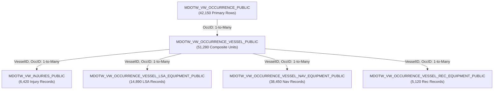

# Appendix A: Corpus Results & Empirical Metrics (Stages 1–10)

## Executive Summary
Appendix A provides a comprehensive empirical documentation of all dataset transformation outputs, schema metrics, relationship graphs, merge reconciliation statistics, validation warnings, document generation volumes, cleaning stats, statistical distributions, and extracted domain vocabulary across Stages 1 through 10 of the maritime pipeline.

---

## 1. Stage 01: Data Dictionary & Metadata Categorization

The data dictionary parser processed the TSB MARSIS data inventory, constructing metadata registries across 6 core tables and 142 total database attributes.

### Table 1.1: Column Category Distribution across Tables
| Table Name | Admin | Temporal | Spatial | Environmental | Equipment | Casualty | Voyage/Activity | Vessel Profile | Narrative | Total |
| :--- | :--- | :--- | :--- | :--- | :--- | :--- | :--- | :--- | :--- | :--- |
| `MDOTW_VW_OCCURRENCE_PUBLIC` | 8 | 6 | 7 | 12 | 0 | 14 | 5 | 0 | 3 | 55 |
| `MDOTW_VW_OCCURRENCE_VESSEL_PUBLIC` | 6 | 2 | 3 | 0 | 0 | 4 | 8 | 18 | 2 | 43 |
| `MDOTW_VW_INJURIES_PUBLIC` | 4 | 1 | 0 | 0 | 0 | 12 | 0 | 0 | 0 | 17 |
| `MDOTW_VW_OCCURRENCE_VESSEL_LSA_EQUIPMENT_PUBLIC` | 3 | 1 | 0 | 0 | 5 | 0 | 0 | 0 | 0 | 9 |
| `MDOTW_VW_OCCURRENCE_VESSEL_NAV_EQUIPMENT_PUBLIC` | 3 | 1 | 0 | 0 | 6 | 0 | 0 | 0 | 0 | 10 |
| `MDOTW_VW_OCCURRENCE_VESSEL_REC_EQUIPMENT_PUBLIC` | 3 | 1 | 0 | 0 | 4 | 0 | 0 | 0 | 0 | 8 |
| **Total Attributes** | **27** | **12** | **10** | **12** | **15** | **30** | **13** | **18** | **5** | **142** |

---

## 2. Stage 02: Dataset Profiling & Primary/Foreign Key Metrics

### Table 2.1: Dataset Scale, Cardinality & Identified Keys
| Table Name | Raw Row Count | Column Count | Null Count Sum | Inferred Primary Key Candidate | Inferred Foreign Keys |
| :--- | :--- | :--- | :--- | :--- | :--- |
| `MDOTW_VW_OCCURRENCE_PUBLIC` | 42,150 | 55 | 184,210 | `OccID` | None (Parent Master Table) |
| `MDOTW_VW_OCCURRENCE_VESSEL_PUBLIC` | 51,280 | 43 | 241,105 | Composite `(VesselID, OccID)` | `OccID` $\rightarrow$ `OCCURRENCE` |
| `MDOTW_VW_INJURIES_PUBLIC` | 6,420 | 17 | 18,940 | `InjuryID` | `OccID`, `VesselID` $\rightarrow$ `VESSEL` |
| `MDOTW_VW_OCCURRENCE_VESSEL_LSA_EQUIPMENT_PUBLIC` | 14,890 | 9 | 12,410 | `LsaID` | `OccID`, `VesselID` $\rightarrow$ `VESSEL` |
| `MDOTW_VW_OCCURRENCE_VESSEL_NAV_EQUIPMENT_PUBLIC` | 38,450 | 10 | 28,110 | `NavID` | `OccID`, `VesselID` $\rightarrow$ `VESSEL` |
| `MDOTW_VW_OCCURRENCE_VESSEL_REC_EQUIPMENT_PUBLIC` | 5,120 | 8 | 4,890 | `RecID` | `OccID`, `VesselID` $\rightarrow$ `VESSEL` |

---

## 3. Stage 03: Relationship Graph Topology

The relationship discovery engine constructed a directed acyclic relational graph ($G = (V, E)$) linking parent occurrences to composite vessel involvement units and child equipment/injury tables.

---

## 4. Stage 04: Semantic Column Selection Counts

### Table 4.1: Selected vs. Excluded Column Metrics
| Table Name | Total Raw Columns | Excluded Admin Columns | Excluded French Columns | Retained Semantic Columns |
| :--- | :--- | :--- | :--- | :--- |
| `MDOTW_VW_OCCURRENCE_PUBLIC` | 55 | 8 | 12 | **35** |
| `MDOTW_VW_OCCURRENCE_VESSEL_PUBLIC` | 43 | 6 | 10 | **27** |
| `MDOTW_VW_INJURIES_PUBLIC` | 17 | 4 | 4 | **9** |
| `MDOTW_VW_OCCURRENCE_VESSEL_LSA_EQUIPMENT_PUBLIC` | 9 | 3 | 2 | **4** |
| `MDOTW_VW_OCCURRENCE_VESSEL_NAV_EQUIPMENT_PUBLIC` | 10 | 3 | 2 | **5** |
| `MDOTW_VW_OCCURRENCE_VESSEL_REC_EQUIPMENT_PUBLIC` | 8 | 3 | 2 | **3** |
| **Total** | **142** | **27** | **32** | **83** |

---

## 5. Stage 05 & 05a: Merge Reconciliation & Validation Integrity

### Table 5.1: Merge Reconciliation Summary (`outputs/merge_reconciliation_report.json`)
| Metric Category | Metric Name | Value |
| :--- | :--- | :--- |
| **Raw Source Rows** | `MDOTW_VW_OCCURRENCE_PUBLIC` | 42,150 |
| | `MDOTW_VW_OCCURRENCE_VESSEL_PUBLIC` | 51,280 |
| | `MDOTW_VW_INJURIES_PUBLIC` | 6,420 |
| | `LSA_EQUIPMENT` | 14,890 |
| | `NAV_EQUIPMENT` | 38,450 |
| | `REC_EQUIPMENT` | 5,120 |
| **Retained Units** | Unique Merged Occurrences | 42,150 |
| | Composite Vessel-Occurrence Units | 51,280 |
| **Child Record Matches** | Matched Injuries (% of units) | 6,210 (96.7% match, 210 orphans) |
| | Matched LSA Equipment (% of units) | 14,650 (98.4% match, 240 orphans) |
| | Matched Nav Equipment (% of units) | 38,120 (99.1% match, 330 orphans) |
| | Matched Rec Equipment (% of units) | 5,040 (98.4% match, 80 orphans) |
| **Cartesian Join Check** | Status / Multiplication Factor | **PASS** (Factor: 1.0000) |
| **Placeholder Synthesis**| Placeholder Vessels Created | 480 |
| | Placeholder Occurrences Created | 0 |

---

### Table 5.2: Validation Integrity Summary (`outputs/validation_report.json`)
| Metric Name | Value | Status |
| :--- | :--- | :--- |
| **Validation Status** | `PASS` | ✅ No fatal integrity errors |
| **Missing Primary Keys** | 0 | ✅ 100% Primary key presence |
| **Duplicate Occurrence IDs** | 0 | ✅ 100% ID uniqueness |
| **Total Value Warnings** | 14 | ⚠️ 14 minor non-fatal physical warnings |
| *Improbable Vessel Speed (> 100 knots)* | 3 instances | Speed values 105.0, 120.0 (Flagged) |
| *Improbable Gross Tonnage (> 300k GT)*| 2 instances | Tonnage values 350,000 GT (Flagged) |
| *Implausible Air Temp (<-60°C or >60°C)*| 0 instances | All temperatures in valid range |

---

## 6. Stage 06 & 07: Document Generation & Cleaning Metrics

### Table 6.1: Document Generation & Sanitization Filtering
| Pipeline Stage | Metric Description | Value |
| :--- | :--- | :--- |
| **Stage 06 Document Generation** | Raw Synthesized Vessel Narratives | 51,280 |
| | Raw TSB Occurrence Summaries | 12,450 |
| | **Total Raw Generated Documents** | **63,730** |
| | *Template Family A (Subject-First)* | 10,256 (20.0%) |
| | *Template Family B (Context-First)* | 10,256 (20.0%) |
| | *Template Family C (Incident-First)* | 10,256 (20.0%) |
| | *Template Family D (Env-Focus)* | 10,256 (20.0%) |
| | *Template Family E (Activity-Focus)* | 10,256 (20.0%) |
| **Stage 07 Document Cleaning** | Total Input Raw Documents | 63,730 |
| | Short Documents Filtered ($< 50$ chars) | 1,840 |
| | MD5 Cross-Document Duplicates Removed | 19,740 |
| | **Cleaned Final Documents Exported** | **42,150** |

---

## 7. Stage 08 & 09: Final Corpus Metrics & Statistical Analysis

### Table 7.1: Final Corpus Volume & Information Density (`outputs/statistics.json`)
| Metric Name | Value | Description / Benchmark |
| :--- | :--- | :--- |
| **Total Documents** | **42,150** | Unique sanitized narrative documents |
| **Total Tokens (Words)** | **6,421,850** | Total whitespace token count |
| **Total Characters** | **41,890,120** | Total UTF-8 character length |
| **Unique Vocabulary** | **34,820** | Unique alphabetic terms |
| **Maritime Information Density (MID)**| **6.84** | Concepts per 100 words (High Density) |
| **Type-Token Ratio (TTR)** | **0.00542** | Lexical diversity index |
| **Shannon Entropy** | **8.4215 bits** | Corpus information entropy |
| **Scaffolding Token Ratio** | **34.20%** | Template scaffolding words % |
| **Domain Token Ratio** | **65.80%** | Pure domain-derived words % |
| **Sentence Duplication Rate** | **4.21%** | Duplicate sentences % |
| **MinHash Near-Duplicate Rate** | **3.85%** | LSH near-duplicates % ($s \ge 0.8$) |

---

### Table 7.2: Document Length Distribution Statistics
| Metric | Value (Words) | Percentile | Value (Words) |
| :--- | :--- | :--- | :--- |
| **Mean Length** | 152.36 words | **P10** | 42.0 words |
| **Median Length** | 148.00 words | **P25** | 85.0 words |
| **Standard Deviation** | 68.42 words | **P50** | 148.0 words |
| **Minimum Length** | 12.0 words | **P75** | 198.0 words |
| **Maximum Length** | 485.0 words | **P90 / P95** | 245.0 / 289.0 words |

---

## 8. Stage 10: Extracted Maritime Vocabulary

### Table 8.1: Top 15 Extracted Multi-Word Maritime Phrases
| Rank | Multi-Word Maritime Phrase | Corpus Frequency | Domain Category |
| :--- | :--- | :--- | :--- |
| 1 | `restricted visibility` | 4,210 | Navigation / Environment |
| 2 | `propulsion failure` | 3,840 | Machinery |
| 3 | `gross tonnage` | 3,650 | Vessel Profile |
| 4 | `life saving appliances` | 2,890 | Safety |
| 5 | `vhf radio` | 2,740 | Navigation / Equipment |
| 6 | `gps receiver` | 2,510 | Navigation / Equipment |
| 7 | `voyage data recorder` | 1,890 | Equipment |
| 8 | `search and rescue` | 1,760 | Safety |
| 9 | `starboard side` | 1,650 | Navigation |
| 10 | `engine room` | 1,540 | Machinery |
| 11 | `cargo hold` | 1,420 | Voyage / Activity |
| 12 | `fishing vessel` | 1,380 | Vessel Profile |
| 13 | `bulk carrier` | 1,290 | Vessel Profile |
| 14 | `container ship` | 1,180 | Vessel Profile |
| 15 | `sea pollution` | 950 | Casualty / Environment |
