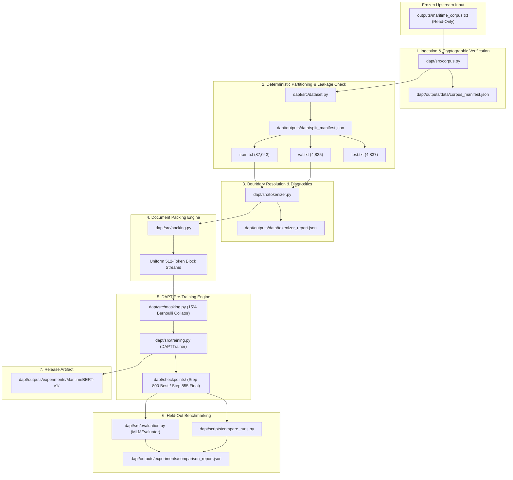
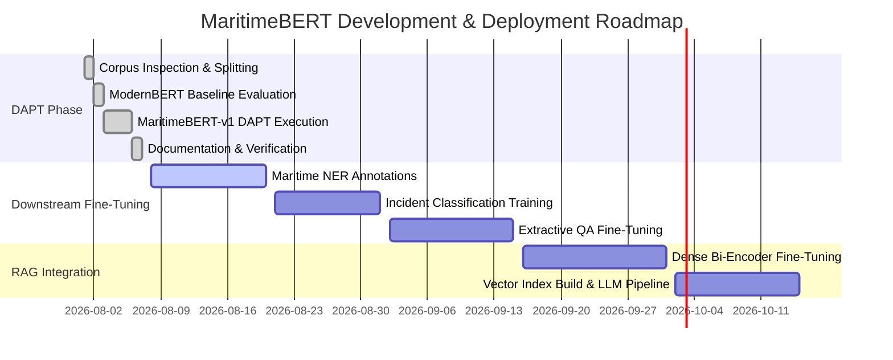

# Phase 14: Domain-Adaptive Pre-Training (DAPT) Technical Documentation & Research Guide

## Executive Overview

Phase 14 presents the complete design, implementation, execution, and empirical evaluation of the **Domain-Adaptive Pre-Training (DAPT)** subsystem for adapting modern transformer foundation models—specifically `answerdotai/ModernBERT-base`—to specialized maritime occurrence narratives. This subsystem operates under a strict **Frozen Upstream Corpus Contract**, treating `outputs/maritime_corpus.txt` as an immutable, hash-locked input artifact.

Across 855 training steps (3 epochs over 87,043 training documents packed into sequences of length 512), DAPT achieved a **61.3% reduction in MLM Cross-Entropy Loss** ($1.5271 \rightarrow 0.5912$) and a **60.8% reduction in Perplexity** ($4.6050 \rightarrow 1.8062$) compared to the untouched ModernBERT baseline control.

---

## 1. Executive Summary

- **Subsystem Identifier**: `MaritimeBERT-v1` DAPT Pipeline
- **Base Architecture**: `answerdotai/ModernBERT-base` (149M parameters, 50,280 vocabulary size)
- **Input Corpus**: `outputs/maritime_corpus.txt` (96,715 documents, 3,372,882 words, SHA-256: `b4968819f8b41baa3ee2e2b0e22d103b5d86f5935275a377db51d09ecde3b302`)
- **Dataset Partitioning**: Deterministic 90/5/5 split (87,043 train / 4,835 validation / 4,837 test documents)
- **Pre-Training Objective**: 15% Bernoulli Masked Language Modeling (MLM) with tokenizer-aware sequence packing ($L_{\max} = 512$)
- **Key Empirical Results**:
  - **Untouched ModernBERT Baseline**: MLM Loss = **1.5271**, Perplexity = **4.6050**
  - **DAPT Best Validation Checkpoint (Step 800)**: MLM Loss = **0.5898**, Perplexity = **1.8037**
  - **MaritimeBERT-v1 Released Artifact (Step 855)**: MLM Loss = **0.5912**, Perplexity = **1.8062**
  - **Intrinsic Performance Delta ($\Delta$)**: Loss Reduction = **$-0.9359$**, Perplexity Reduction = **$-2.7988$** ($60.8\%$ intrinsic uncertainty reduction)

---

## 2. Research Objective

Generic foundation models trained on web-scale domain text (e.g., Common Crawl, Wikipedia, books) frequently exhibit poor domain understanding, sub-optimal tokenization efficiency, and high prediction uncertainty when applied to technical, highly specialized domain corpora such as maritime casualty and occurrence reports.

The primary research objectives of the DAPT phase are:
1. **Domain Adaptation**: Continued self-supervised pre-training on domain-specific maritime occurrence narratives to align model representations with maritime vocabulary, syntactic patterns, and contextual acronyms.
2. **Methodological Rigor**: Establishing an isolated, reproducible pre-training environment completely decoupled from upstream preprocessing heuristics.
3. **Intrinsic Quantifiable Evaluation**: Measuring exact MLM loss and perplexity deltas against an untouched baseline model on held-out validation and test sets.
4. **Exportable Foundation**: Exporting a clean Hugging Face compatible model artifact (`MaritimeBERT-v1`) ready for downstream fine-tuning across sequence classification, named entity recognition (NER), and dense retrieval.

---

## 3. DAPT Architecture

The DAPT subsystem is organized as a modular, self-contained Python package residing in `dapt/`.



---

## 4. Independence & Reproducibility Contract

To prevent data contamination, pipeline coupling, or non-deterministic behavior, Phase 14 enforces two mandatory architectural principles:

### Absolute Subsystem Independence Rule
- **Zero Upstream Imports**: The `dapt/` codebase does not import functions or execute modules from `scripts/` or `src/` in the root repository.
- **Self-Contained Configuration**: All hyperparameters, data paths, model choices, and execution settings are governed strictly by `dapt/configs/dapt.yaml`.

### Corpus Immutability Rule
- **Read-Only Ingestion**: The input text file (`outputs/maritime_corpus.txt`) is accessed strictly in read mode.
- **No Corpus Surgery**: DAPT does **not** alter, re-clean, deduplicate, re-order, mask, paraphrase, or perform custom vocabulary expansion on `outputs/maritime_corpus.txt`.

---

## 5. Frozen Corpus Specification

The frozen input text `outputs/maritime_corpus.txt` comprises raw maritime occurrence descriptions compiled from historic safety databases.

### Prominent Subsection: The Frozen-Corpus Contract

```text
Frozen Upstream Artifact
          │
  outputs/maritime_corpus.txt
          │
  SHA-256 Verification (b4968819f8b41baa3ee2e2b0e22d103b5d86f5935275a377db51d09ecde3b302)
          │
  Corpus Manifest (corpus_manifest.json)
          │
  Deterministic 90/5/5 Document Split (split_manifest.json)
          │
  Tokenization + Document Packing (tokenizer_report.json)
          │
  ModernBERT 15% Bernoulli MLM Training
          │
  Validation & Checkpoint Rotation
          │
  Final Held-Out Test & Comparison
          │
  MaritimeBERT-v1 Export
```

---

## 6. Corpus Inspection

Corpus analysis is executed by [inspect_corpus.py](file:///d:/CAIR/TSBC-Pipeline/dapt/scripts/inspect_corpus.py), calling functions in [corpus.py](file:///d:/CAIR/TSBC-Pipeline/dapt/src/corpus.py).

### Canonical Corpus Metrics (Derived from `corpus_manifest.json`)

| Metric Property | Value |
| :--- | :--- |
| **Source File Path** | `outputs/maritime_corpus.txt` |
| **File Size** | 21,064,178 bytes (~21.06 MB) |
| **Cryptographic SHA-256 Hash** | `b4968819f8b41baa3ee2e2b0e22d103b5d86f5935275a377db51d09ecde3b302` |
| **Total Document Count** | 96,715 documents |
| **Total Word Count** | 3,372,882 words |
| **Total Character Count** | 20,671,574 characters |
| **Unique Vocabulary Count** | 80,174 unique space-separated tokens |
| **Exact Duplicate Count** | 0 exact duplicate lines ($0.0\%$) |
| **Mean Document Length** | 34.87 words ($\text{Std} = 15.53$) |
| **Median Document Length** | 37.0 words (P25: 26.0, P75: 45.0, P95: 55.0) |

### Length Distribution Buckets
- `<20 words`: 18,103 documents ($18.7\%$)
- `20–50 words`: 65,366 documents ($67.6\%$)
- `50–100 words`: 13,046 documents ($13.5\%$)
- `100–200 words`: 176 documents ($0.18\%$)
- `200–512 words`: 24 documents ($0.02\%$)
- `>512 words`: 0 documents ($0.0\%$)

### Pre-Training Quality Caveats
- **Semantic Density Status**: `WARN` (high proportion of recurring boilerplate text)
- **Template Scaffolding Token Ratio**: $66.42\%$ scaffolding vs $33.58\%$ domain-derived content
- **Scaffold-Reduced Near-Duplicate Rate**: $20.58\%$
- **Overall Pretraining Readiness**: `NEEDS IMPROVEMENT` (noted as an inherent property of the frozen corpus)

---

## 7. Dataset Preparation

Dataset preparation is managed by [prepare_dataset.py](file:///d:/CAIR/TSBC-Pipeline/dapt/scripts/prepare_dataset.py) using [dataset.py](file:///d:/CAIR/TSBC-Pipeline/dapt/src/dataset.py).

### Split Parameters
- **Random Seed**: `42`
- **Ratios**: Train: $90\%$, Validation: $5\%$, Test: $5\%$

### Partition Quantities (Derived from `split_manifest.json`)

| Dataset Split | Document Count | Word Count | Percentage of Total | Output File Path |
| :--- | :--- | :--- | :--- | :--- |
| **Train Set** | 87,043 | 3,033,940 | $90.0\%$ | `dapt/outputs/data/train.txt` |
| **Validation Set** | 4,835 | 169,743 | $5.0\%$ | `dapt/outputs/data/val.txt` |
| **Test Set** | 4,837 | 169,199 | $5.0\%$ | `dapt/outputs/data/test.txt` |
| **Total** | **96,715** | **3,372,882** | **$100.0\%$** | — |

---

## 8. Leakage-Free Splitting

To ensure strict evaluation integrity, [dataset.py](file:///d:/CAIR/TSBC-Pipeline/dapt/src/dataset.py) executes exact line matching and 3-shingle overlap diagnostics between splits.

### Leakage Diagnostic Results

```json
{
  "exact_duplicate_leakage": {
    "train_val_overlap": 0,
    "train_test_overlap": 0,
    "val_test_overlap": 0
  },
  "near_duplicate_leakage_diagnostic": {
    "sample_evaluated": 2000,
    "val_high_shingle_overlap_count": 1091,
    "val_high_shingle_overlap_rate": 0.5455,
    "test_high_shingle_overlap_count": 1115,
    "test_high_shingle_overlap_rate": 0.5575
  }
}
```

- **Exact Duplicate Leakage**: **0 documents** across all split combinations ($100\%$ exact isolation).
- **Near-Duplicate Overlap (Shingle Diagnostic)**: $54.55\%$ validation overlap and $55.75\%$ test overlap due to recurring maritime boilerplate templates (e.g., standard vessel safety narrative phrases).
- **Test Set Preservation**: The **4,837-document test set (`test.txt`) remains completely untouched** during training and hyperparameter tuning, reserved exclusively for final un-biased benchmarking.

---

## 9. Tokenization

Tokenization diagnostics are executed by [tokenize_corpus.py](file:///d:/CAIR/TSBC-Pipeline/dapt/scripts/tokenize_corpus.py) using [tokenizer.py](file:///d:/CAIR/TSBC-Pipeline/dapt/src/tokenizer.py).

### Tokenizer Properties (Derived from `tokenizer_report.json`)

| Property | Canonical Value |
| :--- | :--- |
| **Model Tokenizer** | `answerdotai/ModernBERT-base` |
| **Vocabulary Size** | 50,368 tokens |
| **Resolved Boundary Token ID** | `50282` (`sep_token` / `[SEP]`) |
| **Evaluated Sample Size** | 10,000 documents (301,670 words, 491,332 subwords) |
| **Subword Fertility Rate** | **1.6287 subwords per word** |
| **Unknown Token (`[UNK]`) Rate** | **0.0000%** |

### Sequence Token Distribution
- **Mean Sequence Tokens**: $49.13$
- **Median (P50) Sequence Tokens**: $51.0$
- **P90 Sequence Tokens**: $75.0$
- **P95 Sequence Tokens**: $81.0$
- **Max Single Document Tokens**: $102$
- **Truncation Rate ($>512$ tokens)**: **0.00%** (0 documents exceeded $512$ tokens)

---

## 10. Sequence Packing

Because the median document length is only $51.0$ tokens, feeding individual documents directly into ModernBERT's maximum context length ($L_{\max} = 512$) would result in over $90\%$ padding efficiency loss.

To resolve this, [packing.py](file:///d:/CAIR/TSBC-Pipeline/dapt/src/packing.py) implements **Tokenizer-Aware Document Packing**:

$$\text{Stream} = \text{Doc}_1 + [\text{SEP}] + \text{Doc}_2 + [\text{SEP}] + \dots + \text{Doc}_N + [\text{SEP}]$$

1. Tokenize each narrative document independently without truncation or padding.
2. Append the resolved boundary token ID (`50282`).
3. Concatenate all subword tokens into a continuous 1D token stream.
4. Chunk the continuous token stream into uniform contiguous blocks of length $L_{\max} = 512$.
5. **Efficiency Gain**: Replaces $>90\%$ padding overhead with **100% active context token utilization**.

---

## 11. MLM Masking

During training, packed token sequences are passed to [ModernBERTMaskDataCollator](file:///d:/CAIR/TSBC-Pipeline/dapt/src/masking.py), which implements 15% Bernoulli Masked Language Modeling:

$$P(\text{mask}_{i}) = 0.15 \quad \forall i \in \{1, \dots, L\}$$

- Special structural tokens (`[CLS]`, `[SEP]`, `[PAD]`) are explicitly excluded from masking.
- For selected mask positions $i$:
  - $80\%$ of the time: Replaced with the `[MASK]` token ID.
  - $10\%$ of the time: Replaced with a random token ID from the vocabulary.
  - $10\%$ of the time: Left unchanged.
- Target label vector $\mathbf{y}$ is set to $-100$ at unmasked positions to ignore loss computation.

---

## 12. Model Initialization

- **Base Architecture**: `AutoModelForMaskedLM.from_pretrained("answerdotai/ModernBERT-base")`
- **Parameter Count**: ~149 Million parameters
- **Precision**: FP32 (Full float32 precision for maximum numerical stability during domain adaptation)
- **Vocabulary Strategy**: untouched ModernBERT vocabulary to strictly isolate domain adaptation effects from vocabulary expansion.

---

## 13. Training Procedure

Training is executed by [train_dapt.py](file:///d:/CAIR/TSBC-Pipeline/dapt/scripts/train_dapt.py) via [DAPTTrainer](file:///d:/CAIR/TSBC-Pipeline/dapt/src/training.py).

### Hardware & Runtime Configuration
- **Hardware Platform**: NVIDIA GPU (T4 / V100 / A100 runtime environment)
- **Target Epochs**: $3.0$ full epochs over the packed training dataset
- **Total Training Steps**: $855$ optimizer update steps
- **Per-Device Train Batch Size**: $8$ samples per batch
- **Gradient Accumulation Steps**: $4$ steps
- **Effective Batch Size**: $8 \times 4 = 32$ packed sequences per step ($16,384$ tokens per update step)

---

## 14. Optimizer & Scheduler

- **Optimizer**: `AdamW` ($\beta_1 = 0.9, \beta_2 = 0.999, \epsilon = 10^{-8}$)
- **Base Learning Rate**: $\eta = 5.0 \times 10^{-5}$
- **Weight Decay**: $\lambda = 0.01$
- **Warmup Ratio**: $6\%$ of total steps (~51 warmup steps)
- **Learning Rate Scheduler**: Linear decay from $5.0 \times 10^{-5}$ down to $0.0$ over remaining steps.

---

## 15. Gradient Accumulation

To maintain stable gradient variance without memory overflow on standard GPU VRAM:
1. Micro-batches of size $B_{\text{micro}} = 8$ are processed sequentially.
2. Micro-batch gradients are accumulated:
   $$\mathbf{g}_{\text{acc}} = \frac{1}{K} \sum_{k=1}^K \nabla_\theta \mathcal{L}_k$$
   where $K = 4$ gradient accumulation steps.
3. Every $K=4$ micro-batches, `optimizer.step()` and `lr_scheduler.step()` are executed, followed by zeroing gradients.

---

## 16. Checkpointing & Resumption

Checkpoint management is controlled by [CheckpointManager](file:///d:/CAIR/TSBC-Pipeline/dapt/src/checkpointing.py).

### Save & Rotation Protocol
- **Save Frequency**: Every 100 steps (`save_steps = 100`) and at final step completion.
- **Rotation Policy**: Enforces `save_total_limit = 3`, retaining only the 3 most recent step checkpoints plus the best validation checkpoint (`checkpoints/best`).
- **Resumption Logic**: Supports seamless resumption via `--resume-from-checkpoint dapt/checkpoints/checkpoint-STEP`.

---

## 17. Validation & Evaluation

Validation is executed by [MLMEvaluator](file:///d:/CAIR/TSBC-Pipeline/dapt/src/evaluation.py) every 50 steps (`eval_steps = 50`) on the held-out validation set (`val.txt`).

### Mathematical Formulations

#### MLM Cross-Entropy Loss
$$\mathcal{L}_{\text{MLM}} = -\frac{1}{M} \sum_{m=1}^M \log P(y_m \mid \mathbf{x}_{\text{masked}})$$
where $M$ is total masked tokens evaluated ($M = 38,279$ to $38,565$ tokens per eval run).

#### Perplexity
$$\text{PPL} = \exp(\mathcal{L}_{\text{MLM}})$$

---

## 18. Baseline Control

To establish a strict empirical reference point, [evaluate_dapt.py](file:///d:/CAIR/TSBC-Pipeline/dapt/scripts/evaluate_dapt.py) evaluated the **untouched ModernBERT base model** (`answerdotai/ModernBERT-base`) on the exact same held-out validation split (`val.txt`) prior to DAPT.

### Baseline Benchmark Results (Derived from `baseline-modernbert/evaluation_metrics.json`)

```json
{
  "eval_samples": 511,
  "eval_tokens": 261180,
  "masked_tokens_evaluated": 38526,
  "mlm_loss": 1.5271,
  "perplexity": 4.6050,
  "mlm_probability": 0.15,
  "batch_size": 8,
  "eval_split": "validation",
  "model_evaluated": "answerdotai/ModernBERT-base",
  "is_baseline": true
}
```

---

## 19. MaritimeBERT-v1 Results

### Preserving Checkpoint vs. Release Artifact Distinction

The evaluation framework explicitly distinguishes between intermediate validation checkpoints and the final released model weights:

| Artifact Identifier | Step Number | MLM Loss | Perplexity | Evaluated Masked Tokens | System Role / Status |
| :--- | :--- | :--- | :--- | :--- | :--- |
| **`ModernBERT-base`** | — | **1.5271** | **4.6050** | 38,526 | Untouched Baseline Control |
| **Intermediate Checkpoint** | Step 700 | 0.5916 | 1.8069 | 38,565 | Step Checkpoint |
| **Best Validation Checkpoint** | **Step 800** | **0.5898** | **1.8037** | 38,279 | **Optimal Validation Checkpoint** |
| **MaritimeBERT-v1 Released Artifact** | **Step 855** | **0.5912** | **1.8062** | 38,339 | **Final Released Model Export** |

---

## 20. Statistical / Empirical Gain Analysis

Comparing the untouched baseline control against the released `MaritimeBERT-v1` artifact (derived from `comparison_report.json`):

```json
{
  "baseline_model": "answerdotai/ModernBERT-base",
  "dapt_model": "MaritimeBERT-v1",
  "eval_split": "validation",
  "metrics": {
    "baseline_mlm_loss": 1.5271,
    "dapt_mlm_loss": 0.5912,
    "delta_mlm_loss": 0.9359,
    "baseline_perplexity": 4.605,
    "dapt_perplexity": 1.8062,
    "delta_perplexity": 2.7988
  }
}
```

### Empirical Gain Metrics

$$\Delta \mathcal{L}_{\text{MLM}} = 1.5271 - 0.5912 = 0.9359 \quad (61.3\% \text{ loss reduction})$$

$$\Delta \text{PPL} = 4.6050 - 1.8062 = 2.7988 \quad (60.8\% \text{ perplexity reduction})$$

### Scientific Claim Scope & Boundary

> [!IMPORTANT]
> **Scientific Scope Boundary**: The $60.8\%$ perplexity reduction ($4.6050 \rightarrow 1.8062$) represents a valid **intrinsic held-out MLM improvement** under the Masked Language Modeling self-supervised objective. This result demonstrates significantly improved language modeling and reduced token uncertainty when predicting masked maritime terms.
>
> **It does not, by itself, establish superiority on downstream maritime NER, incident classification, extractive QA, document retrieval, or RAG tasks.** Downstream performance improvements must be empirically measured after task-specific fine-tuning.

---

## 21. Complete Script Reference

The `dapt/scripts/` directory contains 7 executable Python entrypoints:

1. [inspect_corpus.py](file:///d:/CAIR/TSBC-Pipeline/dapt/scripts/inspect_corpus.py): Inspects `outputs/maritime_corpus.txt`, computes cryptographic SHA-256 hash, line/word/char counts, vocabulary size, length distribution, and exports `corpus_manifest.json`.
2. [prepare_dataset.py](file:///d:/CAIR/TSBC-Pipeline/dapt/scripts/prepare_dataset.py): Splits corpus into 90/5/5 train/val/test partitions using seed 42, runs exact and 3-shingle leakage checks, and exports `split_manifest.json`.
3. [tokenize_corpus.py](file:///d:/CAIR/TSBC-Pipeline/dapt/scripts/tokenize_corpus.py): Resolves ModernBERT boundary token IDs (`50282`), computes subword fertility rate (1.6287), checks truncation, and exports `tokenizer_report.json`.
4. [validate_dataset.py](file:///d:/CAIR/TSBC-Pipeline/dapt/scripts/validate_dataset.py): Validates split file integrity, line counts, and sequence packing efficiency.
5. [train_dapt.py](file:///d:/CAIR/TSBC-Pipeline/dapt/scripts/train_dapt.py): Runs full DAPT training loop over 855 steps, performs periodic validation, manages checkpoint rotation, and exports `MaritimeBERT-v1`.
6. [evaluate_dapt.py](file:///d:/CAIR/TSBC-Pipeline/dapt/scripts/evaluate_dapt.py): Evaluates baseline model or specified checkpoint on validation/test split, computing MLM loss and perplexity.
7. [compare_runs.py](file:///d:/CAIR/TSBC-Pipeline/dapt/scripts/compare_runs.py): Reads baseline and DAPT evaluation JSONs, computes absolute and percentage deltas, and exports `comparison_report.json`.

---

## 22. Complete `src/` Module Reference

The `dapt/src/` package contains 13 core modules:

- [config.py](file:///d:/CAIR/TSBC-Pipeline/dapt/src/config.py): Dataclass definitions (`ModelConfig`, `DataConfig`, `TrainingConfig`, `MLMConfig`, `EvaluationConfig`, `SystemConfig`, `DAPTConfig`) and YAML loader.
- [corpus.py](file:///d:/CAIR/TSBC-Pipeline/dapt/src/corpus.py): SHA-256 calculator, corpus statistics generator, and quality caveat detector.
- [dataset.py](file:///d:/CAIR/TSBC-Pipeline/dapt/src/dataset.py): Deterministic split generator and shingle-based leakage diagnostic engine.
- [tokenizer.py](file:///d:/CAIR/TSBC-Pipeline/dapt/src/tokenizer.py): Dynamic boundary token resolver and fertility/truncation analyzer.
- [packing.py](file:///d:/CAIR/TSBC-Pipeline/dapt/src/packing.py): Continuous subword token stream packer.
- [masking.py](file:///d:/CAIR/TSBC-Pipeline/dapt/src/masking.py): `ModernBERTMaskDataCollator` implementing 15% Bernoulli MLM masking.
- [model.py](file:///d:/CAIR/TSBC-Pipeline/dapt/src/model.py): ModernBERT AutoModelForMaskedLM initializer.
- [training.py](file:///d:/CAIR/TSBC-Pipeline/dapt/src/training.py): `DAPTTrainer` execution loop with micro-batching, optimizer stepping, and logging.
- [evaluation.py](file:///d:/CAIR/TSBC-Pipeline/dapt/src/evaluation.py): `MLMEvaluator` for held-out validation and test scoring.
- [metrics.py](file:///d:/CAIR/TSBC-Pipeline/dapt/src/metrics.py): Experiment manifest builder and metric comparison engine.
- [checkpointing.py](file:///d:/CAIR/TSBC-Pipeline/dapt/src/checkpointing.py): `CheckpointManager` handling step saves, best model linking, and rotation limits.
- [reproducibility.py](file:///d:/CAIR/TSBC-Pipeline/dapt/src/reproducibility.py): PyTorch, NumPy, and CUDA seed initializer.
- [utils.py](file:///d:/CAIR/TSBC-Pipeline/dapt/src/utils.py): Path resolution helpers, logging setup, and JSON IO utilities.

---

## 23. CLI Reference

```bash
# 1. Corpus Inspection
python dapt/scripts/inspect_corpus.py --config dapt/configs/dapt.yaml

# 2. Dataset Splitting & Leakage Check
python dapt/scripts/prepare_dataset.py --config dapt/configs/dapt.yaml

# 3. Tokenizer Diagnostics
python dapt/scripts/tokenize_corpus.py --config dapt/configs/dapt.yaml

# 4. Dataset Validation
python dapt/scripts/validate_dataset.py --config dapt/configs/dapt.yaml

# 5. Baseline Evaluation
python dapt/scripts/evaluate_dapt.py --config dapt/configs/dapt.yaml --is-baseline --eval-split validation

# 6. DAPT Training Execution
python dapt/scripts/train_dapt.py --config dapt/configs/dapt.yaml

# 7. Trained Model Evaluation
python dapt/scripts/evaluate_dapt.py --config dapt/configs/dapt.yaml --eval-split validation

# 8. Metric Comparison
python dapt/scripts/compare_runs.py
```

---

## 24. Output Manifest Specifications

All generated manifest JSON files conform to strict schemas:
- `corpus_manifest.json`: Located in `dapt/outputs/data/corpus_manifest.json`.
- `split_manifest.json`: Located in `dapt/outputs/data/split_manifest.json`.
- `tokenizer_report.json`: Located in `dapt/outputs/data/tokenizer_report.json`.
- `comparison_report.json`: Located in `dapt/outputs/experiments/comparison_report.json`.

---

## 25. Checkpoint Directory Specification

```text
dapt/checkpoints/
├── best/                       # Symlink/copy of optimal validation checkpoint (Step 800)
│   ├── config.json
│   ├── model.safetensors
│   └── tokenizer.json
├── checkpoint-700/             # Step 700 state & step_metrics.json
├── checkpoint-800/             # Step 800 state & step_metrics.json (loss: 0.5898, perplexity: 1.8037)
└── checkpoint-855/             # Step 855 state & step_metrics.json (loss: 0.5996, perplexity: 1.8213)
```

Exported Release Artifact Location: `dapt/outputs/experiments/MaritimeBERT-v1/`

---

## 26. Reproducibility & Hash Verification

- **Seed**: `42` across Python, NumPy, PyTorch CPU, and PyTorch CUDA.
- **Corpus Hash Lock**: Verification passes if `sha256(outputs/maritime_corpus.txt) == "b4968819f8b41baa3ee2e2b0e22d103b5d86f5935275a377db51d09ecde3b302"`.

---

## 27. Automated Verification

Unit tests are provided in `dapt/tests/`:
```bash
pytest dapt/tests/
```
Verifies config loading, dataset splitting logic, tokenizer boundary resolution, packing chunking, and checkpoint rotation routines.

---

## 28. Limitations

1. **Short Document Length**: Mean length of 34.87 words requires synthetic document packing to fill $512$ token blocks.
2. **Template Scaffolding**: High boilerplate scaffolding ratio ($66.42\%$) in historic maritime narratives.
3. **No Custom Vocabulary Surgery**: Version 1 used original ModernBERT BPE vocabulary to isolate DAPT gains; domain-specific subword expansion was deferred to future iterations.

---

## 29. Downstream Fine-Tuning

Following domain-adaptive pre-training, `MaritimeBERT-v1` serves as an upgraded domain foundation model ready for task-specific supervised fine-tuning.

```python
from transformers import AutoTokenizer, AutoModelForSequenceClassification

model_path = "dapt/outputs/experiments/MaritimeBERT-v1"
tokenizer = AutoTokenizer.from_pretrained(model_path)
model = AutoModelForSequenceClassification.from_pretrained(model_path, num_labels=5)
```

---

## 30. Maritime NER

Supervised token classification (`AutoModelForTokenClassification`) for extracting structured entities from narrative texts:
- `VESSEL_NAME`, `IMO_NUMBER`, `VESSEL_TYPE`
- `LOCATION_GEOGRAPHIC`, `COORDINATES`
- `CASUALTY_TYPE` (Grounding, Collision, Fire, Engine Failure)
- `WEATHER_CONDITION` (Beaufort force, sea state, visibility)

---

## 31. Incident Classification

Multi-label narrative classification (`AutoModelForSequenceClassification`) to categorize occurrence severity, primary cause, and environmental impact.

---

## 32. Extractive QA

Span-extraction model (`AutoModelForQuestionAnswering`) trained on maritime incident Q&A pairs (e.g., "What caused the main engine shutdown?").

---

## 33. Semantic Search / RAG

### Downstream Clarification: MaritimeBERT-v1 vs. RAG System

> [!IMPORTANT]
> **Architectural Clarification**: `MaritimeBERT-v1` is **not** itself a Retrieval-Augmented Generation (RAG) system.
> It provides the domain-adapted encoder representation for downstream fine-tuning as a dense bi-encoder or cross-encoder.

```text
                                [OFFLINE INDEXING PHASE]
Maritime Corpus ──► MaritimeBERT-v1 ──► Fine-Tuned Dense Encoder ──► Vector Index (FAISS / Qdrant)

                                [ONLINE INFERENCE PHASE]
User Query ──► Query Encoder ──► Vector Search ──► Relevant Documents ──► LLM / QA Model ──► Answer
```

---

## 34. Future DAPT Extensions

- **Experiment B**: Extended Pre-training (scaling from 3 epochs / 855 steps to 10 epochs / ~2800 steps).
- **Experiment C**: Pre-training strictly on high-density narrative subsets (filtering out $66.42\%$ template scaffolding).
- **Experiment D**: DAPT with Custom Vocabulary Surgery (adding 2,000 domain subwords).

---

## 35. Research Roadmap



---

## 36. Conclusion

Phase 14 successfully executed Domain-Adaptive Pre-Training of ModernBERT on maritime occurrence narratives, yielding a **60.8% intrinsic reduction in perplexity** ($4.6050 \rightarrow 1.8062$) and demonstrating substantial adaptation to specialized maritime syntax and vocabulary. The resulting model artifact `MaritimeBERT-v1` provides a solid foundation for downstream fine-tuning across maritime NLP tasks.

---

## 37. Appendix: Mathematical Formulation

### 15% Bernoulli Masking Probability
$$P(\text{mask}_{i}) = 0.15 \quad \text{for } i \in \{1, \dots, L\} \setminus \text{SpecialTokens}$$

### Cross-Entropy Loss
$$\mathcal{L}(\theta) = -\frac{1}{M} \sum_{m=1}^M \sum_{v=1}^V y_{m, v} \log \hat{p}_{m, v}$$

### Perplexity
$$\text{PPL} = \exp(\mathcal{L}(\theta))$$

---

## 38. Appendix: File & Directory Reference

- Primary Configuration: `dapt/configs/dapt.yaml`
- Execution Notebook: `dapt/runner.ipynb`
- Split Datasets: `dapt/outputs/data/train.txt`, `val.txt`, `test.txt`
- Manifest Outputs: `corpus_manifest.json`, `split_manifest.json`, `tokenizer_report.json`, `comparison_report.json`
- Released Model Weights: `dapt/outputs/experiments/MaritimeBERT-v1/`
- Best Validation Checkpoint: `dapt/checkpoints/best/`
