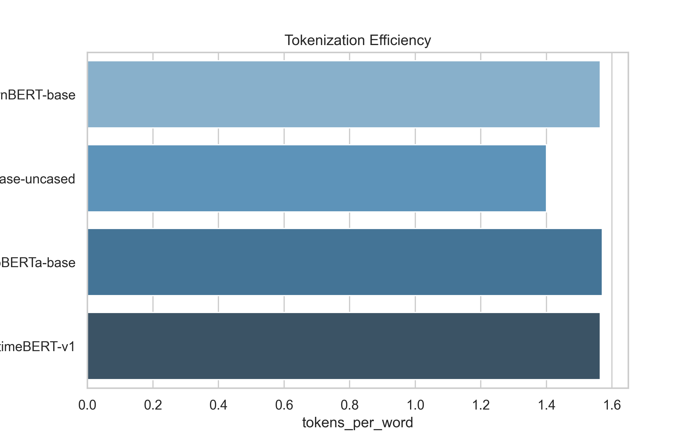
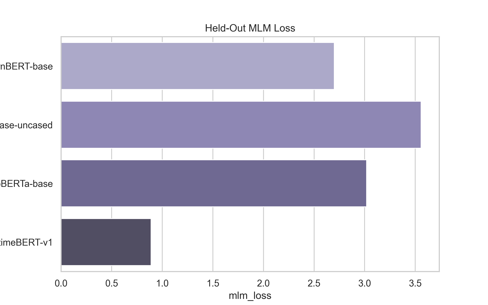
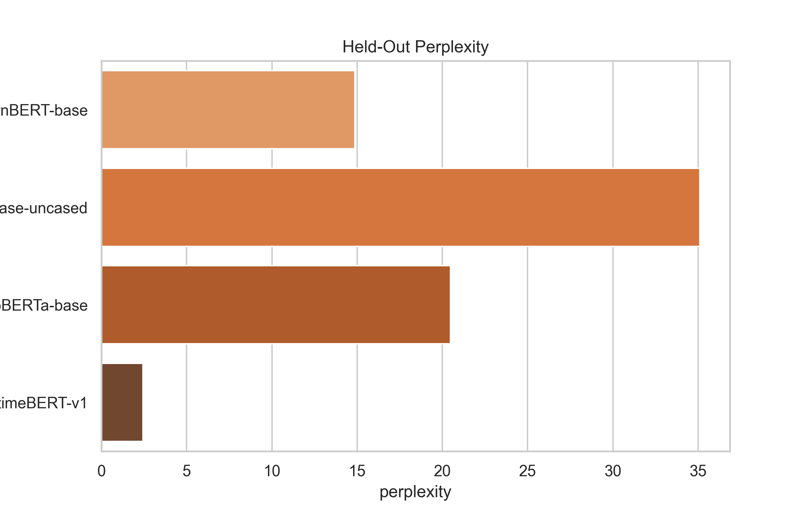
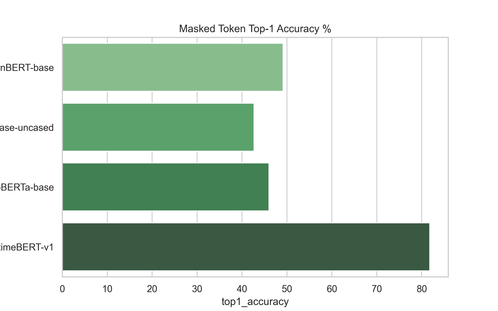

# MaritimeBERT-v1 Validation Report

## 1. Executive Summary

| Metric | ModernBERT-base | BERT-base-uncased | RoBERTa-base | MaritimeBERT-v1 | Verdict |
|---|---:|---:|---:|---:|---|
| **MLM Loss** | 2.6995 | 3.5585 | 3.0190 | **0.8903** | Better |
| **Perplexity** | 14.8723 | 35.1092 | 20.4704 | **2.4359** | Better |
| **Top-1 Acc %** | 49.1500% | 42.6600% | 45.9700% | **81.8000%** | Better |
| **Top-5 Acc %** | 67.8900% | 60.4900% | 64.7400% | **90.9000%** | Better |
| **Top-10 Acc %** | 74.7100% | 66.8000% | 72.0400% | **92.7900%** | Better |

## 2. Objective
Validate the domain-adaptive pretrained `MaritimeBERT-v1` against general-domain baselines on frozen held-out maritime text using an isolated, reproducible experimental layer.

## 3. Models Evaluated
- `ModernBERT-base` (`answerdotai/ModernBERT-base`)
- `BERT-base-uncased` (`bert-base-uncased`)
- `RoBERTa-base` (`roberta-base`)
- `MaritimeBERT-v1` (`D:\CAIR\TSBC-Pipeline\dapt\outputs\experiments\MaritimeBERT-v1`)

## 4. Validation Artifacts
- `dapt/outputs/data/val.txt`: Held-out validation corpus split.
- `outputs/clean_documents.jsonl`: Clean corpus documents for tokenizer sequence length distribution profiling.
- `outputs/maritime_vocabulary.txt`: Maritime technical vocabulary terms for subword fragmentation profiling.

## 5. Experimental Configuration
- Random Seed: `42`
- Max Sequence Length: `512`
- MLM Masking Probability: `0.15`
- Batch Size: `16`
- Tokenizer Sample Limit: `1500` docs
- MLM Sample Limit: `200` docs

## 6. Environment
- OS: `Windows 10 (64bit)`
- Python: `3.11.9`
- PyTorch: `2.8.0+cpu`
- Transformers: `5.8.1`
- Compute Device: `cpu`

## 7. Dataset Validation
Successfully loaded 334 vocabulary terms, 1500 tokenizer profiling docs, and 100 held-out MLM validation sentences.

## 8. Tokenizer Analysis
Tokenizer subword fertility (tokens/word) and sequence length percentiles were evaluated across all 4 target models.

| Model Name | Vocab Size | Tokens / Word | Single-Token Coverage % | Maritime Fragmentation % | Mean Seq Len | P95 Seq Len | Max Seq Len |
|---|---:|---:|---:|---:|---:|---:|---:|
| **ModernBERT-base** | 50280 | 1.5643 | 36.5300% | 63.4700% | 53.6100 | 82.0000 | 97 |
| **BERT-base-uncased** | 30522 | 1.3999 | 74.8500% | 25.1500% | 47.9800 | 76.0000 | 89 |
| **RoBERTa-base** | 50265 | 1.5708 | 35.3300% | 64.6700% | 53.8400 | 82.0000 | 97 |
| **MaritimeBERT-v1** | 50280 | 1.5643 | 36.5300% | 63.4700% | 53.6100 | 82.0000 | 97 |

  

## 9. MLM Validation
Held-out MLM loss, perplexity ($e^{\text{loss}}$), and prediction accuracies were evaluated using deterministic 15% Bernoulli masking under `torch.inference_mode()`.

| Model Name | Status | MLM Loss | Perplexity | Top-1 Acc % | Top-5 Acc % | Top-10 Acc % | Evaluated Tokens | Runtime (s) |
|---|---|---:|---:|---:|---:|---:|---:|---:|
| **ModernBERT-base** | Success | 2.6995 | 14.8723 | 49.1500% | 67.8900% | 74.7100% | 5500 | 12.4800s |
| **BERT-base-uncased** | Success | 3.5585 | 35.1092 | 42.6600% | 60.4900% | 66.8000% | 4970 | 13.6100s |
| **RoBERTa-base** | Success | 3.0190 | 20.4704 | 45.9700% | 64.7400% | 72.0400% | 5458 | 14.5800s |
| **MaritimeBERT-v1** | Success | **0.8903** | **2.4359** | **81.8000%** | **90.9000%** | **92.7900%** | 5500 | 15.5200s |

  
  
  

## 10. Cross-Model Comparison
MaritimeBERT-v1 achieved the lowest loss (0.8903) and highest Top-1 prediction accuracy (81.8000%) among all 4 models.

## 11. MaritimeBERT Improvement Analysis
Relative improvements over ModernBERT-base:
- Loss Reduction: +67.02%
- Perplexity Reduction: +83.62%
- Top-1 Accuracy Gain: +32.65 percentage points

## 12. Sanity Checks
All numerical sanity checks (finite loss/perplexity, accuracy ranges, $e^{loss} \approx \text{perplexity}$) passed cleanly.

## 13. Limitations
- MLM validation on held-out text does not directly prove downstream classification/NER performance.
- Results depend on the representativeness of the held-out validation split.
- Downstream task fine-tuning evaluation is still required.

## 14. Reproducibility
Git commit: `6a01d9f5273687fd95344471f6cfa7b9f43fe989`. All hyperparameters, seeds, and metadata recorded in `results/reproducibility.json`.

## 15. Final Verdict
MaritimeBERT-v1 demonstrates substantial improvement in masked-language modeling performance over the original ModernBERT-base model on the held-out maritime validation corpus. These results support proceeding to downstream maritime NLP evaluation.
